<div align="center">
  
  <h1 style="margin-top: 0.25rem;">Bearcat</h1>
</div>

Bearcat is a tool for managing One Click Hoster uploads. It tracks release folders and can upload them automatically to configured hosters. Bearcat can also create archives itself in 7Zip and RAR formats.

Generated links can be submitted to one or more link crypters. Bearcat checks link availability automatically, schedules repackaging and reuploading when links go offline, and handles the case where a release that was down must be uploaded again with a `__nonce__` file so the generated archive hashes change.

Bearcat is a .NET 10 application built on ASP.NET Core. The frontend uses Blazor, and PostgreSQL is used as the database. The application can run locally or in Docker.

## GUI

<p>
  <a href="docs/images/running-upload.png">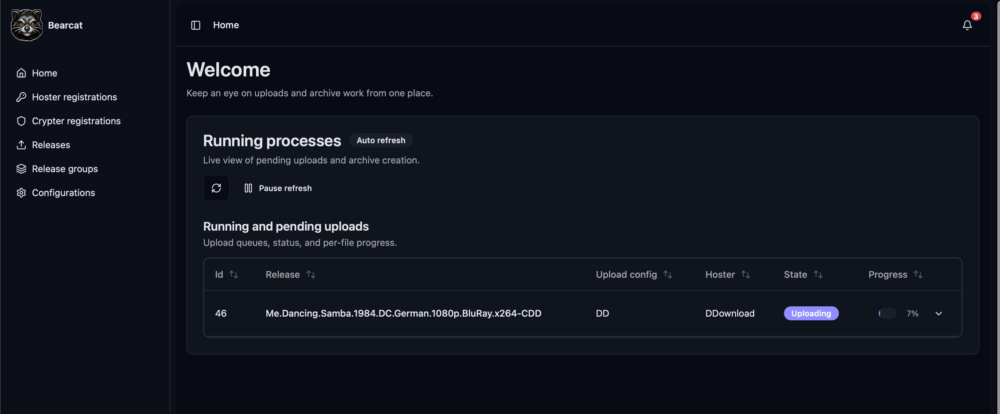</a>
  <a href="docs/images/running-archiving.png">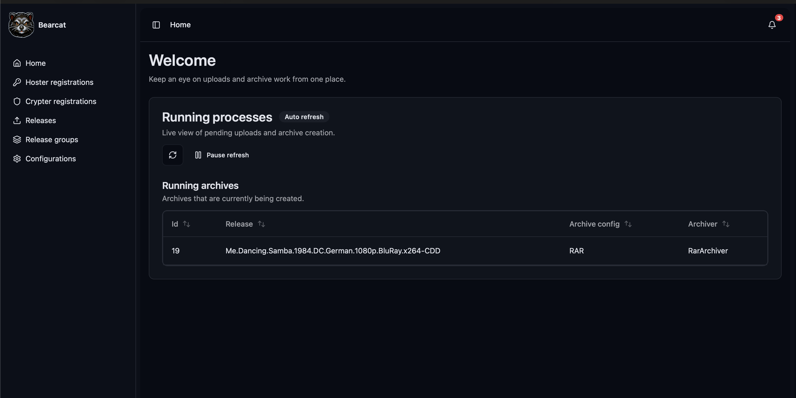</a>
  <a href="docs/images/releases-overview.png">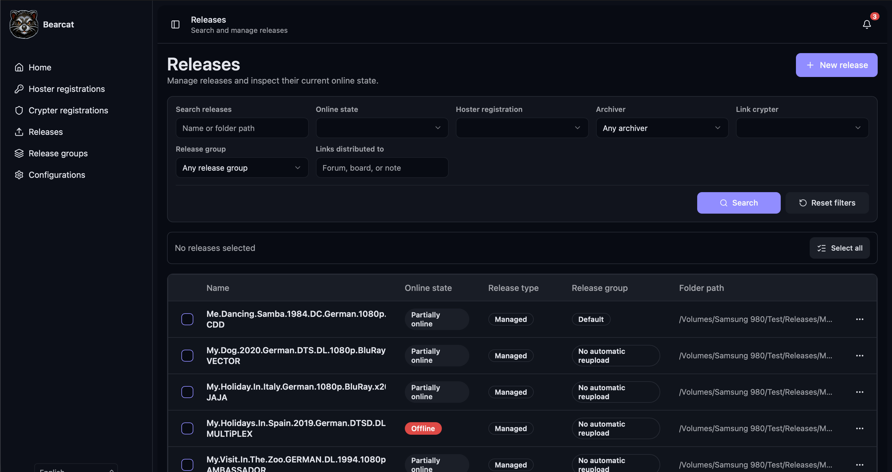</a>
</p>

<p>
  <a href="docs/images/release-detail.png">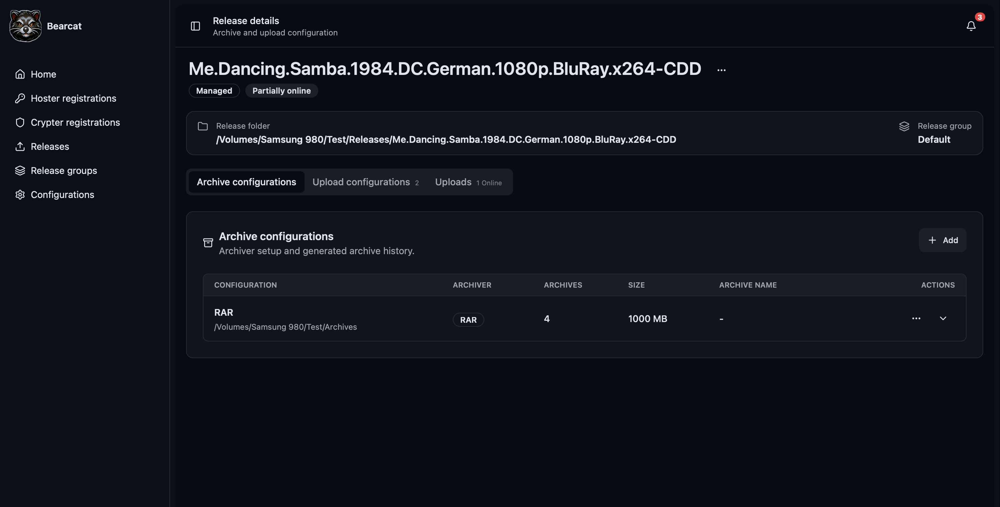</a>
  <a href="docs/images/upload-configs.png">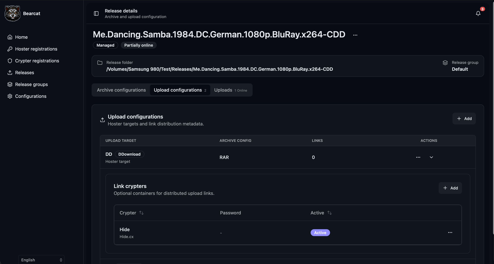</a>
  <a href="docs/images/release-uploads.png">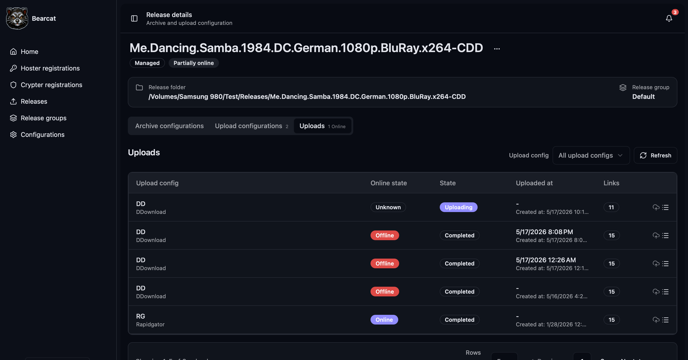</a>
</p>

<p>
  <a href="docs/images/hosters.png">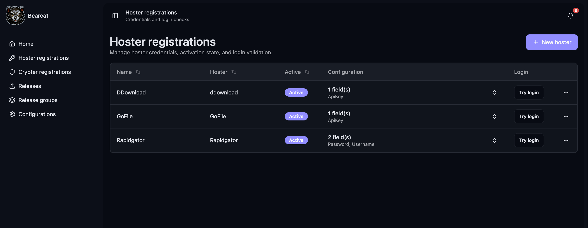</a>
  <a href="docs/images/link-crypters.png">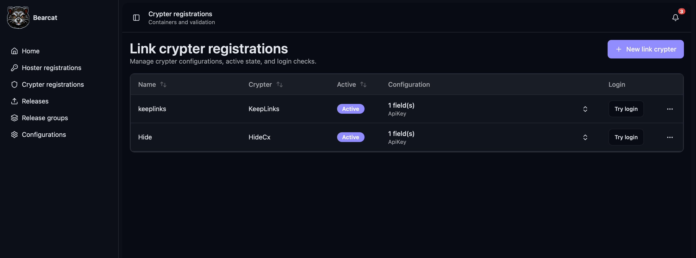</a>
  <a href="docs/images/release-groups.png">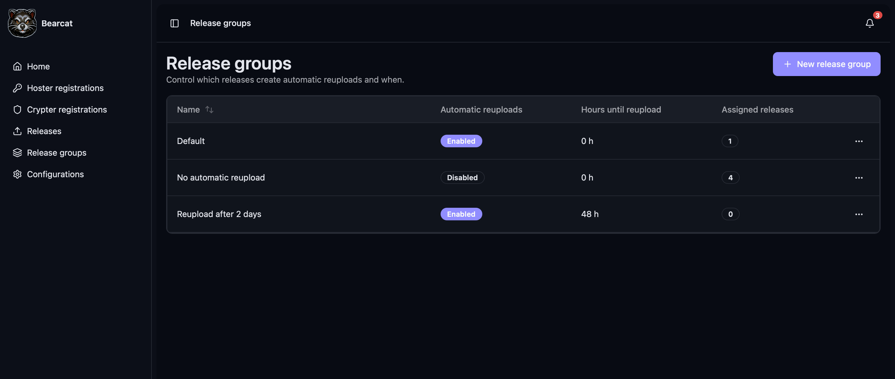</a>
</p>

<p>
  <a href="docs/images/notification-center.png">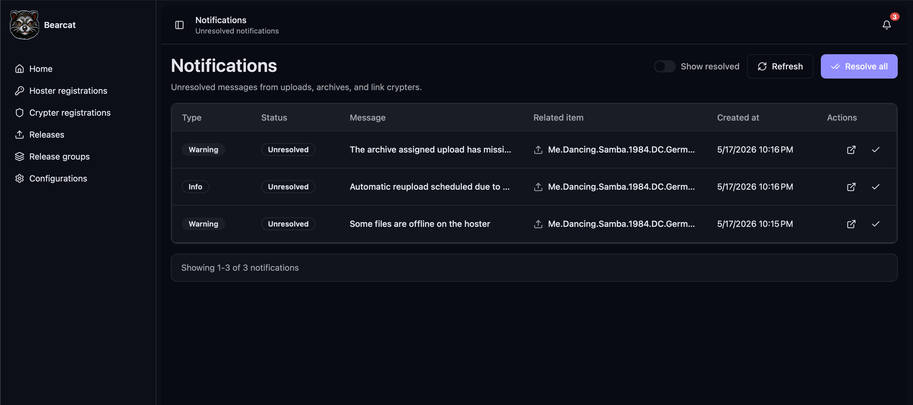</a>
  <a href="docs/images/notification.png">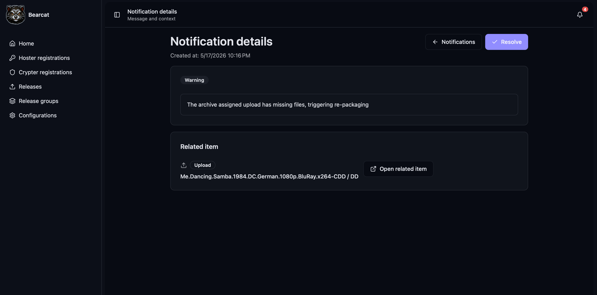</a>
  <a href="docs/images/auto-archive-deletion.png">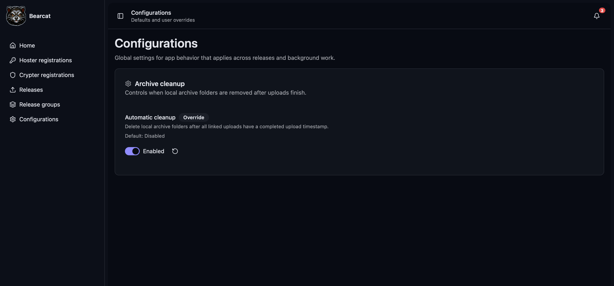</a>
</p>

## Documentation

Additional documentation is kept in [`docs/`](docs/).

- [Development notes](docs/development.md)

## Running Bearcat With Docker

The repository contains a `docker-compose.yml` file and `.env` files for local Docker configuration.

1. Copy the example environment file:

   ```bash
   cp .env.example .env
   ```

2. Edit `.env` and set at least `RELEASES_DIR` to the local directory that contains the release folders Bearcat should manage. Adjust the PostgreSQL credentials, data directory, exposed port, CPU limits, or memory limits if needed.

3. Start the application and database:

   ```bash
   docker compose up --build
   ```

4. Open Bearcat at:

   ```text
   http://localhost:8080
   ```

The Compose setup builds the Bearcat image, starts PostgreSQL, mounts the configured release directory, and passes the database connection string to the application. Database migrations run when the ASP.NET Core environment is `Production`; the Docker image sets `ASPNETCORE_ENVIRONMENT=Production` by default, and `docker-compose.yml` also sets it explicitly.

The Bearcat image is intentionally built and run as `linux/amd64`, including on Macs with Apple Silicon. Bearcat depends on the official RAR command line tools, and RAR does not provide an ARM64 Linux build because it is closed source. Docker containers run inside a Linux virtual machine on macOS, so the container architecture must match the available Linux RAR binary.

## Local development

Install the .NET 10 SDK version declared in `global.json`, then restore and build the solution from the repository root:

```bash
dotnet restore Bearcat.slnx
dotnet build Bearcat.slnx
```

Run the test suite with:

```bash
dotnet test Bearcat.slnx
```

For local development, Bearcat can load `appsettings.user.json` in development mode. Use it for machine-specific settings such as local database credentials and release directories. This file is ignored by Git and should not be committed.

Example for `Bearcat.Host/appsettings.user.json`:

```json
{
  "ReleaseDataDirectory": "/path/to/releases",
  "Database": {
    "ConnectionString": "Host=localhost;Database=<your-local-db-name>;Username=<db-username>;Password=<db-password>>"
  }
}
```

The main host application is `Bearcat.Host`. The Blazor UI project is `Bearcat.Website`.
