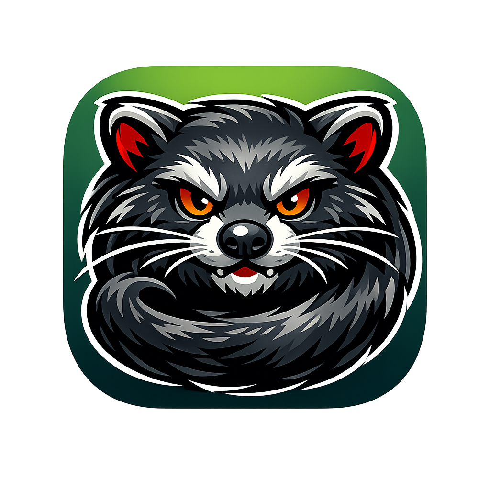
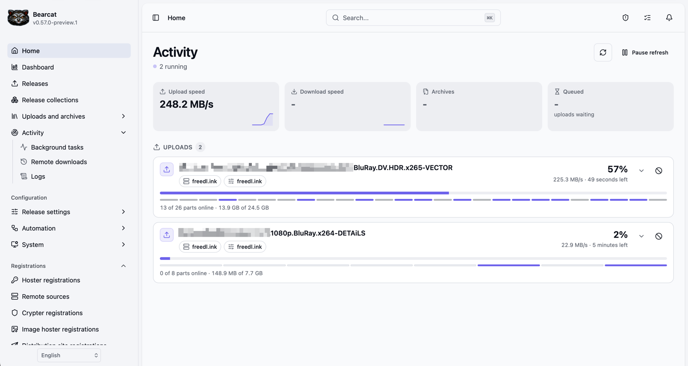

<div align="center">
  
  <h1 style="margin-top: 0.25rem;">Bearcat: Self-hosted upload manager for one-click hosters</h1>
</div>

Bearcat manages uploads to Rapidgator, DDownload, Keep2Share, and other one-click hosters. It watches release folders, creates RAR or 7z archives, uploads them, and checks whether the links are still online. When links go offline, it can repackage and reupload the files automatically.

Bearcat also watches FTP and FTPS servers for new releases, downloads matching folders, and can automatically extract RAR and 7z archives before repackaging and uploading them using a release template.

Run it on your own desktop, NAS, or server and manage it through a web interface.

[Downloads](https://github.com/gizmo93/Bearcat/releases) · [Getting started guide](https://gizmo93.github.io/Bearcat/#get-started) · [User documentation](https://gizmo93.github.io/Bearcat/)



## Features

- [Automatically download releases from FTP/FTPS servers](https://gizmo93.github.io/Bearcat/remote-downloads/), verify SFV checksums, and optionally extract RAR or 7z archives before uploading.
- Create RAR or 7z archives, or upload archives you already have.
- Upload releases to multiple hosters and check link availability automatically.
- Repackage and reupload managed releases when links go offline.
- Send upload links to Filecrypt, Hide.cx, Keeplinks, or tolink.to.
- Fetch release and media metadata, upload cover images, and generate BBCode forum posts.
- Track releases waiting to be posted and prepare forum drafts for you to review and submit.
- Forward upload notifications and errors to Telegram.

See the [supported hosters and link crypters](https://gizmo93.github.io/Bearcat/#which-hosters-and-linkcrypters-are-supported) for the full list.

## Documentation

- [User guide](https://gizmo93.github.io/Bearcat/)
- [Automatic FTP/FTPS downloads and archive extraction](https://gizmo93.github.io/Bearcat/remote-downloads/)
- [Archives, link checks, and automatic reuploads](https://gizmo93.github.io/Bearcat/upload-lifecycle/)
- [Managed releases and existing archives](https://gizmo93.github.io/Bearcat/release-types/)
- [Development notes](docs/development.md)

## Local development

Bearcat uses .NET 10, ASP.NET Core, Blazor, and EF Core with SQLite or PostgreSQL.

Install the .NET 10 SDK version declared in `global.json`, then restore and build the solution from the repository root:

```bash
dotnet restore Bearcat.slnx
dotnet build Bearcat.slnx
```

Run the test suite with:

```bash
dotnet test Bearcat.slnx
```

Database integration tests run against SQLite and PostgreSQL. The PostgreSQL part uses Testcontainers and needs Docker.

Outside a container, Bearcat loads an optional `appsettings.user.json`. Use it for machine-specific settings such as the database and release directories. This file is ignored by Git and should not be committed.

Example for `src/Bearcat.Host/appsettings.user.json` with SQLite:

```json
{
  "WorkingDirectories": ["/path/to/releases"],
  "Database": {
    "Provider": "Sqlite",
    "SqliteFilePath": "/path/to/bearcat.db"
  }
}
```

With PostgreSQL:

```json
{
  "WorkingDirectories": ["/path/to/releases"],
  "Database": {
    "Provider": "Postgres",
    "ConnectionString": "Host=localhost;Database=<your-local-db-name>;Username=<db-username>;Password=<db-password>"
  }
}
```

Without `Database:Provider`, Bearcat uses PostgreSQL. The `http (SQLite)` launch profile of `Bearcat.Host` sets `Database__Provider=Sqlite` and overrides the file. Create new migrations with `scripts/add-migration.sh <Name>`, which adds them for both providers. See [development notes](docs/development.md).

The main host application is `Bearcat.Host`. The Blazor UI project is `Bearcat.Website`.
