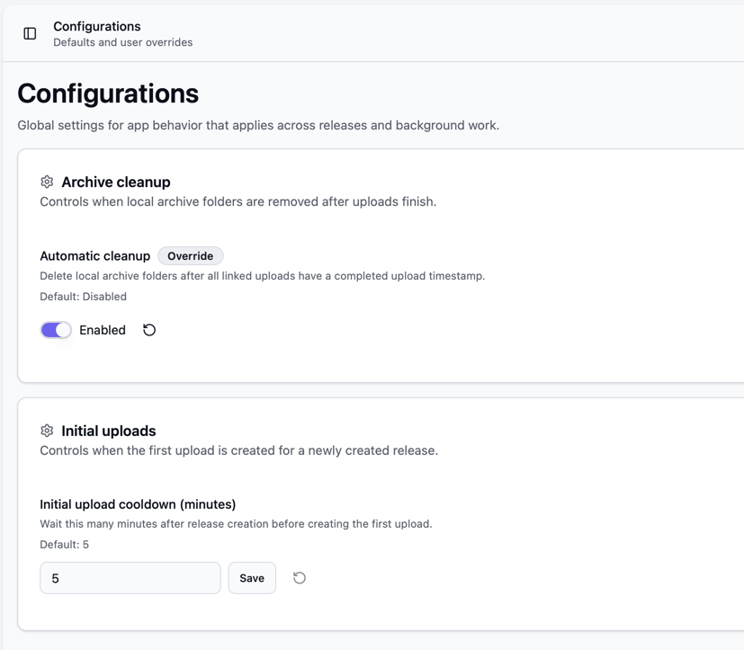

# Advanced configuration

Bearcat does most work in background tasks.
The web UI gives you two places to control that behavior:

- "Background tasks" shows scheduled work, health and enable / disable switches.
- "Configurations" contains global settings that affect background work.

## Background tasks UI

Open "Background tasks" in the sidebar to see the current task list.
Each background task runs on its own schedule and stores its last known state in the database.

The table columns mean:

- "Name" is the task display name.
- "Active" enables or disables future executions of that task.
- "Status" shows "Never run", "Running", "Success" or "Error".
- "Started" and "Finished" show the timestamps of the latest run.
- "Duration" shows how long the latest finished run took.
- "Last error" shows the latest error message if the task failed.

Tasks are enabled by default.
If you disable a task, Bearcat skips future runs of that task.
Disabling a task does not cancel work that is already running at that moment.
Use the "Refresh" button to reload the latest state.

Most tasks should stay enabled during normal operation.
Only disable a task if you intentionally want to pause that part of the system, for example while debugging a failing hoster account or while doing maintenance on a storage folder.

## Available background tasks

| Task | Runs | What it does |
| --- | ---: | --- |
| Configuration cache refresh | Every 5 minutes | Reloads configuration overrides from the database into the in-memory configuration cache. Saving a value in the UI also updates the cache immediately, but this task keeps the cache in sync. |
| Release folder automation | Every 2 minutes | Scans enabled release folder automations, creates releases from matching direct subfolders and applies the selected release template. |
| Release info resolution | Every 10 minutes | Looks for releases without release information and tries to fetch metadata from active NFO database registrations such as xrel.to. |
| Archive creation | Every 20 seconds | Creates missing archives for uploads that are waiting for an archive. If a matching archive already exists, it can reuse it instead of creating a new one. |
| Archive cleanup | Every 30 minutes | Deletes local archive folders after their linked uploads have completed, if automatic archive cleanup is enabled in "Configurations". |
| Archive upload | Every 20 seconds | Uploads pending archive files to the configured hosters and updates upload progress and final upload state. |
| Upload state check | Every 20 seconds | Checks whether uploaded files are still online, creates initial upload records after the configured cooldown and schedules automatic reuploads when release group rules allow it. |
| Link crypter container creation | Every 20 seconds | Creates missing link crypter containers for completed uploads that have link crypter configurations. |

## Configuration UI

Open "Configurations" in the sidebar to change global application behavior.
Each configuration property shows its current value and its default value.

When you change a value, Bearcat stores it as an override.
Overridden values show an "Override" badge.
Use the reset button next to a property to remove the override and return to the default.

Configuration changes are stored in the database.
They survive container restarts.

## Archive cleanup

"Archive cleanup" controls whether Bearcat removes local archive folders after uploads finish.

The available setting is:

- "Automatic cleanup" defaults to disabled.

When automatic cleanup is enabled, the "Archive cleanup" background task deletes archive folders that match all of these conditions:

- The archive is in the "Created" state.
- The archive is linked to at least one upload.
- All linked uploads have a completed upload timestamp.

After deleting the archive folder from disk, Bearcat marks the archive as deleted in the database.
This cleanup only affects the local archive folder that Bearcat created for upload preparation.
It does not delete the release source folder and it does not delete files from the hoster.

Leave automatic cleanup disabled if you want to inspect generated archive files manually or keep them as a local backup.
Enable it if your archive folder is temporary storage and you want Bearcat to free disk space after successful uploads.

## Initial upload cooldown

"Initial uploads" controls when Bearcat creates the first upload run for a new release.

The available setting is:

- "Initial upload cooldown (minutes)" defaults to `5`.

After you create a release and add an upload configuration, Bearcat waits until the release is older than this cooldown before it creates the first upload record.
The "Upload state check" background task performs this check.

For example:

- `5` means Bearcat waits about five minutes after release creation before scheduling the initial upload.
- `0` means Bearcat can create the initial upload on the next "Upload state check" run.
- A larger value gives you more time to finish release setup before Bearcat starts archiving and uploading.

Changing the cooldown affects upload configurations that do not have an upload yet.
It does not cancel or delay uploads that already exist.
