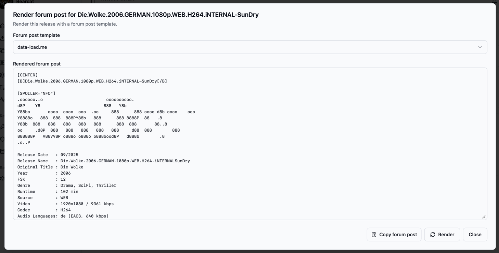

# Forum post templates

Forum post templates help you prepare the text that you want to paste into a forum after a release is ready.
Most forums accept BBCode, so a template can contain normal BBCode and placeholders that Bearcat replaces with data from the selected release.

This is useful when your posts should always follow the same structure, for example:

- release name at the top
- language, size and media information
- NFO content inside a spoiler block
- download sections for Rapidgator, DDownload or other upload configurations
- link crypter container links


## Creating a template

Open "Forum post templates" in the sidebar.

Click "New forum post template", enter a name and write the template body.
The template body can contain plain text, BBCode and Scriban placeholders.

Example:

```text
[CENTER]
[B]{{ release.name }}[/B]
Size: {{ release_info.size }}

[SPOILER="NFO"]
{{ release.nfo }}
[/SPOILER]

{{ for upload in uploads }}
[B]{{ upload.name }}[/B]
{{ for crypter in upload.link_crypters }}
[URL='{{ crypter.container_link }}']{{ crypter.name }}[/URL]
{{ end }}

{{ end }}
[/CENTER]
```

Click "Validate" to check the template syntax.
Validation checks whether the Scriban syntax is valid.
It does not require the selected release to have values for every variable.

## Rendering a forum post

Open a release and go to the "Overview" tab.
Click "Render forum post".

Bearcat opens a dialog where you can select one of your forum post templates.
It renders the template with the selected release and shows the final text.
Click "Copy forum post" and paste the result into your forum editor.



If a value is not available for the release, Bearcat renders an empty text instead of crashing.
For example, if no `.nfo` file exists in the release folder, `{{ release.nfo }}` renders as empty text.

## Available variables

The template editor shows the available variables on the right side.
Use the search field if the list gets long.

Common variables:

| Variable | Description |
| --- | --- |
| `{{ release.name }}` | Release name from Bearcat. |
| `{{ release.nfo }}` | Content of the first `.nfo` file in the release folder. |
| `{{ release_info.release_name }}` | Release name from the metadata source. |
| `{{ release_info.database_url }}` | Release database URL, for example from xrel.to. |
| `{{ release_info.size }}` | Formatted size from the metadata source. |
| `{{ release_info.video.type }}` | Video type from the metadata source. |
| `{{ release_info.audio.type }}` | Audio type from the metadata source. |

Loop variables:

| Loop | Description |
| --- | --- |
| `{{ for info in release_infos }}` | Loops over all resolved release infos. |
| `{{ for external_info in release_info.external_infos }}` | Loops over external metadata entries. |
| `{{ for url in external_info.urls }}` | Loops over URLs of an external metadata entry. |
| `{{ for upload in uploads }}` | Loops over upload configurations. |
| `{{ for link in upload.links }}` | Loops over direct hoster links of the latest upload. |
| `{{ for crypter in upload.link_crypters }}` | Loops over link crypter container links. |

Inside `uploads`, these variables are available:

| Variable | Description |
| --- | --- |
| `{{ upload.name }}` | Upload configuration name. |
| `{{ upload.hoster_name }}` | Hoster registration name. |
| `{{ upload.uploaded_at }}` | Latest upload date. |
| `{{ upload.archive_password }}` | Archive password of the latest upload. |

Inside `upload.link_crypters`, these variables are available:

| Variable | Description |
| --- | --- |
| `{{ crypter.name }}` | Link crypter registration name. |
| `{{ crypter.container_link }}` | Generated container URL. |
| `{{ crypter.created_at }}` | Container creation date. |

## Scriban basics

Bearcat uses Scriban syntax for placeholders.

Print a value:

```text
{{ release.name }}
```

Loop over a list:

```text
{{ for upload in uploads }}
[B]{{ upload.name }}[/B]
{{ end }}
```

Only render a block when a value exists:

```text
{{ if release.nfo }}
[SPOILER="NFO"]
{{ release.nfo }}
[/SPOILER]
{{ end }}
```

Check out the [Scriban documentation](https://scriban.github.io/docs/language/) for more details and examples.

## Practical tips

Name upload configurations like you want them to appear in the forum post, for example `Rapidgator` or `DDownload`.
That makes `{{ upload.name }}` useful directly in the rendered output.

Render the post only after the release has completed uploads and link crypter containers.
Before that, upload and container variables may still be empty.

Keep forum-specific formatting in separate templates if you post to multiple forums.
Different forums often support slightly different BBCode variants.