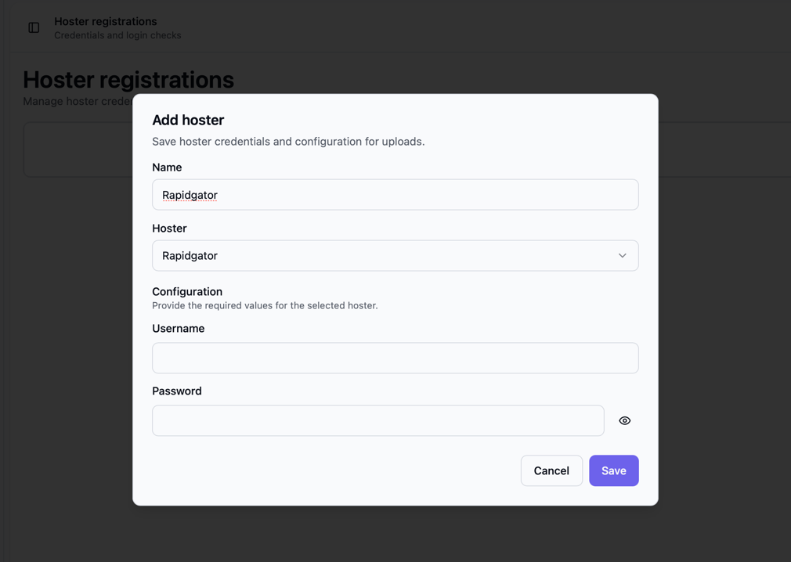

# Initial setup

After you started your Bearcat container, its frontend is available
at `http://localhost:8080` (or the port you set in the .env file) and you can start setting it up.

You will be greated with the start page

In the middle you can see a widget that in the future will show you archives, that currently get created and running uploads.

In the top right corner there is a notification bell, that will show you notifications about finished uploads, failed uploads and so on.

## Setting up hoster accounts

To set up your hoster accounts, click om the "Hoster registrations" link in the sidebar on the left and click "New hoster".

Fill out the needed authentification informations.
Depending on the hoster it can be username / password or an API key; check out the documentation of the Hoster on how to get these informations for your account.

Save and test the connection by clicking "Try login".

## Setting up link cypter accounts, and NFO databases
The menu option "Crypter registrations" works the same way as the "Hoster registrations", but here you can set up your accounts for link crypters, that you want to use to create link containers for your releases.
The menu option "NFO database registrations" will (currently) only allow you to activate xrel.to.
That's optional and doesn't need any credentials, but it's needed if you automatically want to fetch release related informations.

## Manually create a release
