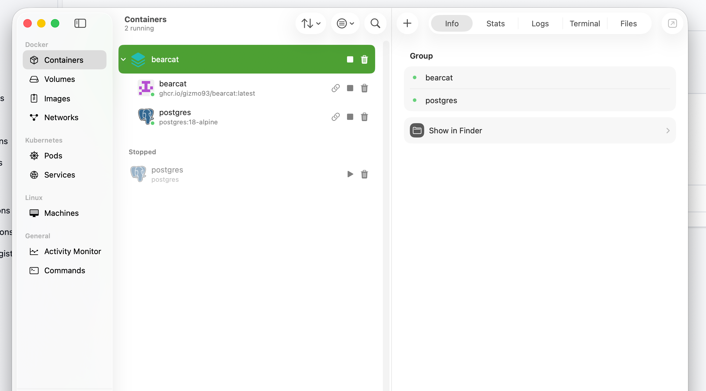

# Hosting as a Docker container

## Initial setup

### Windows
To run local Docker containers, I recommend to install Docker Desktop (https://www.docker.com/products/docker-desktop/) or Rancher Desktop (https://rancherdesktop.io).
Docker Desktop is faster and easier to set up than Rancher and it's free for non-commercial use.

## macOS
On macOS, you can also use Docker Desktop (https://www.docker.com/products/docker-desktop/) or Rancher Desktop (https://rancherdesktop.io) or OrbStack (https://orbstack.dev).
All of these options work, however, I personally recommend OrbStack.
It's designed to be macOS-only and thus it has the best performance and lowest memory footprint. The free version should be enough to run Bearcat.
Bearcat is developed on macOS and I personally use OrbStack to run containers locally.



## Linux
Docker Desktop and Rancher Desktop are also available for Linux.
For futher infos on how to set them up, please check their documentation.
As Docker is a Linux native technology, Docker containers basically run "natively" on Linux, while on Windows and macOS a small Linux VM runs these containers.

## Synology NAS
Synology NAS with an x86_64 CPU architecture support Docker ("Container Manager").
You just need to install the respective package from the Synology Package Manager.


## Running Bearcat

To get started with Docker, you can use the provided `docker-compose.yml` file.
Copy the `.env.example` file to `.env` and set the variables in that file according to your needs.

These are the variables you need to set and what they are for:

### Database related

- `POSTGRES_DATA_DIR`: The directory on the host machine where PostgreSQL data will be stored. This allows you to persist your database data even if the container is removed. Also, it allows you to create backups of your database
- `POSTGRES_USER`: The username for the PostgreSQL database
- `POSTGRES_PASSWORD`: The password for the PostgreSQL database
- `POSTGRES_DB`: The name of the PostgreSQL database
- `POSTGRES_CPU_LIMIT`: The CPU limit for the PostgreSQL container. This is optional, but it can help to prevent the database from consuming too much CPU resources on your machine. You can set it to a value like `0.5` for 50% of a single CPU core, or `1` for 100% of a single CPU core.
- `POSTGRES_MEMORY_LIMIT`: The memory limit for the PostgreSQL container. This is optional, but it can help to prevent the database from consuming too much memory resources on your machine. You can set it to a value like `512m` for 512 megabytes, or `1g` for 1 gigabyte.
- `POSTGRES_PORT`: The port on which the PostgreSQL database will be accessible. This is optional, but it can be useful if you want to connect to the database from outside the Docker network. The default value is `5432`, which is the default port for PostgreSQL. If that one is already used for something else on your machine, feel free to choose a different one

### Bearcat related
- `BEARCAT_PORT`: The port on which Bearcat web frontend will be accessible. If you don't set this, Bearcat will run at port 8080.
- `RELEASES_DIR`: The directory on the host machine where Bearcat will look for release files to upload. This is required, as Bearcat needs to know where your release files are located. You can set it to any directory on your machine, even network folders that are mounted on the host machine, but make sure that the directory exists and that Bearcat has read and write permissions to it.
- `BEARCAT_IMAGE`: The name of the Bearcat Docker image to use. This is optional, but it can be useful if you want to use a custom built image of Bearcat instead of the one from Docker Hub. The default value is `ghcr.io/justanotherx265/bearcat:latest`, which is the latest version of Bearcat from GitHub Container Registry. If you want to use a custom image version, you can set it there
- `BEARCAT_CPU_LIMIT`: The CPU limit for the Bearcat container. This is optional, but it can help to prevent Bearcat from consuming too much CPU resources on your machine. You can set it to a value like `0.5` for 50% of a single CPU core, or `1` for 100% of a single CPU core.
- `BEARCAT_MEMORY_LIMIT`: The memory limit for the Bearcat container. This is


Then run the following command in the terminal from the directory where the `docker-compose.yml` file is located:

```bash
docker compose up -d
```

That one will start the Bearcat and PostgreSQL container with the settings you did in your .env file.
Depending on the performance of your machine it might take a while and the command will in the end tell you, if all containers could be started successfully.


## Updating Bearcat

The default .env file uses the latest image of Bearcat, the moment you run docker compose up.
If there is a new version out and you want to update your instance, execute the following command in the terminal from the directory where the `docker-compose.yml` file is located:

```bash
docker compose pull
docker compose up -d
```

This will only recreate the container if the newer image is different from the one you already have.
As all Bearcat data is stored in its database and you set the database data directory to a persistent location on your host machine, you won't lose any data by updating the container image.
