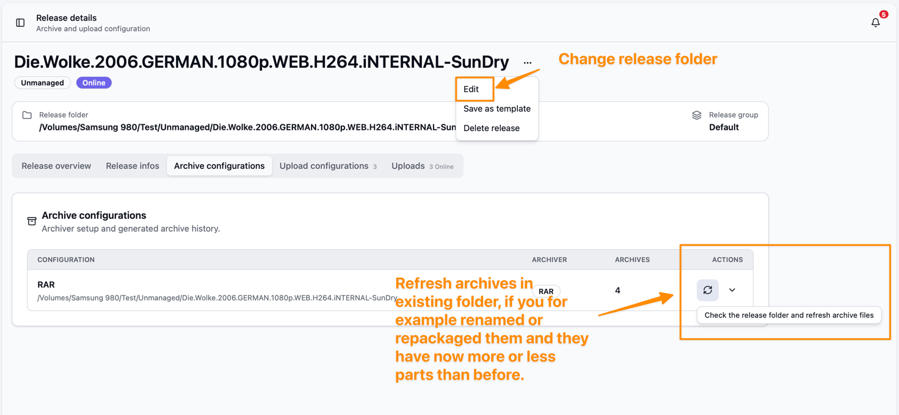

# User Documentation

Bearcat is a self hosted tool (YOU host it :D) to manage your One Click Hoster (OCH) uploads.
You can create releases, define how they should be packed (currently RAW and 7Zip are supported),
define to which hosters they should be uploaded and if needed, on which link crypters you want to create link containers.
Bearcat will then from time to time check the online status of your uploads and will automatically repackage and reupload them, if needed.
It also supports pulling release related information from xrel.to, that helps you to copy paste all infos that you need to create a forum post from one single place.

# Release types

Bearcat supports two release types (or release models): managed releases and unmanaged releases.
Both types use the same upload, online check, notification and reupload workflow, but they differ in who creates the archive files.

| Model | Archive files are created by | Best for                                                                           | What Bearcat does |
| --- | --- |------------------------------------------------------------------------------------| --- |
| Managed | Bearcat | Releases where you have raw files and want Bearcat to pack them                    | Creates archives from the release files, uploads them, checks online state, and can create replacement archives for reuploads. |
| Unmanaged | You or another tool | "Bring your own archives": Releases where you already have a set of archive files. | Uses the existing archive files in the release folder, uploads them, checks online state, and waits for you to refresh the archive if files are missing or replaced. |

## Managed releases

Managed releases are the default workflow.
The release folder contains the raw files, and Bearcat creates archive files based on the archive configuration.
You choose an archiver, archive folder, archive size, optional password and hosters, where you want to upload them to.

When an upload is needed, Bearcat creates or reuses a matching archive and then uploads the archive files.
If local archive files go missing, Bearcat marks the old archive as missing and creates a replacement archive from the raw release files.
This also makes managed releases a good fit for automatic reuploads.

## Unmanaged releases

Unmanaged releases are for releases that are already packed before Bearcat sees them.
In this model, the release folder is the folder that contains the archive files.
Bearcat auto creates an Archive configuration and archives and assumes the archiver (RAR or 7zip) based on the file endings.

If an unmanaged upload finds that local archive files are missing, Bearcat marks the archive as missing, unlinks it from the upload and puts the upload back into `WaitingForArchive`.
Bearcat does not repack unmanaged releases, because it does not have the raw files.

After you restore or replace the archive files, either change the release folder to the place, where the new archives are located or use the unmanaged archive refresh action so Bearcat can use them for pending re-uploads.

# Supported Hosters, Link Crypters and Archivers
Currently the following OCHs are supported:

- Rapidgator
- DDownload
- GoFile
- Keep2Share
- Alfafile
- NitroFlare
- 1fichier
- Uploady.io
- Katfile
- Krakenfiles
- FileQ

The following link crypters are supported:

- Hide.cx
- Keeplinks

The following archivers are supported:

- RAR
- 7Zip

# Getting Started

## Running Bearcat
Bearcat is self hosted, so you can run it on your own desktop machine, on a NAS, or on a server.

For macOS on Apple Silicon, the preferred local setup is the Bearcat Desktop app. It runs natively on ARM and starts the web application for you. The Docker image is still useful, but it is built as `linux/amd64` because the official RAR command line tools are only available for Linux x64.

For Windows, choose the setup based on where Bearcat should live. On a Windows Server or any always-on server machine, Docker is still the preferred setup as it will restart your container if it fails. For normal desktop use, the Bearcat Desktop app is the preferred setup because it makes the local web app visible through a tray icon and gives you a simple way to start and stop it.

Linux and NAS setups should use Docker.

Bearcat uses a PostgreSQL database to store releases, hosters, link crypters, configuration, and upload state. With Docker Compose, PostgreSQL is started together with Bearcat. With the Desktop app, you bring your own PostgreSQL server and enter the connection settings in the launcher.

## Account data encryption and backups

Bearcat encrypts hoster, link crypter, and NFO database account configurations before storing them in the database.
The encryption key is stored outside the database in a file named `bearcat.key`.
This key is created automatically on first start and is not part of the application release or Docker image.

Back up `bearcat.key` together with the PostgreSQL database.
If you move Bearcat to another computer or server, the database and `bearcat.key` must be moved together.
Without this key, Bearcat can still start, but it cannot decrypt the stored account configurations.
If `bearcat.key` is lost, the affected hoster, link crypter, and NFO database registrations must be recreated.

Default key locations:

- Desktop on Windows: `%APPDATA%\Bearcat\bearcat.key`
- Desktop on macOS: `~/Library/Application Support/Bearcat/bearcat.key`
- Docker Compose: `${BEARCAT_DATA_DIR:-./bearcat-data}/bearcat.key`

[Running Bearcat with the Desktop App](use-the-desktop-launcher.md)

[Installing PostgreSQL for the Desktop App](install-postgresql-for-desktop.md)

[Running Bearcat in Docker](use-the-docker-image.md)

## Setting it up

As soon as Bearcat is running on your machine, you can start setting it up.

[Setup after installation](post-installation.md)

[Advanced configuration](advanced-configuration.md)

## More informations

[Upload lifecycle](upload-lifecycle.md)

[Forum post templates](forum-post-templates.md)
