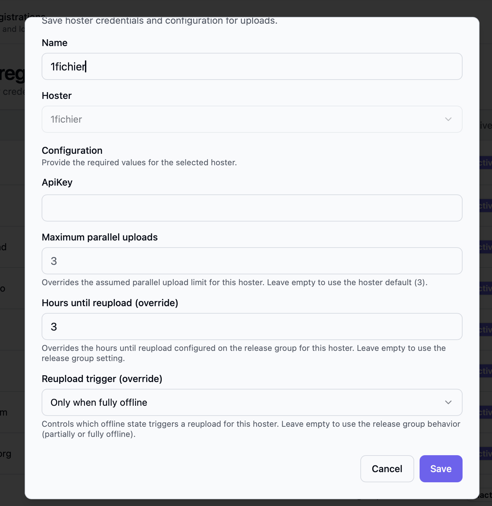

After your [first upload](/Bearcat/post-installation/), use these settings to add link containers, cover images, or automatic reuploads. Change only what you need.

## Use a proxy

To route hoster uploads, mirror downloads, or image uploads through an HTTP or SOCKS5 proxy,
see [Proxy Servers](/Bearcat/proxy-servers/). You can set defaults per category and override them
for individual accounts.

## Setting up link crypters and metadata sources

- Open **Crypter registrations** to add accounts for link containers. On a release, expand a saved
  upload configuration and add a link crypter registration, with an optional container password.
- Open **NFO database registrations** to enable sources for scene release information and NFOs.
- Open **Metadata sources** to add providers for titles, descriptions, genres, and cover images.

See [Release Information and Metadata](/Bearcat/release-information-and-metadata/) for providers,
credentials, and language settings.

## Setting up image hoster accounts

To share cover images in forums, open **Image hoster registrations** and click **New image hoster**.
Choose the hoster and enter any required account information.

## Image upload configuration

On a release's **Images** tab, click **Add** under **Image upload configurations**. Choose a name and the image
hoster registration that should receive the cover.

Use a name you can recognize in templates. For example, `ImgBB Cover` is available as
`imagelinks.imgbb_cover.full` in [forum post templates](/Bearcat/forum-post-templates/).

Bearcat uploads the image once the release has a cover URL. If no cover is available, it skips
the image upload.

## Automatic reuploads

Edit a release group to enable automatic reuploads and set **Hours until reupload**.
With a value of `24`, Bearcat waits at least 24 hours after confirming files are offline before
scheduling a replacement. With `0`, it can schedule one as soon as the files are confirmed offline.

Assign groups when creating or editing a release. To move several releases together, select them
in the release list and choose **Change release group**.
See [Automatic reuploads](/Bearcat/upload-lifecycle/#7-automatic-reuploads) for the full behavior.

## Reupload overrides per hoster

In **Hoster registrations**, open **New hoster** or **Edit** to override reupload settings for one
account. Leave the override fields empty to use the release group's settings.

| Setting | Effect |
| --- | --- |
| **Hours until reupload (override)** | Replaces the release group's waiting time for this hoster. |
| **Reupload trigger: Partially or fully offline** | Starts the waiting time when any file goes offline. |
| **Reupload trigger: Only when fully offline** | Waits until every file is offline. The waiting time starts when the last file goes offline. |
| **Always reupload all files** | Uploads every file again, including those still online. |

Waiting time and trigger overrides do not enable automatic reuploads for a group that has them disabled.
For examples and timing details, see [Per-hoster overrides](/Bearcat/upload-lifecycle/#per-hoster-overrides).

The **Reupload** column shows the overrides, or **Release group defaults** when none are set.
**Full reuploads** indicates that **Always reupload all files** is enabled.

## Parallel uploads per hoster

Some hosters report their upload limit through the API: Bearcat shows **Via API** and does not let
you change it. For other hosters, **New hoster** and **Edit** offer a **Maximum parallel uploads**
field. Leave it empty to use the default shown in the field, or enter your own limit.

The **Parallel uploads** column shows the effective limit and an **Override** badge for custom values.
The [global upload limit](/Bearcat/advanced-configuration/#upload-concurrency) also applies:
Bearcat uses the smaller of the global and per-hoster limits.

## Upload speed limit per hoster

**New hoster** and **Edit** offer a **Maximum upload speed (MB/s)** field. It caps the combined
upload speed of all uploads to this hoster registration. Decimal values such as `0.5` or `0,5` are
allowed. Leave it empty for no limit.

The [global upload speed limit](/Bearcat/advanced-configuration/#upload-concurrency) also applies,
so the lower of both limits takes effect. The **Parallel uploads** column shows a configured limit.
