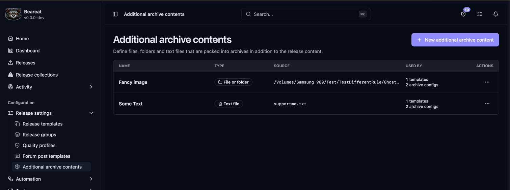
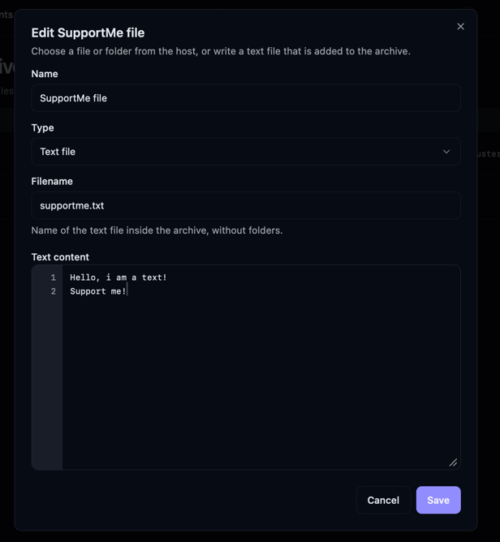
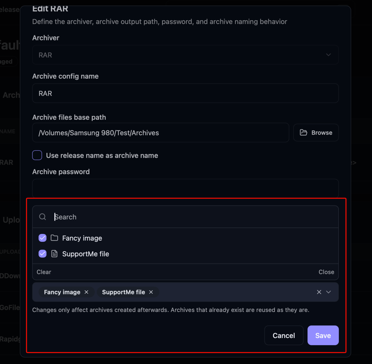

Add a file, folder, or text file to every archive created with a chosen archive configuration.
For example, include a `Premium.txt` with your referral link.

This feature is available for [managed releases](/Bearcat/release-types/) only. Bearcat does
not create archives for unmanaged releases.

## Create an entry

In the navigation, open **Configuration > Release settings > Additional archive contents**.
You can also find the page with **Ctrl+K** or **Cmd+K**.



Select **New additional archive content**, give it a unique name, and choose a type.
The name is just for you, so you are later able to know which file is what when assigning it to an archive. 

### File or folder

Enter the full **Source path** to an existing file or folder on the machine running Bearcat.
Folders are copied with their contents and keep their folder name.

Use **Browse** to select a path inside your working directories. Paths outside those directories
can be entered manually. 

With Docker, use paths that exist inside the container. The path depends on how you
set up your bind mounts when creating the Docker container.

### Text file

Enter a **Filename**, such as `Premium.txt`, and the **Text content**, then save.

- Use a filename without folders. `__nonce.txt` is reserved by Bearcat.
- Text content must not be empty.
- The editor uses a monospace font and line numbers. Spaces are preserved, including ASCII art.
- Bearcat writes the file as UTF-8 with Windows line endings (CRLF).



## Assign it to archives

Creating an entry does not add it to any archives yet. Select it under **Additional archive
contents** when editing an archive configuration:

- **On a release template:** applies to new releases created from that template.
- **On a release, under Archive configurations:** applies to that release only.

You can select multiple entries and reuse an entry across templates and releases.

Two selected entries cannot generate the same name in the release folder. For example,
`/extras/Premium.txt` conflicts with a text file named `premium.txt`. Bearcat ignores case
when checking these names.



## Where the contents are within an archive

The contents sit directly inside the release folder in the archive, next to the release files:

```text
Rel.Name/
  rel.name.mkv
  rel.name.nfo
  Premium.txt
```

Before packing, Bearcat checks the source paths and looks for duplicated file names. It then copies
or writes the selected contents into the release folder and creates the archive.

After packing, Bearcat removes these temporary additions, including its internal `__nonce.txt`.
Cleanup also runs if packing fails. After a crash, leftover additions are cleaned up on the
next start. Your original release files are kept.

## If packing fails

Bearcat stops archive creation and reports an error with a notification when:

| Problem | What to check |
| --- | --- |
| A source file or folder is missing | Check the source path and any Docker bind mount. |
| The release folder already contains the same name | Rename the additional file or folder, or remove its assignment. Bearcat never overwrites your existing files. |
| A file or folder cannot be copied | Check that Bearcat can read the source and write to the release folder. |

## Edit or delete an entry

Changes to contents or assignments affect only archives created afterwards. Existing archives
are reused unchanged, so editing an entry does not update an archive that has already been packed.

To delete an entry, first remove its assignments. If it is still in use, Bearcat lists the
templates and releases that prevent deletion.
