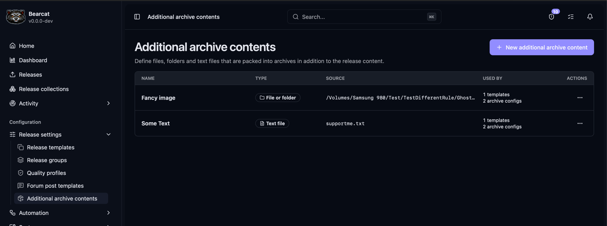
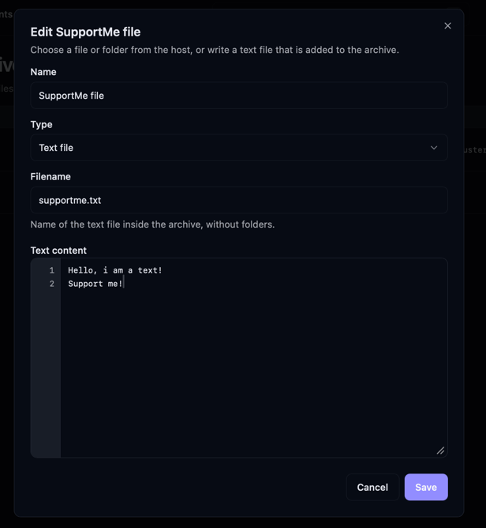
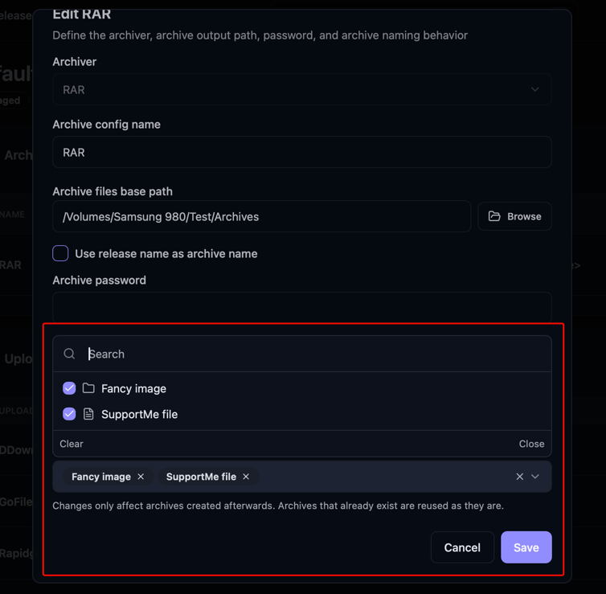

Include your own files, folders, or text files in archives, such as a `Premium.txt` with your referral link.

Available for [managed releases](/Bearcat/release-types/) only, since Bearcat does not pack unmanaged releases.

## Create an entry

In the navigation, open **Configuration > Release settings > Additional archive contents**.
You can also find the page with **Ctrl+K** or **Cmd+K**.



Click **New additional archive content**, give the entry a unique name, and choose a type.

### File or folder

Enter the full **Source path** to an existing file or folder on the machine running Bearcat.
Folders are copied with their contents and keep their folder name.

Use **Browse** to select a path inside your working directories. Paths outside those directories
can be entered manually.

In Docker, enter the path inside the container. Make the file or folder available there through a bind mount.

### Text file

Enter a **Filename**, such as `Premium.txt`, and the **Text content**, then save.

- Use a filename without folders. `__nonce.txt` is reserved by Bearcat.
- Text content must not be empty.
- Spaces are preserved, including ASCII art.
- Bearcat writes the file as UTF-8 with Windows line endings (CRLF).



## Assign it to archives

To include an entry in an archive, select it under **Additional archive contents** in the archive configuration:

- **On a release template:** applies to new releases created from that template.
- **On a release, under Archive configurations:** applies to that release only.

You can select multiple entries and reuse an entry across templates and releases.

Each selected entry needs a different file or folder name. For example,
`/extras/Premium.txt` conflicts with a text file named `premium.txt`. Bearcat ignores case
when checking these names.



## Where the contents are within an archive

The contents sit directly inside the release folder in the archive, next to the release files:

```text
Rel.Name/
  rel.name.mkv
  rel.name.nfo
  Premium.txt
```

If **Pack release folder as root folder** is off in the archive configuration, the release files
and the contents are at the top level of the archive instead.

Bearcat adds the contents to the release folder for packing, then removes them again. It also removes
`__nonce.txt` if **Create nonce file** is on. This cleanup runs even if packing fails, or on the next
start after a crash. Your original release files are kept.

## If packing fails

Bearcat stops packing and creates an error notification for these problems:

| Problem | What to check |
| --- | --- |
| A source file or folder is missing | Check the source path and any Docker bind mount. |
| The release folder already contains the same name | Rename the additional file or folder, or remove its assignment. Bearcat never overwrites your existing files. |
| A file or folder cannot be copied | Check that Bearcat can read the source and write to the release folder. |

## Edit or delete an entry

Changes apply only to new archives.

To delete an entry, first remove its assignments. If it is still in use, Bearcat lists the
templates and releases that prevent deletion.
