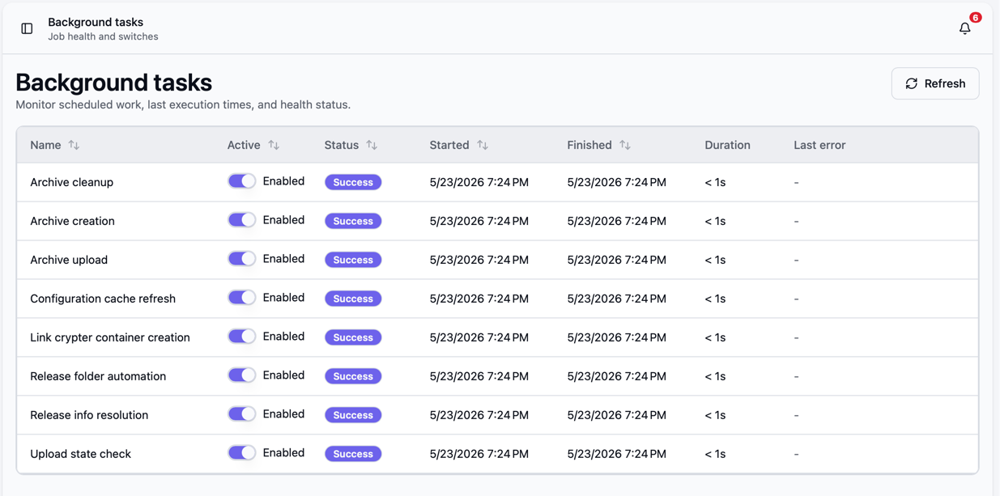
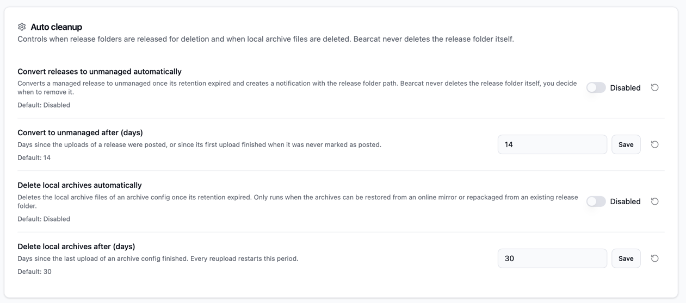
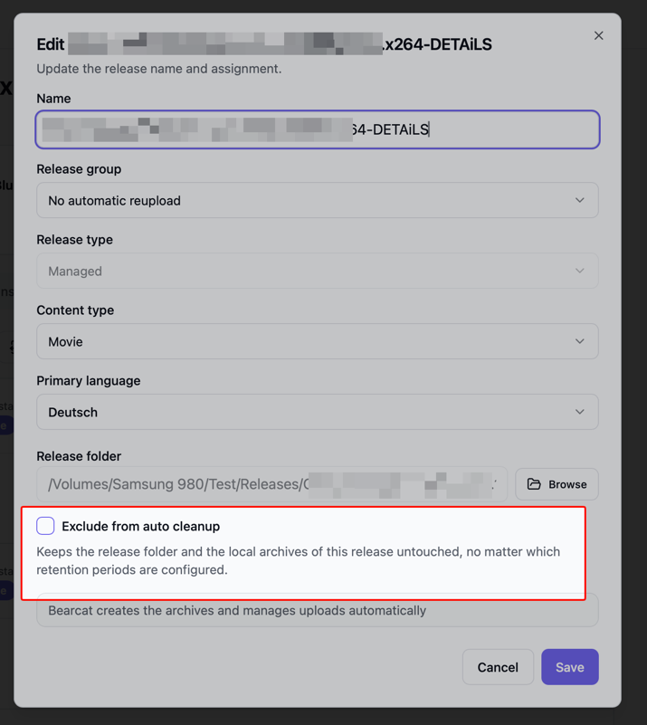

Bearcat does most work in background tasks.
The web UI gives you two places to control that behavior:

- "Background tasks" shows scheduled work, health and enable / disable switches.
- "Configurations" contains global settings that affect background work.

## Background tasks

Open "Background tasks" in the sidebar to see the current task list.
Each background task runs on its own schedule and stores its last known state in the database.

The table columns mean:

- "Name" is the task display name.
- "Active" enables or disables future executions of that task.
- "Status" shows "Never run", "Running", "Success" or "Error".
- "Started" and "Finished" show the timestamps of the latest run.
- "Duration" shows how long the latest finished run took.
- "Last error" shows the latest error message if the task failed.

Tasks are enabled by default.
If you disable a task, Bearcat skips future runs of that task.
Disabling a task does not cancel work that is already running at that moment.
Use the "Refresh" button to reload the latest state.

Most tasks should stay enabled during normal operation.
Only disable a task if you intentionally want to pause that part of the system, for example while debugging a failing hoster account or while doing maintenance on a storage folder.

### Available background tasks

| Task | Runs | What it does |
| --- | ---: | --- |
| Configuration cache refresh | Every 5 minutes | Reloads configuration overrides from the database into the in-memory configuration cache. Saving a value in the UI also updates the cache immediately, but this task keeps the cache in sync. |
| Release folder automation | Every 2 minutes | Scans enabled release folder automations and creates releases from matching direct subfolders using the selected release template. A matching folder is only turned into a release once it looks finished (see ["Folder automation"](#folder-automation) below). |
| Release info resolution | Every 10 minutes | Resolves missing scene release information, NFO files, external IDs, and movie or TV metadata through the active NFO databases and metadata sources. |
| Archive creation & restore | Every 20 seconds | Restores archive files from a mirror hoster when they are no longer on disk, then creates missing archives for uploads that are waiting for an archive. If a matching archive already exists, it can reuse it instead of creating a new one. |
| Auto cleanup | Every 30 minutes | Converts managed releases to unmanaged and deletes local archive files once their retention periods have passed, if the matching rule is enabled in "Configurations". |
| Archive upload | Every 20 seconds | Uploads pending archive files to the configured hosters and updates upload progress and final upload state. |
| Image upload | Every 30 seconds | Uploads release cover images to configured image hosters when a cover image URL is available. |
| Upload state check | Every 20 seconds | Checks whether uploaded files are still online, creates initial upload records after the configured cooldown and schedules automatic reuploads when release group rules allow it. |
| Link crypter container creation | Every 20 seconds | Creates missing link crypter containers for completed uploads that have link crypter configurations. |

## Configurations

Open "Configurations"   in the sidebar to change global application behavior.
Each configuration property shows its current value and its default value.

When you change a value, Bearcat stores it as an override.
Overridden values show an "Override" badge.
Use the reset button next to a property to remove the override and return to the default.

Configuration changes are stored in the database.
They survive container restarts.

### Auto cleanup

"Auto cleanup" frees disk space once a release has been online for a while.
It has two independent rules, and both are disabled by default:

- "Convert releases to unmanaged automatically" with "Convert to unmanaged after (days)", default `14`.
- "Delete local archives automatically" with "Delete local archives after (days)", default `30`.

You can enable either one on its own.
The "Auto cleanup" background task runs the release folder rule first and the archive rule second, so a release gets converted to unmanaged before its archives are considered.

Bearcat never deletes your release folder.
That decision stays with you, which is the same rule the manual "Convert to unmanaged" action follows.

#### Convert releases to unmanaged automatically

This rule automatically converts a release from Managed (= all its raw files are available in case of repacks) to Unmanaged (= raw files are not considered anymore, only existing Archives get reuploaded).
The clock starts at the date the uploads were posted, or at the first finished upload when the release was never marked as posted.
A release with neither is never converted.

When the period has passed, Bearcat checks that:

- No upload of the release is running.
- Every archive configuration has a local archive, or an online mirror on a hoster that is enabled for [mirror downloads](/Bearcat/mirror-downloads/).

If that is the case, Bearcat switches the release to unmanaged, forgets the release folder path, and creates a notification.
The notification contains the release folder path, because after the conversion Bearcat no longer stores it.
Delete the folder yourself if you want.

If any archive is stored inside the release folder, the notification says so and asks you to delete only the release data and keep the archive files.

#### Delete local archives automatically

This rule deletes the local archive files of an archive configuration.
The clock starts at the last finished upload of that archive configuration, so every reupload restarts the period.

Bearcat only deletes when the archives stay recoverable:

- A fully online upload exists on a hoster that is enabled for [mirror downloads](/Bearcat/mirror-downloads/), or
- the release is managed and still has a release folder to repack from.

It deletes the archive files one by one and removes the archive folder only when it is empty afterwards.
After that the archive is marked as deleted in the database.

Uploads on the hoster are never touched.

#### Exclude single releases

Both rules skip releases with the "Exclude from auto cleanup" checkbox set.
You find it in the release dialog, when creating a release and when editing one.

Use it for releases whose raw files or archives you want to keep on disk, no matter which retention periods are configured.

### Archive repackaging

"Archive repackaging" controls how Bearcat changes generated archive files when it has to create a fresh archive for an upload or reupload.

The available setting is:

- "Repackaging strategy" defaults to "Change archive file size by 1 MB".

Bearcat always writes a random `__nonce.txt` file into the release folder before packing.
The repackaging strategy decides how that nonce file should affect the generated archive files:

| Value | UI label | Behavior |
| --- | --- | --- |
| `NonceOnly` | Nonce only, no compression | Packs without compression and without solid mode. Only `__nonce.txt` changes. This has the lowest CPU cost, but the lowest chance that every archive part gets a new MD5 hash. |
| `SolidCompression` | Solid archive with compression | Packs with solid mode and compression. This is the safest option for making the nonce change affect all archive files, but it uses more CPU. |
| `IncrementArchiveFileSize` | Change archive file size by 1 MB | Packs without compression and without solid mode, but increases the archive part size by `1` MB compared to the latest archive for the same archive configuration. This is the default. |

`IncrementArchiveFileSize` stores the archive part size that was actually used on each archive.
When Bearcat creates the next archive for the same archive configuration, it reads the latest stored value and adds `1` MB.
For the first archive, Bearcat uses the "Archive file size (MB)" from the archive configuration.

RAR and 7Zip both support all three strategies.

### Folder automation

"Folder automation" controls when a watched folder is considered finished and turned into a release by the "Release folder automation" background task.

The available settings are:

- "Folder stability (minutes)" defaults to `5`.
- "Minimum folder size (MB)" defaults to `1`.

When a matching folder is found, Bearcat does not create a release immediately.
Instead it remembers the folder's total file count and size and only creates the release once that fingerprint has stayed unchanged for at least "Folder stability (minutes)" and the folder is at least "Minimum folder size (MB)" in size.

This avoids two problems that happen when a release folder is still being filled:

- Creating a release while files are still being copied in, which would extract the wrong media metadata (for example a too-small main video size).
- Turning empty or near-empty folders into releases.

Bearcat compares total size and file count between scans rather than folder modification dates, because release folders are often moved or copied with their original timestamps preserved.

For example, with the defaults Bearcat creates the release once a matching folder has been quiet for about five minutes and holds at least one megabyte of files:

- Raise "Folder stability (minutes)" if your copies are slow or pause for long stretches, so Bearcat waits longer before acting.
- Set "Minimum folder size (MB)" to `0` to disable the size check and let even empty folders become releases.

This only affects automatic release creation.
You can still create releases manually and trigger media metadata extraction yourself on a release's "Release info" panel.

### Initial upload cooldown

"Initial uploads" controls when Bearcat creates the first upload run for a new release.

The available setting is:

- "Initial upload cooldown (minutes)" defaults to `5`.

After you create a release and add an upload configuration, Bearcat waits until the release is older than this cooldown before it creates the first upload record.
The "Upload state check" background task performs this check.

For example:

- `5` means Bearcat waits about five minutes after release creation before scheduling the initial upload.
- `0` means Bearcat can create the initial upload on the next "Upload state check" run.
- A larger value gives you more time to finish release setup before Bearcat starts archiving and uploading.

Changing the cooldown affects upload configurations that do not have an upload yet.
It does not cancel or delay uploads that already exist.

### Upload concurrency

"Upload concurrency" controls how many archive files Bearcat uploads in parallel across all hosters.

The available setting is:

- "Maximum parallel uploads" defaults to `10`.

This is the global limit for the "Archive upload" background task.
Bearcat never runs more than this many file uploads at the same time, even when several uploads are pending.

Each hoster also has its own parallel upload limit.
For a single hoster, the effective number of parallel uploads is the smaller of this global limit and that hoster's limit.
You can view and, where allowed, override the per-hoster limit on the "Hoster registrations" page (see ["Parallel uploads per hoster"](/Bearcat/post-installation/#parallel-uploads-per-hoster)).

Lower this value to reduce bandwidth and CPU usage during uploads.
Raise it if you upload to many hosters at once and want more files to transfer in parallel.
