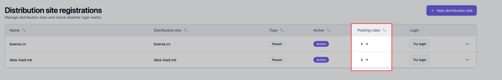
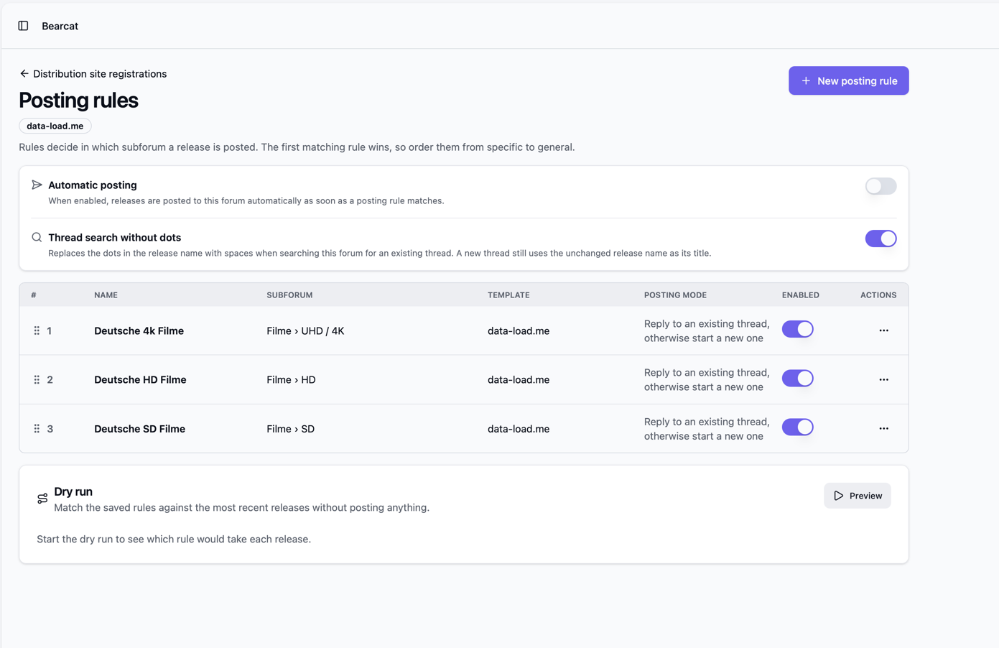
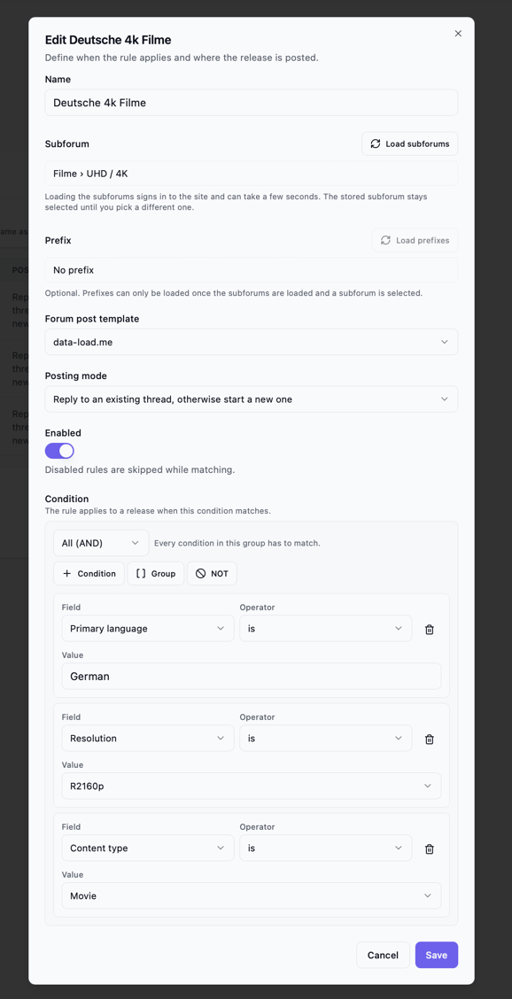
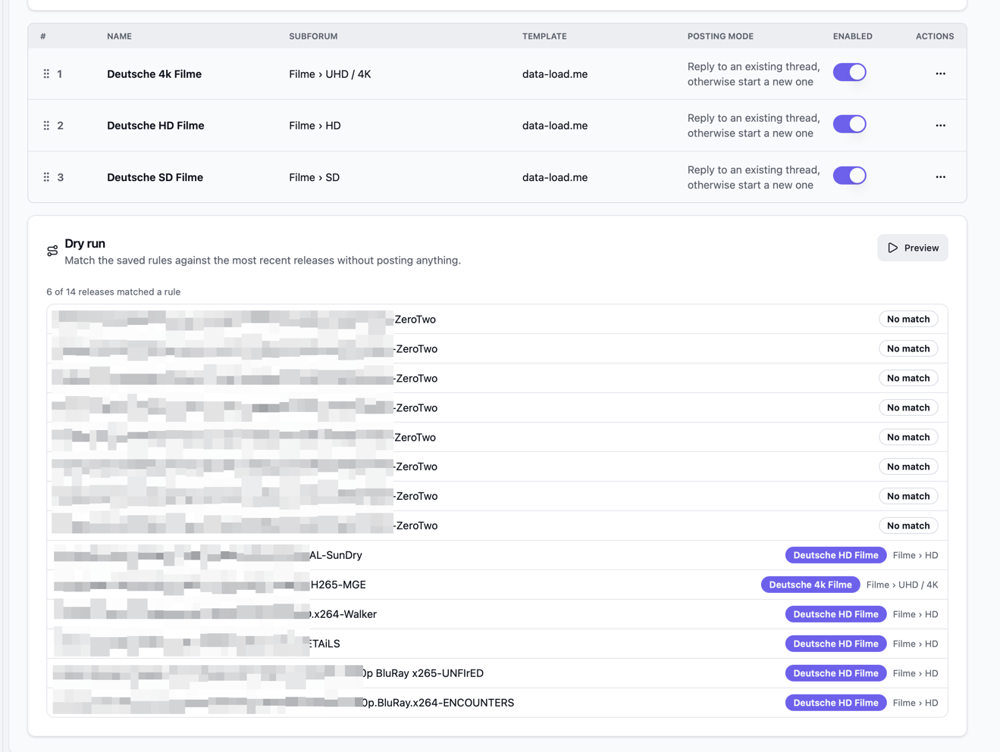

[Posting to Forums](/Bearcat/posting-to-forums/) prepares a draft that you check and submit yourself.
Posting rules remove that last step: a rule decides which subforum a release belongs in, and Bearcat
renders the template, finds or creates the thread and sends the post. You can trigger that per release
from the post queue, or let a background task do it automatically.

Every forum registration has its own rule list. Rules are ordered and the first matching rule wins.
If no rule matches, the release is not posted to that forum automatically, to prevent mistakes from happening
(e.g. posting into the wrong subforum).

## What you need first

- A forum added under **Distribution sites**, with a working login.
- At least one [forum post template](/Bearcat/forum-post-templates/) that the rule can render.
- Releases that reach the [post queue](/Bearcat/post-queue/), pass their
  [quality gate](/Bearcat/quality-gates/) (if there is any) and have a classification.

## Opening the posting rules page

Open **Distribution sites** in the sidebar. The table has a **Posting rules** column that shows how
many rules a forum has. 

Click the number to open the page, or use **Posting rules** in the row menu.

## Site-wide settings

Two switches at the top of the page apply to the whole forum registration.

**Automatic posting** is off by default. While it is off, rules are only used for the preview and for
the **Post** button in the post queue, so nothing is sent without you pressing something. Switch it
on and the "Automatic forum posting" background task posts every matching release that is waiting in
the post queue, every 15 minutes by default. The interval can be changed on the
[Background tasks](/Bearcat/advanced-configuration/#background-tasks) page.

**Thread search without dots** is on by default. Release names use dots, most forum thread titles use
spaces, so Bearcat replaces the dots with spaces when it searches the forum for an existing thread.
A new thread gets the same spaced name as its title, switch it off and both the search and new thread titles use the dotted release name.

## Adding a rule

Click **New posting rule**. A rule has these parts:

- **Name**: your own name for that rule
- **Subforum**: where a matching release is posted. Click **Load subforums** first. Bearcat signs in
  to the forum and reads the current forum tree, which can take a few seconds. The stored subforum
  stays selected until you pick a different one, so you do not have to load the list to edit the
  other fields.
- **Prefix**: some subforums allow you to set prefixes on new threads
- **Forum post template**: the template that is rendered as the post body.
- **Posting mode**: either *Reply to an existing thread, otherwise start a new one*, or *Always start
  a new thread*.
- **Enabled**: disabled rules are skipped while matching

## Conditions

A rule applies to a release when its condition matches. A condition is built from comparison rows
inside groups:

- **All (AND)**: every entry in the group has to match.
- **Any (OR)**: at least one entry has to match.
- **NOT**: matches when the single condition inside does not match.

Groups can be nested, so you can build something like "German and (1080p or 2160p) and not from
group X". Use **Condition**, **Group** and **NOT** inside a group to add entries.

Each comparison row picks a field, an operator and a value:

| Field | Values |
| --- | --- |
| Release name | Free text |
| Resolution | From the classification, for example `R1080p` or `R2160p` |
| Primary language | Language of the release, for example `German` |
| Multi-language | Yes or no |
| Content type | `Movie`, `TvShowEpisode` or `Other` |
| Source | For example `BluRay` or `WebDl` |
| Release group | The Bearcat release group the release belongs to |
| Release group tag | The group tag from the release name, for example `FLAME` |
| Year | Number |
| Season | Number |
| Episode | Number |

Which operators a field offers depends on its type. The release name supports *is*, *is not*, the two
pattern operators and *matches regex*. Release group and release group tag swap the regex for
*is one of*, *is none of*, *is set* and *is not set*. The primary language has the list and set
operators but no patterns. Resolution, year, season and episode can be compared with *is at least*
and *is at most*.

*matches pattern (%)* uses `%` as a placeholder for any text and matches the whole value, so
`%German%` matches anywhere in the name and `%-FLAME` matches names ending in that group. Patterns
and regular expressions ignore case. A regular expression that is invalid or too slow counts as
no match instead of failing the rule.

Most fields come from the release classification, which Bearcat derives from the release name and,
where available, the media info. Releases without a classification are not posted at all, see below.

## Ordering the rules

The rule list is ordered and the first matching rule wins. Drag a rule by the handle on the left to
move it. Put specific rules above general ones.

## Dry run

The **Dry run** card at the bottom of the page matches the saved rules against the most recent
releases without posting anything. Click **Preview** and you get a list of releases with the rule
that would take each one and its subforum, or **No match**. Use it after you changed the order or
added a condition, to see whether the rules do what you expect before you switch automatic posting
on.

The dry run uses the rules as they are saved, so save a rule first if you want to see its effect.

## Posting from the post queue

Every entry under **Single releases** in the [post queue](/Bearcat/post-queue/) has an **Automatic
posting** section that shows, per forum, what the rules would do:

- the matched rule and its subforum, with a **Post** button,
- **Posted** with a link, if the release was already posted to that forum,
- **No matching posting rule**, if no rule matches the release.

A forum with automatic posting switched on has an **Auto** badge, so you can tell which entries
the background task will handle on its own.

**Post** renders the template, searches for an existing thread if the rule
says so, replies there or creates a new thread with the prefix, and stores the resulting URL under
**Posted locations** on the release. When more than one forum is still open, **Post to all matched
sites** goes through them one after another.

Once no matched forum is left open, Bearcat marks the release as posted and it leaves the queue. If
you post somewhere else by hand, **Mark as posted** still works as before.

Collections currently have no automatic posting section. Rules match single releases.

## When a release cannot be posted

Instead of the forum list, the entry shows a short reason:

- **Automatic posting is blocked: the quality gate has not passed.** The release has to be
  [passed or manually approved](/Bearcat/quality-gates/).
- **Automatic posting is blocked: the release has no classification.** Classification runs in the
  background every 30 minutes and after media metadata are extracted. Wait for the next run, or
  extract the media metadata on the release to trigger it.
- **No forum has posting rules yet.** No forum registration has an enabled rule.

The background task uses the same checks, so a blocked release is skipped there as well and picked
up again once it is ready.

## Notifications

Every automatic post creates a notification, whether it worked or not.

## Posted locations and duplicates

A release stores in which forum it already got posted. That is how Bearcat tracks already posted things and shows **Posted** instead of offering the post again. It
also means the background task cannot post a release twice to the same forum, even if the rules
change in between.