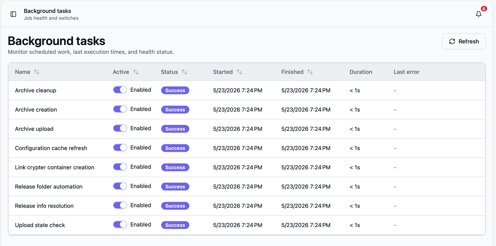
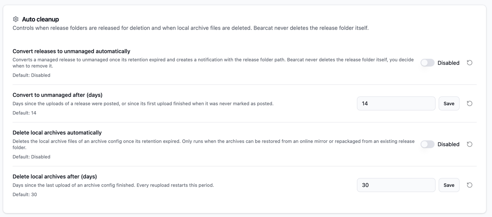
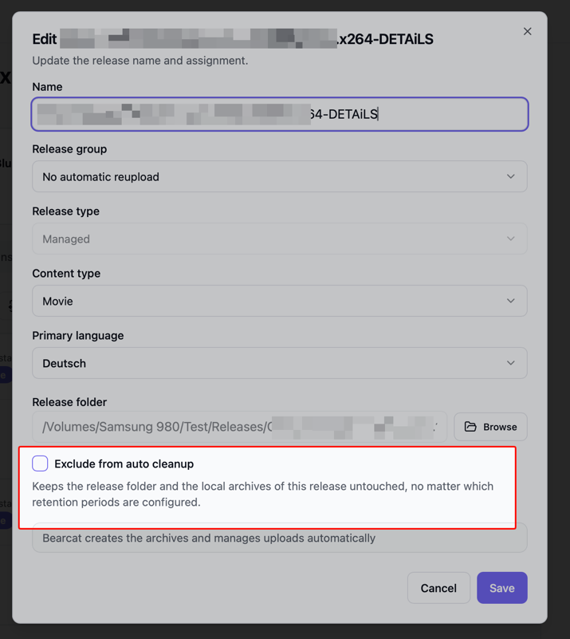

Bearcat packt, lädt und prüft Dateien im Hintergrund. Unter **Hintergrundaufgaben** verwaltest du
die Aufgaben, unter **Konfigurationen** ihre Einstellungen.

## Hintergrundaufgaben

Jede Aufgabe läuft nach ihrem eigenen Zeitplan.

Die Tabelle zeigt Status, Start, Ende, Dauer und den letzten Fehler jeder Aufgabe.
Mit **Aktiv** schaltest du künftige Ausführungen ein oder aus. Laufende Aufgaben werden dabei nicht abgebrochen.
Standardmässig sind alle Aufgaben aktiv.

### Verfügbare Hintergrundaufgaben

| Aufgabe | Läuft | Funktion |
| --- | ---: | --- |
| Configuration cache refresh | Alle 5 Minuten | Lädt zwischengespeicherte Einstellungen neu aus der Datenbank. In der Oberfläche gespeicherte Einstellungen gelten sofort. |
| Release folder automation | Alle 2 Minuten | Scannt Ordner und erstellt Releases mit dem gewählten Template, sobald die [Ordnerprüfungen](#ordnerautomatisierung) bestanden sind. |
| Remote source scan | Alle 2 Minuten | Findet passende FTP-/FTPS-Ordner und plant sie ein, sobald die [Prüfungen für Remoteordner](#remotedownloads) bestanden sind. |
| Remote source download | Alle 20 Sekunden | Lädt geplante Remoteordner herunter. |
| Remote download verification and extraction | Alle 20 Sekunden | Prüft abgeschlossene Downloads anhand ihrer SFV-Dateien und entpackt Archive, falls konfiguriert. |
| Remote download release creation | Alle 20 Sekunden | Erstellt Releases aus abgeschlossenen Downloads mit den jeweils gewählten Templates. |
| Remote download raw file cleanup | Alle 2 Minuten | Wandelt heruntergeladene Releases in Unmanaged um und entfernt ihre Rohdateien, wenn [Rohdateien behalten](/Bearcat/de/remote-downloads/#rohdateien-nach-dem-upload-löschen) ausgeschaltet ist und die Bedingungen für das Löschen erfüllt sind. |
| Release info resolution | Alle 10 Minuten | Ergänzt fehlende Sceneinfos, NFOs, externe IDs und Metadaten aus den aktiven Quellen. |
| Archive creation & restore | Alle 20 Sekunden | Stellt Archive für wartende Uploads bereit: verwendet vorhandene Archive wieder, stellt fehlende Dateien von einem Mirror wieder her oder erstellt neue Archive. |
| Auto cleanup | Alle 30 Minuten | Wendet aktivierte [Aufräumregeln](#automatisches-aufräumen) nach Ablauf ihrer Aufbewahrungsfristen an. |
| Archive upload | Alle 20 Sekunden | Lädt Archive zu den konfigurierten Hostern hoch. |
| Image upload | Alle 30 Sekunden | Lädt Coverbilder von Releases zu konfigurierten Bildhostern hoch, wenn eine Cover-URL vorhanden ist. |
| Upload state check | Alle 20 Sekunden | Prüft, ob hochgeladene Dateien noch online sind, erstellt nach dem konfigurierten Cooldown initiale Uploads und plant automatische Reuploads. |
| Link crypter container creation | Alle 20 Sekunden | Erstellt Linkcryptercontainer für abgeschlossene Uploads. |

## Konfigurationen

Öffne "Konfigurationen" im Menü, um das globale Verhalten von Bearcat zu ändern.

Schalter und Auswahlfelder speichern sofort. Zahlenfelder haben Buttons zum Speichern und Verwerfen.
Du kannst auch Enter zum Speichern oder Escape zum Abbrechen drücken.

Geänderte Einstellungen sind mit einem Punkt markiert. Der Standardwert wird daneben angezeigt.
Mit **Zurücksetzen** stellst du ihn wieder her.

### Automatisches Aufräumen

**Automatisches Aufräumen** gibt Speicherplatz frei. Es gibt zwei unabhängige Regeln,
die standardmässig deaktiviert sind:

- "Releases automatisch in Unmanaged umwandeln" mit "In Unmanaged umwandeln nach", Standard `14` Tage,
  und optional "Releaseordner beim Umwandeln löschen".
- "Lokale Archive automatisch löschen" mit "Lokale Archive löschen nach", Standard `30` Tage.

Ohne "Releaseordner beim Umwandeln löschen" löschen diese Regeln deinen Releaseordner nicht. Lösche ihn selbst, wenn du ihn nicht mehr brauchst.
[Remotedownloads](/Bearcat/de/remote-downloads/#rohdateien-nach-dem-upload-löschen) haben eine eigene Option,
um heruntergeladene Rohdateien nach dem Upload zu löschen.

#### Releases automatisch in Unmanaged umwandeln

Diese Regel wandelt Managed Releases in Unmanaged Releases um. Bearcat lädt danach vorhandene Archive erneut hoch, statt aus den ursprünglichen Releasedateien neue zu erstellen.
Die Frist beginnt mit dem Postingdatum oder dem ersten abgeschlossenen Upload, wenn das Release
nie als gepostet markiert wurde. Ohne eines dieser Daten bleibt das Release managed.

Nach Ablauf der Frist müssen beide Bedingungen erfüllt sein:

- Kein Upload des Releases läuft.
- Jede Archivkonfiguration hat ein lokales Archiv oder einen vollständig verfügbaren Mirror auf einem Hoster, der für [Mirrordownloads](/Bearcat/de/mirror-downloads/) aktiviert ist.

Sind beide Bedingungen erfüllt, wandelt Bearcat das Release in Unmanaged um und entfernt den gespeicherten
Pfad zum Releaseordner. Du erhältst eine Benachrichtigung mit diesem Pfad und kannst den Ordner selbst löschen.

Liegt ein Archiv im Releaseordner, weist die Benachrichtigung darauf hin und bittet dich, nur die Releasedaten zu löschen und die Archivdateien zu behalten.

Ist "Releaseordner beim Umwandeln löschen" aktiviert, löscht Bearcat den Releaseordner im selben Durchlauf wie die Umwandlung.
Es gibt keine eigene Frist. Der Ordner wird nur gelöscht, wenn:

- Jede Archivkonfiguration ein lokales Archiv hat, dessen Archivdateien alle auf der Festplatte vorhanden sind. Ein Mirror reicht für die Umwandlung, aber nicht für das Löschen.
- Kein Archiv im Releaseordner liegt.
- Der Ordner kein Laufwerksstamm und kein Arbeitsverzeichnis ist und keines enthält.

Sonst wandelt Bearcat das Release um, behält den Ordner und die Benachrichtigung nennt den Grund.
Schlägt das Löschen fehl, bleibt das Release Unmanaged und die Benachrichtigung bittet dich, den Ordner selbst zu löschen.

#### Lokale Archive automatisch löschen

Diese Regel löscht die lokalen Archivdateien einer Archivkonfiguration.
Die Frist beginnt mit dem letzten abgeschlossenen Upload dieser Archivkonfiguration, jeder Reupload startet sie also neu.

Bearcat löscht nur, wenn die Archive wiederherstellbar bleiben:

- Es gibt einen vollständig online verfügbaren Upload auf einem Hoster, der für [Mirrordownloads](/Bearcat/de/mirror-downloads/) aktiviert ist, oder
- das Release ist managed und hat noch einen Releaseordner, aus dem neu gepackt werden kann.

Bearcat entfernt den Archivordner, wenn er danach leer ist. Dateien auf dem Hoster bleiben erhalten.

#### Einzelne Releases ausschliessen

Aktiviere beim Erstellen oder Bearbeiten eines Releases **Vom automatischen Aufräumen ausschliessen**,
um beide Regeln zu überspringen.

Lass bei Remotedownloads zusätzlich
**Rohdateien behalten** in der Automatisierung aktiviert, um den heruntergeladenen Ordner zu behalten.

### Archivrepackaging

Hoster können bereits hochgeladene Dateien am MD5-Hash erkennen. Bevor Bearcat ein Archiv erneut zum
selben Hostertyp hochlädt, ändert es die Hashes. Das Verfahren hängt vom Format ab:

- **RAR:** Bearcat speichert die Hashhistorie pro Archivkonfiguration, auch nach dem Löschen lokaler
  Archive. Es hängt an jeden neu gepackten Archivteil und an jeden wiederverwendeten Archivteil, der
  erneut hochgeladen wird, Nullbytes an, bis dessen Hash neu ist. Das Archiv lässt sich weiterhin
  normal entpacken. Die eingestellte Partgrösse bleibt gleich; die standardmässige Erhöhung um `1` MB
  entfällt normalerweise. Kompression und Solidmodus richten sich weiterhin nach der gewählten Strategie.
- **7-Zip:** Für neue Hashes muss Bearcat das Release neu packen. Wähle dafür unter
  **Konfigurationen** eine **Repackagingstrategie**:

| Strategie | Wirkung beim Packen von 7-Zip-Archiven |
| --- | --- |
| **Archivdateigrösse um 1 MB verändern** (Standard) | Keine Kompression, kein Solidmodus. Jedes neue Archiv verwendet eine um `1` MB grössere Partgrösse als das vorherige derselben Archivkonfiguration. Das erste verwendet die eingestellte Grösse. |
| **Nur Nonce, keine Kompression** | Nur die zufällige `__nonce.txt` ändert sich. Braucht wenig CPU, aber einige Parts behalten eventuell ihren alten Hash. |
| **Solidarchive mit Kompression** | Kompression im Solidmodus verteilt die Nonceänderung zuverlässiger auf die Parts, braucht aber mehr CPU. |

**Noncedatei erstellen** ist in der Archivkonfiguration standardmässig aktiviert. Schaltest du es aus,
erhöht 7-Zip die Partgrösse unabhängig von der Strategie immer um `1` MB. Bei RAR sorgen weiterhin
angehängte Nullbytes für neue Hashes.

Fehlen beim vorherigen RAR-Archiv Hashes, etwa aus der Zeit vor dem Hashtracking, bestimmt die gewählte
Strategie beim Neupacken auch die Partgrösse. Mit der Standardstrategie wird sie dann gegenüber dem
vorherigen Archiv um `1` MB erhöht.

### Ordnerautomatisierung

Bearcat erstellt ein Release aus einem überwachten Ordner, sobald beide Bedingungen erfüllt sind:

- Anzahl und Gesamtgrösse der Dateien bleiben für die Dauer von "Ordnerstabilität" unverändert, Standard `5` Minuten.
- Der Ordner erreicht die "Minimale Ordnergrösse", Standard `1` MB.

So erstellt Bearcat keine Releases, während noch Dateien kopiert werden.

Erhöhe die Stabilitätsdauer bei langsamen Kopiervorgängen. Setze die Mindestgrösse auf `0`, um leere Ordner zuzulassen.
Manuelles Erstellen von Releases und die Metadatenabfrage unter **Releaseinfo** sind davon unabhängig.

### Remotedownloads

Die Einstellungen für [FTP-/FTPS-Downloads](/Bearcat/de/remote-downloads/) findest du unter
**Konfigurationen > Remotedownloads**. Sie gelten unabhängig von der lokalen Ordnerautomatisierung.

| Einstellung | Standard | Wirkung |
| --- | --- | --- |
| Ordnerstabilität | `5` min | Wartet, bis Dateianzahl und Gesamtgrösse des Remoteordners so lange unverändert bleiben. |
| Minimale Ordnergrösse | `1` MB | Kleinere Ordner bleiben in **Wird beobachtet**. Setze `0`, um die Grössenprüfung zu deaktivieren. |
| Maximale parallele Dateidownloads | `4` | Begrenzt, wie viele Dateien gleichzeitig heruntergeladen werden. **Maximale Verbindungen** der Quelle gilt zusätzlich. |
| Wiederholungsverzögerung | `30` s | Wartet so lange, bevor ein fehlgeschlagener Downloadversuch wiederholt wird. |

Erhöhe die Stabilitätsdauer, wenn Dateien langsam eintreffen oder Uploads auf den FTP-Server oft pausieren.
Bearcat lädt jeweils einen Releaseordner herunter, mit mehreren Dateien parallel. Senke das Verbindungslimit,
wenn der Server gleichzeitige Übertragungen verbietet.

### Cooldown für initiale Uploads

"Cooldown für initiale Uploads" ist standardmässig `5` Minuten. So hast du Zeit, ein Release fertig einzurichten, bevor Bearcat es packt und hochlädt.

Sobald eine Uploadkonfiguration existiert und das Release älter als der Cooldown ist, plant der nächste Lauf von "Upload state check" den initialen Upload ein.
Die Wartezeit zählt ab der Erstellung des Releases. Setze sie auf `0`, damit der erste Upload direkt bei der nächsten Prüfung geplant wird.

Änderungen betreffen nur Uploadkonfigurationen ohne Upload. Bestehende Uploads werden weder abgebrochen noch verzögert.

### Parallele Uploads

"Maximale parallele Uploads" ist standardmässig `10`. Der Wert limitiert parallele Dateiuploads über alle Hoster hinweg.
Das Limit jedes Hosters gilt zusätzlich.

Auf der Seite "Hosterregistrierungen" siehst du die einzelnen Limits und kannst sie, wo möglich, überschreiben. Siehe [Parallele Uploads pro Hoster](/Bearcat/de/account-settings/#parallele-uploads-pro-hoster).

"Maximale Uploadgeschwindigkeit" (MB/s) ist standardmässig leer, also ohne Limit. Der Wert limitiert die gesamte
Uploadgeschwindigkeit aller laufenden Uploads über alle Hoster hinweg. Kommazahlen wie `0.5` oder `0,5` sind erlaubt.
Jede Hosterregistrierung kann zusätzlich ein eigenes Limit setzen. Siehe
[Uploadgeschwindigkeit pro Hoster begrenzen](/Bearcat/de/account-settings/#uploadgeschwindigkeit-pro-hoster-begrenzen).

Bei sehr niedrigen Geschwindigkeitslimits können Uploads wegen Zeitüberschreitungen scheitern.

## Datenbank

Neue Installationen als Desktopanwendung, Windows-Dienst oder Docker verwenden SQLite. Bestehende PostgreSQL-Installationen verwenden weiterhin PostgreSQL.

Die Datenbankeinstellungen werden beim Start aus Umgebungsvariablen oder einer Einstellungsdatei gelesen:

| Installation | Wo du sie setzt |
| --- | --- |
| Docker | `docker-compose.yml`, oder `docker-compose.postgres.yml` für PostgreSQL. Siehe [Bearcat in Docker ausführen](/Bearcat/de/use-the-docker-image/#datenbank). |
| Desktopanwendung | **Database type** in den Einstellungen der [Desktopanwendung](/Bearcat/de/use-the-desktop-launcher/#datenbanktyp). |
| Windows-Dienst | Abschnitt `Database` in `%ProgramData%\Bearcat\config.json`, geschrieben von `Bearcat.Cli.exe setup`. |

| Einstellung | Umgebungsvariable | Wert |
| --- | --- | --- |
| `Database:Provider` | `Database__Provider` | `Sqlite` oder `Postgres`, ohne Beachtung der Gross- und Kleinschreibung. Nicht gesetzt: `Postgres`. |
| `Database:SqliteFilePath` | `Database__SqliteFilePath` | Pfad zur SQLite-Datenbankdatei. Nicht gesetzt: `bearcat.db` im Datenverzeichnis. |
| `Database:ConnectionString` | `Database__ConnectionString` | PostgreSQL Connection String, zum Beispiel `Host=localhost;Database=bearcat;Username=bearcat;Password=...`. Wird nur mit `Postgres` verwendet. |

Bearcat bestimmt das Datenverzeichnis in dieser Reihenfolge:

1. Umgebungsvariable `BEARCAT_DATA_DIR`
2. Einstellung `Bearcat:DataDirectory` (Umgebungsvariable `Bearcat__DataDirectory`)
3. `/data` innerhalb eines Containers
4. Der Anwendungsdatenordner des Benutzers plus `Bearcat`: `%APPDATA%\Bearcat` unter Windows, `~/Library/Application Support/Bearcat` unter macOS

Der Windows-Dienst verwendet `%ProgramData%\Bearcat` als Datenverzeichnis.

Hinweise zu SQLite:

- Lege die SQLite-Datenbank auf ein lokales Laufwerk. Netzwerkfreigaben (NFS/SMB) eignen sich nicht für den verwendeten WAL-Modus.
- Sichere `bearcat.key` aus dem Datenverzeichnis zusammen mit der Datenbankdatei. Stoppe Bearcat, bevor du die Datenbankdatei kopierst. Eine Kopie bei laufendem Bearcat kann inkonsistent sein, auch mit den `-wal`- und `-shm`-Dateien. Verwende dann `sqlite3 bearcat.db ".backup bearcat-backup.db"`.

Eine Änderung von `Database:Provider` überträgt keine vorhandenen Daten. Eine neue Datenbank startet leer.
Ohne `Database:Provider` verwendet Bearcat weiterhin PostgreSQL, damit ältere Konfigurationen funktionieren.

## Zeitzone

Bearcat verwendet die lokale Zeitzone für angezeigte Zeiten und zeitabhängige Regeln.
Standardmässig gilt die Zeitzone des Betriebssystems.

| Installation | Standard | Ändern |
| --- | --- | --- |
| Desktopanwendung | Zeitzone deines Computers | Ändere die Zeitzone deines Computers. |
| Windows-Dienst | Zeitzone des Windows-Servers | Füge `"LocalTimezone": "Europe/Berlin"` zu `%ProgramData%\Bearcat\config.json` hinzu und starte den Dienst neu. |
| Docker | UTC | Setze `BEARCAT_TIMEZONE` in `.env`. Siehe [Docker-Einstellungen](/Bearcat/de/use-the-docker-image/#docker-einstellungen). |

Der Wert ist eine Zeitzonen-ID wie `Europe/Berlin` oder `America/New_York`.
Bei einer unbekannten ID bricht Bearcat den Start ab.
