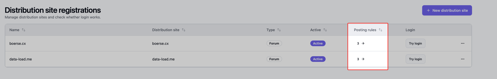
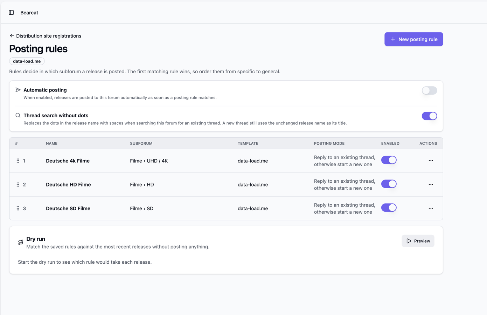
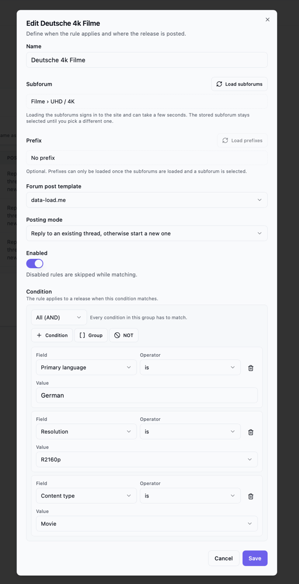
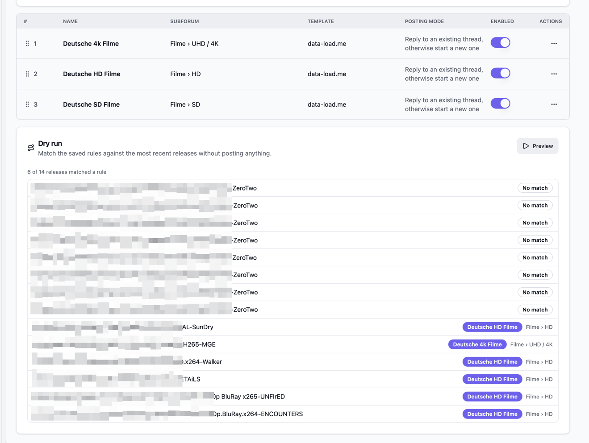
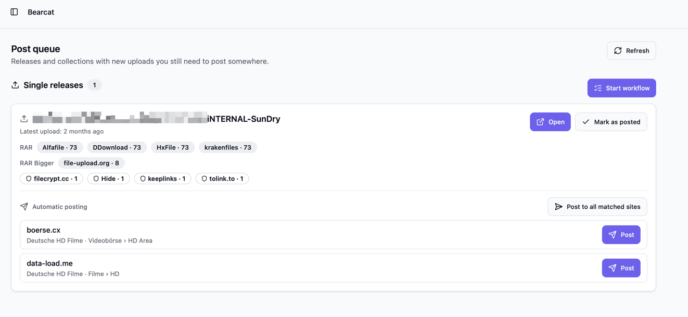

Mit Postingregeln wählt Bearcat ein Unterforum, füllt ein Template aus und sendet den Post ab.
Führe sie mit **Posten** in der [Postwarteschlange](/Bearcat/de/post-queue/) aus oder aktiviere das automatische Posten.
Wenn du Entwürfe selbst prüfen und absenden willst, lies [In Foren posten](/Bearcat/de/posting-to-forums/).

Jedes Forum hat eigene Regeln. Bearcat überspringt Foren ohne passende Regel.

## Voraussetzungen

- Ein Forum unter **Verteilungsseiten** mit funktionierendem Login.
- Eine passende [Forenpostvorlage](/Bearcat/de/forum-post-templates/).
- Releases in der [Postwarteschlange](/Bearcat/de/post-queue/) mit Klassifizierung und bestandener oder manuell freigegebener
  [Qualitätsprüfung](/Bearcat/de/quality-gates/). Gruppen ohne Qualitätsprofil bestehen die Prüfung.

## Postingregeln öffnen

Öffne **Verteilungsseiten** in der Seitenleiste. Die Spalte **Postingregeln** zeigt,
wie viele Regeln das jeweilige Forum hat.

Klicke auf die Zahl, um die Seite zu öffnen, oder nutze **Postingregeln** im Zeilenmenü.

## Einstellungen pro Forum

**Automatisches Posten** ist standardmässig aus. Du kannst Regeln trotzdem in der Vorschau prüfen und **Posten** in der Postwarteschlange nutzen.
Ist es aktiviert, postet die Hintergrundaufgabe "Automatic forum posting" passende Releases aus der Warteschlange standardmässig alle 15 Minuten.
Das Intervall änderst du unter [Hintergrundaufgaben](/Bearcat/de/advanced-configuration/#hintergrundaufgaben).

**Themensuche ohne Punkte** ist standardmässig an. Bearcat ersetzt Punkte durch Leerzeichen, wenn es
nach Themen sucht und neue Themen benennt. Schalte es aus, um für beides den Releasenamen mit Punkten zu verwenden.

## Regel hinzufügen

Klicke auf **Neue Postingregel**. Fülle die folgenden Felder aus:

- **Name**: dein eigener Name für die Regel
- **Unterforum**: das Ziel des Posts. Klicke auf **Unterforen laden** und wähle eines aus.
  Das Laden kann einige Sekunden dauern.
- **Präfix**: in manchen Unterforen kannst du Präfixe für neue Themen setzen
- **Forenpostvorlage**: die Vorlage für den Posttext.
- **Postingmodus**: entweder *Auf bestehendes Thema antworten, sonst neues Thema* oder *Immer ein neues
  Thema erstellen*.
- **Aktiviert**: deaktivierte Regeln werden beim Abgleich übersprungen

## Bedingungen

Mit Bedingungen legst du fest, für welche Releases die Regel gilt. Du kannst Vergleiche gruppieren:

- **Alle (UND)**: jeder Eintrag der Gruppe muss passen.
- **Mindestens eine (ODER)**: mindestens ein Eintrag muss passen.
- **NICHT**: passt, wenn die einzelne Bedingung darin nicht passt.

Gruppen lassen sich verschachteln, so kannst du etwa "Deutsch und (1080p oder 2160p) und nicht von
Gruppe X" abbilden. Mit **Bedingung**, **Gruppe** und **NICHT** fügst du innerhalb einer Gruppe Einträge hinzu.

Jede Vergleichszeile hat ein Feld, einen Operator und einen Wert:

| Feld | Werte |
| --- | --- |
| Releasename | Freitext |
| Auflösung | Aus der Klassifizierung, zum Beispiel `R1080p` oder `R2160p` |
| Hauptsprache | Sprache des Releases, zum Beispiel `German` |
| Mehrsprachig | Ja oder nein |
| Inhaltstyp | `Movie`, `TvShowEpisode` oder `Other` |
| Quelle | Zum Beispiel `BluRay` oder `WebDl` |
| Releasegruppe | Die Releasegruppe in Bearcat, zu der das Release gehört |
| Releasegruppenkürzel | Das Gruppenkürzel aus dem Releasenamen, zum Beispiel `FLAME` |
| Jahr | Zahl |
| Staffel | Zahl |
| Episode | Zahl |

Welche Operatoren verfügbar sind, hängt vom Feld ab:

| Feld | Operatoren |
| --- | --- |
| Releasename | *ist*, *ist nicht*, Mustervergleich und *passt auf Regex* |
| Releasegruppe, Releasegruppenkürzel | *ist*, *ist nicht*, Mustervergleich, *ist eines von*, *ist keines von*, *ist gesetzt*, *ist nicht gesetzt* |
| Hauptsprache | *ist*, *ist nicht*, *ist eines von*, *ist keines von*, *ist gesetzt*, *ist nicht gesetzt* |
| Auflösung, Jahr, Staffel, Episode | Zusätzlich *ist mindestens* und *ist höchstens* |

Bei *passt auf Muster (%)* steht `%` für beliebigen Text. Das Muster muss auf den ganzen Wert passen:

- `%German%` passt auf Namen, die `German` enthalten.
- `%-FLAME` passt auf Namen, die auf `-FLAME` enden.

Muster und reguläre Ausdrücke ignorieren Gross- und Kleinschreibung. Ist ein regulärer Ausdruck ungültig
oder überschreitet der Abgleich das Zeitlimit, gilt die Bedingung als nicht erfüllt.

Die meisten Felder stammen aus der Klassifizierung anhand des Releasenamens und vorhandener Mediendaten.
Postingregeln benötigen eine Klassifizierung des Releases.

## Regeln sortieren

Die erste passende Regel wird verwendet. Ziehe Regeln am Griff links in die gewünschte Reihenfolge.
Setze spezifische Regeln vor allgemeine.

## Probelauf

Speichere deine Regeln und klicke dann in der Karte **Probelauf** unten auf der Seite auf **Vorschau**.
Die Vorschau zeigt für aktuelle Releases die passende Regel und das Unterforum oder **Kein Treffer**.
Dabei wird nichts gepostet.

Führe eine Vorschau aus, nachdem du Bedingungen oder die Reihenfolge der Regeln geändert hast und bevor du das automatische Posten aktivierst.

## Aus der Postwarteschlange posten

Jeder Eintrag unter **Einzelreleases** in der [Postwarteschlange](/Bearcat/de/post-queue/) hat einen Abschnitt
**Automatisches Posten**, der pro Forum zeigt, was die Regeln tun würden:

- die passende Regel und ihr Unterforum, mit einem Button **Posten**,
- **Gepostet** mit einem Link, wenn das Release bereits in diesem Forum gepostet wurde,
- **Keine passende Postingregel**, wenn keine Regel auf das Release passt.

Das Badge **Auto** zeigt, dass Bearcat in diesem Forum automatisch postet.

**Posten** sendet die ausgefüllte Vorlage je nach Regel als Antwort oder neues Thema ab. Bearcat speichert
die Post-URL unter **Veröffentlichungsorte**. **In alle passenden Foren posten** postet nacheinander in die
übrigen passenden Foren.

Sobald kein passendes Forum mehr offen ist, markiert Bearcat das Release als gepostet, und es verlässt
die Warteschlange. Wenn du selbst postest, verwende **Als gepostet markieren**.

Automatisches Posten ist nur für Einzelreleases verfügbar.

## Wenn ein Release nicht gepostet werden kann

Statt der Forenliste zeigt der Eintrag einen kurzen Grund:

- **Automatisches Posten blockiert: Das Quality Gate wurde nicht bestanden.** Das Release muss die
  [Qualitätsprüfung bestehen oder manuell freigegeben werden](/Bearcat/de/quality-gates/).
  Noch ungeprüfte Releases prüft Bearcat beim nächsten Hintergrundlauf.
- **Automatisches Posten blockiert: Das Release hat keine Klassifizierung.** Bearcat klassifiziert Releases
  alle 30 Minuten und nach dem Auslesen der Mediendaten. Warte auf den nächsten Lauf oder klicke
  beim Release auf **Mediendaten extrahieren**.
- **Noch kein Forum mit Postingregeln vorhanden.** Keine Forenregistrierung hat eine aktivierte Regel.

Die Hintergrundaufgabe versucht es erneut, sobald das Release diese Voraussetzungen erfüllt.

## Post nach einem Reupload aktualisieren

Nach einem Reupload kann Bearcat bestehende Posts mit den neuen Downloadlinks aktualisieren.
Es füllt die Vorlage mit den aktuellen Daten und **ersetzt den gesamten Post, einschliesslich deiner Änderungen im Forum**.
Verwende das für Posts mit direkten Downloadlinks statt eines Linkcryptercontainers.

### Aus der Warteschlange aktualisieren

Ein Reupload legt das Release wieder in die Postwarteschlange. Bereits genutzte Foren zeigen
**Postinhalt ist veraltet** neben dem gespeicherten Link. Klicke auf **Post aktualisieren**, um den Post zu ersetzen.
Vorlage und Aktualisierungszeit werden mit der URL unter **Veröffentlichungsorte** gespeichert.

Bei Foren mit aktiviertem **Automatisches Posten** aktualisiert die Hintergrundaufgabe Posts automatisch,
sofern eine Vorlage verfügbar ist. Das Release verlässt die Warteschlange, sobald alle Posts und Aktualisierungen abgeschlossen sind.

### Template wählen

Bearcat verwendet das erste verfügbare Template in dieser Reihenfolge:

1. Das Template, das du im Dialog wählst.
2. Das Template, mit dem der Post erstellt wurde.
3. Das Template der Regel, die aktuell auf das Release passt.

Ältere Posts haben eventuell kein gespeichertes Template. Wähle eines im Dialog oder sorge dafür, dass eine Postingregel passt.

### Aus den Veröffentlichungsorten aktualisieren

Du kannst einen Post auch unter **Veröffentlichungsorte** bei einem Release oder einer Collection aktualisieren.
Klicke auf den Button zum Aktualisieren und bestätige das Ersetzen.
Der Eintrag muss mit einer Verteilungsseite verknüpft sein; auch von Hand bestätigte Posts lassen sich aktualisieren.

Collections lassen sich nur auf diesem Weg aktualisieren. Die Hintergrundaufgabe bearbeitet nur Einzelreleases.

## Benachrichtigungen

Bearcat meldet erfolgreiche und fehlgeschlagene Posts. Die Benachrichtigungen für erfolgreiche und
fehlgeschlagene Aktualisierungen kannst du separat deaktivieren.

## Veröffentlichungsorte und Duplikate

Bearcat speichert jedes Forum unter **Veröffentlichungsorte** und zeigt **Gepostet**, statt erneutes Posten anzubieten.
Die Hintergrundaufgabe überspringt diese Foren, auch wenn sich die Regeln geändert haben.
