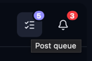
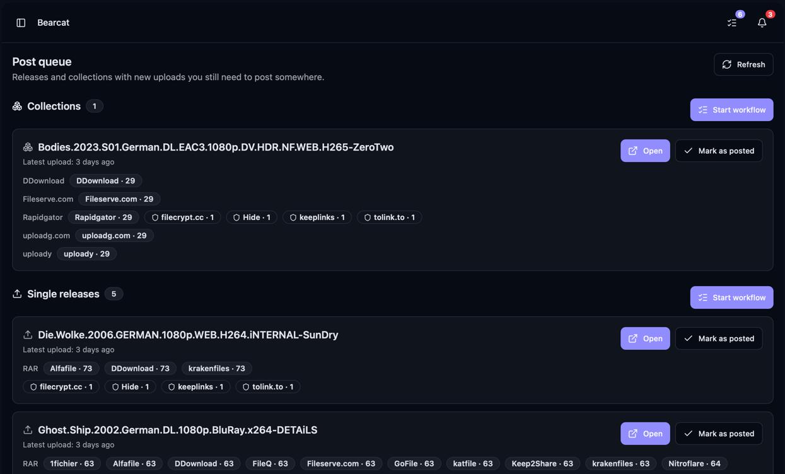
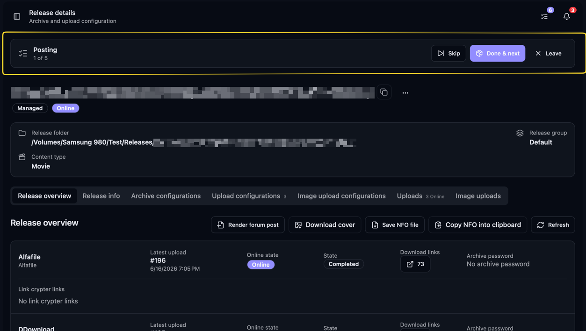
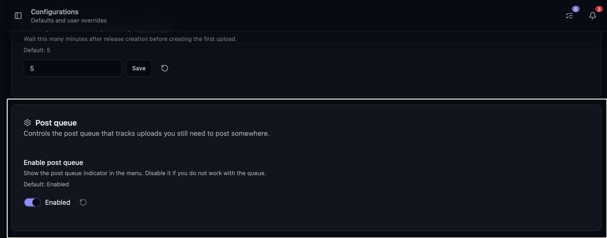

Die Postwarteschlange listet Releases und Collections mit neuen Uploads, die du noch nicht gepostet hast.
Von dort aus kannst du Forenposts vorbereiten, sie über Postingregeln absenden oder Releases als
gepostet markieren, nachdem du sie selbst geteilt hast.

## Wo du sie findest

Klicke auf das Listensymbol neben der Benachrichtigungsglocke. Das Badge zeigt, wie viele Releases
und Collections noch gepostet werden müssen.

Sind alle Einträge erledigt, verschwindet das Badge.

## Wann etwas in die Warteschlange kommt

Ein Release erscheint in der Warteschlange, sobald es einen fertigen Upload hat, den du nicht als gepostet
markiert hast. Bearcat betrachtet pro Uploadkonfiguration den neuesten fertigen Upload. Ältere Uploads werden nicht einzeln aufgeführt.

Die Warteschlange hat zwei Bereiche:

- **Einzelreleases**: Releases, die ausserhalb einer Collection hochgeladen wurden.
- **Collections**: Neue Uploads über Uploadslots einer Collection. Eine TV-Staffel erscheint als ein Eintrag.

Wie Collections und ihre Uploadslots funktionieren, steht unter [Releasecollections](/Bearcat/de/release-collections/).

## Aus der Warteschlange in ein Forum posten

Mit eingerichteten [Postingregeln](/Bearcat/de/automatic-forum-posting/) zeigt der Bereich **Automatisches Posten**
bei Einzelreleases die passende Regel und das Zielunterforum pro Forum.

Mit **Posten** sendest du den Post ab. **In alle passenden Foren posten** arbeitet alle offenen Foren ab.
Das Badge **Auto** zeigt, dass Bearcat in diesem Forum automatisch postet.

Sobald alle passenden Foren erledigt sind, markiert Bearcat das Release als gepostet und entfernt es aus der Warteschlange.

## Als gepostet markieren

Wenn du ein Release irgendwo gepostet hast, klicke in seinem Eintrag auf **Als gepostet markieren**. Der Eintrag wird dann aus der Liste entfernt.

## Der geführte Workflow

Klicke unter Einzelreleases oder Collections auf **Workflow starten**, um die Einträge nacheinander abzuarbeiten.
Bearcat öffnet den ersten Eintrag und zeigt deinen Fortschritt in der Workflowleiste.

Verwende im Kopfbereich des Releases oder der Collection [**Im Forum posten**](/Bearcat/de/posting-to-forums/),
um einen Entwurf vorzubereiten, oder [**Forenpost rendern**](/Bearcat/de/forum-post-templates/#post-rendern)
aus dem Pfeilmenü, um den Text zu kopieren.
Sende den Post im Forum ab und kehre dann zur Workflowleiste zurück.

Die Workflowleiste bietet drei Aktionen:

- **Erledigt & weiter** markiert das aktuelle Release als gepostet und bringt dich zum nächsten.
- **Überspringen** geht weiter, ohne das aktuelle Release zu markieren. Es bleibt also in der Warteschlange.
- **Verlassen** beendet den Durchlauf und bringt dich zurück zur Seite der Postwarteschlange.

Nach dem letzten Eintrag kehrst du zur Postwarteschlange zurück. Sind alle Einträge erledigt,
erscheint **Nichts offen zum Posten**.

Mit **Öffnen** bei einem Eintrag startest du den Workflow direkt an dieser Stelle.

## Die Postwarteschlange deaktivieren

Deaktiviere die Postwarteschlange unter **Konfigurationen**, um ihr Symbol in der Kopfzeile auszublenden und
offene Einträge nicht mehr zu zählen. Die Seite der Warteschlange zeigt dann einen Hinweis statt der Listen.
Du kannst sie wieder aktivieren, ohne Bearcat neu zu starten.

