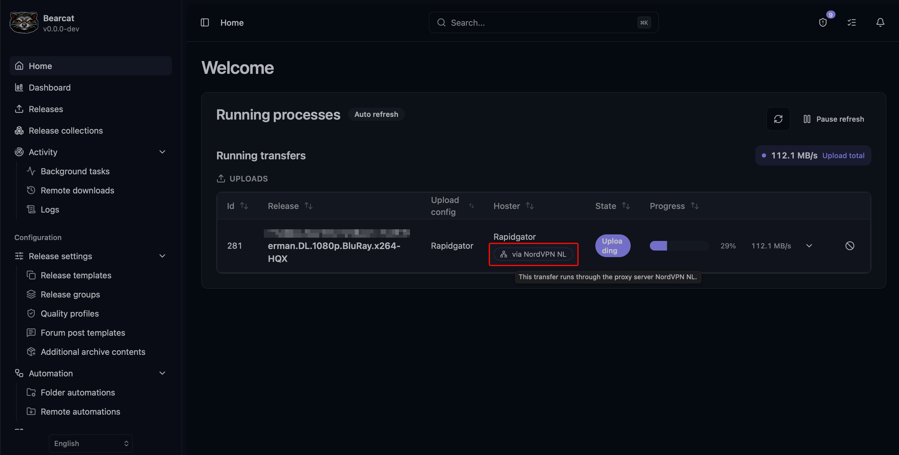
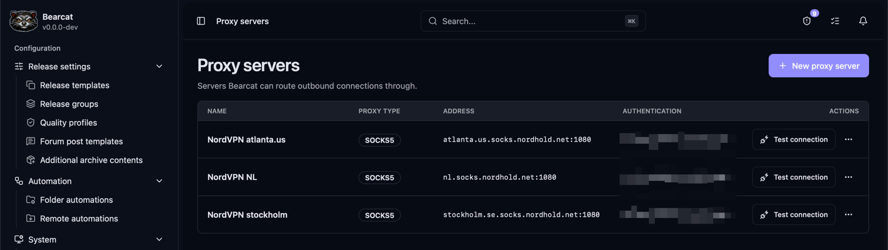
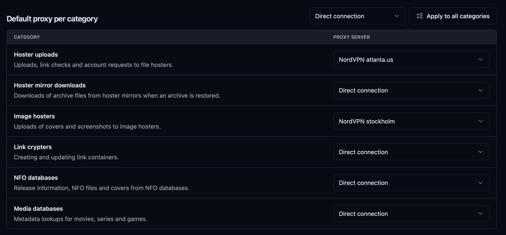
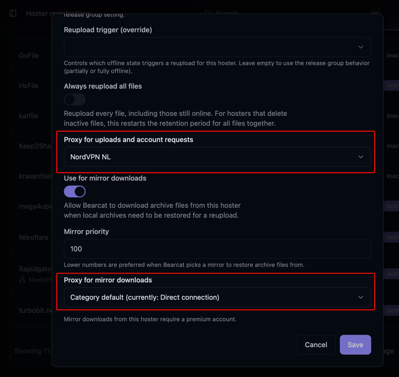

Bearcat kann HTTP- und HTTPS-Anfragen über einen **HTTP**- oder **SOCKS5**-Proxy senden.
Wähle einen Standard pro Kategorie oder einen anderen Proxy für ein einzelnes Konto.
Ohne Proxy verbindet sich Bearcat direkt.

## Einen Proxy hinzufügen

1. Öffne **Proxyserver** in der Seitenleiste und klicke auf **Neuer Proxyserver**.
2. Gib einen Namen ein und wähle **HTTP** oder **SOCKS5** als **Proxytyp**.
3. Gib **Host** und **Port** getrennt ein. Verwende im Feld für den Host einen Hostnamen oder eine
   IP-Adresse wie `proxy.example.com`, ohne `http://`, Port oder Pfad.
4. Gib **Benutzername** und **Passwort** ein, falls der Proxy sie verlangt.
5. Klicke auf **Speichern**, dann auf **Verbindung testen**.

Der Test prüft die Proxyverbindung. Weise den Proxy einer Kategorie oder einem Konto zu, um ihn zu verwenden.

## Festlegen, welche Anfragen den Proxy verwenden

Wähle unter **Standardproxy pro Kategorie** einen Proxy für jede Kategorie, die darüber laufen soll.
Änderungen werden sofort gespeichert und erfordern keinen Neustart.

| Kategorie | Anfragen |
| --- | --- |
| **Uploads zu Hostern** | Dateiuploads, Linkprüfungen, Logins und andere Kontoanfragen. |
| **Mirrordownloads von Hostern** | Archivdownloads von Hostermirrors und die dafür nötigen Hosteranfragen. |
| **Bildhoster** | Coveruploads und andere Bildhosteranfragen. |
| **Linkcrypter** | Erstellen und Aktualisieren von Linkcontainern. |
| **NFO-Datenbanken** | Abrufen von Releaseinformationen, NFO-Dateien und Covern. |
| **Mediendatenbanken** | Abrufen von Metadaten zu Filmen, Serien und Spielen. |

Wähle **Direkte Verbindung**, um keinen Proxy zu verwenden. Für denselben Standard in allen Kategorien
wählst du ihn neben **Für alle Kategorien übernehmen** und klickst auf den Button. Abweichende
Kontoeinstellungen haben weiterhin Vorrang.

Foren, Verteilungsseiten und FTP/FTPS-Remotequellen verwenden diese Proxyeinstellungen nicht.

## Den Proxy für ein Konto überschreiben

Bearbeite eine Registrierung und wähle eine dieser Optionen:

| Option | Wirkung |
| --- | --- |
| **Kategoriestandard (aktuell: …)** | Folgt der Einstellung der Kategorie, auch bei späteren Änderungen. Das ist der Standard. |
| **Kein Proxy (direkte Verbindung)** | Verbindet sich direkt, auch wenn die Kategorie einen Proxy hat. |
| Name eines Proxys | Verwendet immer diesen Proxy, unabhängig von der Einstellung der Kategorie. |

In **Hosterregistrierungen** gibt es zwei getrennte Felder:

- **Proxy für Uploads und Kontoabfragen** gilt auch für **Login testen** und Linkprüfungen.
- **Proxy für Mirrordownloads** gilt beim Wiederherstellen von Archiven. Dieses Feld gibt es bei
  Hostern, die [Mirrordownloads](/Bearcat/de/mirror-downloads/) unterstützen.

In **Bildhosterregistrierungen** und **Crypterregistrierungen** verwendest du das Feld **Proxy**.
Speichere die Registrierung nach der Änderung.

Um über einen Proxy hochzuladen und Archive direkt herunterzuladen, setze **Uploads zu Hostern**
auf deinen Proxy und **Mirrordownloads von Hostern** auf **Direkte Verbindung**. Lass beide Felder
in der Hosterregistrierung auf **Kategoriestandard**.

## Einen Proxy ändern oder entfernen

Mit **Bearbeiten** im Aktionsmenü des Proxys änderst du Adresse oder Zugangsdaten.
Lass das Passwortfeld leer, um das gespeicherte Passwort zu behalten, oder aktiviere
**Gespeichertes Passwort entfernen**, um es zu löschen.

Entferne vor dem Löschen alle Zuweisungen zu Kategorien und Konten. Bearcat zeigt verbleibende
Zuweisungen an, die das Löschen verhindern.

## Wenn eine Anfrage fehlschlägt

- Führe **Verbindung testen** aus und prüfe Host, Port, Proxytyp und Zugangsdaten.
- Wenn der Test erfolgreich ist, aber eine Übertragung fehlschlägt, prüfe, ob der Proxy den Zugriff auf
  diesen Hoster erlaubt.
- Wenn Bearcat das gespeicherte Proxypasswort nicht entschlüsseln kann, bearbeite den Proxy und gib das
  Passwort erneut ein.

Bearcat weicht nicht auf eine direkte Verbindung aus, wenn der gewählte Proxy fehlschlägt.
