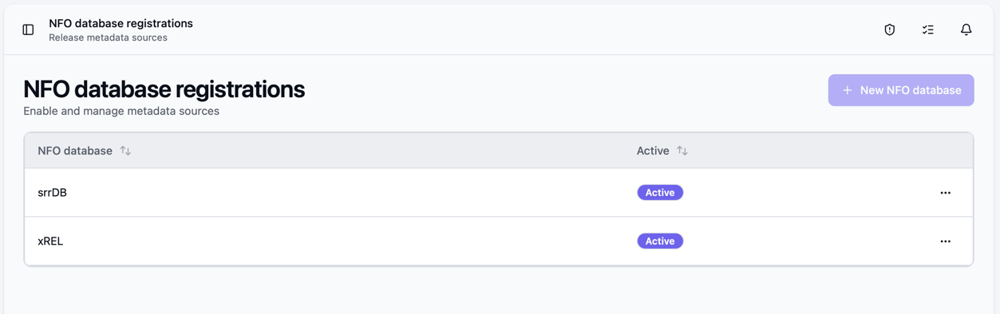
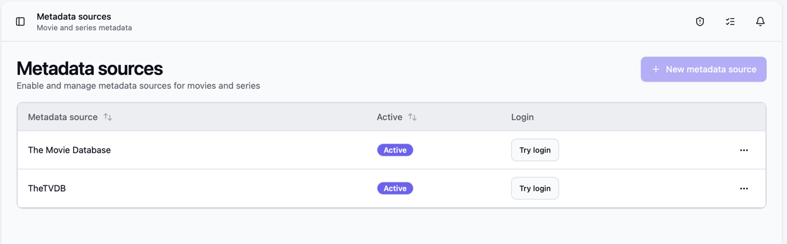
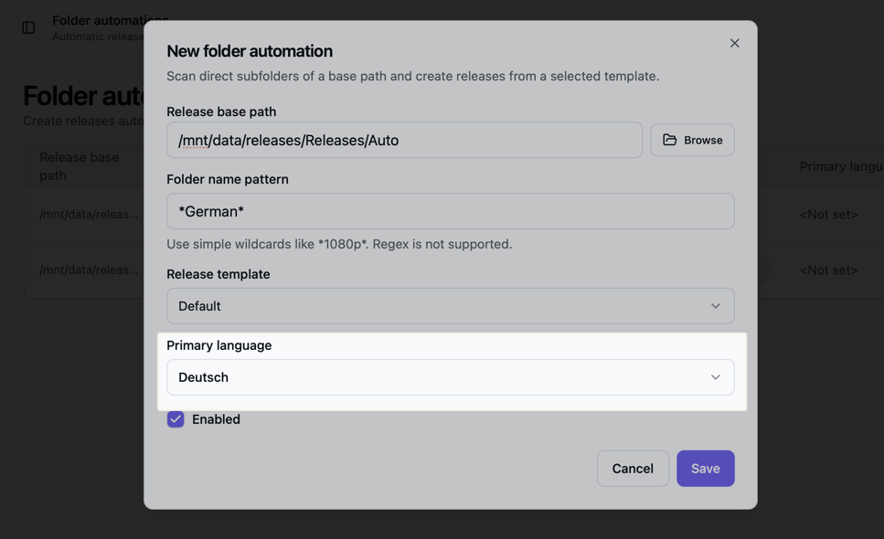
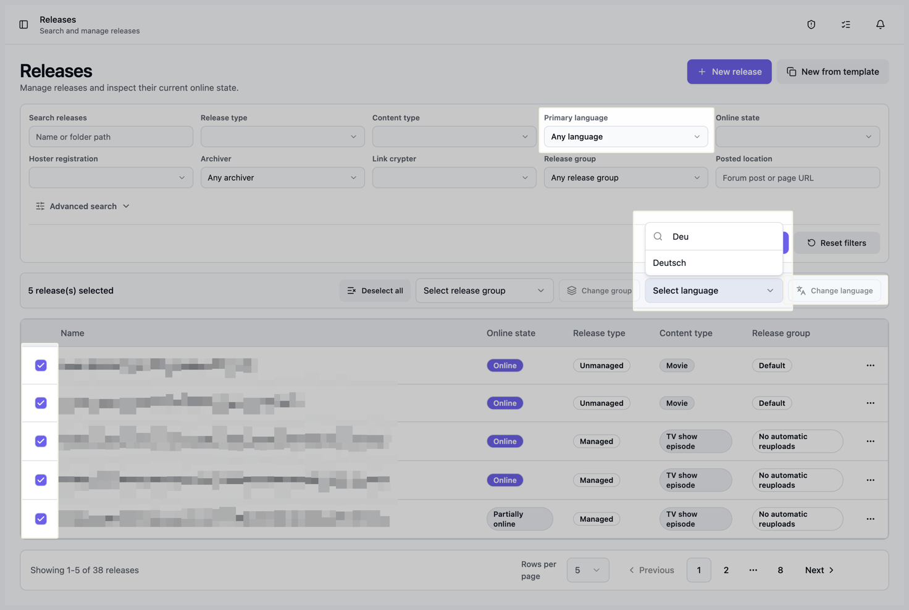
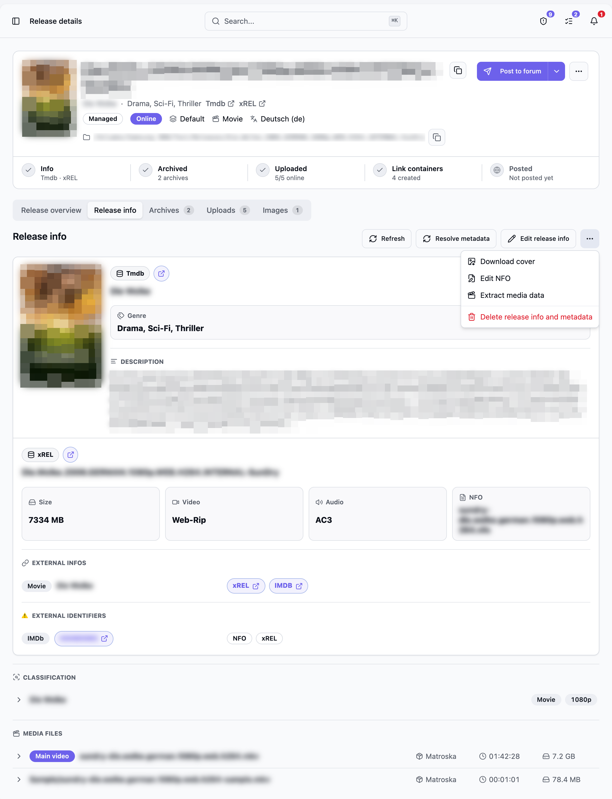

Bearcat speichert drei Arten von Informationen zu einem Release:

- **Releaseinformationen** stammen aus Scenedatenbanken: Releasename, Grösse, Video- und Audiotyp,
  Datenbanklinks und weitere Angaben zum Release.
- **Metadaten** beschreiben den Film oder die Serie: Titel, Genre, Beschreibung, Coverbild und Anbieterlink.
- **Mediendaten** werden mit MediaInfo aus den lokalen Videodateien gelesen. Sie enthalten Codecs,
  Auflösung, Laufzeit, Audiospuren und Untertitelspuren.

Zum Beispiel kombiniert Bearcat Sceneinfos von xREL mit Titel, Beschreibung und einem höher
aufgelösten Cover von TMDB.

## Quellen konfigurieren

Öffne **NFO-Datenbankregistrierungen** in der Seitenleiste, um Quellen für Scenereleaseinformationen
und NFO-Dateien zu aktivieren:

- **xREL** deckt deutsche Scenereleases gut ab.
- **SRRDB** deckt auch viele englische und internationale Scenereleases ab und kann NFO-Dateien
  und IMDb-IDs liefern.
- **PreDB** hat eine ähnliche Abdeckung wie SRRDB, aber strengere API-Limits. Sind beide aktiviert,
  fragt Bearcat für NFO-Dateien zuerst SRRDB.

xREL, SRRDB und PreDB benötigen keine Zugangsdaten.

Öffne **Metadatenquellen**, um Anbieter für Film-, TV- und Spielmetadaten zu registrieren:

| Anbieter | Metadaten | Zugangsdaten |
| --- | --- | --- |
| **The Movie Database (TMDB)** | Filme, TV-Serien und Folgen | API-Schlüssel |
| **TheTVDB** | TV-Serien | API-Schlüssel |
| **Steam** | Spiele | Keine |

Prüfe nach dem Speichern mit **Login testen**, ob die Verbindung funktioniert.

Bearcat fragt die aktiven Anbieter in einer festen Reihenfolge ab und verwendet den ersten Treffer.
Für das Cover hat der Metadatenanbieter Vorrang. Fehlende Angaben ergänzt Bearcat aus der Scenedatenbank.

## Primärsprache

Setze bei einem Release oder einer Collection eine Primärsprache, um übersetzte Titel und
Beschreibungen von den Metadatenanbietern anzufordern.

Wähle die Sprache beim Erstellen oder Bearbeiten eines Releases oder einer Collection.
In einer Ordnerautomatisierung kannst du sie für alle neuen Releases vorgeben, zum Beispiel Deutsch
für das Ordnermuster `*.GERMAN.*`.

Bearcat leitet keine Sprache aus Releasenamen ab. Ist keine gesetzt, verwendet der Metadatenanbieter
seine Standardsprache.

Die Liste der Ordnerautomatisierungen zeigt die Sprache jeder Automatisierung. Filtere auf
**Releases** nach einer Sprache oder wähle **<Nicht gesetzt>**, um Releases ohne Sprache zu finden.
Du kannst auch mehrere Releases auswählen und ihre Sprache gemeinsam setzen oder entfernen.

## So ruft Bearcat die Daten ab

1. NFO aus dem Releaseordner lesen oder aus einer aktiven NFO-Datenbank laden.
2. Sceneinfos aus den aktiven NFO-Datenbanken abrufen.
3. IMDb-IDs aus dem NFO und den Ergebnissen von xREL oder SRRDB auslesen.
4. Metadaten über eine IMDb-ID suchen. Ohne passende ID verwendet Bearcat den Titel und weitere Angaben aus dem Releasenamen.
5. Die Primärsprache an den Metadatenanbieter übergeben.

Bei Collections sucht Bearcat nach einer TV-Serie. Es verwendet eine IMDb-ID aus einem der enthaltenen
Releases oder sucht nach dem Collectionnamen.

Die Hintergrundaufgabe **Release info resolution** ergänzt fehlende Daten automatisch. Du kannst die
entsprechenden Aktionen auch im Tab **Releaseinfo** auslösen.

## Der Tab Releaseinfo

Der Tab zeigt Metadaten und Sceneinfos getrennt. Diese Aktionen stehen zur Verfügung:

- **Aktualisieren** lädt die aktuellen Daten neu aus der Datenbank von Bearcat.
- **Metadaten abrufen** fragt die aktiven Metadatenquellen erneut ab.
- **Releaseinfo bearbeiten** öffnet den manuellen Editor.
- **Jetzt auflösen** erscheint, wenn die Sceneinfos fehlen.
- **NFO hinzufügen** erscheint, wenn kein NFO gespeichert ist.

Im `...`-Menü kannst du das Cover herunterladen, ein vorhandenes NFO bearbeiten, Mediendaten
extrahieren oder die ermittelten Releaseinformationen und Metadaten löschen.

Jede externe IMDb-ID erscheint einmal mit allen Quellen, die sie gefunden haben.

## Manuelle Eingabe

Findet kein Anbieter einen Treffer, gib die Werte mit **Releaseinfo bearbeiten** manuell ein. Du kannst auch eine
IMDb-ID oder IMDb-URL eingeben. Bearcat speichert diese ID getrennt von den IDs aus dem NFO, xREL oder SRRDB.

Mit **NFO hinzufügen** oder **NFO bearbeiten** gibst du NFO-Inhalt manuell ein. Bearcat durchsucht den gespeicherten Inhalt
bei jeder Änderung nach IMDb-IDs. Bei Managed Releases wird das bearbeitete NFO auch in den Releaseordner
geschrieben.

Manuell eingegebene Metadaten werden von einer automatischen Metadatenaktualisierung nicht überschrieben. Für eine neue Suche
klicke auf **Releaseinfos und Metadaten löschen** und rufe die Daten erneut ab. Das gespeicherte NFO
und die extrahierten externen IDs bleiben für die nächste Suche erhalten.
