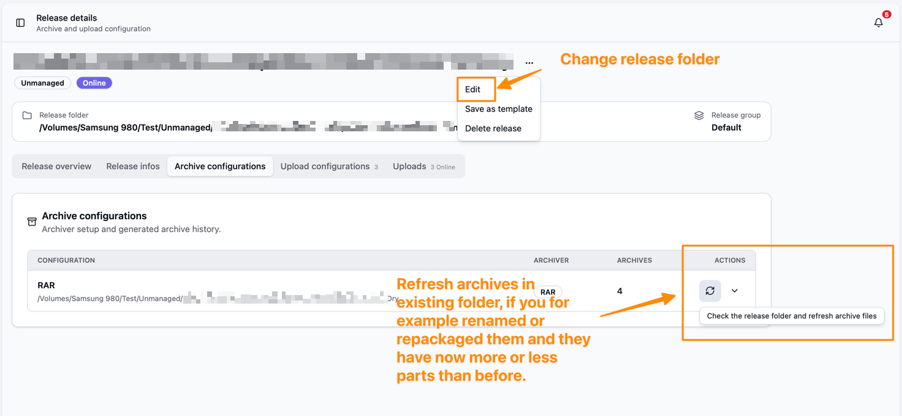

Bei Managed Releases packt Bearcat deine Dateien. Bei Unmanaged Releases lädst du vorhandene Archive hoch.
Upload, Linkprüfung und Reuploads funktionieren bei beiden gleich.

| Typ | Quelle | Wer erstellt die Archive? |
| --- | --- | --- |
| Managed | Rohdateien des Releases | Bearcat |
| Unmanaged | Vorhandene Archive | Du oder ein anderes Tool |

## Managed Releases

Der Releaseordner enthält deine Rohdateien. In der Archivkonfiguration legst du Archivformat,
Ausgabeordner, Partgrösse und optional ein Passwort fest. Bearcat packt die Dateien und lädt sie zu den gewählten Hostern hoch.

Bearcat verwendet vorhandene Archive wenn möglich wieder. Fehlen sie lokal, lädt es sie von einem
[Mirrorhoster](/Bearcat/de/mirror-downloads/) herunter oder packt sie aus den Rohdateien neu.
Das [Archivformat](/Bearcat/de/upload-lifecycle/#archivwiederverwendung-und-repackaging)
bestimmt, ob für neue Hashes neu gepackt werden muss.

## Unmanaged Releases

Ein Unmanaged Release verwendet vorhandene Archive und hat **keinen Releaseordner** mit Rohdateien.
Jede Archivkonfiguration verweist direkt auf einen Archivordner. Bearcat erkennt das Archivformat an den Dateiendungen.

Fehlen Archivdateien, kehrt der Upload zu `WaitingForArchive` zurück. Bearcat lädt sie von einem
aktivierten [Mirrorhoster](/Bearcat/de/mirror-downloads/) herunter, auf dem sie noch online sind. Ohne Mirror
musst du die Archive selbst bereitstellen. Ein Unmanaged Release hat keine Rohdateien zum Neupacken.

Nach einem Mirrordownload läuft der Upload automatisch weiter. Stellst du die Dateien selbst bereit,
aktualisiere die Unmanaged Archive im Aktionsmenü. Ändere den Archivordner, wenn du die Dateien woanders ablegst.

[Qualitätsprüfungen](/Bearcat/de/quality-gates/) prüfen bei Unmanaged Releases nur die Releaseinfos (Cover, Beschreibung, NFO).
Die Prüfungen des Releaseordners entfallen.

## Zwischen Typen umwandeln

Über das Aktionsmenü auf der Releasedetailseite wandelst du zwischen den Typen um.

- **In Unmanaged umwandeln** setzt ein erstelltes Archiv für jede Archivkonfiguration voraus.
  Bearcat entfernt den gespeicherten Pfad zum Releaseordner. Archive und Uploads bleiben erhalten.
  Die Rohdateien kannst du danach selbst löschen.
- **In Managed umwandeln** lässt dich einen Releaseordner mit den Rohdateien wählen. Archivkonfigurationen und Uploads bleiben erhalten.
  Bearcat kann das Release danach wieder neu packen.

Bei Releases, die per FTP oder FTPS heruntergeladen wurden, kannst du in der Remoteautomatisierung auch **Rohdateien behalten**
deaktivieren. Bearcat wandelt sie dann in Unmanaged Releases um und entfernt den heruntergeladenen Ordner nach den
ersten Uploads, sobald die [Bedingungen für das Aufräumen](/Bearcat/de/remote-downloads/#rohdateien-nach-dem-upload-löschen) erfüllt sind.
