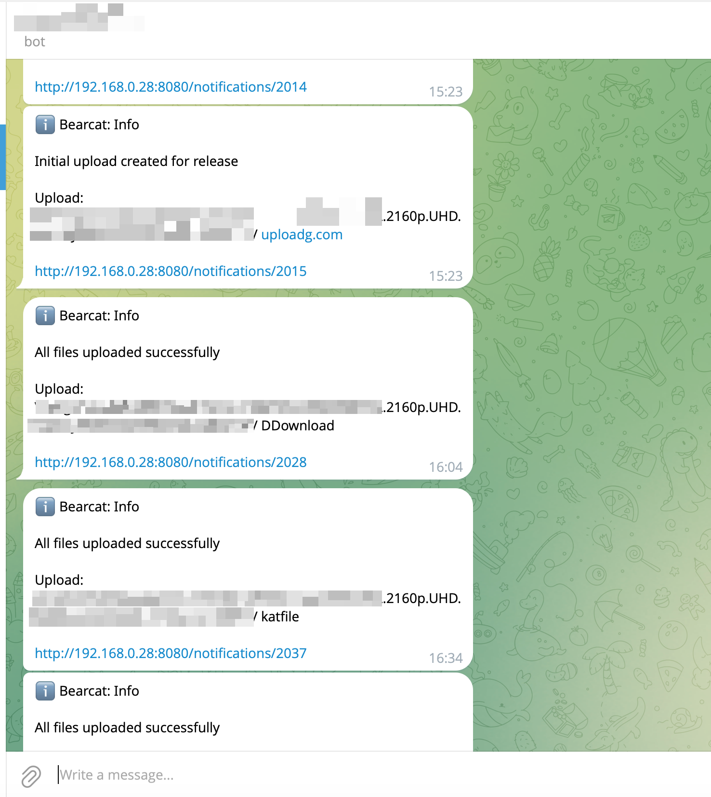
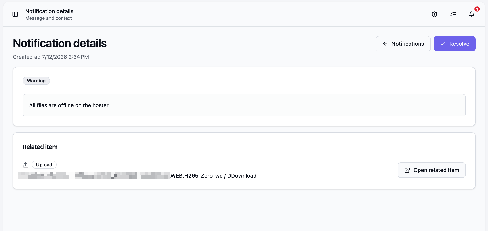
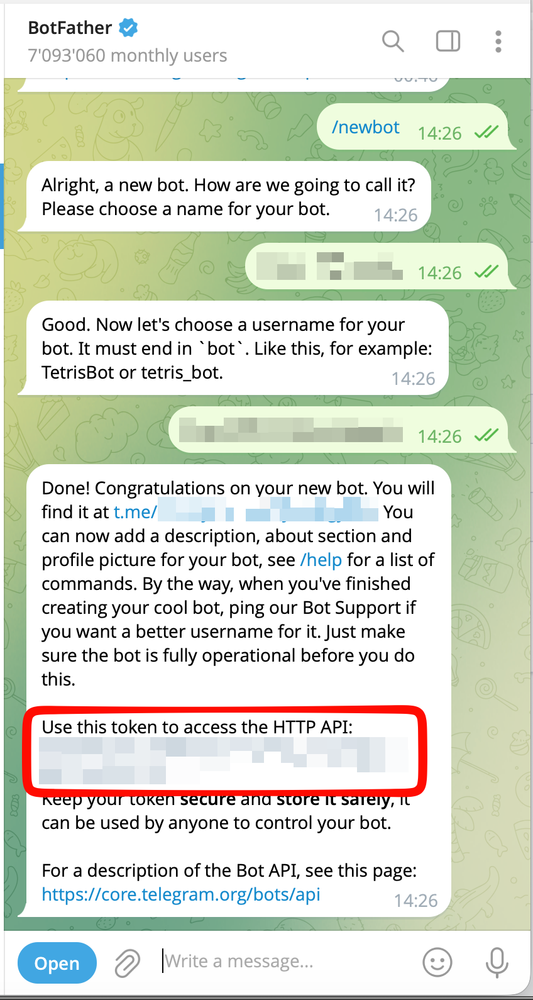
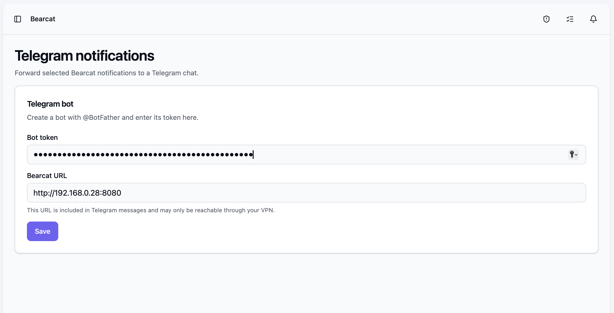
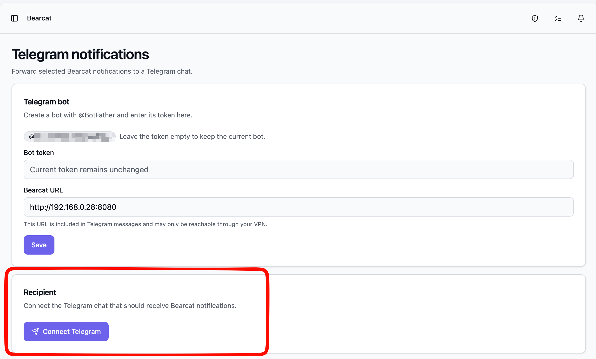
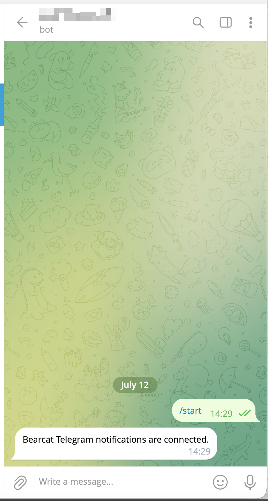

Bearcat kann abgeschlossene Uploads, Fehler und weitere Benachrichtigungen an deinen Telegram-Chat senden.
Jede Nachricht nennt das Release, den Upload oder das Archiv und verlinkt auf die zugehörige Benachrichtigung in Bearcat.

Der Link öffnet die Details der Benachrichtigung:

## Wo du sie findest

Öffne **Telegram Notifications** in der Seitenleiste oder rufe `/telegram` auf.

## Den Bot einrichten

Erstelle zuerst einen eigenen Telegram-Bot:

1. Öffne in Telegram einen Chat mit [@BotFather](https://t.me/BotFather) und sende `/newbot`.
   Folge den Anweisungen, um einen Namen und einen Benutzernamen zu wählen. BotFather gibt dir einen **Bottoken**.

   

2. Füge diesen Token im Feld **Bottoken** auf der Seite Telegram Notifications ein.
3. Gib eine **Bearcat-URL** ein, die dein Smartphone erreichen kann. Läuft Bearcat in einem privaten Netzwerk,
   braucht dein Smartphone eventuell eine VPN-Verbindung, um Links aus Benachrichtigungen zu öffnen.
4. Klicke auf **Speichern**.

Bearcat speichert den Token verschlüsselt. Lass das Feld leer, wenn du andere Einstellungen bearbeitest, um
den aktuellen Bot zu behalten. Ein neuer Token ersetzt den Bot und trennt den Chat. Du musst ihn danach erneut verbinden.

## Einen Chat verbinden

1. Klicke im Bereich **Empfänger** auf **Telegram verbinden**. Bearcat erzeugt einen Einmallink.

   

2. Klicke auf **Telegram öffnen** und drücke im geöffneten Chat auf **Start**. Der Link ist zehn Minuten
   gültig.
3. Klicke zurück in Bearcat auf **Verbindung prüfen**. Ist der Chat verbunden, erscheint er als
   **Verbunden** und erhält eine kurze Bestätigungsnachricht.

   

Klicke auf **Test Notification senden**, um zu prüfen, ob Nachrichten den verbundenen Chat erreichen.

Wenn du die Seite während der Einrichtung neu lädst, verwende **Verbindung prüfen** oder erzeuge einen neuen
Link, um fortzufahren.

## Festlegen, welche Benachrichtigungen weitergeleitet werden

Wähle unter **Weitergeleitete Schweregrade** die Typen **Info**, **Warnung** und/oder **Fehler** und klicke auf **Speichern**.
Entferne den Haken bei einem Typ, um ihn nicht mehr weiterzuleiten.

Weitergeleitet werden nur Benachrichtigungen, die nach dem Verbinden des Chats entstehen.

## Zustellstatus

Der Bereich **Empfänger** zeigt den Zustellstatus:

- wie viele Benachrichtigungen noch auf die Zustellung warten,
- wie viele nach mehreren Fehlversuchen nicht zugestellt werden konnten,
- wann die letzte Benachrichtigung zugestellt wurde,
- den letzten Fehler, falls eine Zustellung fehlgeschlagen ist.

Bearcat versucht fehlgeschlagene Zustellungen erneut und wartet zwischen den Versuchen immer länger.
Nach mehreren Fehlern gibt es die Zustellung dieser Benachrichtigung auf. Das kann passieren, wenn der Bot
blockiert oder der Chat gelöscht wurde.

## Verbindung trennen

**Verbindung trennen** entfernt den verbundenen Chat und verwirft alle Benachrichtigungen, die noch auf die
Zustellung warten. Bearcat fragt vorher nach einer Bestätigung, da sich das nicht rückgängig machen lässt.
Der Bot selbst bleibt konfiguriert, und du kannst einen neuen Chat verbinden.
