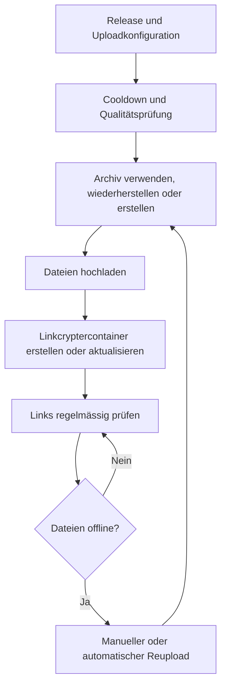

Nach dem Hinzufügen einer Uploadkonfiguration bereitet Bearcat das Archiv vor, lädt es hoch und prüft seine Links.
In der Releasegruppe aktivierst du bei Bedarf automatische Reuploads für Dateien, die offline gehen.

<details>
<summary>Uploadablauf anzeigen</summary>



</details>

## 1. Release und Uploadkonfiguration

Eine **Uploadkonfiguration** verbindet Release, Hosterregistrierung und Archivkonfiguration.
Optional wählst du Linkcrypterkonfigurationen dazu.

Erstelle für jeden Hoster eine eigene Uploadkonfiguration. Mehrere Konfigurationen für denselben
Hoster sind möglich, etwa mit unterschiedlichen Partgrössen.

## 2. Der erste Upload

Der **Cooldown für initiale Uploads** beginnt mit der Erstellung des Releases.
Unter **Konfigurationen** stellst du die Wartezeit ein (Standard: `5` Minuten).

Sobald der Cooldown abgelaufen ist und eine Uploadkonfiguration existiert, plant Bearcat den ersten
Upload bei der nächsten Prüfung ein. Mit `0` Minuten entfällt die Wartezeit.
Das Release muss auch die [Qualitätsprüfungen](/Bearcat/de/quality-gates/) bestehen oder manuell freigegeben sein.

## 3. Archiv erstellen

Für jeden wartenden Upload stellt Bearcat ein Archiv bereit:

1. Wenn möglich, ein fertiges Archiv derselben Archivkonfiguration wiederverwenden.
2. Fehlende lokale Dateien von einem konfigurierten [Mirrorhoster](/Bearcat/de/mirror-downloads/) wiederherstellen.
3. Wenn beides nicht möglich ist, ein neues Archiv aus dem Releaseordner erstellen.

Neu packen kann Bearcat nur [Managed Releases](/Bearcat/de/release-types/).
Unmanaged Releases brauchen lokale Archivdateien oder einen verfügbaren Mirror.

Die Archivkonfiguration legt Archiver, Ausgabeordner, Dateinamenpräfix, Passwort und Partgrösse fest.
Dazu kommen zwei Packoptionen:

- **Releaseordner als Stammordner packen** (Standard: an): Das Archiv enthält einen Ordner mit dem Namen
  des Releaseordners auf der Festplatte. Wenn deaktiviert, wird der Inhalt des Releaseordners direkt
  auf oberster Ebene ins Archiv gepackt.
- **Noncedatei erstellen** (Standard: an): Bearcat packt eine zufällige `__nonce.txt` mit. Siehe
  [Die Noncedatei und Repackaging](#die-noncedatei-und-repackaging).

Änderungen an diesen Optionen gelten nur für danach erstellte Archive.
Du kannst ausserdem [zusätzliche Archivinhalte](/Bearcat/de/additional-archive-contents/) zuweisen, zum Beispiel
eine Textdatei mit einem Empfehlungslink, die Bearcat in jedes neu erstellte Archiv aufnimmt.

Nach dem Packen hat das Archiv den Status `Created` und der Upload `Pending`.
Schlägt das Packen fehl, haben sie den Status `CreationFailed` und `Failed`.

Für Reuploads muss Bearcat eventuell die Archivhashes ändern oder die Dateien neu packen. Details unter
[Archivwiederverwendung und Repackaging](#archivwiederverwendung-und-repackaging).

### Laufende Archiverstellung abbrechen

Unter **Aktivität > Archive** kannst du laufende Archiverstellungen abbrechen.
Das gilt auch während der MD5-Berechnung oder der Hashänderung eines wiederverwendeten Archivs.

- **Neues Archiv:** Bearcat löscht das Archiv und seine Dateien.
- **Wiederverwendetes Archiv:** Das Archiv bleibt erhalten. Dateien, deren Hashänderung nicht abgeschlossen wurde, erhalten neue Hashes,
  bevor das Archiv dem nächsten Upload zugewiesen wird.

In beiden Fällen wechseln die Uploads, die auf dieses Archiv warten, auf `Canceled`. Erstelle einen manuellen Reupload, wenn
du es erneut versuchen willst. Wenn du Bearcat beendest, wird eine unterbrochene Archiverstellung
beim nächsten Start fortgesetzt oder das Archiv neu gepackt.

## 4. Upload zum Hoster

Die Hintergrundaufgabe **Archive upload** startet Uploads im Status `Pending` und setzt sie auf `Uploading`.

| Ergebnis | Uploadstatus | Onlinestatus |
| --- | --- | --- |
| Alle Dateien hochgeladen | `Completed` | `Online` |
| Einige Dateien fehlgeschlagen | `Failed` | `PartiallyOnline` |

Bearcat speichert für erfolgreiche Uploads einen Zeitstempel. Den Fortschritt verfolgst du auf der Releasedetailseite
unter **Uploads** > **Verlauf**. **Übersicht** zeigt den neuesten Upload jeder Uploadkonfiguration.

## 5. Linkcryptercontainer

Nach einem erfolgreichen Upload erstellt Bearcat für jede aktive Linkcrypterkonfiguration einen
Container mit den Downloadlinks. Schlägt das fehl, erscheint der Fehler am Container und als Benachrichtigung.

Mit einer [Releasecollection](/Bearcat/de/release-collections/) sammelst du Links mehrerer Releases
in einem gemeinsamen Container, etwa für eine TV-Staffel.

## 6. Onlineprüfungen

Bearcat prüft die hochgeladenen Dateien regelmässig, frühestens alle 30 Minuten.

| Onlinestatus | Bedeutung |
| --- | --- |
| `Online` | Alle Dateien sind online. |
| `PartiallyOnline` | Einige Dateien sind offline. |
| `Offline` | Alle Dateien sind offline. |

Schlägt eine Prüfung fehl, bleibt der bisherige Onlinestatus erhalten.
Bei anhaltenden Fehlern erhältst du eine Benachrichtigung pro Hosterregistrierung.
Weitere Meldungen folgen erst, wenn du sie erledigt hast.

Bei einem Captcha benachrichtigt Bearcat dich. Bei ungültigen Zugangsdaten deaktiviert es die
Hosterregistrierung. Korrigiere die Daten und aktiviere sie wieder. Das gilt auch für Fehler beim Hochladen.

## 7. Automatische Reuploads

Bearcat erstellt einen automatischen Reupload, wenn alle diese Bedingungen erfüllt sind:

- Die Releasegruppe hat automatische Reuploads aktiviert.
- Der Upload ist gemäss dem Reuploadauslöser des Hosters offline, siehe unten.
- Jede hochgeladene Datei wurde mindestens einmal geprüft.
- Die Wartezeit **Stunden bis Reupload** ist abgelaufen.
- Für dieselbe Uploadkonfiguration gibt es keinen blockierenden Ersatzupload.
- Das Release hat die [Qualitätsprüfungen](/Bearcat/de/quality-gates/) bestanden oder wurde manuell freigegeben.

Ein Ersatzupload blockiert weitere Reuploads, solange er `Online` ist oder den Status `Pending`,
`Uploading`, `WaitingForArchive`, `Failed` oder `CancellationRequested` hat.

Ist ein Reupload fällig, erstellt Bearcat einen neuen Uploadeintrag für dieselbe Uploadkonfiguration:

```text
WaitingForArchive -> Pending -> Uploading -> Completed
```

Wird dasselbe Archiv wiederverwendet, übernimmt Bearcat die noch verfügbaren Links und lädt nur
die fehlenden Dateien hoch. Ein neu gepacktes Archiv muss vollständig hochgeladen werden,
da seine Parts nicht mit den alten zusammenpassen.

### Overrides pro Hoster

In der Hosterregistrierung kannst du [Reuploadoverrides](/Bearcat/de/account-settings/#reuploadoverrides-pro-hoster) setzen:

| Einstellung | Wirkung |
| --- | --- |
| **Stunden bis Reupload** | Überschreibt die Wartezeit der Releasegruppe für diesen Hoster. |
| **Reuploadauslöser: Teilweise oder komplett offline** (Standard) | Die Wartezeit beginnt, sobald die erste Datei offline geht. |
| **Reuploadauslöser: Erst wenn komplett offline** | Wartet, bis alle Dateien offline sind. Kommt eine wieder online, beginnt die Frist beim nächsten vollständigen Offlinegehen neu. |
| **Immer alle Dateien neu hochladen** | Lädt auch Parts erneut hoch, die noch online sind. |

**Erst wenn komplett offline** vermeidet wiederholte Reuploads, wenn der Hoster einzelne Parts nach und nach löscht.
**Immer alle Dateien neu hochladen** setzt das Uploaddatum aller Parts zurück.

## 8. Manuelle Reuploads

Wähle **Manuellen Reupload erstellen** im `...`-Menü eines Eintrags unter **Uploads > Verlauf**.
Das geht bei `Offline`, `PartiallyOnline`, `Canceled` oder `Failed`.

Auch hier darf es keinen [blockierenden Ersatzupload](#7-automatische-reuploads) geben.

## 9. Linkcryptercontainer nach einem Reupload

Bearcat versucht, den bestehenden Container für dieselbe Uploadkonfiguration und Linkcrypterkonfiguration
zu aktualisieren.
Gelingt das, bleibt die URL gleich. Die Links in deinen Forenposts bleiben gültig.

Kann der Anbieter Container nicht aktualisieren oder schlägt die Aktualisierung fehl, erstellt Bearcat einen neuen Container.
Dadurch kann sich die Container-URL ändern.

## 10. Aufräumen nach erfolgreichem Upload

Unter [Automatisches Aufräumen](/Bearcat/de/advanced-configuration/#automatisches-aufräumen) kannst du
Managed Releases nach einer Frist in Unmanaged umwandeln und optional den Releaseordner löschen lassen.
Lokale Archive kannst du behalten, löschen oder in einen [Speicherordner](/Bearcat/de/archive-storage-folders/) verschieben lassen.
Standardmässig sind beide Aufräumregeln ausgeschaltet.

Fehlen Archive beim nächsten Reupload, stellt Bearcat sie von einem [Mirror](/Bearcat/de/mirror-downloads/)
wieder her oder packt sie bei Managed Releases neu. Das Aufräumen löscht keine Dateien auf dem Hoster.

## Archivwiederverwendung und Repackaging

Hoster erkennen Dateien oft an ihrem MD5-Hash. Wurde ein Archiv bereits zum gleichen Hostertyp hochgeladen,
braucht Bearcat neue Hashes, bevor es erneut hochgeladen wird.

Neue Hashes brauchen nur Dateien, die erneut hochgeladen werden. Die übrigen Parts behalten ihren Hash.

- **RAR:** Bearcat hängt Nullbytes an, bis jede hochzuladende Datei einen Hash hat, der für diese
  Archivkonfiguration noch nicht verwendet wurde. Das Archiv lässt sich weiterhin normal entpacken.
  Bearcat behält die Hashhistorie auch nach dem Löschen der lokalen Dateien.
- **7-Zip:** Die Parts lassen sich so nicht ändern, ohne das Archiv zu beschädigen. Bearcat
  erstellt deshalb ein neues Archiv. Müssen keine Dateien erneut hochgeladen werden, kann es das Archiv wiederverwenden.

Bevor Bearcat ein wiederverwendetes Archiv ändert, prüft es, ob ein anderer aktiver Upload es verwendet.
Falls ja, wartet es auf einen späteren Durchlauf. Fehlt eine hochzuladende Datei lokal, stellt Bearcat
sie zuerst von einem [Mirrorhoster](/Bearcat/de/mirror-downloads/) wieder her und ändert danach die Hashes.

### Die Noncedatei und Repackaging

**Noncedatei erstellen** fügt neu gepackten Archiven eine zufällige `__nonce.txt` hinzu.
Bearcat entfernt sie nach dem Packen aus dem Releaseordner, auch bei einem Fehler.

RAR bekommt neue Hashes durch angehängte Nullbytes, mit oder ohne Noncedatei.
Diese Bytes zählen zum Dateigrössenlimit des Hosters.

7-Zip muss die Dateien mit geänderter Nonce, Kompression oder grösseren Parts neu packen.
Unter [Archivrepackaging](/Bearcat/de/advanced-configuration/#archivrepackaging) findest du die Strategien
und die Ausnahme für ältere RAR-Archive mit fehlenden Hashes.
