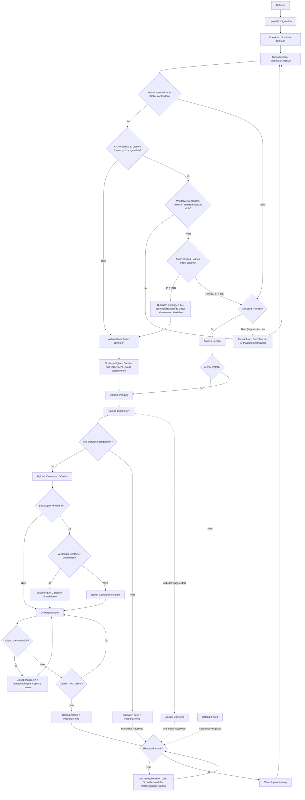

Nach dem Hinzufügen einer Uploadkonfiguration bereitet Bearcat das Archiv vor, lädt es hoch und prüft seine Links.
In der Releasegruppe aktivierst du bei Bedarf automatische Reuploads für Dateien, die offline gehen.

<details>
<summary>Vollständiges Diagramm des Uploadablaufs anzeigen</summary>



</details>

## 1. Release und Uploadkonfiguration

Für einen Upload brauchst du eine **Uploadkonfiguration**. Sie verbindet:

- das Release
- die Hosterregistrierung
- die Archivkonfiguration
- optionale Linkcrypterkonfigurationen

Erstelle für jeden Hoster eine eigene Uploadkonfiguration. Die Konfigurationen laufen unabhängig
voneinander. Auch mehrere Konfigurationen für denselben Hoster sind möglich, etwa mit unterschiedlichen Partgrössen.

## 2. Der erste Upload

Bearcat wartet den **Cooldown für initiale Uploads** ab, bevor es den ersten Upload erstellt.
Unter **Konfigurationen** stellst du die Wartezeit ein (Standard: `5` Minuten). So hast du Zeit,
das Release fertig einzurichten und die Dateien zu kopieren.

Nach dem Cooldown erstellt die Hintergrundaufgabe **Upload state check** den Upload im Status
`WaitingForArchive`. Mit einem Cooldown von `0` wird er bei der nächsten Prüfung erstellt.

## 3. Archiv erstellen

Die Hintergrundaufgabe **Archive creation** bereitet für jeden Upload in `WaitingForArchive` ein Archiv vor:

1. Wenn möglich, ein fertiges Archiv derselben Archivkonfiguration wiederverwenden.
2. Fehlende lokale Dateien von einem konfigurierten [Mirrorhoster](/Bearcat/de/mirror-downloads/) wiederherstellen.
3. Wenn beides nicht möglich ist, ein neues Archiv aus dem Releaseordner erstellen.

Neu packen kann Bearcat nur [Managed Releases](/Bearcat/de/release-types/).
Unmanaged Releases brauchen lokale Archivdateien oder einen verfügbaren Mirror.

Die Archivkonfiguration legt Archiver, Ausgabeordner, Dateinamenpräfix, Passwort und Partgrösse fest.
Dazu kommen zwei Packoptionen:

- **Releaseordner als Stammordner packen** (Standard: an): Das Archiv enthält einen Ordner mit dem Namen
  des Releaseordners auf der Festplatte. Wenn deaktiviert, wird der Inhalt des Releaseordners direkt
  auf oberster Ebene ins Archiv gepackt.
- **Noncedatei erstellen** (Standard: an): Bearcat packt eine zufällige `__nonce.txt` mit. Siehe
  [Die Noncedatei und Repackaging](#die-noncedatei-und-repackaging).

Änderungen an diesen Optionen gelten nur für danach erstellte Archive.
Du kannst ausserdem [zusätzliche Archivinhalte](/Bearcat/de/additional-archive-contents/) zuweisen, zum Beispiel
eine Textdatei mit einem Empfehlungslink, die Bearcat in jedes neu erstellte Archiv aufnimmt.

Nach dem Packen hat das Archiv den Status `Created` und der Upload `Pending`.
Schlägt das Packen fehl, haben sie den Status `CreationFailed` und `Failed`.

Für Reuploads muss Bearcat eventuell die Archivhashes ändern oder die Dateien neu packen. Details unter
[Archivwiederverwendung und Repackaging](#archivwiederverwendung-und-repackaging).

### Laufende Archiverstellung abbrechen

Unter **Aktivität > Archive** kannst du laufende Archiverstellungen abbrechen.
Das gilt auch während der MD5-Berechnung oder der Hashänderung eines wiederverwendeten Archivs.

- **Neues Archiv:** Bearcat löscht das Archiv und seine Dateien.
- **Wiederverwendetes Archiv:** Das Archiv bleibt erhalten. Dateien, deren Hashänderung nicht abgeschlossen wurde, erhalten neue Hashes,
  bevor das Archiv dem nächsten Upload zugewiesen wird.

In beiden Fällen wechseln die Uploads, die auf dieses Archiv warten, auf `Canceled`. Erstelle einen manuellen Reupload, wenn
du es erneut versuchen willst. Wenn du Bearcat beendest, wird eine unterbrochene Archiverstellung
beim nächsten Start fortgesetzt oder das Archiv neu gepackt.

## 4. Upload zum Hoster

Die Hintergrundaufgabe **Archive upload** startet Uploads im Status `Pending` und setzt sie auf `Uploading`.

| Ergebnis | Uploadstatus | Onlinestatus |
| --- | --- | --- |
| Alle Dateien hochgeladen | `Completed` | `Online` |
| Einige Dateien fehlgeschlagen | `Failed` | `PartiallyOnline` |

Bearcat speichert für erfolgreiche Uploads einen Zeitstempel. Den Fortschritt verfolgst du auf der Releasedetailseite
unter **Uploads** > **Verlauf**. **Übersicht** zeigt den neuesten Upload jeder Uploadkonfiguration.

## 5. Linkcryptercontainer

Nach einem erfolgreichen Upload erstellt Bearcat bei Bedarf Linkcryptercontainer mit den Downloadlinks.

Die Hintergrundaufgabe **Link crypter container creation** erstellt für jede aktive Linkcrypterkonfiguration
einen Container, sobald der Upload `Completed` und `Online` ist. Schlägt das fehl, zeigt Bearcat den
Fehler am Container an und erstellt eine Fehlerbenachrichtigung.

Mit einer [Releasecollection](/Bearcat/de/release-collections/) kannst du die Links mehrerer Releases
in einem gemeinsamen Container sammeln, zum Beispiel für eine TV-Staffel.

## 6. Onlineprüfungen

Die Hintergrundaufgabe **Upload state check** prüft jede hochgeladene Datei und wiederholt die
Prüfung frühestens nach 30 Minuten.

Der Upload erhält danach einen dieser Status:

- **`Online`**: Jede geprüfte Datei ist online.
- **`PartiallyOnline`**: Mindestens eine Datei ist offline, aber nicht alle.
- **`Offline`**: Alle hochgeladenen Dateien sind offline.

Schlägt eine Linkprüfung fehl, bleibt der bisherige Onlinestatus erhalten. Bearcat erstellt pro
Hosterregistrierung eine Fehlerbenachrichtigung mit der Anzahl betroffener Uploads. Weitere Meldungen
folgen erst, wenn du diese erledigt hast.

Verlangt der Hoster ein Captcha, markiert Bearcat den Upload entsprechend und benachrichtigt dich.
Bei ungültigen Zugangsdaten deaktiviert es die Hosterregistrierung. Korrigiere die Zugangsdaten
und aktiviere sie wieder. Das gilt auch, wenn der Fehler beim Hochladen auftritt.

## 7. Automatische Reuploads

Bearcat erstellt einen automatischen Reupload, wenn alle diese Bedingungen erfüllt sind:

- Die Releasegruppe hat automatische Reuploads aktiviert.
- Der neueste relevante Upload ist `Offline` oder `PartiallyOnline` (abhängig vom Reuploadauslöser des Hosters, siehe unten).
- Jede hochgeladene Datei wurde mindestens einmal geprüft.
- Die Wartezeit ("Stunden bis Reupload") ist seit dem Offlinegehen des Uploads abgelaufen.
- Für dieselbe Uploadkonfiguration gibt es keinen anderen Ersatzupload, der einen weiteren Reupload blockiert.

Ein Ersatzupload blockiert weitere Reuploads, solange er `Online` ist oder den Status `Pending`,
`Uploading`, `WaitingForArchive`, `Failed` oder `CancellationRequested` hat.

Ist ein Reupload fällig, erstellt Bearcat einen neuen Uploadeintrag für dieselbe Uploadkonfiguration:

```text
WaitingForArchive -> Pending -> Uploading -> Completed
```

Wird dasselbe Archiv wiederverwendet, übernimmt Bearcat die noch verfügbaren Links und lädt nur
die fehlenden Dateien hoch. Ein neu gepacktes Archiv muss vollständig hochgeladen werden,
da seine Parts nicht mit den alten zusammenpassen.

### Overrides pro Hoster

Eine Hosterregistrierung kann Wartezeit und Auslöser der Releasegruppe überschreiben. Die Einrichtung ist unter
[Overrides pro Hoster für Reuploads](/Bearcat/de/account-settings/#reuploadoverrides-pro-hoster) beschrieben.

- **Stunden bis Reupload:** ersetzt die Wartezeit der Releasegruppe für diesen Hoster.
- **Reuploadauslöser:** legt fest, wann diese Wartezeit beginnt:
  - **Teilweise oder komplett offline** (Standard): beginnt, sobald die erste Datei offline geht.
  - **Erst wenn komplett offline:** beginnt, sobald die letzte Datei offline geht. Solange noch eine Datei
    online ist, wird kein Reupload geplant. Kommt eine Datei wieder online, wird der Timer zurückgesetzt.
- **Immer alle Dateien neu hochladen:** lädt jeden Archivpart hoch, auch die noch verfügbaren.

Bei Hostern, die Dateien einzeln entfernen, verhindert **Erst wenn komplett offline** wiederholte Reuploads,
solange noch Parts online sind. Löscht ein Hoster Dateien nach längerer Zeit ohne Downloads, setzt **Immer alle Dateien
neu hochladen** das Uploaddatum aller Parts zurück.

## 8. Manuelle Reuploads

Du kannst einen Reupload auch selbst auslösen: mit **Manuellen Reupload erstellen** im `...`-Menü eines Eintrags unter **Uploads** > **Verlauf**. Bearcat erlaubt das für Uploads mit diesem Status:

- `Offline`
- `PartiallyOnline`
- `Canceled`
- `Failed`

Auch manuelle Reuploads unterliegen den [Blockierregeln für Ersatzuploads](#7-automatische-reuploads).

## 9. Linkcryptercontainer nach einem Reupload

Bearcat versucht, den bestehenden Container für dieselbe Uploadkonfiguration und Linkcrypterkonfiguration
zu aktualisieren.
Gelingt das, bleibt die URL gleich. Die Links in deinen Forenposts bleiben gültig.

Kann der Anbieter Container nicht aktualisieren oder schlägt die Aktualisierung fehl, erstellt Bearcat einen neuen Container.
Dadurch kann sich die Container-URL ändern.

## 10. Aufräumen nach erfolgreichem Upload

Automatisches Aufräumen ist standardmässig deaktiviert. Du kannst zwei Regeln aktivieren, die
die Hintergrundaufgabe **Auto cleanup** nach Ablauf der eingestellten Fristen anwendet:

- Managed Releases in Unmanaged umwandeln: Du erhältst eine Benachrichtigung mit dem Pfad des Releaseordners und kannst ihn selbst löschen.
- Lokale Archive löschen: Nur wenn Bearcat sie von einem Mirrorhoster herunterladen oder aus dem Releaseordner neu packen kann.

Die Archivfrist zählt ab dem letzten Upload der Archivkonfiguration, jeder Reupload startet sie also neu. Auf dem Hoster wird nie etwas gelöscht.

Fehlt das lokale Archiv bei einem späteren Reupload, lädt Bearcat es von einem
[Mirrorhoster](/Bearcat/de/mirror-downloads/) herunter oder packt es bei Managed Releases neu.
Details findest du unter [Automatisches Aufräumen](/Bearcat/de/advanced-configuration/#automatisches-aufräumen).

## Archivwiederverwendung und Repackaging

Hoster erkennen Dateien oft an ihrem MD5-Hash. Wurde ein Archiv bereits zum gleichen Hostertyp hochgeladen,
braucht Bearcat neue Hashes, bevor es erneut hochgeladen wird.

Neue Hashes brauchen nur Dateien, die erneut hochgeladen werden. Parts, die vom vorherigen Upload noch
online sind, behalten ihren Hash.

- **RAR:** Bearcat hängt Nullbytes an, bis jede hochzuladende Datei einen Hash hat, der für diese
  Archivkonfiguration noch nicht verwendet wurde. Das Archiv lässt sich weiterhin normal entpacken.
  Bearcat behält die Hashhistorie auch nach dem Löschen der lokalen Dateien.
- **7-Zip:** Die Parts lassen sich so nicht ändern, ohne das Archiv zu beschädigen. Bearcat
  erstellt deshalb ein neues Archiv. Sind alle Parts noch online, verwendet Bearcat das Archiv wieder.

Bevor Bearcat ein wiederverwendetes Archiv ändert, prüft es, ob ein anderer aktiver Upload es verwendet.
Falls ja, wartet es auf einen späteren Durchlauf. Fehlt eine hochzuladende Datei lokal, stellt Bearcat
sie zuerst von einem [Mirrorhoster](/Bearcat/de/mirror-downloads/) wieder her und ändert danach die Hashes.

### Die Noncedatei und Repackaging

**Noncedatei erstellen** fügt neu gepackten Archiven eine zufällige `__nonce.txt` hinzu. Bearcat entfernt
sie nach dem Packen aus dem Releaseordner, auch wenn das Packen fehlschlägt. Nach einem Absturz entfernt
es übrig gebliebene temporäre Dateien beim nächsten Start.

Bei RAR erhält jeder Archivteil durch angehängte Nullbytes einen neuen Hash, mit oder ohne Noncedatei.
Das gilt für wiederverwendete und neu gepackte Archive. Die Partgrösse bleibt deshalb normalerweise
beim eingestellten Wert, statt um `1` MB zu wachsen. Die angehängten Bytes zählen trotzdem zum
Dateigrössenlimit des Hosters.

7-Zip muss die Dateien mit geänderter Nonce, Kompression oder grösseren Parts neu packen.
Unter [Archivrepackaging](/Bearcat/de/advanced-configuration/#archivrepackaging) findest du die Strategien
und die Ausnahme für ältere RAR-Archive mit fehlenden Hashes.
