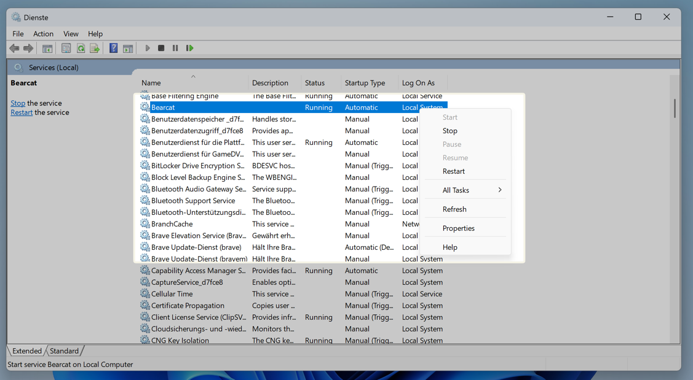
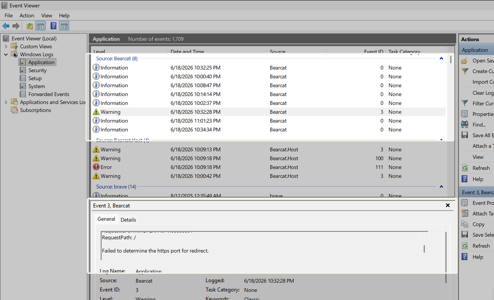
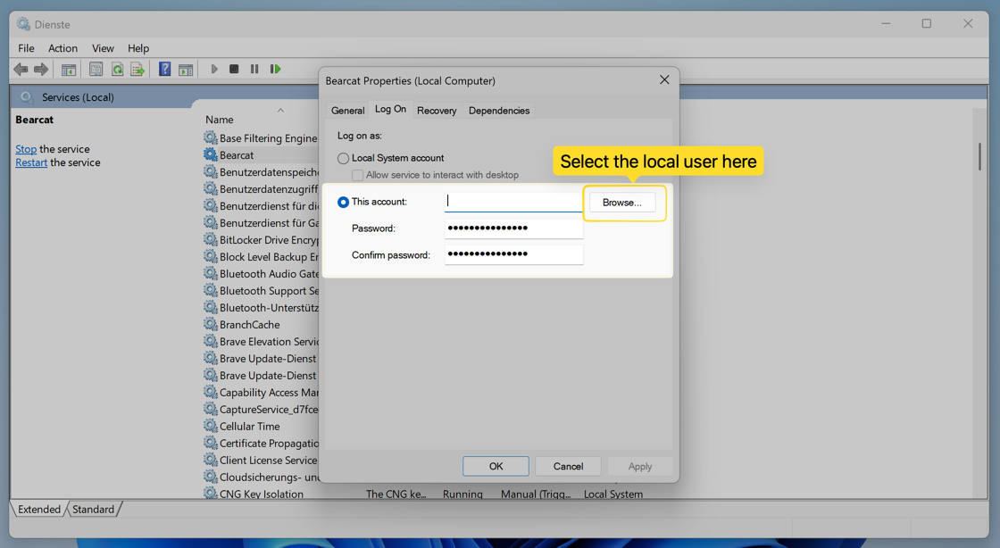

Der Windows-Dienst startet Bearcat mit Windows und läuft auch ohne Anmeldung.
Neue Installationen verwenden **SQLite** und brauchen keinen Datenbankserver.
Um Bearcat selbst zu starten und zu beenden, verwende die [Desktopanwendung](/Bearcat/de/use-the-desktop-launcher/).

## 1. Archivprogramme installieren und Bearcat herunterladen

Installiere [WinRAR](https://www.rarlab.com/download.htm) und [7-Zip](https://www.7-zip.org/download.html).
Erstelle einen Ordner für deine Releases, zum Beispiel `C:\Bearcat\releases`.

Lade das Paket `Bearcat.Service-win-...zip` für deinen Rechner von
[GitHub Releases](https://github.com/gizmo93/Bearcat/releases) herunter und entpacke es, zum Beispiel nach
`C:\Program Files\Bearcat`. Lass alle Dateien im selben Ordner.

## 2. Setup ausführen

Öffne PowerShell **als Administrator**, wechsle in den entpackten Ordner und führe aus:

```powershell
cd "C:\Program Files\Bearcat"
.\Bearcat.Cli.exe setup
```

Für eine neue Installation verwendest du diese Antworten:

| Abfrage | Eingabe |
| --- | --- |
| **Database** | Behalte **SQLite (recommended)**. |
| **SQLite database file** | Behalte den Standard, `%ProgramData%\Bearcat\bearcat.db`. |
| **Path to 7z executable** | Meist `C:\Program Files\7-Zip\7z.exe`. |
| **Path to rar executable** | Meist `C:\Program Files\WinRAR\Rar.exe`. |
| **Working directory** | Dein Releaseordner, zum Beispiel `C:\Bearcat\releases`. |
| **Additional working directory** | Leer lassen, um fortzufahren. |
| **Web port** | Behalte `17208`. |

Hast du die Archivprogramme an einem anderen Ort installiert, gib deren tatsächliche Pfade ein.
Lege die SQLite-Datenbank auf ein lokales Laufwerk. Für Releases auf einer Netzwerkfreigabe siehe
[Netzwerkfreigabe für Releases verwenden](#netzwerkfreigabe-für-releases-verwenden).

Das Setup speichert die Konfiguration, installiert den Dienst und startet Bearcat.

## 3. Bearcat öffnen

Öffne [http://127.0.0.1:17208](http://127.0.0.1:17208) oder verwende den Port, den du im Setup gewählt hast.

**Weiter: [Hosterkonto hinzufügen und erstes Release hochladen](/Bearcat/de/post-installation/).**

## Setup später ändern

Führe `.\Bearcat.Cli.exe setup` erneut aus, um Pfade, Port oder Datenbank zu ändern.
Die aktuelle Datenbank ist vorausgewählt. Dienstregistrierung und Dienstkonto bleiben erhalten.

Für PostgreSQL [richtest du zuerst einen PostgreSQL-Server ein](/Bearcat/de/install-postgresql-for-desktop/).
Wähle im Setup **PostgreSQL** und gib Host, Port, Datenbankname, Benutzername und Passwort ein.
Das Setup testet die Verbindung.

Ein Datenbankwechsel überträgt keine Daten; die neue Datenbank startet leer.

## Speicherort der Konfiguration

Das Setup speichert die Einstellungen für den Rechner hier:

```text
%ProgramData%\Bearcat\config.json
```

Die Datei enthält Datenbankeinstellungen, Pfade der Archivprogramme, Arbeitsverzeichnisse und Webport.
Nur das Dienstkonto und Administratoren haben Zugriff auf den Ordner. PostgreSQL-Passwörter stehen im Klartext in der Datei.

Den Schlüssel für deine verschlüsselten Zugangsdaten speichert Bearcat im selben Ordner:

```text
%ProgramData%\Bearcat\bearcat.key
```

Sichere `bearcat.key` zusammen mit deiner Datenbank:

- SQLite: die Datenbankdatei, standardmässig `%ProgramData%\Bearcat\bearcat.db`. Stoppe den Dienst, bevor du die Datei kopierst. Läuft der Dienst, verwende stattdessen `sqlite3 bearcat.db ".backup bearcat-backup.db"`.
- PostgreSQL: deine PostgreSQL-Datenbank.

Ohne `bearcat.key` kann Bearcat deine gespeicherten Zugangsdaten nicht mehr entschlüsseln.

`setup` und `set-db-password` behalten eigene Abschnitte wie `Logging` oder `Bearcat` bei.

Um die Befehlsendpunkte der REST-API zu aktivieren, füge `Bearcat.ApiKey` hinzu. Siehe [Bearcat mit externen Tools steuern](/Bearcat/de/external-orchestration/#windows-dienst).

## Dienst verwalten

Öffne **Dienste** (`services.msc`) und suche **Bearcat**.



Oder verwende ein Terminal als Administrator:

```text
sc.exe start Bearcat
sc.exe stop Bearcat
sc.exe query Bearcat
```

Nach einem Absturz startet der Dienst automatisch neu.

## Logs prüfen

Der Dienst schreibt in das Windows-**Ereignisprotokoll**. Öffne die **Ereignisanzeige**, gehe zu **Windows-Protokolle => Anwendung** und filtere nach der Quelle **Bearcat**.



## Ausführlichere Logs

Standardmässig protokolliert Bearcat Warnungen und Fehler. Für mehr Details füge den folgenden Abschnitt `Logging` in `config.json` ein. Behalte deine bestehenden Werte für Verbindung, Pfade und Port:

```json
{
  "Database": { "Provider": "Sqlite", "SqliteFilePath": "..." },
  "Archivers": { "RarPath": "...", "SevenZipPath": "..." },
  "WorkingDirectories": ["..."],
  "Urls": "http://127.0.0.1:17208",
  "Logging": {
    "LogLevel": {
      "Default": "Information",
      "Bearcat": "Debug"
    }
  }
}
```

Starte den Dienst neu, um die Änderung zu übernehmen:

```text
sc.exe stop Bearcat
sc.exe start Bearcat
```

## Netzwerkfreigabe für Releases verwenden

Der Dienst läuft standardmässig als `LocalSystem`. Dieses Konto hat keinen Zugriff auf geschützte Netzwerkfreigaben. Verbundene Laufwerke wie `Z:` sind für Dienste nicht sichtbar. Liegen deine Releasedaten auf einer Netzwerkfreigabe:

1. Gib im Setup einen **UNC-Pfad** (`\\server\share\releases`) ein, keinen verbundenen Laufwerksbuchstaben.
2. Öffne `services.msc` => **Bearcat** => **Anmelden** und wähle ein Konto mit Zugriff auf die Freigabe.

   

3. Starte den Dienst neu.

Das Setup weist dich darauf hin, wenn es einen UNC-Pfad erkennt. Das gewählte Konto bleibt bei späteren Setupdurchläufen erhalten.

## Datenbankpasswort ändern

Bei PostgreSQL aktualisierst du das Datenbankpasswort mit diesem Befehl als Administrator:

```text
.\Bearcat.Cli.exe set-db-password
```

Der Befehl fragt nach dem neuen Passwort, testet die Verbindung, aktualisiert die Konfiguration und startet den Dienst neu.
Bei SQLite bricht er mit einem Fehler ab und lässt die Konfiguration unverändert.

## Aktualisieren

Sichere deine Datenbank vor einem grösseren Update. Bearcat führt Datenbankmigrationen beim Start aus.

1. Stoppe den Dienst mit `sc.exe stop Bearcat`, um die Programmdateien freizugeben.
2. Ersetze alle Dateien im Installationsordner durch das neue Release, einschliesslich der DLLs.
3. Starte den Dienst mit `sc.exe start Bearcat`.

Einstellungen, `bearcat.key` und die standardmässige SQLite-Datenbank bleiben in `%ProgramData%\Bearcat`.
Dienstregistrierung und Dienstkonto bleiben erhalten.

## Deinstallieren

Um den Dienst zu stoppen und zu entfernen, führe (als Administrator) aus:

```text
.\Bearcat.Cli.exe uninstall
```

Der Befehl entfernt den Dienst und bietet an, `config.json` zu löschen. Die Datenbank bleibt erhalten.
