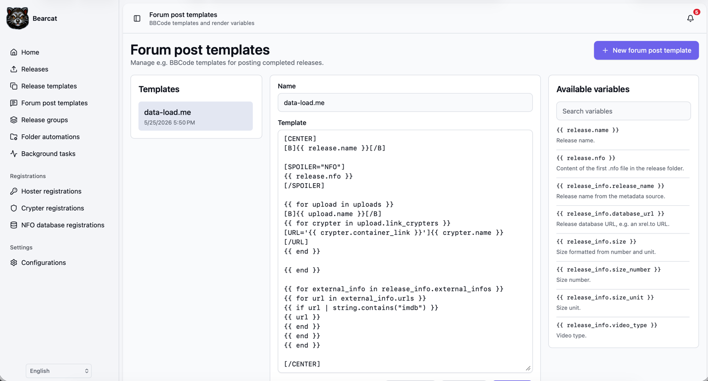
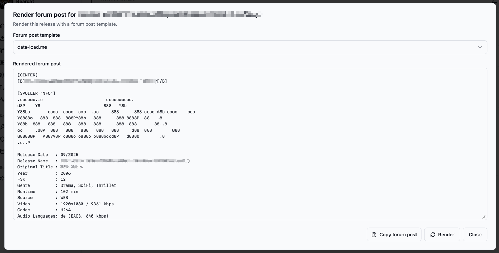

Forum post templates help you prepare the text that you want to paste into a forum after a release is ready.
Most forums accept BBCode, so a template can contain normal BBCode and placeholders that Bearcat replaces with data from the selected release.

This is useful when your posts should always follow the same structure, for example:

- release name at the top
- language, size and media information
- NFO content inside a spoiler block
- download sections for Rapidgator, DDownload or other upload configurations
- cover image links from the image hosters, that you have configured
- link crypter container links



## Creating a template

Open "Forum post templates" in the sidebar.

Click "New forum post template", enter a name and write the template body.
The template body can contain plain text, BBCode and Scriban placeholders.

Example:

```text
[CENTER]
[B]{{ release.name }}[/B]
Size: {{ release_info.size }}

[SPOILER="NFO"]
{{ release.nfo }}
[/SPOILER]

{{ for upload in uploads }}
[B]{{ upload.name }}[/B]
{{ for crypter in upload.link_crypters }}
[URL='{{ crypter.container_link }}']{{ crypter.name }}[/URL]
{{ end }}

{{ end }}
[/CENTER]
```

If you upload cover images to an image hoster, you can also place the cover directly in the post.
For example, if your image upload configuration is named `ImgBB Cover`:

```text
[IMG]{{ imagelinks.imgbb_cover.full }}[/IMG]
```

Click "Validate" to check the template syntax.
Validation checks whether the Scriban syntax is valid.
It does not require the selected release to have values for every variable.

## Rendering a forum post

Open a release and go to the "Overview" tab.
Click "Render forum post".

Bearcat opens a dialog where you can select one of your forum post templates.
It renders the template with the selected release and shows the final text.
Click "Copy forum post" and paste the result into your forum editor.



If a value is not available for the release, Bearcat renders an empty text instead of crashing.
For example, if no `.nfo` file exists in the release folder, `{{ release.nfo }}` renders as empty text.

## Available variables

The template editor shows the available variables on the right side.
Use the search field if the list gets long.

Common variables:

| Variable | Description |
| --- | --- |
| `{{ release.name }}` | Release name from Bearcat. |
| `{{ release.nfo }}` | Content of the first `.nfo` file in the release folder. |
| `{{ release_info.release_name }}` | Release name from the metadata source. |
| `{{ release_info.database_url }}` | Release database URL, for example from xrel.to. |
| `{{ release_info.size }}` | Formatted size from the metadata source. |
| `{{ release_info.video.type }}` | Video type from the metadata source. |
| `{{ release_info.audio.type }}` | Audio type from the metadata source. |

Loop variables:

| Loop | Description |
| --- | --- |
| `{{ for info in release_infos }}` | Loops over all resolved release infos. |
| `{{ for external_info in release_info.external_infos }}` | Loops over external metadata entries. |
| `{{ for url in external_info.urls }}` | Loops over URLs of an external metadata entry. |
| `{{ for upload in uploads }}` | Loops over upload configurations. |
| `{{ for link in upload.links }}` | Loops over direct hoster links of the latest upload. |
| `{{ for crypter in upload.link_crypters }}` | Loops over link crypter container links. |

Inside `uploads`, these variables are available:

| Variable | Description |
| --- | --- |
| `{{ upload.name }}` | Upload configuration name. |
| `{{ upload.hoster_name }}` | Hoster registration name. |
| `{{ upload.uploaded_at }}` | Latest upload date. |
| `{{ upload.archive_password }}` | Archive password of the latest upload. |

Inside `upload.link_crypters`, these variables are available:

| Variable | Description |
| --- | --- |
| `{{ crypter.name }}` | Link crypter registration name. |
| `{{ crypter.container_link }}` | Generated container URL. |
| `{{ crypter.created_at }}` | Container creation date. |

## Media information

For managed releases, Bearcat can read technical metadata from the video files in the release folder
(container, duration, video/audio/subtitle streams) using [MediaInfo](https://mediaarea.net/en/MediaInfo).
This lets you put resolution, codecs, runtime, languages or a complete MediaInfo dump into your forum post.

### When are the media metadata parsed?

Media metadata are read from the raw video files, so they are only available for managed releases.

- **Automatically** when a release is created automatically from a release template (right after the
  release info is resolved). This only happens for managed releases.
- **Manually** at any time with the "Extract media metadata" button on a release's "Release info" panel.
  Use this to (re-)parse the files, for example after the files changed or for releases that were not
  created automatically.

The button re-reads every video file and replaces the previously stored metadata.

### Main video

`release.main_video` points to the largest video file in the release, which is usually the actual video, the rest is usually samples.
This is a shortcut so you do not have to loop over `release.media_files` for the common case.

| Variable | Description |
| --- | --- |
| `{{ release.main_video.path }}` | Relative file path inside the release folder. |
| `{{ release.main_video.extension }}` | File extension without leading dot, for example `mkv`. |
| `{{ release.main_video.size_bytes }}` | File size in bytes. |
| `{{ release.main_video.duration }}` | Duration formatted as `hh:mm:ss`. |
| `{{ release.main_video.container }}` | Container format, for example `Matroska`. |
| `{{ release.main_video.media_info }}` | Full MediaInfo text dump for the file. |
| `{{ release.main_video.video.codec }}` | Video codec, for example `HEVC`. |
| `{{ release.main_video.video.profile }}` | Video codec profile, for example `Main 10`. |
| `{{ release.main_video.video.resolution }}` | Resolution formatted as `WxH`, for example `1920x1080`. |
| `{{ release.main_video.video.width }}` | Frame width in pixels. |
| `{{ release.main_video.video.height }}` | Frame height in pixels. |
| `{{ release.main_video.video.fps }}` | Frames per second. |
| `{{ release.main_video.video.pixel_format }}` | Pixel format, for example `YUV 4:2:0 10 bit`. |
| `{{ release.main_video.video.bitrate_kbps }}` | Video bitrate in kbit/s. |
| `{{ release.main_video.video.language }}` | Video stream language. |
| `{{ release.main_video.video.title }}` | Video stream title. |
| `{{ release.main_video.default_audio.codec }}` | Codec of the default (or first) audio stream, for example `DTS`. |
| `{{ release.main_video.default_audio.profile }}` | Audio codec profile, for example `DTS-HD MA`. |
| `{{ release.main_video.default_audio.channel_layout }}` | Channel layout, for example `5.1`. |
| `{{ release.main_video.default_audio.channels }}` | Channel count. |
| `{{ release.main_video.default_audio.sample_rate }}` | Sample rate in Hz. |
| `{{ release.main_video.default_audio.bitrate_kbps }}` | Audio bitrate in kbit/s. |
| `{{ release.main_video.default_audio.language }}` | Audio stream language. |
| `{{ release.main_video.default_audio.title }}` | Audio stream title. |

### All media files

Loop over every parsed video file with `release.media_files`. Each `file` has the same fields as
`release.main_video`, plus loops over its individual audio and subtitle streams.

| Loop | Description |
| --- | --- |
| `{{ for file in release.media_files }}` | Loops over all parsed video files. |
| `{{ for audio in file.audio_streams }}` | Loops over the audio streams of a file. |
| `{{ for subtitle in file.subtitle_streams }}` | Loops over the subtitle streams of a file. |

Inside `file.audio_streams`, these variables are available:

| Variable | Description |
| --- | --- |
| `{{ audio.codec }}` | Audio codec. |
| `{{ audio.profile }}` | Audio codec profile. |
| `{{ audio.language }}` | Stream language. |
| `{{ audio.title }}` | Stream title. |
| `{{ audio.channel_layout }}` | Channel layout. |
| `{{ audio.channels }}` | Channel count. |
| `{{ audio.sample_rate }}` | Sample rate in Hz. |
| `{{ audio.bitrate_kbps }}` | Bitrate in kbit/s. |
| `{{ audio.is_default }}` | Whether this is the default stream. |

Inside `file.subtitle_streams`, these variables are available:

| Variable | Description |
| --- | --- |
| `{{ subtitle.codec }}` | Subtitle codec. |
| `{{ subtitle.language }}` | Stream language. |
| `{{ subtitle.title }}` | Stream title. |
| `{{ subtitle.forced }}` | Whether the subtitle is forced. |
| `{{ subtitle.is_default }}` | Whether this is the default stream. |

Example that posts a raw MediaInfo dump of the main video inside a spoiler:

```text
[SPOILER="MediaInfo"]
{{ release.main_video.media_info }}
[/SPOILER]
```

Or a short technical summary built from individual fields:

```text
Video: {{ release.main_video.video.codec }} {{ release.main_video.video.resolution }}
Audio: {{ release.main_video.default_audio.codec }} {{ release.main_video.default_audio.channel_layout }}
Runtime: {{ release.main_video.duration }}
```

## Image links

Image links are available through `imagelinks`.
Use the name of the image upload configuration and the image size you want to use.

For this short form, Bearcat turns the configuration name into a template-friendly name:

- spaces become `_`
- letters become lowercase
- punctuation is removed or replaced

So an image upload configuration named `ImgBB Cover` becomes `imgbb_cover`.

Common examples:

| Variable | Description |
| --- | --- |
| `{{ imagelinks.imgbb_cover.full }}` | Full image URL for the `ImgBB Cover` image upload configuration. |
| `{{ imagelinks.imgbb_cover.medium }}` | Medium image URL, if the image hoster returned one. |
| `{{ imagelinks.imgbb_cover.thumbnail }}` | Thumbnail URL, if the image hoster returned one. |

You can also use the original configuration name:

```text
{{ imagelinks["ImgBB Cover"].full }}
```

That is useful if you are not sure how the name will be normalized.

Bearcat can only render image links after the cover image was uploaded.
If a release has no cover image, or the image upload has not completed yet, the value stays empty.

## Scriban basics

Bearcat uses Scriban syntax for placeholders.

Print a value:

```text
{{ release.name }}
```

Loop over a list:

```text
{{ for upload in uploads }}
[B]{{ upload.name }}[/B]
{{ end }}
```

Only render a block when a value exists:

```text
{{ if release.nfo }}
[SPOILER="NFO"]
{{ release.nfo }}
[/SPOILER]
{{ end }}
```

Check out the [Scriban documentation](https://scriban.github.io/docs/language/) for more details and examples.

## Practical tips

Name upload configurations like you want them to appear in the forum post, for example `Rapidgator` or `DDownload`.
That makes `{{ upload.name }}` useful directly in the rendered output.

Name image upload configurations clearly, for example `ImgBB Cover`.
That makes the template variable easy to read later: `{{ imagelinks.imgbb_cover.full }}`.

Render the post only after the release has completed uploads and link crypter containers.
Before that, upload, container and image link variables may still be empty.

Keep forum-specific formatting in separate templates if you post to multiple forums.
Different forums often support slightly different BBCode variants.
