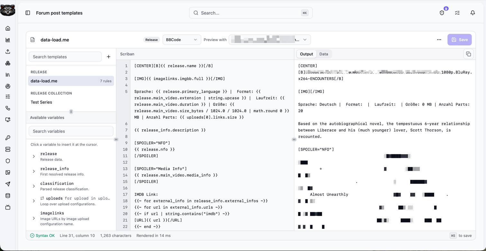
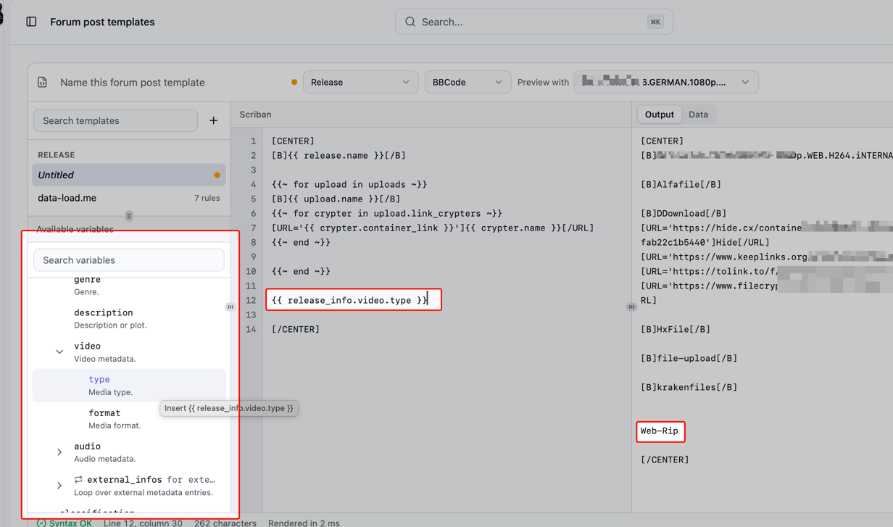
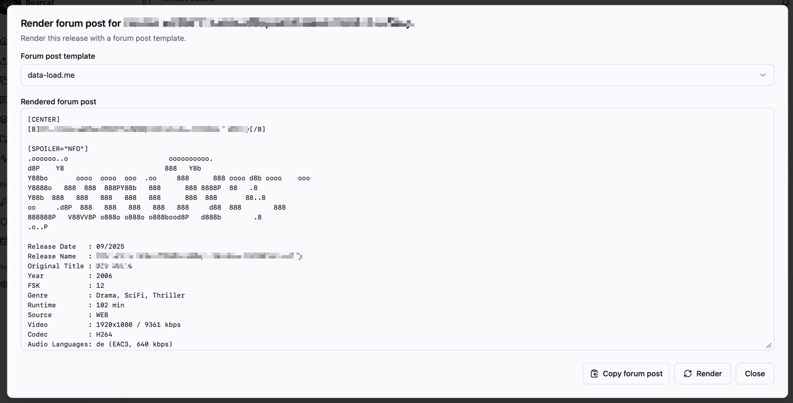

Write your post with placeholders for the release name, NFO, links, and images. Bearcat fills them
with data from a release or collection.

You can copy the result by hand or let [posting rules](/Bearcat/automatic-forum-posting/) post it for you.



## Create a template

1. Open **Forum post templates** and click **+** next to the search field.
2. Choose the type: **Release** or **Release collection**. You can't change it later.
3. Choose the output format. Use **BBCode** for forum posts. Only BBCode templates can be posted to forums.
4. Enter a name, write the template and press **Ctrl+S** (**⌘S** on a Mac) to save.

## Use the editor

The editor has three parts: your templates and variables on the left, the template in the middle
and a live preview on the right.

- **Insert variables:** click a variable under **Available variables** to insert it at the cursor.
  Lists like `uploads` insert a complete loop. Use the search field to find a variable.

  

- **Preview:** choose a release under **Preview with**. The preview updates while you type.
  **Output** shows the finished post, **Data** shows all values of that release.
- **Errors:** the status bar shows syntax errors. Click them to jump to the line.

If a placeholder stays empty in the preview, check the **Data** tab. It shows what the release
actually has.

## Template syntax

Templates use [Scriban](https://scriban.github.io/docs/language/).

Print a value:

```text
{{ release.name }}
```

Loop through a list:

```text
{{~ for upload in uploads ~}}
[B]{{ upload.name }}[/B]
{{~ end ~}}
```

Use `~` to remove the whitespace around `for` and `end` from the output.
For values within a line, use `{{ }}` without `~`.

Show a section only if a value exists:

```text
{{~ if release.nfo ~}}
[SPOILER="NFO"]{{ release.nfo }}[/SPOILER]
{{~ end ~}}
```

A complete example with NFO and link crypter links:

```text
[CENTER]
[B]{{ release.name }}[/B]

[SPOILER="NFO"]{{ release.nfo }}[/SPOILER]

{{~ for upload in uploads ~}}
[B]{{ upload.name }}[/B]
{{~ for crypter in upload.link_crypters ~}}
[URL='{{ crypter.container_link }}']{{ crypter.name }}[/URL]
{{~ end ~}}
{{~ end ~}}
[/CENTER]
```

Collection templates work the same way. They loop over the collection's releases with
`{{~ for release in releases ~}}`.

## Render a post

Open a release or release collection and click **Render forum post** in the arrow menu of
**Post to forum**. Without an active forum distribution site, it is a separate button. Choose a template and click
**Copy forum post**, then paste the result into your forum.



## Good to know

- **Empty values:** missing data leaves placeholders empty. Wait for uploads and link crypter containers
  to finish before rendering, so the post includes all links.
- **Image links:** use `{{ imagelinks.imgbb_cover.full }}` for an image upload configuration named
  `ImgBB Cover`. Bearcat converts the name to lowercase and replaces spaces with `_`.
  Alternatively, use the original name: `{{ imagelinks["ImgBB Cover"].full }}`. The link appears once the image is uploaded.
- **Media data:** `release.main_video` and `release.media_files` come from the video files of managed
  releases. Bearcat reads them automatically for releases created from a release template. For other
  releases, click **Extract media data** on the release.
- **Upload names:** name your upload configurations the way they should appear in the post, for
  example `Rapidgator`. Then you can use `{{ upload.name }}` directly.
- **Several forums:** BBCode support varies between forums. Use one template per forum if needed.
