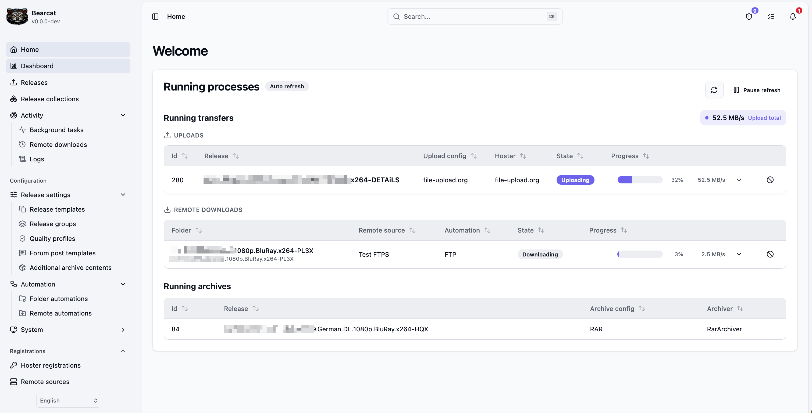

import { CardGrid, LinkCard, Aside } from '@astrojs/starlight/components';

## What is Bearcat?
Bearcat (Binturong) is not only a fluffy animal that lives in south east asia and smells like popcorn, but also a self-hosted upload manager for one-click hosters. 

It can do the following things for you:

- Automatically pack your release files into RAR or 7zip
- Upload your archive files to one-click hosters like Rapidgator, Nitroflare, and more
- Upload release cover images to image hosters, so you can use them in forum posts
- Check the state of your uploads and trigger automatic re-uploads if something is offline
- Resolve additional release infos from databases like xrel, Srrdb, and TheTVDB (cover, plot, genre, external links, and more)
- Read technical media metadata (resolution, codecs, audio and subtitle tracks) from your video files with MediaInfo, so you can put it into forum posts
- Generate forum-ready BBCode for your release posts, including links, NFO content, and more
- Keep track of which finished uploads you still need to post to a forum or so with a [guided post queue](/Bearcat/post-queue/)
- [Half automated creation of forum posts](/Bearcat/posting-to-forums/)

<Aside type="tip">
	Bearcat is self-hosted: you run it on your own desktop machine, NAS, or server and keep control of the database, account configuration, and release data.
</Aside>

## Can I also bring my own archives and let Bearcat just upload them?
Yes, you can!
You can either bring your own archives or let Bearcat pack your release files for you.
[Click here to learn more about release types](/Bearcat/release-types/).

## Which hosters and linkcrypters are supported?

Hosters:

- Rapidgator
- DDownload
- GoFile
- [Keep2Share](/Bearcat/keep2share/)
- Alfafile
- NitroFlare
- 1fichier
- Uploady.io
- Katfile
- Krakenfiles
- FileQ
- UploadG.com
- FileServe.com
- Clicknupload.click

Link crypters:

- Hide.cx
- Keeplinks
- tolink.to
- [filecrypt.cc](/Bearcat/filecrypt/)

Image hosters:

- ImgBB
- pixhost.to (no API key needed!)
- pixelfox.cc
- directupload.eu (no API key needed!)

Forums:

- Basic support for XenForo (currently data-load.me & boerse.cx)

## Installing & running Bearcat 

<Aside type="note">
Regarding the size of the Bearcat package:
To enable the semi-automatic posting to forums, Bearcat uses Playwright, with is a framework to use a browser to programmatically access a website and navigate on it.
This requires a headless version of Chromium to be installed and that headless version currently comes bundled with Bearcat, which adds about 260MB to the actual application size.
The alternative would be, to not bundle it. Then the app would download it the first time it's required. Maybe this will be the way to go in the future.
</Aside>

<CardGrid>
	<LinkCard
		title="Desktop app"
		description="Run Bearcat on demand on Windows or macOS with the launcher."
		href="/Bearcat/use-the-desktop-launcher/"
	/>
	<LinkCard
		title="Windows service"
		description="Run Bearcat always-on in the background on a Windows PC or server."
		href="/Bearcat/use-the-windows-service/"
	/>
	<LinkCard
		title="Docker container"
		description="Host Bearcat on Linux, NAS devices, or servers."
		href="/Bearcat/use-the-docker-image/"
	/>
	<LinkCard
		title="Initial setup"
		description="Connect accounts, configure templates, and create your first release."
		href="/Bearcat/post-installation/"
	/>
</CardGrid>

## Learn more

<CardGrid>
	<LinkCard
		title="Upload lifecycle"
		description="See how releases move from archives to upload checks and reuploads."
		href="/Bearcat/upload-lifecycle/"
	/>
	<LinkCard
		title="Release collections"
		description="Group related releases like a TV season and share their uploads and links."
		href="/Bearcat/release-collections/"
	/>
	<LinkCard
		title="Forum post templates"
		description="Generate forum-ready BBCode from release data, NFO content, and links."
		href="/Bearcat/forum-post-templates/"
	/>
	<LinkCard
		title="Advanced configuration"
		description="Tune background tasks and global behavior once the basics are running."
		href="/Bearcat/advanced-configuration/"
	/>
</CardGrid>
