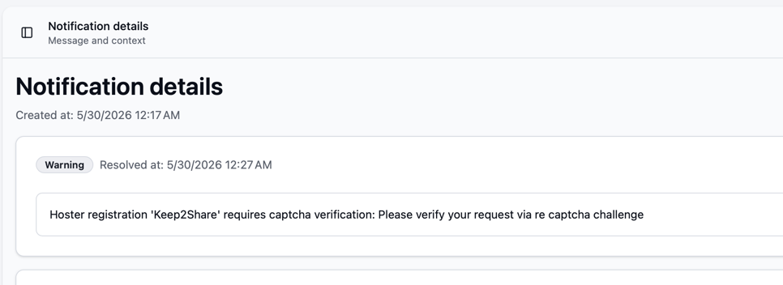
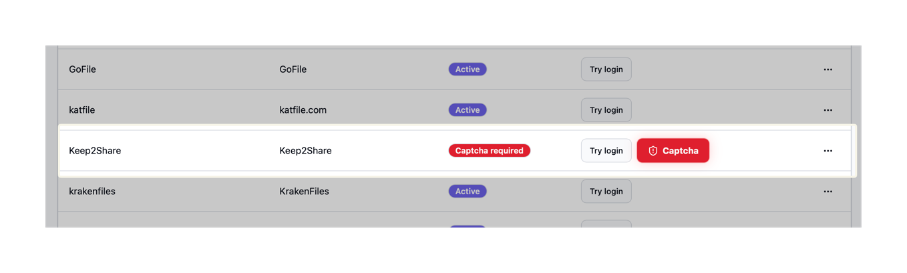
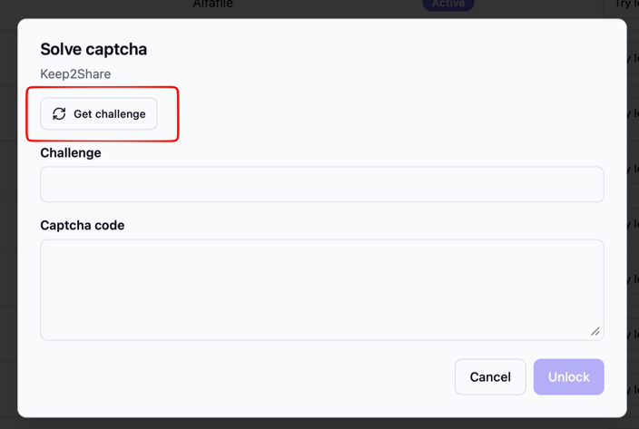
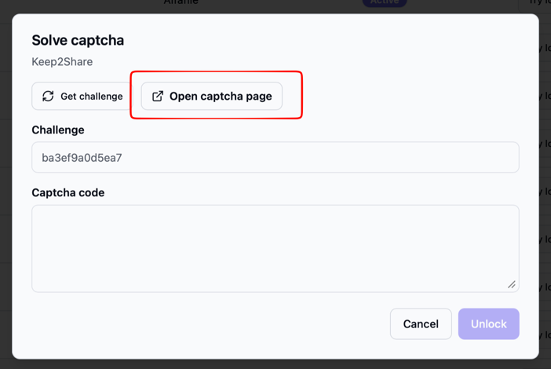
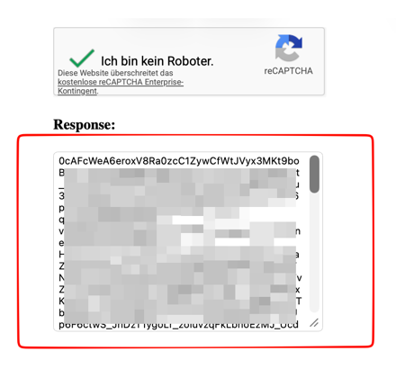
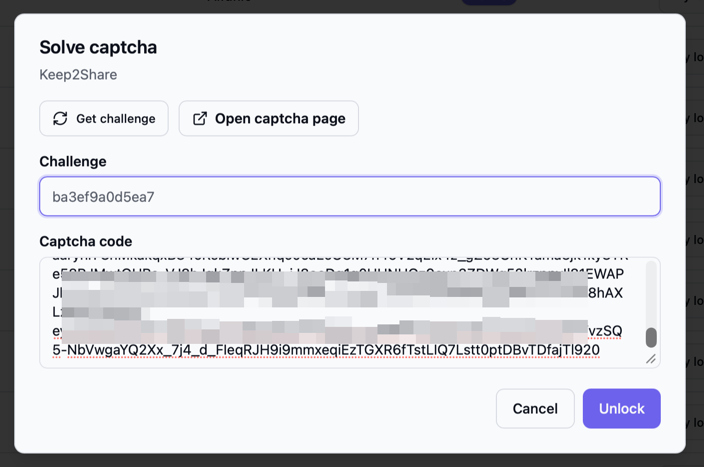
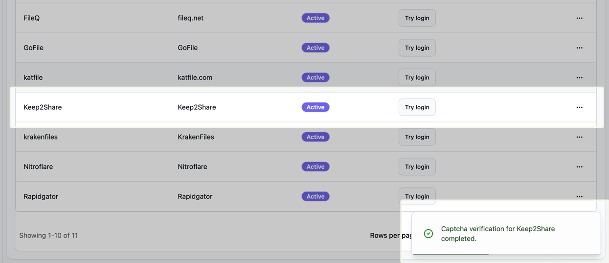

## "Unicorn" captcha challenges

Keep2Share might require you to resolve captchas from time to time, if you are accessing it from a "not trustworthy" IP address.
In this case, all API calls fail until you resolved that captcha.

Bearcat will handle these errors by sending you a notification telling you to resolve a captcha challenge and automatically disable the hoster configuration to avoid getting the IP address banned.

If you then visit the Hoster Registrations page, you will see a new button:

Clicking on it will open a new dialog, with a "Get challenge" button.
This button will retrieve the URL for the captcha challenge from the keep2share API and asks you to open it and do the challenge.

Open the link, solve the challenge and copy the long token in the "Response" box:

Then paste the token into the "Captcha code" box and click "Unlock".

If everything went well, you will see a successful login notification and the Hoster Registration will be automatically reactivated.
