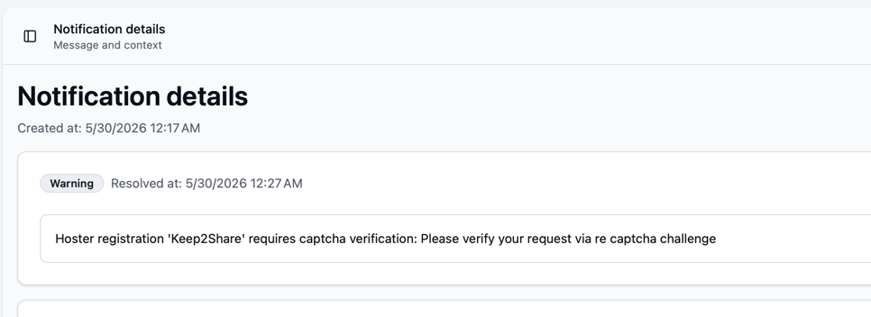
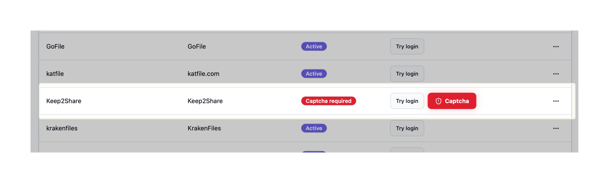
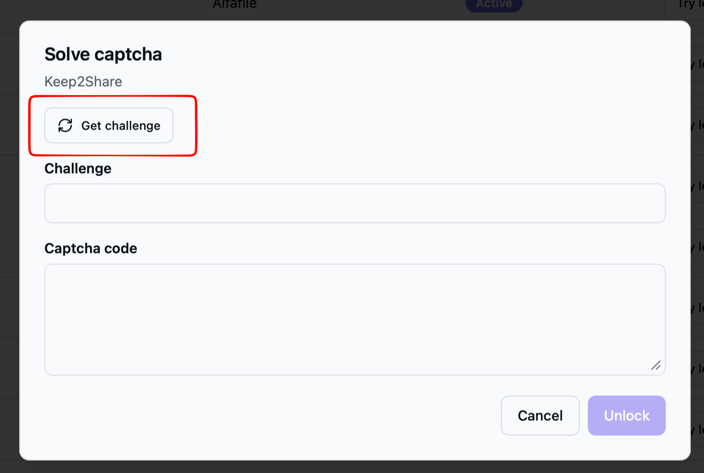
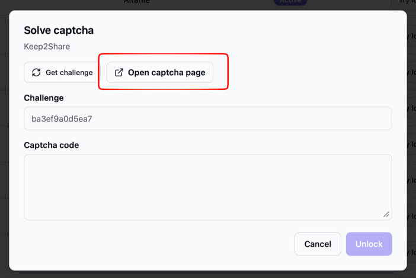
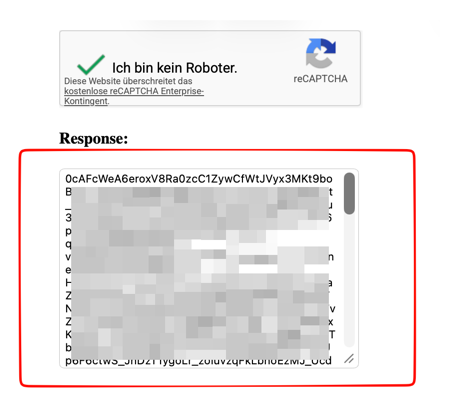
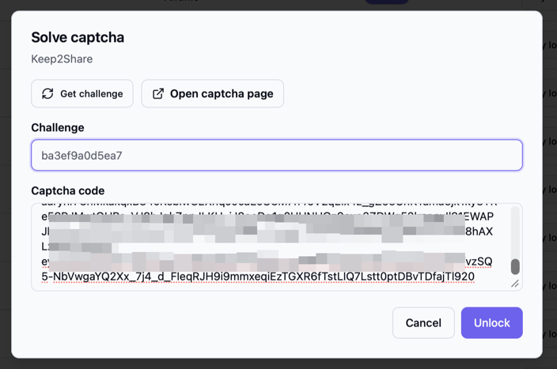
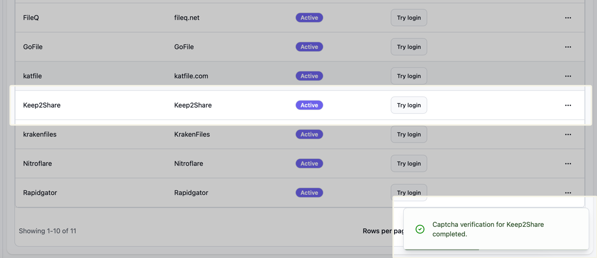

## "Unicorn" captcha challenges

Keep2Share sometimes requires a captcha when it does not trust your IP address.
Until you solve it, API calls fail. Bearcat disables the hoster registration and notifies you.
This prevents further requests that could trigger an IP ban.

1. Open **Hoster registrations** and click the captcha button for your Keep2Share account.

   

2. Click **Get challenge** in the dialog, then open the link shown.

   
   

3. Solve the captcha and copy the token from the **Response** box.

   

4. Paste the token into **Captcha code** in Bearcat and click **Unlock**.

   

After a successful login, Bearcat reactivates the hoster registration automatically.

