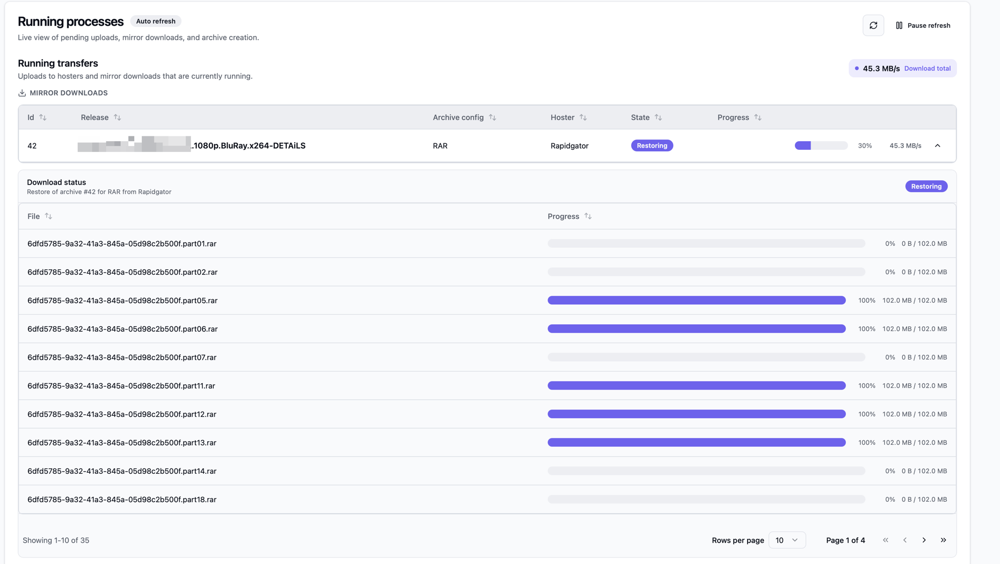
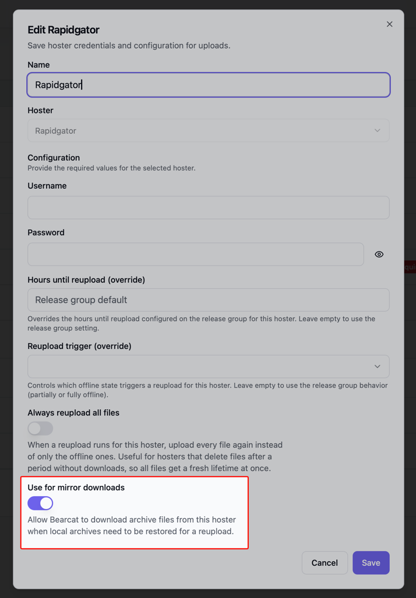
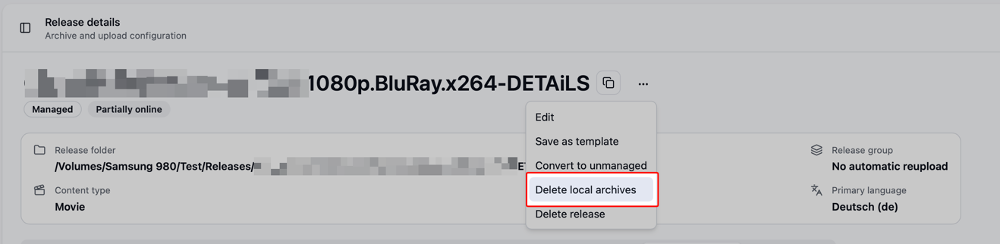

Mirror downloads turn your hosters into long-term storage. You mark a hoster as a mirror, and from
then on Bearcat can download the archive files back from that hoster whenever a reupload needs them.
The local copy of an archive becomes optional, so you can free the disk space it takes up and still
keep the release reuploadable.

This works for both [managed and unmanaged releases](/Bearcat/release-types/).

## When Bearcat downloads from a mirror

A mirror download happens when all of the following are true:

- An upload is waiting for its archive, which is the normal state for a new reupload.
- The newest archive of that archive configuration is deleted or has missing files.
- A mirror hoster still has every needed file online.

Bearcat provisions the archive files for an upload in this order:

1. Use the local archive files if they are still on disk.
2. Download them from a mirror hoster.
3. For managed releases only, repack them from the release folder.

An unmanaged release without a mirror has nothing to fall back on, so Bearcat keeps the upload
waiting and asks you to provide the archive files. See
[Unmanaged Releases](/Bearcat/release-types/#unmanaged-releases) for that path.

Bearcat only downloads the files it actually needs. If a previous upload to the same hoster still
has some files online, those are carried over and only the missing ones are downloaded.

## Enable a hoster as a mirror

Open the hoster registration and turn on **"Use for mirror downloads"**. Nothing else changes for
that hoster: it keeps uploading exactly as before, it is just also allowed to serve files back.

Mirror downloads currently work with **Rapidgator** and **1fichier** only, and both need a premium
account.

## Verification and failures

Bearcat stores the MD5 hash of every file it uploads. After a mirror download it hashes the
downloaded file again and compares it to the stored value. If a hash does not match, or a download
fails for another reason, Bearcat discards the restore, keeps the archive in its old state, and
creates an "Archive restore failed" notification.

A failed restore also fails the waiting uploads. Create a manual reupload once you fixed the cause.

## Parallel downloads

The "Mirror downloads" section on the "Configurations" page has one setting:

- **"Max parallel downloads"** defaults to `2`. It limits how many archive files Bearcat downloads
  at the same time while restoring an archive.

Raise it if your line is fast and your hoster account allows several connections. Lower it to `1` if
the hoster throttles or rejects parallel downloads.

## Delete local archives yourself

The release detail page has a **"Delete local archives"** action in the actions menu. It deletes the
local archive files of the release and marks the archives as deleted, which is the manual way to
free disk space.

Bearcat only offers this when the release stays recoverable:

- No upload of the release is running.
- Every archive configuration has a fully online upload on a hoster that is enabled for mirror
  downloads, **or** the release is managed and still has its release folder for repacking.

The action deletes the archive files one by one and removes the archive folder only if it is empty
afterwards. That matters for unmanaged releases, where the archive folder is your folder and may
hold other files.

## Automatic cleanup

Auto cleanup can delete local archives on a retention period and
leave the restore to the mirrors. See
[Auto cleanup](/Bearcat/advanced-configuration/#auto-cleanup) for the two rules and their settings.

This means, archives can leave your disk after a while, the hosters keep them, and
Bearcat downloads them back when a reupload needs them.
