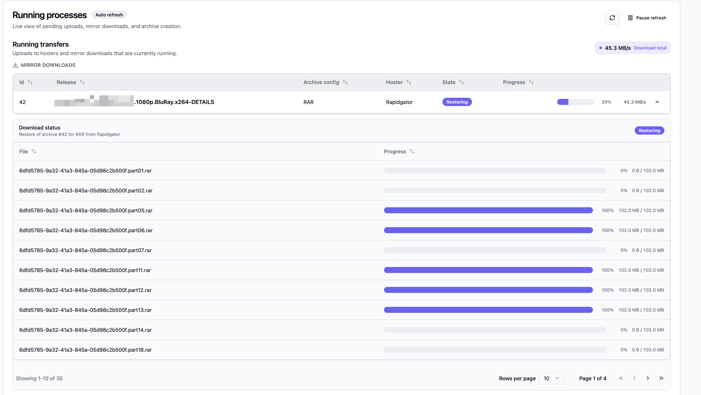
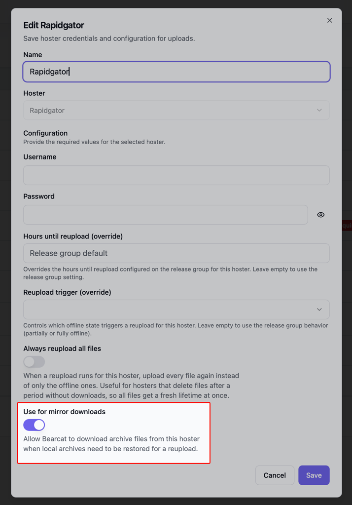
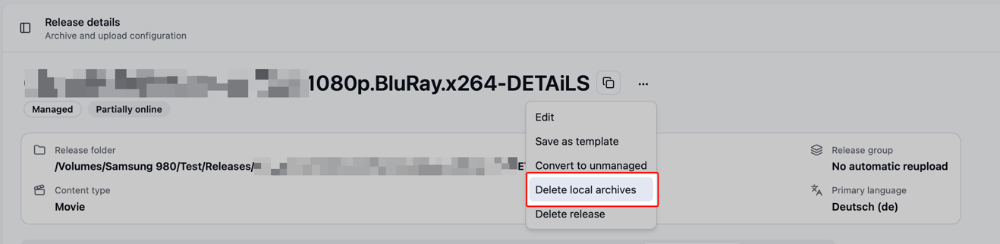

Enable a hoster as a mirror so Bearcat can restore archive files when a reupload needs them.
You can then delete local archives to free disk space, as long as a mirror still has the required files online.

This works for both [managed and unmanaged releases](/Bearcat/release-types/).

## When Bearcat downloads from a mirror

Bearcat downloads an archive from a mirror when:

- an upload is waiting for its archive,
- the latest archive in that configuration is missing or incomplete locally, and
- all required files are online on a mirror hoster.

When archive reuse is possible, Bearcat looks for files in this order:

1. Use the local archive files if they are still on disk.
2. Download them from a mirror hoster.
3. For managed releases only, repack them from the release folder.

For new hashes, 7-Zip needs repacking even when archive files are available.
See [Archive reuse](/Bearcat/upload-lifecycle/#archive-reuse-and-repackaging) for format differences.

Without local archives or a mirror, an unmanaged upload waits until you provide the archive files. See
[Unmanaged Releases](/Bearcat/release-types/#unmanaged-releases) for instructions.

Bearcat reuses files still online from a previous upload to the same hoster and downloads only
the missing ones.

## Enable a hoster as a mirror

Open the hoster registration and turn on **Use for mirror downloads**.

### Use a proxy for downloads

Set **Proxy for mirror downloads** in the hoster registration to use a proxy for archive restores.
It is separate from the proxy used for uploads and account requests. Leave it on **Category default**
to follow the global **Hoster mirror downloads** setting. See [Proxy Servers](/Bearcat/proxy-servers/).

### Mirror priority

**Mirror priority** appears when you enable mirror downloads. The default is `100`; lower numbers
take priority, so `10` is chosen before `100`.

Bearcat only considers active mirror registrations with all required files marked online.
If several mirrors have the same priority, it chooses the one with the most recent file check.

The hoster list shows the priority next to **Mirror downloads**, for example **Mirror downloads (Prio: 100)**.

### Hosters that support mirror downloads

**Use for mirror downloads** is available for these hosters:

| Hoster | Premium account needed |
| --- | --- |
| Rapidgator | Yes |
| 1fichier | Yes |
| Alfafile | Yes |
| HxFile.co | Yes |
| Keep2Share | Yes |
| Fast2Share.com | Yes |
| mega4upload.net | Yes |
| DDownload | No |
| datavaults.co | No |
| file-upload.org | No |
| Uploady.io | No |

Bearcat shows a hint beside the switch when a premium account is needed. Free accounts can still
upload to these hosters.

Why some hosters need a premium account

- **Alfafile:** free accounts allow one download every 120 minutes and only 500 MB of total traffic.
- **Fast2Share:** free accounts have a waiting period for each file. Bearcat does not support this,
  so mirror downloads with a free account fail.
- **Keep2Share:** free downloads are limited to roughly 50 KB/s and one connection at a time.
- **mega4upload.net:** downloads need a premium account and an API key that has the
  `download` scope. Ask mega4upload support to add the scope to your key.

## Cancel a running download

Follow or cancel mirror downloads under **Activity > Downloads**. It shows progress, speed,
remaining time, and file details.

Canceling deletes the incomplete downloads and cancels the waiting uploads so they do not restart
on the next run. The archive state is reset; files on the hoster are kept. Create a manual reupload when you want to try again.

## Verification and failures

Bearcat checks each downloaded file against the MD5 hash stored during upload. If a hash does not
match or a download fails, it discards the restore, keeps the archive in its previous state, and
creates an **Archive restore failed** notification.

The waiting uploads also fail. Fix the cause, then create a manual reupload.

## Parallel downloads

Under **Configurations > Mirror downloads**, set **Max parallel downloads** to limit how many
archive files are downloaded at once. Default: `2`.

Raise it if your line is fast and your hoster account allows several connections. Lower it to `1` if
the hoster throttles or rejects parallel downloads.

## Speed limits

- **Maximum download speed** (MB/s) under **Configurations > Mirror downloads** caps the combined speed of all running mirror downloads.
- **Maximum mirror download speed (MB/s)** in the hoster registration caps the combined speed of
  all mirror downloads from that hoster registration.

Both are empty by default, which means no limit. Decimal values such as `0.5` or `0,5` are allowed.
When both are set, the lower limit takes effect.

## Delete local archives yourself

Choose **Delete local archives** in the release detail page's action menu to free disk space.
It deletes the release's local archive files and marks the archives as deleted.

Bearcat only offers this when the release stays recoverable:

- No upload of the release is running.
- Every archive configuration has a fully online upload on a hoster that is enabled for mirror
  downloads, **or** the release is managed and still has its release folder for repacking.

Bearcat deletes the archive files and removes the folder only if it is then empty. Other files are kept.

## Automatic cleanup

Auto cleanup can delete local archives after a configured retention period. Bearcat downloads them
from a mirror when a later upload needs them. See
[Auto cleanup](/Bearcat/advanced-configuration/#auto-cleanup) for the two rules and their settings.
