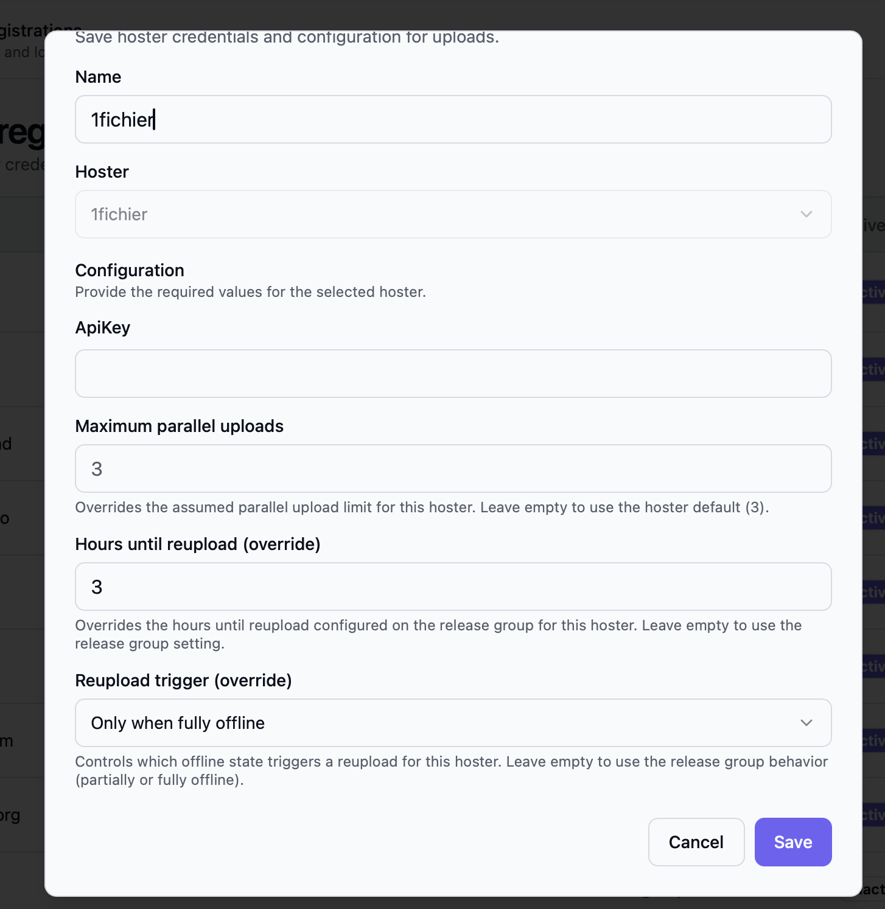

Open the Bearcat web interface. With the default Docker setup, it is at
`http://localhost:8080`. For the Desktop app or Windows service, use the address from your installation setup.

This guide starts with a **managed release**: Bearcat packs your files into archives and uploads them.
If you already have archives, see [Release Types](/Bearcat/release-types/).

## Setting up hoster accounts

1. Open **Hoster registrations** in the sidebar and click **New hoster**.
2. Choose a hoster and enter your credentials. Depending on the hoster, you need a username and password or an API key.
3. Save, then click **Try login** to check the connection.


You can leave the parallel upload and reupload settings at their defaults for now.

## Setting up release groups

A release group controls automatic reuploads for its releases.

1. Open **Release groups** in the sidebar and click **New release group**.
2. Give the group a name and leave automatic reuploads disabled for your first upload.
3. Save the group.


Bearcat still creates initial uploads and checks their links when automatic reuploads are disabled.
You can [enable reuploads later](#automatic-reuploads).

## Manually create a release

1. Open **Releases** in the sidebar and click **New release**.
2. Select **Managed** as the release type and choose the folder containing your files.
3. Enter a name, or leave it empty to use the selected folder's name.
4. Select the release group you created and click **Create release**.
5. Click the release name in the list to open its detail page.


The folder picker starts in your configured release directory. In Docker, this is the directory
mounted from `RELEASES_DIR` in your `.env` file.

Creating a release does not start an upload. Add the archive and upload configurations next.

## Create archive- and upload configurations

### Archive configuration

On the **Archive configurations** tab, click **Add** and choose:

- A name for the configuration and the archiver to use.
- The folder where Bearcat should store the archives before uploading them.
- An archive file prefix, part size in MB, and optional password.

The archiver adds the file extension automatically.


### Upload configuration

On the **Upload configurations** tab, click **Add**. Choose a name, your hoster registration,
and the archive configuration to upload.


The **Links distributed to** list is optional. Use it to record where you shared the links so you
can find those posts again later.

### Check the upload

Bearcat creates the first upload after the configured cooldown, which defaults to five minutes.
Its background tasks then create the archives and upload them to your hoster.

Open the **Uploads** tab to check progress. Once the upload finishes, copy its links from **Overview**.
For the full sequence, see [Upload Lifecycle](/Bearcat/upload-lifecycle/).


The notification bell shows completed uploads, failures, and other events. Open a notification for
details and mark it as resolved once you have dealt with it. You can also
[forward notifications to Telegram](/Bearcat/telegram-notifications/).

## Optional setup

The following settings add link containers, metadata, cover images, and automation to your releases.

### Setting up link crypters and metadata sources

- Open **Crypter registrations** to add accounts for link containers. On a release, expand a saved
  upload configuration and add a link crypter registration, with an optional container password.
- Open **NFO database registrations** to enable sources for scene release information and NFOs.
- Open **Metadata sources** to add providers for titles, descriptions, genres, and cover images.

See [Release Information and Metadata](/Bearcat/release-information-and-metadata/) for providers,
credentials, and language settings.

### Setting up image hoster accounts

To share cover images in forums, open **Image hoster registrations** and click **New image hoster**.
Choose the hoster and enter any required account information.

### Image upload configuration

On a release's **Image upload configurations** tab, click **Add**. Choose a name and the image
hoster registration that should receive the cover.

Use a name you can recognize in templates. For example, `ImgBB Cover` is available as
`imagelinks.imgbb_cover.full` in [forum post templates](/Bearcat/forum-post-templates/).

Bearcat uploads the image once the release has a cover URL. If no cover is available, it skips
the image upload.

### Automatic reuploads

Edit a release group to enable automatic reuploads and set **Hours until reupload**.
With a value of `24`, Bearcat waits at least 24 hours after confirming files are offline before
scheduling a replacement. With `0`, it can schedule one as soon as the files are confirmed offline.

Assign groups when creating or editing a release. To move several releases together, select them
in the release list and choose **Change release group**.
See [Automatic reuploads](/Bearcat/upload-lifecycle/#7-automatic-reuploads) for the full behavior.

### Reupload overrides per hoster

In **Hoster registrations**, open **New hoster** or **Edit** to override reupload settings for one
account. Leave the override fields empty to use the release group's settings.

| Setting | Effect |
| --- | --- |
| **Hours until reupload (override)** | Replaces the release group's waiting time for this hoster. |
| **Reupload trigger: Partially or fully offline** | Starts the waiting time when any file goes offline. |
| **Reupload trigger: Only when fully offline** | Waits until every file is offline. The waiting time starts when the last file goes offline. |
| **Always reupload all files** | Uploads every file again, including those still online. |



Waiting time and trigger overrides do not enable automatic reuploads for a group that has them disabled.
For examples and timing details, see [Per-hoster overrides](/Bearcat/upload-lifecycle/#per-hoster-overrides).

The **Reupload** column shows the overrides, or **Release group defaults** when none are set.
**Full reuploads** indicates that **Always reupload all files** is enabled.

### Parallel uploads per hoster

Some hosters report their upload limit through the API: Bearcat shows **Via API** and does not let
you change it. For other hosters, **New hoster** and **Edit** offer a **Maximum parallel uploads**
field. Leave it empty to use the default shown in the field, or enter your own limit.

The **Parallel uploads** column shows the effective limit and an **Override** badge for custom values.
The [global upload limit](/Bearcat/advanced-configuration/#upload-concurrency) also applies:
Bearcat uses the smaller of the global and per-hoster limits.

## Setting up release templates

A release template saves the release group, archive configurations, upload configurations, image
upload configurations, and link crypter settings for reuse.

Create one in either of these ways:

- Open **Release templates**, click **New release template**, and add the configurations.
- Open a configured release and choose **Save as template** from its action menu.


On the **Releases** page, choose **New from template** to use it. The new release normally takes its
name from the folder. Archive configurations set to use the release name also use that new name.

Enable **Collection detection** in the template to group related releases, such as episodes of a TV
season. See [Release Collections](/Bearcat/release-collections/).

## Setting up folder automations

Folder automations apply a release template to new folders automatically.

1. Create a release template, then open **Release folder automations** and click **New release folder automation**.
2. Set **Release base path** to the folder Bearcat should scan. Only direct subfolders are checked.
3. Optionally set a **Folder name pattern**, such as `*1080p*` or `*.GERMAN.*`. Matching ignores case
   and supports wildcards, but not regular expressions. Leave it empty to include all direct subfolders.
4. Select the template and optionally a primary language for translated metadata. An empty language
   uses the metadata provider's default.
5. Save with **Enabled** checked. You can disable or re-enable the automation from its action menu.


For example, with this base folder:

```text
/data/releases/incoming/
  Movie.One.2026.1080p/
  Movie.Two.2026.2160p/
  Some.Other.Folder/
```

The pattern `*1080p*` selects only `Movie.One.2026.1080p`. An empty pattern includes all three folders.

The background task checks about every two minutes. It skips folders that already have a release
and waits for the configured [folder stability and minimum size](/Bearcat/advanced-configuration/#folder-automation).
For each eligible folder, it creates a release from the template and looks up its metadata.
The archive and upload tasks then take over.

### Download releases from FTP or FTPS

Use **Remote sources** and **Remote automations** to download new folders from a server and create
releases from a template. See [FTP / FTPS Downloads](/Bearcat/remote-downloads/) for setup and examples.

## The release detail page

<details>
<summary>Tab reference and screenshots</summary>


### Overview tab

Shows the latest uploads, download and container links, image links, and archive passwords.
If the release folder contains a `.nfo` file, you can copy it here too.
Use this tab to copy the links and details for a forum post.


### Release info tab

This tab separates scene release information from movie or TV metadata. It also shows the NFO,
external IDs with their sources, and technical media data. You can resolve, refresh, or edit these
values manually.


See [Release Information and Metadata](/Bearcat/release-information-and-metadata/) for details.

### Archive configurations tab

Sets the archiver, output folder, part size, and password for each set of archives.
Add at least one configuration for a managed release.


### Upload configurations tab

Connects an archive configuration to a hoster account. You can also add link crypters to create containers for the upload links.


### Uploads tab

Lists upload runs and their links. You can create manual reuploads, cancel running uploads,
or delete finished and failed entries.


### Image upload configurations tab

Selects the image hoster accounts that receive the release cover. These are separate from file upload configurations.


The release needs a cover URL before Bearcat can upload an image. It normally comes from a metadata
source such as TMDB, with the xREL cover as a fallback. No cover means no image upload or image links.

### Image uploads tab

Lists image upload runs and the URLs returned by the image hoster.


Depending on the image hoster, Bearcat may receive different image sizes, for example full size, medium size or thumbnail.
You can also copy these links from the **Overview** tab.

</details>
