After you started your Bearcat container, its frontend is available
at `http://localhost:8080` (or the port you set in the .env file) and you can start setting it up.

You will be greeted with the start page.

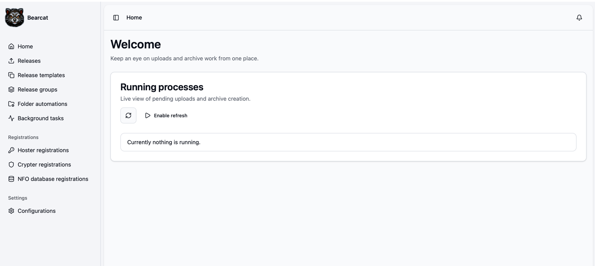

In the middle you can see a widget that in the future will show you archives, that currently get created and running uploads.

In the top right corner there is a notification bell, that will show you notifications about finished uploads, failed uploads and so on.

Notifications are Bearcat's way to tell you that background work needs attention or that something important happened.
They can be info messages, warnings or errors and can be linked to uploads, archives or link crypter containers.
The bell shows the latest unresolved notifications and links to the full notification list.
Once you have checked a notification, you can mark it as resolved so it no longer stays in the unresolved list.

## Setting up hoster accounts

To set up your hoster accounts, click on the "Hoster registrations" link in the sidebar on the left and click "New hoster".


Fill out the needed authentication information.
Depending on the hoster it can be username / password or an API key; check out the documentation of the hoster on how to get this information for your account.

Save and test the connection by clicking "Try login".

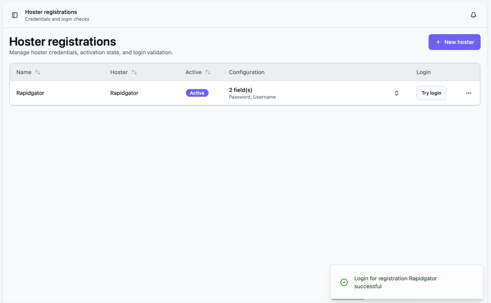

### Parallel uploads per hoster

Each hoster has a maximum number of parallel uploads that Bearcat respects during uploads.

For some hosters this value is reported by the hoster API and cannot be changed (for example Rapidgator).
For hosters where Bearcat only assumes a sensible default, you can override it per registration.

When a hoster allows it, the "New hoster" and "Edit" dialog shows a "Maximum parallel uploads" field.
The placeholder shows the assumed default; leave the field empty to keep using it, or enter a value to override it for this registration.

The "Hoster registrations" table shows the effective value in the "Parallel uploads" column:

- Hosters with an API-provided limit show "Via API".
- Hosters with an assumed default show that default, or your override value with an "Override" badge and the default underneath.

The global "Maximum parallel uploads" setting in "Configurations" still applies on top of the per-hoster limit, so the effective parallelism for a hoster is the smaller of the two values.
See [Advanced Configuration](/Bearcat/advanced-configuration/#upload-concurrency) for the global setting.


## Setting up link crypters and metadata sources

The menu option "Crypter registrations" works the same way as "Hoster registrations", but here
you can set up the link crypter accounts used to create link containers for your releases.

Open "NFO database registrations" to activate xREL and SRRDB. They provide scene release
information, NFO files, and external IDs. They do not require credentials.

Open "Metadata sources" to register TMDB or TheTVDB. These providers supply movie and TV titles,
descriptions, genres, and cover images. They require an API key.

See [Release Information and Metadata](/Bearcat/release-information-and-metadata/) to understand how the lookup works and how languages for Releases are set.

## Setting up image hoster accounts

Some forums do not let you attach image files directly to a post.
They only allow image links from supported image hosters.
Bearcat can upload release cover images to an image hoster and make the returned links available in the release overview and in forum post templates.

Open "Image hoster registrations" in the sidebar and click "New image hoster".
Choose the image hoster and enter the required account information.


## Manually create a release

To create a release yourself, click "Releases" in the sidebar and then click "New release".

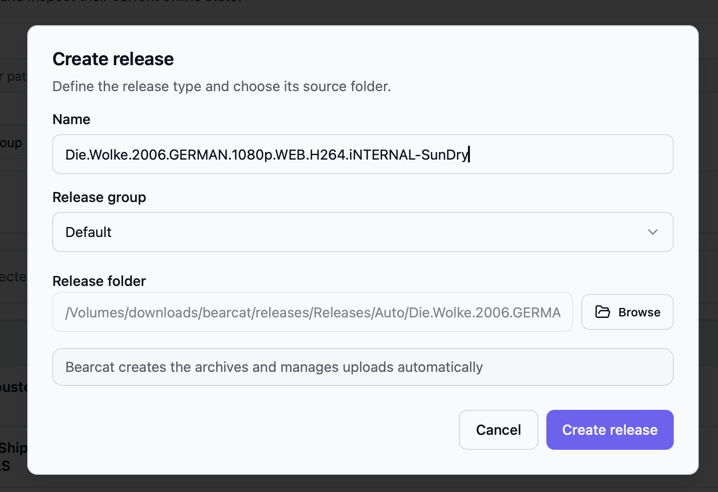

In the dialog, enter a release name and select the release folder.
The folder picker starts in the release directory that you configured with `RELEASES_DIR` in your `.env` file.
If you first select the folder and leave the name empty, Bearcat will use the folder name as the release name.

You also need to choose a release group.
Release groups decide if Bearcat should create automatic reuploads later, so if you do not want to use that feature yet, create a simple release group first and leave automatic reuploads disabled.

Bearcat currently creates managed releases.
That means Bearcat creates the archives and manages the uploads.

After clicking "Create release", the release appears in the release list.
Open it by clicking the release name.
The detail page is the place where you connect all parts of the release:

## The release detail page
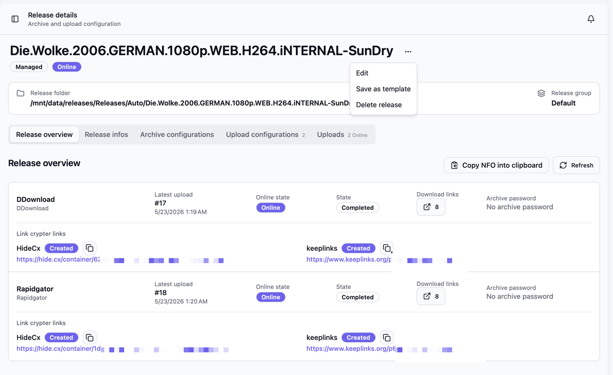

### Overview Tab
... shows the latest upload per upload configuration, download links, link crypter container links, image links, archive passwords and the NFO copy button if a `.nfo` file exists in the release folder.
It should be kind of a quick access to all information that you might need, if you want to share that release in forum.
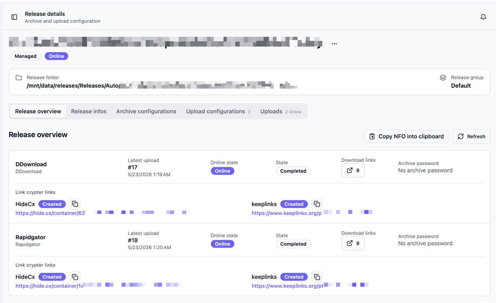


### Release info tab

This tab separates scene release information from movie or TV metadata. It also shows the NFO,
external IDs with their sources, and technical media data. You can resolve, refresh, or edit these
values manually.

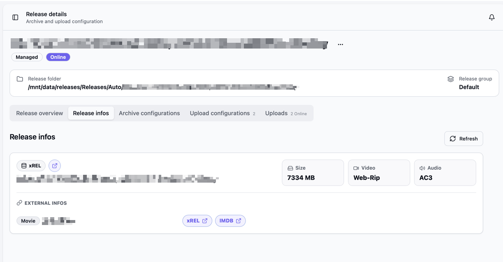

See [Release Information and Metadata](/Bearcat/release-information-and-metadata/) for details.

### Archive configurations tab
... defines how Bearcat should create archive files.
For each archive configuration, the release will be packed 1 time.
In order to be able to upload something, you need to create at least 1 archive configuration.

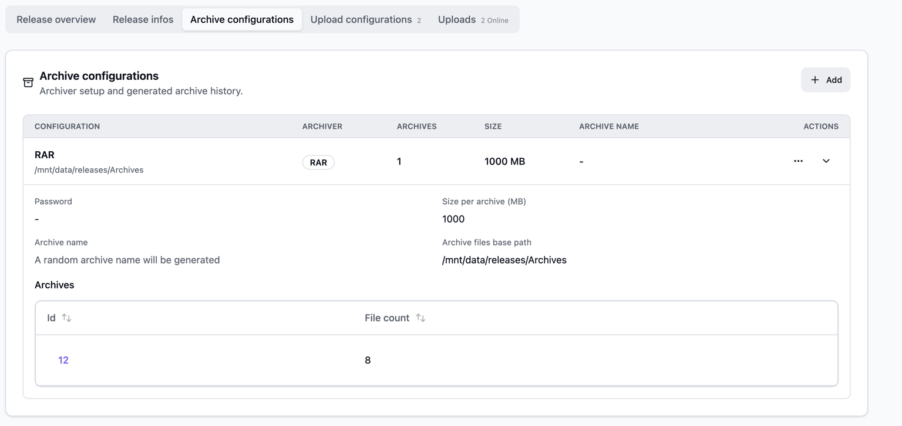

### Upload configurations tab
... defines to which hoster registration an archive configuration should be uploaded.
You can also define, on which link crypters a containers for the upload links should be created.

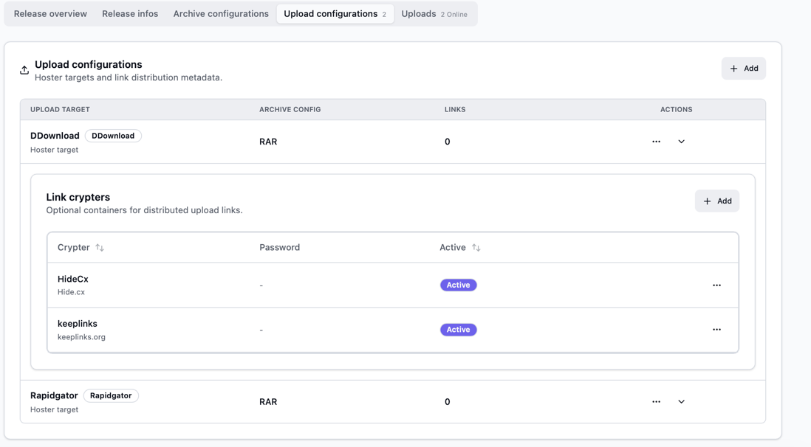

### Uploads tab
... shows the actual upload runs and lets you view links, create manual reuploads, cancel running uploads or delete finished / failed upload entries.
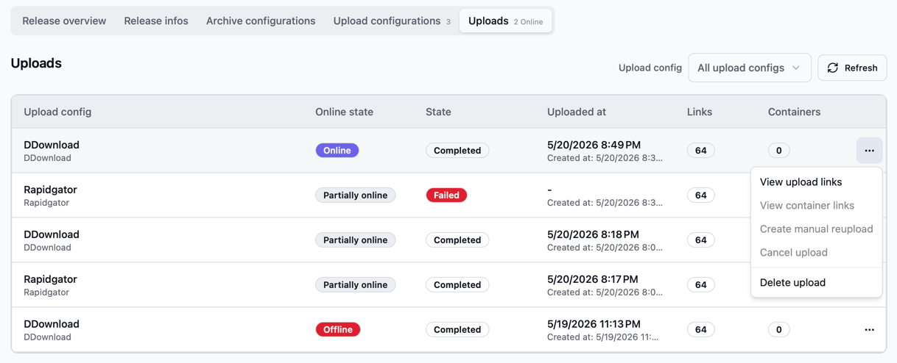
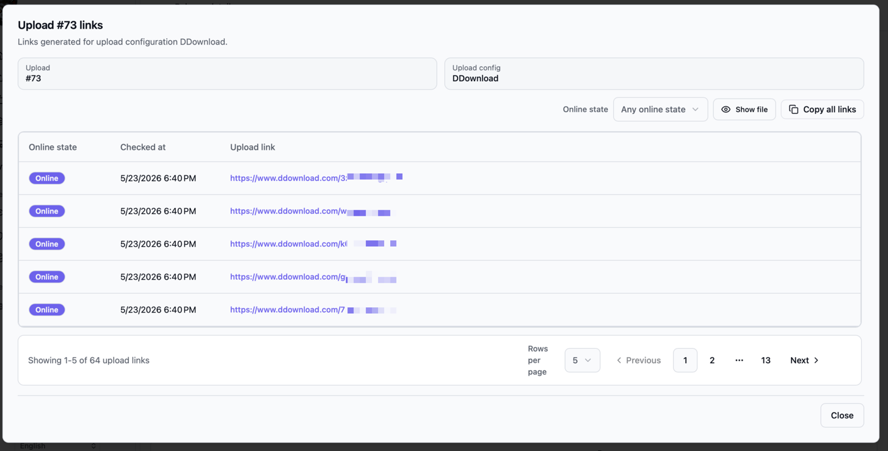
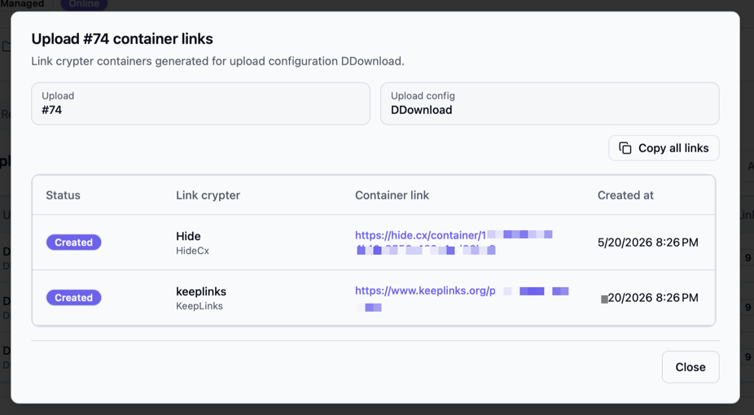

### Image upload configurations tab
... defines to which image hoster registration the release cover should be uploaded.
This is separate from the normal file upload configuration.

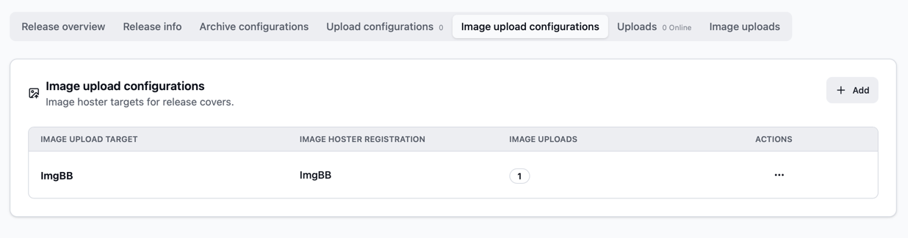

Bearcat only uploads an image when the release has a cover image URL.
The cover URL normally comes from an active metadata source such as TMDB. A cover returned by xREL
is kept as a fallback when the metadata source does not provide one.
If no cover image is known for the release, there is nothing to upload and no image links will be created.

### Image uploads tab
... shows the image upload runs and the image URLs returned by the image hoster.

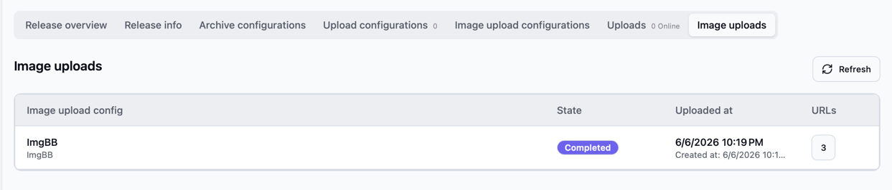

Depending on the image hoster, Bearcat may receive different image sizes, for example full size, medium size or thumbnail.
The same links are also shown compactly in the release "Overview" tab, so you can copy them quickly when preparing a forum post.


## Create archive- and upload configurations 
For a release, add at least one archive configuration and one upload configuration.

### Archive configuration
In the "Archive configurations" tab, click "Add".
Choose a name, the archiver, the archive file folder, an optional archive password and the target archive part size in MB.
The archive file folder is the location where Bearcat stores the generated archive files before they are uploaded.
The archive naming field sets the archive file prefix; the selected archiver adds its file extension automatically.

### Upload configuration
In the "Upload configurations" tab, click "Add".
Choose a name, the hoster registration and the archive configuration that should be uploaded.
The "Links distributed to" list is optional and can be used to note where you posted or shared the links later. It allows you to find the forum thread again, where you shared the links, if they went offline.

If you want Bearcat to create link crypter containers, expand the upload configuration after saving it and add one or more link crypters.
Choose the link crypter registration and optionally set a container password.

Once the release has an upload configuration, Bearcat will create the initial upload automatically after the configured cooldown time.
The background tasks create missing archives, upload them to the selected hosters, check the online state and create link crypter containers.
You can watch the progress on the start page, in the "Uploads" tab of the release, in the notification center and on the "Background tasks" page.

### Image upload configuration
In the "Image upload configurations" tab, click "Add".
Choose a name and the image hoster registration that should receive the release cover.

The name is important if you want to use the image links in forum post templates.
For example, a configuration named `ImgBB Cover` can be used as `imagelinks.imgbb_cover.full` in a template.

Bearcat uploads the cover image automatically once a cover URL exists for the release.
If the release metadata does not contain a cover URL, Bearcat simply skips the image upload.

## Setting up release groups

Release groups are used to control automatic reuploads for multiple releases at once.
Click "Release groups" in the sidebar and then click "New release group".

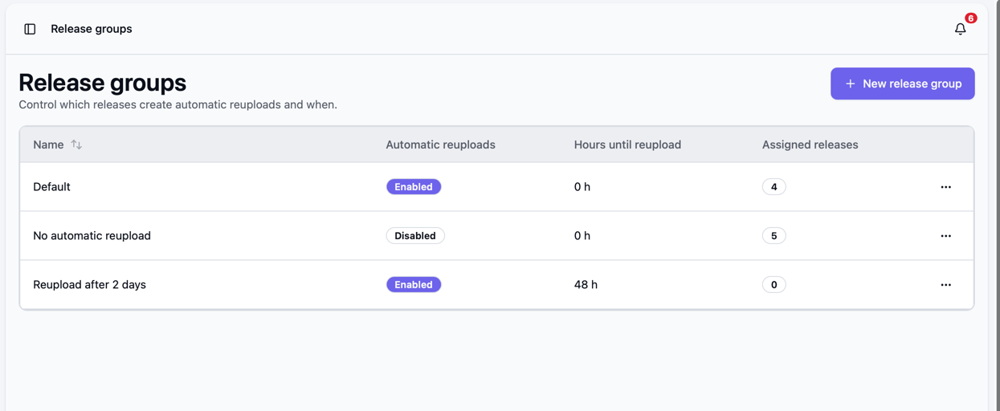

Give the group a name.
Then decide if automatic reuploads should be enabled for releases assigned to this group.
If automatic reuploads are disabled, Bearcat will still create initial uploads and check whether uploaded files are online, but it will not automatically schedule replacement uploads for this group.

If automatic reuploads are enabled, set "Hours until reupload".
This is the waiting time after Bearcat has confirmed that uploaded files are offline.
For example, if you set it to `24`, Bearcat waits until the offline files have been checked for at least 24 hours before it creates a replacement upload.
If you set it to `0`, Bearcat can schedule the replacement as soon as the files are confirmed offline.

You can assign a release group when you create or edit a release.
On the release list, you can also select multiple releases and use "Change release group" to move them together.
This is useful when you want stricter reupload behavior for some releases and a more relaxed setup for others.

Typical setups are:

- A default group with automatic reuploads disabled while you are still testing Bearcat.
- A production group with automatic reuploads enabled and a waiting time like `12` or `24` hours.
- A priority group with a shorter waiting time for releases that should be restored quickly.

## Setting up release templates

Release templates are reusable release setups.
They are useful when multiple releases should use the same release group, archive settings, hoster targets and link crypter settings.

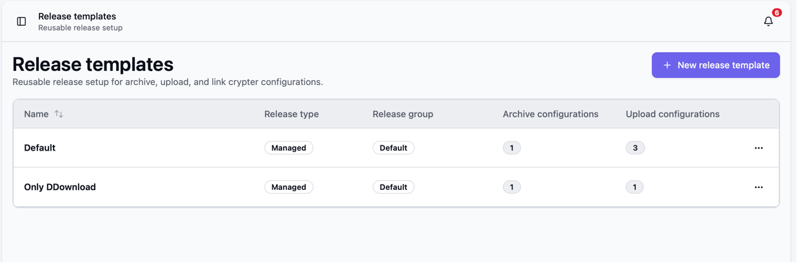

You can create a release template in two ways:

- Open "Release templates" in the sidebar, click "New release template" and then add archive configurations, upload configurations and link crypters to the template.
- Open an existing release, use the action menu in the top right and choose "Save as template".

A release template stores the release group, archive configurations, upload configurations, image upload configurations and link crypter settings.
When Bearcat creates a release from a template, the new release name is normally taken from the folder name.
If an archive template is configured to use the release name as archive name, every automatically created release will get archive names based on its own folder name.

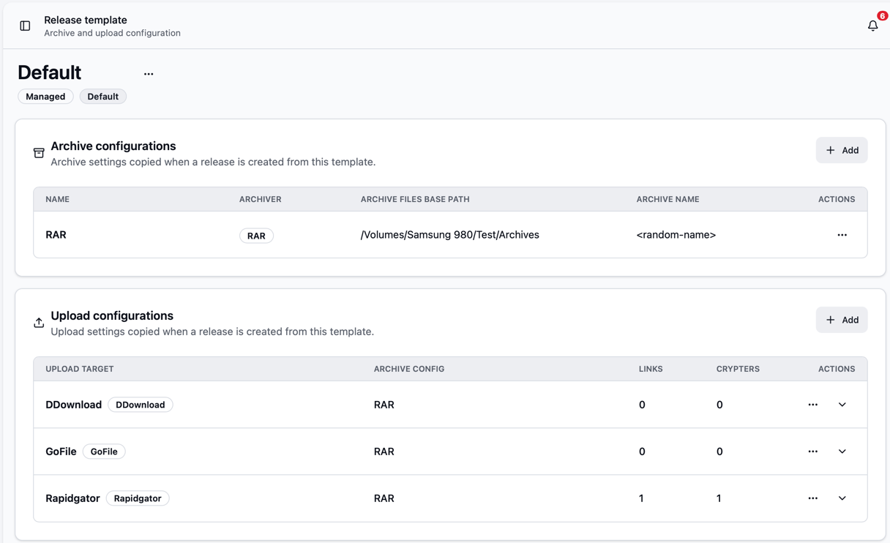

Templates can be used manually from the "Releases" page with "New from template".
They are also required for folder automations, because the automation needs to know which archive and upload setup it should apply to newly found folders.

A template can also group the releases it creates into a release collection.
Turn on "Collection detection" in the template if the releases belong together, for example the episodes of a TV show season.
Bearcat then keeps those releases side by side so you can share their uploads and links from one place.
See [Release Collections](/Bearcat/release-collections/) to learn what you can do with a collection.

## Setting up folder automations

Folder automations create releases automatically when new folders appear below a configured base folder.
They are useful once you have a release template that you want to apply again and again.

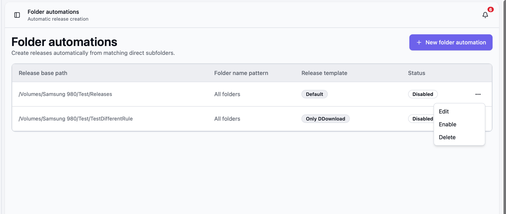

After the template is ready, open "Release folder automations" in the sidebar and click "New release folder automation".

Set the "Release base path" to the folder that Bearcat should scan.
Bearcat scans the direct subfolders of this path.
It does not recursively walk through deeper folder structures for matching releases.

The "Folder name pattern" is optional.
Leave it empty if every direct subfolder should become a release.
If you only want matching folders, use simple wildcards like `*1080p*`, `Series.*.S01*` or `*.GERMAN.*`.
Regular expressions are not supported.
Matching is case-insensitive.

Select the release template and leave "Enabled" checked if the automation should start immediately.
You can disable and re-enable automations later from the action menu in the automations list.

The primary language is optional. When set, every release created by this automation receives that
language and metadata providers use it for translated titles and descriptions. Leave it empty to
use the provider's default language.

The folder automation background task runs about every two minutes.
For every matching direct subfolder, Bearcat checks whether a release with the same folder path already exists.
If not, it creates a new release from the selected template, tries to resolve release information
and metadata from the active sources, and adds a notification.
The normal archive and upload background tasks then continue with archive creation, upload, online-state checks and link crypter container creation.

If the selected template has "Collection detection" turned on, the newly created releases are also grouped into release collections automatically.
This is handy for something like a full season, where every new episode folder ends up in the same collection without any extra work.
See [Release Collections](/Bearcat/release-collections/) for the details.

As an example, if your release directory contains:

```text
/data/releases/incoming/
  Movie.One.2026.1080p/
  Movie.Two.2026.2160p/
  Some.Other.Folder/
```

and the automation uses `/data/releases/incoming` as base path with the pattern `*1080p*`, only `Movie.One.2026.1080p` will be picked up.
If the pattern is empty, all three direct folders are candidates.
