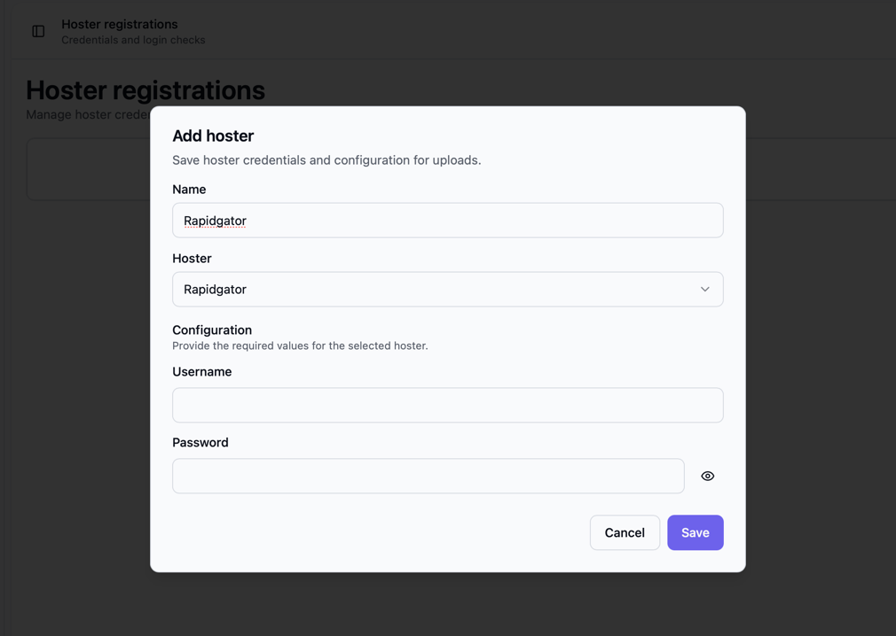
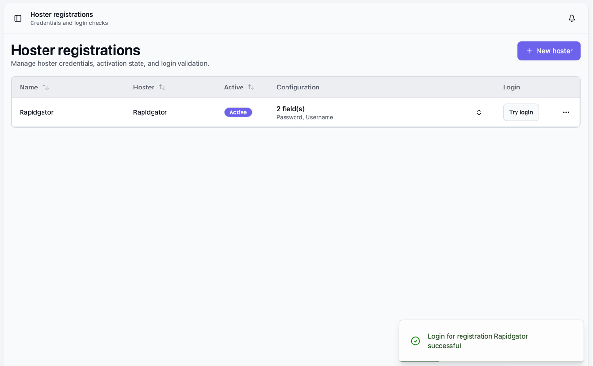

Start Bearcat and have your hoster account and files ready. The files you upload together form a **release**.

Open Bearcat in your browser:

- **Desktop app or Windows service:** [http://127.0.0.1:17208](http://127.0.0.1:17208)
- **Docker:** [http://localhost:8080](http://localhost:8080), or `http://<server-address>:8080` on another computer

If you changed the web port during installation, use that port instead.

## 1. Confirm your working directory

Open **System** > **Folders** and click **Confirm folder** for your working directory.
Check that the contents shown belong to the intended folder, then confirm.

Until you confirm it, Bearcat pauses downloads, archive creation, restores, and deletions in that folder.
See [Folder confirmation](/Bearcat/advanced-configuration/#folder-confirmation).

## 2. Add your hoster account

1. Open **Hoster registrations** and click **New hoster**.
2. Choose your hoster and enter its username and password or API key.
3. Save, then click **Try login** to check the connection.

Leave upload limits and reupload settings at their defaults.

Show hoster setup

## 3. Create a release group

Open **Release groups**, click **New release group**, and name it `My uploads`.
Keep automatic reuploads disabled for this first upload and save.

The group controls whether Bearcat replaces offline uploads. Bearcat checks links even when reuploads are disabled.

## 4. Choose your files

Put the files for your first upload in a subfolder of your working directory, for example
`releases/My.First.Upload/`.

1. Open **Releases** and click **New release**.
2. Select **Managed**. This means Bearcat creates the archives for you.
3. Choose the `My.First.Upload` folder. Leave the name empty to use the folder name.
4. Select the `My uploads` group and click **Create release**.
5. Click the release name to open its detail page.

In Docker, your `RELEASES_DIR` folder appears as `/mnt/data/releases` in the folder picker.
If you already have archives to upload, use an [unmanaged release](/Bearcat/release-types/#unmanaged-releases).

## 5. Choose how to create the archives

On the **Archives** tab, click **Add**:

- Name the configuration `Main archive` and choose RAR or 7z.
- Choose a writable output folder in a working directory, separate from your source files.
- Set the file prefix to `My.First.Upload`. Bearcat adds the file extension.
- Choose a part size in MB within your hoster’s file size limit.
- Set a password if needed, then save.

## 6. Choose where to upload

On **Uploads** > **Configuration**, click **Add**. Name the configuration, select your hoster account
and `Main archive`, then save. Leave **Links distributed to** empty for now.

## 7. Wait for the upload and copy the links

By default, Bearcat packs and uploads the files automatically once the release is five minutes old.
You can change this waiting time in **Configurations**.

Open **Uploads** and switch to **History** to follow progress. Once the upload finishes, copy the download links from **Overview**.

If the upload fails or does not start, check the notification bell for errors. Make sure **Try login**
succeeds, both configurations are saved, and the archive output folder is writable.
See [Upload lifecycle](/Bearcat/upload-lifecycle/) for the stages.

## After your first upload

For future uploads, you can:

- [Save a template and watch folders](/Bearcat/release-templates-and-automations/) to reuse these settings.
- [Enable reuploads or add link crypters](/Bearcat/account-settings/) to manage your upload links.
- [Download from FTP or FTPS](/Bearcat/remote-downloads/) to fetch releases automatically.
- [Add metadata and cover images](/Bearcat/release-information-and-metadata/) for your releases.
- [Explore the release detail page](/Bearcat/release-detail-page/) for more settings.
