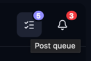
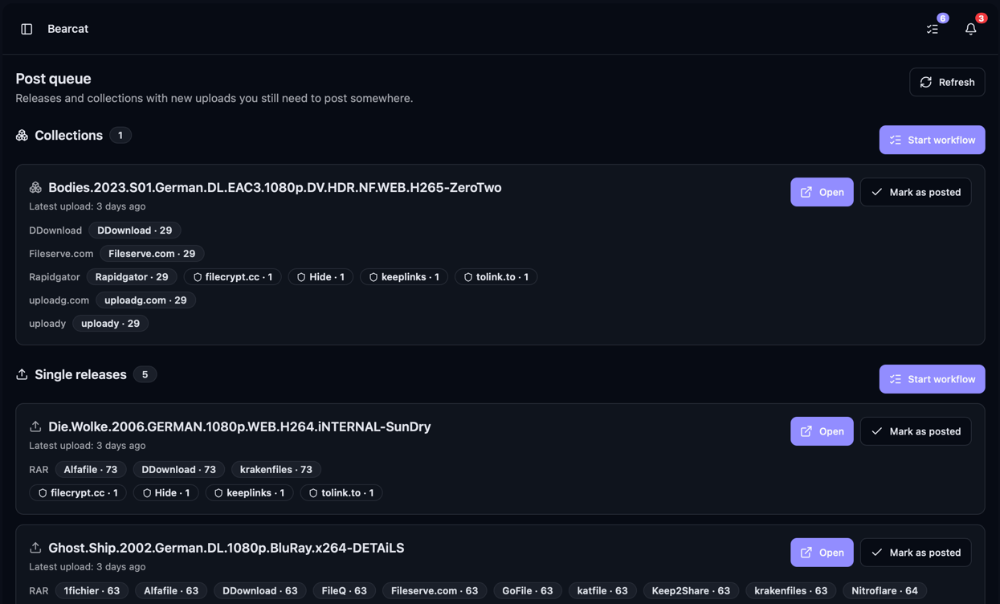
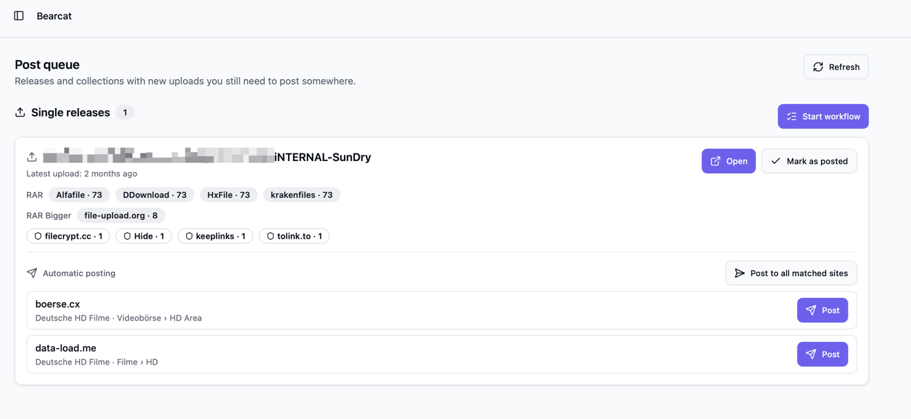
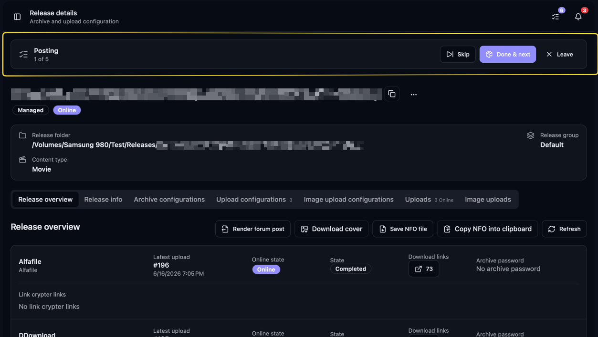
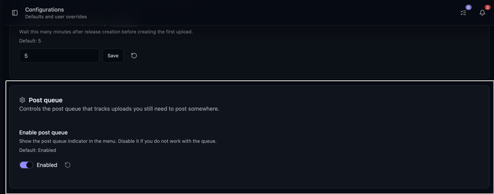

The post queue lists releases and collections with new uploads that you have not posted yet.
From there, you can prepare forum posts, submit them through posting rules, or mark releases
as posted after sharing them yourself.

## Where to find it

The post queue lives behind the list icon in the top header, next to the notification bell. The
icon shows a small badge with the number of releases and collections that are still open to post.

When nothing is open, the badge disappears. Click the icon to open the post queue page.

## When something enters the queue

A release shows up in the queue once it has a finished upload that you have not marked as posted.
Bearcat looks at the newest finished upload per upload configuration, so you always see the
current state and not every old upload.

The queue is split into two parts:

- **Single releases** lists releases whose uploads are not part of a collection.
- **Collections** lists release collections whose upload slots have new uploads.

A release that you upload through a collection slot only shows up under **Collections**, not
under **Single releases**. That way a TV season stays one entry for the whole collection instead
of one entry per episode. See [Release Collections](/Bearcat/release-collections/) for how
collections and their upload slots work.

## Posting to a forum from the queue

If you set up [posting rules](/Bearcat/automatic-forum-posting/) for a forum, every entry under
**Single releases** also has an **Automatic posting** section. It shows per forum which rule matches the release
and into which subforum that post would go.
**Post** renders the template and submits the post for you, and **Post to all matched
sites** works through every open forum at once. 
A forum where automatic posting is active has an **Auto** badge.

Once no matched forum is left open, the release is marked as posted and leaves the queue.

## Marking something as posted

When you have posted a release somewhere, click **Mark as posted** on its entry. The entry is then removed from the list.

## The guided workflow

If you have several releases to post, the workflow walks you through them one by one instead of
making you pick from the list each time.

Click **Start workflow** on the single releases or the collections part. Bearcat takes you to the
first release detail page and shows a workflow bar at the top with your progress. From there you
can render the forum post the usual way on the **Overview** tab. See
[Forum post templates](/Bearcat/forum-post-templates/) for how rendering works.

If you set up a forum as a distribution site, you can also use **Post to forum** on the **Overview**
tab instead of copying the rendered text by hand. It builds the post from the same forum post
templates and prepares a draft with a preview link, so you only have to check it and submit. It does
not submit for you, so mark the release as posted here once the post is up. See
[Posting to Forums](/Bearcat/posting-to-forums/).

The workflow bar gives you three actions:

- **Done & next** marks the current release as posted and takes you to the next one.
- **Skip** moves on without marking the current release, so it stays in the queue.
- **Leave workflow** ends the run and takes you back to the post queue page.

When you reach the end of the list, Bearcat returns you to the post queue page. If you worked
through everything, the queue is empty and shows "Nothing waiting to be posted."

If you want to start in the middle, click **Open** on a specific entry. That starts the workflow
at that release instead of the top of the list.

## Turning the post queue off

If you do not work with the post queue, you can switch it off. Open **Configurations** and disable
the post queue there. The header icon then disappears, Bearcat stops counting open items, and the
post queue page shows a short note instead of the lists. You can turn it back on at any time, and
the icon comes back without a restart.

