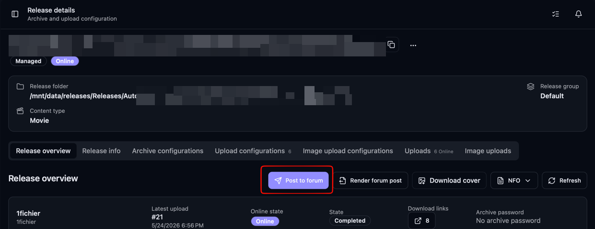
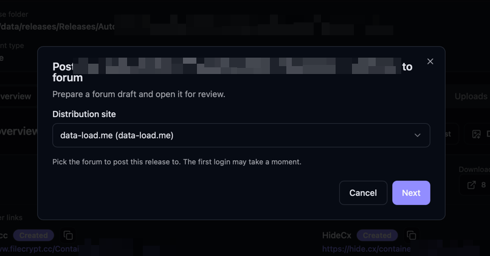
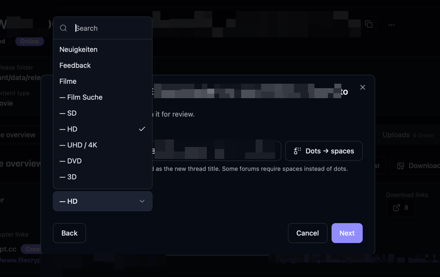
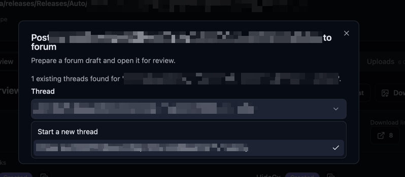
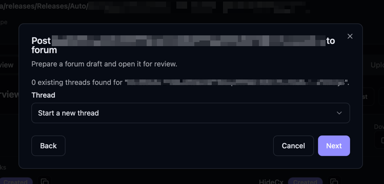
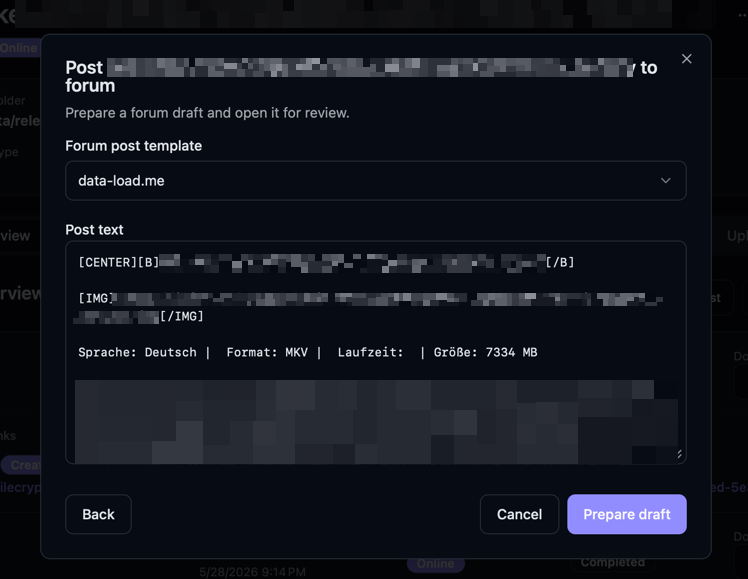
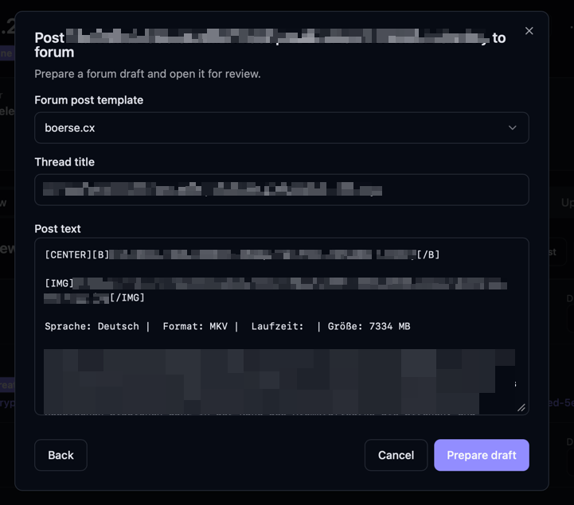
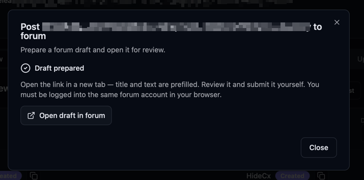
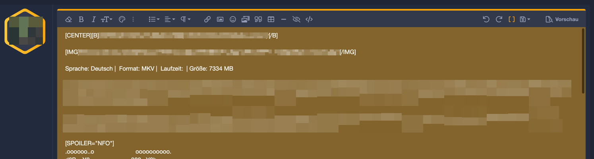
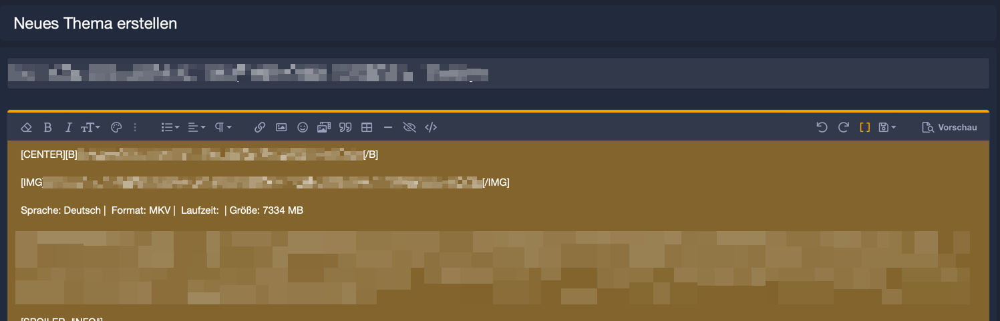

Bearcat can prepare a forum post for a release and hand you a draft inside the forum, with the
title and body already filled in. You open a link, check the post, and submit it yourself.

This is not full automation, and that is on purpose. Bearcat never sends a post for you. It saves
a draft in the forum and gives you a preview link. You log into the same forum account in your
browser, look the post over, and click submit. The reason is simple: nobody wants tools that post
to forums on their own and turn into spam. This is a first step in that direction, with a person
still doing the final click.

## What you need first

- A distribution site, which is a forum account you added to Bearcat.
- A forum post template, so Bearcat knows what the post should look like. See
  [Forum post templates](/Bearcat/forum-post-templates/).
- A release with finished uploads, so the template has links and data to fill in.

## Setting up a distribution site

Open **Distribution sites** in the sidebar and add one. Pick the forum, enter your username and
password, and save. Your password is stored encrypted. Mark the site active and use the test login
to check that the account works.

Supported forums right now are boerse.cx and data-load.me. Both run on XenForo, so more XenForo
forums can be added without much effort.

## Posting a release

Open a release and go to the **Overview** tab. Click **Post to forum**, next to **Render forum
post**. 

Bearcat walks you through a few steps:

1. Pick the distribution site you want to post to.

2. Pick the subforum. The field is searchable, so you can type part of the name. Here you can also
   edit the release name. Release names use dots, but some forums want spaces instead.
   The **Dots → spaces** button rewrites the dots to spaces and turns the last hyphen, the release
   group, into a spaced separator. The name you set here is used both to search for an existing
   thread and as the title of a new thread.

3. Bearcat searches the subforum for a thread that matches the name. If it finds one, it defaults
   to posting a reply into that thread. If it finds none, it starts a new thread.

<figure>

<figcaption>Existing thread found</figcaption>
</figure>

<figure>

<figcaption>No existing thread found</figcaption>
</figure>

4. Pick a forum post template. Bearcat renders it with the release and shows the post body, which
   you can still edit. For a new thread you also set the title, and if the subforum uses prefixes
   (for example 1080p or x265) you can pick them here.

<figure>

<figcaption>Template selection for existing thread => Adding just a new message to a topic</figcaption>
</figure>

<figure>

<figcaption>Template selection for new thread => Create a new forum thread + message</figcaption>
</figure>

5. Click **Prepare draft**. Bearcat saves the draft in the forum and shows an **Open draft in
   forum** link.

## Sending the post

Open the **Open draft in forum** link in the same browser where you are logged into that forum
account. The forum editor opens with the title and body already filled in. Read it, use the
forum's own preview if you want, and submit.

<figure>

<figcaption>New message draft in existing thread</figcaption>
</figure>

<figure>

<figcaption>New thread draft</figcaption>
</figure>

The draft belongs to your forum account, so you need to be logged into the same account in your
browser. If you are not, the editor will not show the prefilled text.

Once you have submitted the post in the forum, click **I have posted** in the dialog. Bearcat then
looks up the post you just made — the new reply in an existing thread, or the thread you just
created — and stores its permalink under **Posted locations** on the release (or collection). If it
cannot find the post automatically (the forum's search index can lag for a few seconds), it shows a
field where you paste the URL yourself.

Recording the post is separate from marking the release as posted: **I have posted** remembers
*where* you posted, while the [Post Queue](/Bearcat/post-queue/) tracks *whether* a release still
needs posting at all.

## Posted locations

Every release and collection has a **Posted locations** list — the URLs where it has been published,
such as forum threads or WordPress pages. **Post to forum** fills it in for you, and you can also add
or remove links by hand. Keep it up to date so you always know where to go if you ever need to swap
out the download links.

## How this fits with templates and the post queue

The post body comes from your [forum post templates](/Bearcat/forum-post-templates/). The same
template you would render and copy by hand is what Bearcat uses to build the draft, so you set the
post up once and reuse it.

The [Post Queue](/Bearcat/post-queue/) tells you which releases still need posting. For a forum you
set up as a distribution site, **Post to forum** is the faster way to handle that step, since you
do not have to copy and paste the rendered text into the forum yourself. The final submit and the
**Mark as posted** step stay in your hands.
