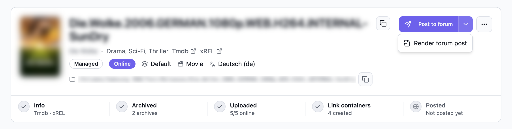
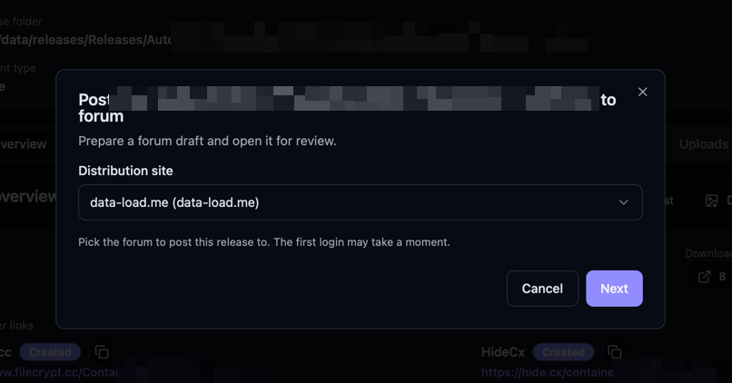
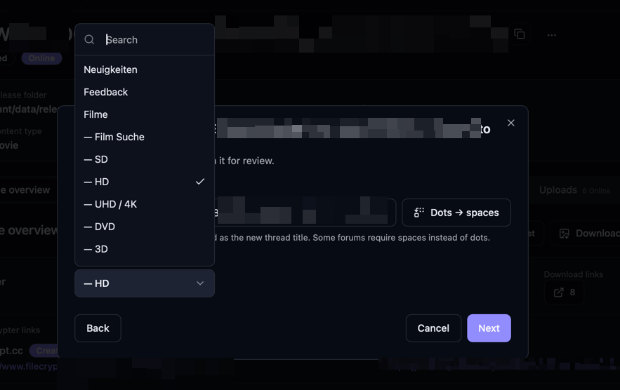
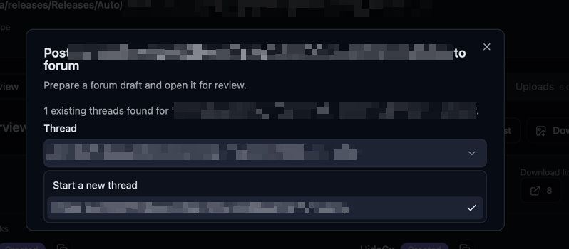
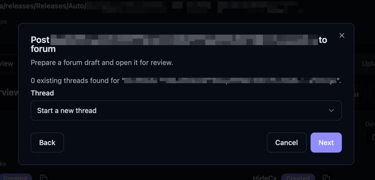
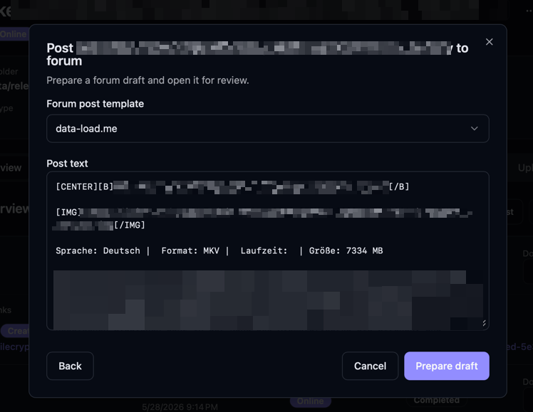
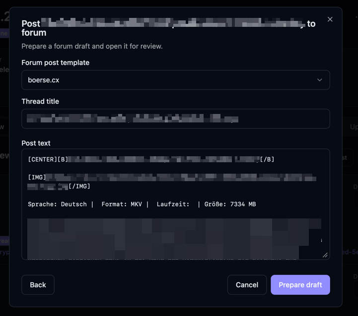
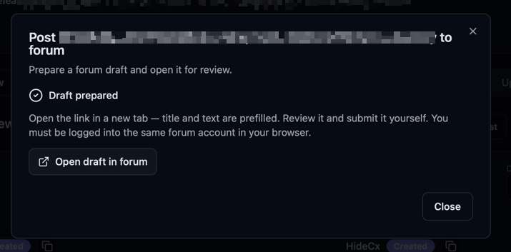
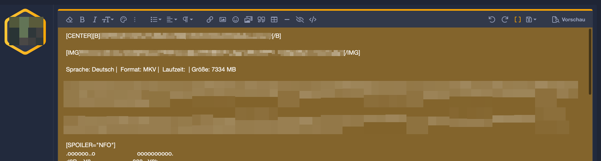
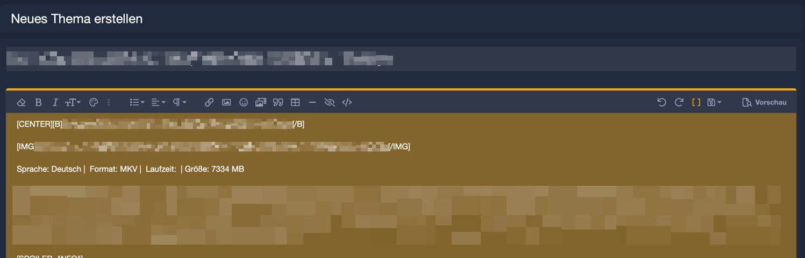

Bearcat can save a draft in the forum with the title and body filled in from a release.
Open the draft link in a browser where you are logged into the same forum account, check the
post, and submit it.

To let Bearcat submit posts for you, use [posting rules](/Bearcat/automatic-forum-posting/).

## What you need first

- A distribution site, which is a forum account you added to Bearcat.
- A forum post template, so Bearcat knows what the post should look like. See
  [Forum post templates](/Bearcat/forum-post-templates/).
- A release with finished uploads, so the template has links and data to fill in.

## Setting up a distribution site

Open **Distribution sites** in the sidebar and add one. Pick the forum, enter your username and
password, and save. Your password is stored encrypted. Mark the site active and use the test login
to check that the account works.

Bearcat has dedicated entries for boerse.cx and data-load.me. Use them for these forums.

For any other XenForo forum, pick **XenForo** and enter the forum address, username and password.
The address is the forum start page including the installation folder, for example
`https://example.org/community/`. Use the address the browser shows after redirects. Each XenForo
forum is a separate distribution site with its own account and posting rules.

The XenForo entry needs friendly URLs and the standard XenForo login, post and draft forms.
Routing through `index.php`, SSO, CAPTCHA and two-factor login are not supported. Custom themes,
required thread fields or add-ons can break individual steps. Test the login and prepare a draft
before enabling automatic posting. A forum that does not work with the XenForo entry needs a
dedicated implementation in Bearcat.

## Posting a release

Open a release and click **Post to forum** in the header. **Render forum post** is in the arrow
menu of the same button.

In the dialog:

1. Pick the distribution site you want to post to.
   
2. Search for and select a subforum. You can also edit the release name, which Bearcat uses
   to search for existing threads and name new ones. **Dots → spaces** replaces dots with spaces
   and adds spaces around the final hyphen before the release group.
   
3. Bearcat searches the subforum for a thread that matches the name. If it finds one, it defaults
   to posting a reply into that thread. If it finds none, it starts a new thread.

   <figure>

   

   <figcaption>Existing thread found</figcaption>
   </figure>

   <figure>

   

   <figcaption>No existing thread found</figcaption>
   </figure>

4. Pick a forum post template. Bearcat renders it with the release and shows the post body, which
   you can still edit. For a new thread you also set the title, and if the subforum uses prefixes
   (for example 1080p or x265) you can pick them here.

   <figure>

   

   <figcaption>Prepare a reply to an existing thread</figcaption>
   </figure>

   <figure>

   

   <figcaption>Prepare a new thread</figcaption>
   </figure>

5. Click **Prepare draft**. Bearcat saves the draft in the forum and shows an **Open draft in
   forum** link.

   

## Sending the post

1. Click **Open draft in forum** in a browser logged into the same forum account. Otherwise,
   the editor will not show the draft.
2. Review the title and body, use the forum's preview if needed, and submit the post.
3. Back in Bearcat, click **I have posted** to save the post URL under **Posted locations**.
   If Bearcat cannot find it yet, paste the URL yourself. The forum's search index can take a few seconds to update.

<figure>

<figcaption>New message draft in existing thread</figcaption>
</figure>

<figure>

<figcaption>New thread draft</figcaption>
</figure>

**I have posted** saves the URL but does not remove the release from the
[post queue](/Bearcat/post-queue/). Use **Mark as posted** there when you have finished posting.

## Letting Bearcat submit the post

[Posting rules](/Bearcat/automatic-forum-posting/) choose the subforum, prefix and template.
Run them with **Post** in the post queue or enable automatic posting in the background.

## Posted locations

**Posted locations** lists the URLs where a release or collection has been published,
such as forum threads or WordPress pages. Confirming a forum post adds its URL here.
You can also add or remove links by hand.

## How this fits with templates and the post queue

[Forum post templates](/Bearcat/forum-post-templates/) provide the post body for both copied posts
and forum drafts. The [post queue](/Bearcat/post-queue/) lists releases that still need posting.
