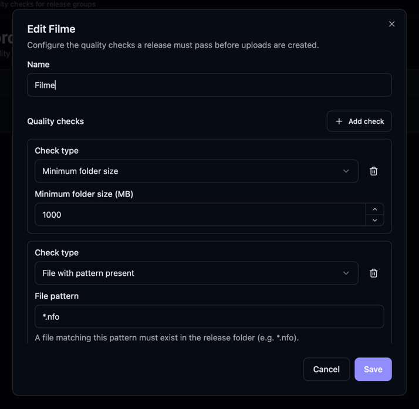
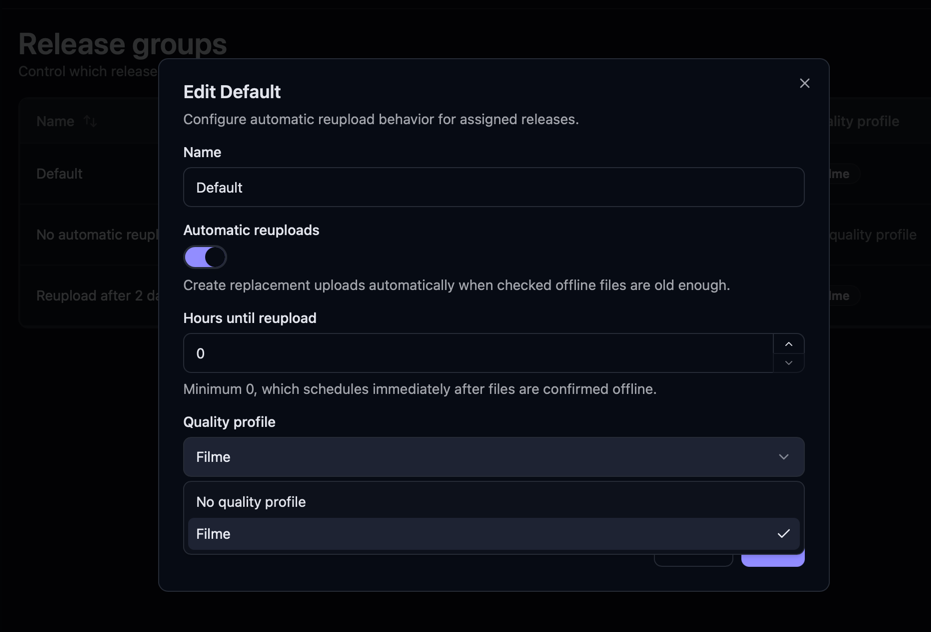
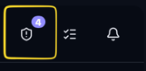
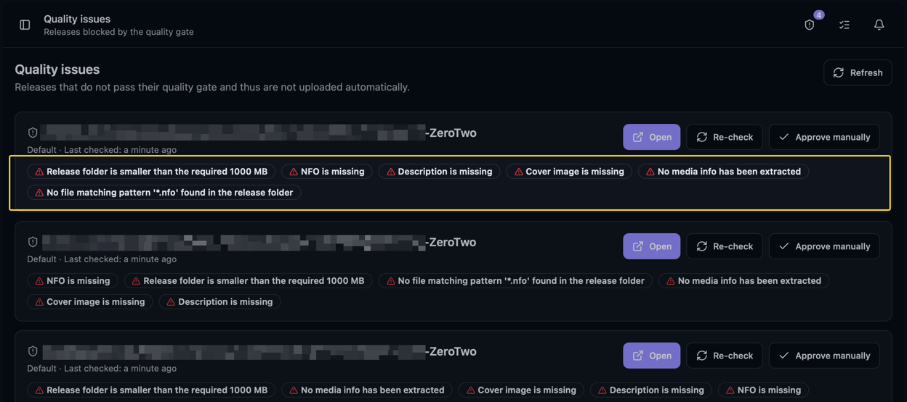

Quality gates prevent new uploads until a release passes your checks or you approve it manually.
Use them to catch missing NFOs, cover images, or incomplete release folders before uploading.

[Unmanaged releases](/Bearcat/release-types/) have no release folder, so only the
**Required release infos** check runs for them. Groups without a quality profile pass the gate.

## How it fits together

- A **quality profile** is a reusable set of checks (for example "NFO present" and "folder at least
  100 MB").
- A **release group** can use one quality profile. Each release in the group must pass its checks or
  receive manual approval before Bearcat creates uploads.

Several release groups can share the same profile, so you only define your rules once.

## Creating a quality profile

Open **Quality Profiles** in the **Configuration** group of the sidebar and click **New quality
profile**. Give it a name and add one or more checks. Each check has its own settings:

- **File with pattern present**: a file matching the pattern you enter (for example `*.nfo` or
  `*.sfv`) has to exist somewhere in the release folder. The pattern is matched against file names
  and is case-insensitive.
- **Minimum folder size**: the release folder has to be at least the number of megabytes you set.
  Bearcat measures the folder live every time it evaluates the gate, so this also catches folders
  that are still being copied.
- **Required release infos**: switch on the parts of the release info that must be filled in: the
  cover image, the description, and/or the NFO.
- **Media info present**: media info has to have been extracted for the release.

The checks that look at the release folder (file pattern, folder size, media info) are skipped for
unmanaged releases.

You can mix as many checks as you like in one profile. A release passes the gate only when **all**
checks pass.

## Assigning a profile to a release group

Open the release group (under **Configuration**, **Release Groups**) and pick a
quality profile in the **Quality profile** field. Leave it empty if the group does not need any
checks. The release groups list shows which profile each group uses.

## What the gate does

Before Bearcat creates an upload for a release, it checks the release against its profile. Only
releases that have **passed** or that you have **manually approved** get uploads. This applies to
the first upload and to [automatic reuploads](/Bearcat/upload-lifecycle/#7-automatic-reuploads):
a release that no longer passes will not be reuploaded automatically until it does.

Every release carries its current gate state:

- **Not evaluated**: the gate has not run yet.
- **Passed**: all checks succeeded.
- **Failed**: at least one check failed; the release is held back.
- **Manually approved**: you manually approved it; see below.

## When the gate is evaluated

You do not have to trigger the checks yourself. Bearcat evaluates a release:

- right before it would create an upload,
- periodically in the background through the **"Quality gate re-evaluation"** task (every 30 minutes
  by default; you can change the interval on the [Background Tasks](/Bearcat/advanced-configuration/#background-tasks)
  page), and
- on demand when you press **Recheck** on a release in the quality issues list.

The background task looks at every release that failed or was never evaluated, so older releases
get their state too.

If you change the checks of a profile or give a release group a different profile, the affected
releases go back to **Not evaluated** and are checked again on the next run.

Manually approved releases are never touched by any of this. An approval sticks until you change it.

## The quality issues list

Releases that fail their gate show up behind the shield icon in the top header, next to the
notification bell. The icon shows a badge with the number of releases that currently fail. When
nothing fails, the badge disappears.

The list shows each failing release together with the checks it did not pass and when it was last
evaluated. For every entry you have three actions:

- **Open** takes you to the release so you can fix what is missing (add the NFO, fill in the cover,
  and so on). The next evaluation picks up the change, or you can recheck right away.
- **Recheck** evaluates the release again immediately, which is handy after you fixed something.
- **Approve manually** marks the release as **manually approved**. Bearcat then creates its uploads
  even though a check failed, and stops re-evaluating it.

Once a release passes (or you approve it), it leaves the list and its uploads are created on the
next upload state check.
