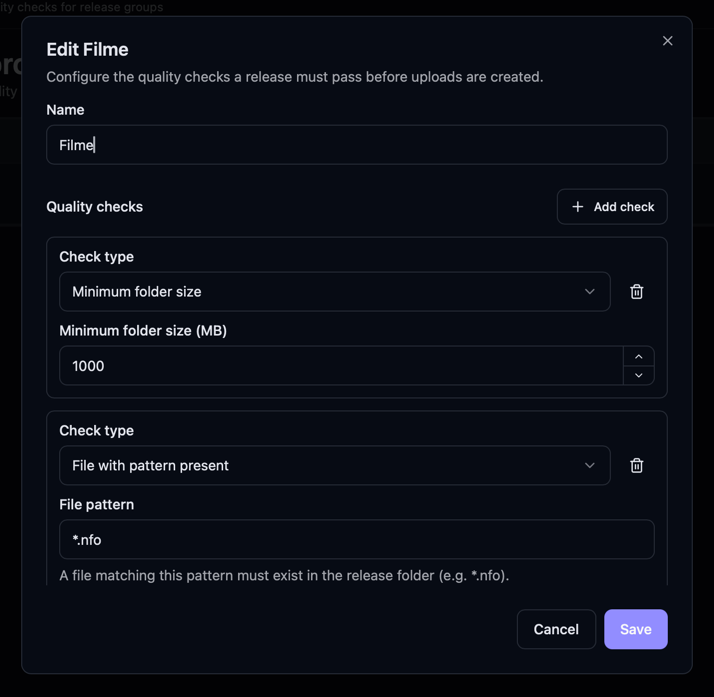
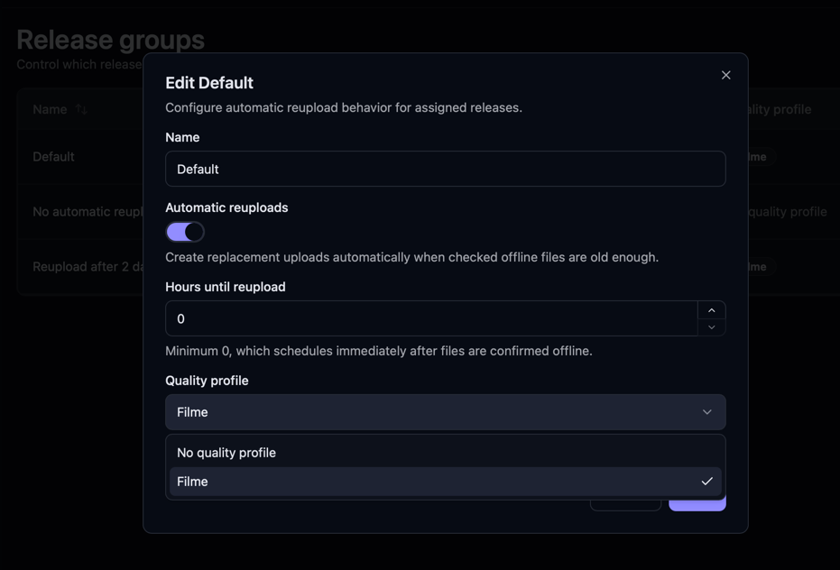
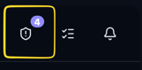
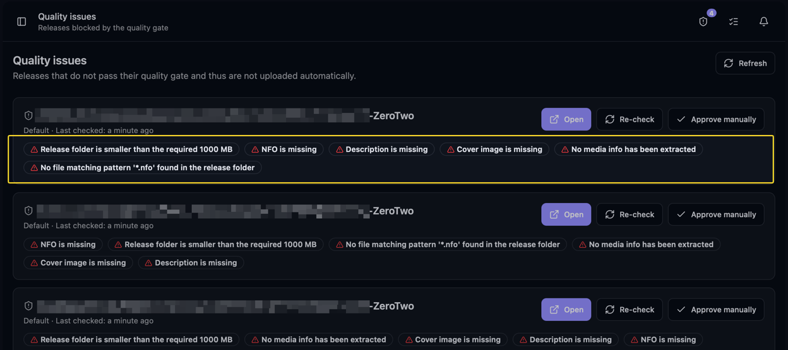

Quality gates prevent new uploads until a release passes your checks or you approve it manually.
Use them to catch missing NFOs, cover images, or incomplete release folders before uploading.

[Unmanaged releases](/Bearcat/release-types/) have no release folder, so only the
**Required release infos** check runs for them. Groups without a quality profile pass the gate.

## Quality profiles and release groups

- A **quality profile** defines checks, such as "NFO present" and "folder at least 100 MB".
- Assign a profile to a **release group** to apply its checks to all releases in that group.

You can assign the same profile to several release groups.

## Creating a quality profile

Open **Quality Profiles** in the **Configuration** group of the sidebar and click **New quality
profile**. Give it a name and add one or more checks. Each check has its own settings:

- **File with pattern present**: a file matching the pattern you enter (for example `*.nfo` or
  `*.sfv`) has to exist somewhere in the release folder. The pattern is matched against file names
  and is case-insensitive.
- **Minimum folder size**: the release folder has to be at least the number of megabytes you set.
  Bearcat measures the folder on each check, including when files are still being copied.
- **Required release infos**: switch on the parts of the release info that must be filled in: the
  cover image, the description, and/or the NFO.
- **Media info present**: media info has to have been extracted for the release.

The checks that look at the release folder (file pattern, folder size, media info) are skipped for
unmanaged releases.

A release passes only when **all** checks in its profile pass.

## Assigning a profile to a release group

Open the release group (under **Configuration**, **Release Groups**) and pick a
quality profile in the **Quality profile** field. Leave it empty if the group does not need any
checks. The release groups list shows which profile each group uses.

## What the gate does

The checks apply to the first upload and to [automatic reuploads](/Bearcat/upload-lifecycle/#7-automatic-reuploads).
If a check fails later, automatic reuploads pause until the release passes again or you approve it manually.

Each release has a check status:

- **Not evaluated**: the gate has not run yet.
- **Passed**: all checks succeeded.
- **Failed**: at least one check failed; new uploads are blocked.
- **Manually approved**: uploads are allowed without further checks.

## When the gate is evaluated

Bearcat checks releases:

- before creating an upload,
- periodically in the background through the **"Quality gate re-evaluation"** task (every 30 minutes
  by default; you can change the interval on the [Background Tasks](/Bearcat/advanced-configuration/#background-tasks)
  page), and
- on demand when you press **Recheck** on a release in the quality issues list.

The background task also checks older releases with failed or pending checks.

If you change the checks of a profile or give a release group a different profile, the affected
releases go back to **Not evaluated** and are checked again on the next run.

Bearcat does not re-evaluate manually approved releases. They remain approved until you change their approval.

## The quality issues list

Click the shield icon next to the notification bell to see releases with failed checks.
Its badge shows how many releases are affected and disappears when none remain.

The list shows affected releases, their failed checks, and the last check time. Each entry has three actions:

- **Open** takes you to the release. Add missing details, then click **Recheck** or wait for the next background check.
- **Recheck** evaluates the release again immediately.
- **Approve manually** marks the release as **manually approved**. This allows uploads despite failed checks
  and stops further checks.

Once a release passes (or you approve it), it leaves the list and its uploads are created on the
next upload state check.
