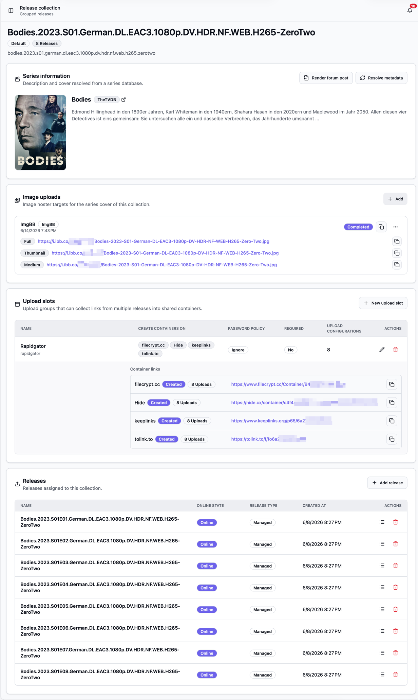

A release collection is a group of releases that belong together, for example all
episodes of a TV show season. Instead of treating every episode as its own island,
Bearcat keeps them side by side so you can manage their uploads and links in one place.

## Why you would use one

Imagine you have a full season with ten episodes. Without collections you upload each
episode on its own, and you end up with ten separate sets of links scattered across ten
releases. Putting a forum post together from that is tedious, and keeping the password and
settings the same on every episode is easy to get wrong.

A collection fixes this. You group the episodes once, decide where they should be uploaded,
and Bearcat handles the rest for the whole season at the same time. The result is one tidy
set of links for the season instead of ten loose ones.

## How a collection is created

Collections are usually created for you automatically. On a release template you can turn on
**Collection detection**. When it is on, Bearcat looks at the name of every new release made
from that template and decides whether it belongs to a collection.

There are two ways to detect:

- **Series episode pattern** reads names like `Show.S01E01` and groups everything from the
  same show and season together.
- **Custom regex** lets you describe your own pattern when your names do not follow the usual
  series layout.

When a matching release shows up, Bearcat either creates a new collection or adds the release
to the one that already exists. You can find all of your collections on the **Release
collections** page and open any of them to see the details.

If a release was not picked up automatically, you can open a collection and use **Add release**
to add it by hand. You can only add releases from the same release group, which keeps unrelated
releases out of the wrong collection.

## What you find inside a collection

A collection page is built from a few parts: the series metadata, the image uploads for the
series cover, the upload slots, and the releases that belong to it.

### Series metadata

Bearcat looks up the series behind a collection through the active metadata sources, using the
same resolver as a single release. TMDB and TheTVDB can provide series metadata. When Bearcat finds
a match, the collection shows the series title, a short description, and the cover image. Use
**Resolve metadata** to look again, for example after changing the name or primary language.

The primary language controls translated titles and descriptions. If it is empty, the provider's
default language is used. Bearcat can use an IMDb ID found on one of the collection's releases and
falls back to a title search when no ID is available.

The resolved values are available in forum post templates, and the cover image can be uploaded to
configured image hosters. See [Release Information and Metadata](/Bearcat/release-information-and-metadata/)
for the complete lookup flow.

### Image uploads

The cover image of a series often needs to live on an image hoster before you can use it in a
forum post. The **Image uploads** part of the collection takes care of that: it uploads the
series cover to the image hosters you choose and keeps the resulting links ready for you.

There are two ways to set this up:

- **On a release template.** When collection detection is on, a template gains a **Collection
  image upload configurations** section. Every hoster you add there is applied to the collection
  that the template's releases land in, so new collections come with their cover uploads already
  configured. The section only appears while collection detection is on, because without a
  collection there would be nothing to upload.
- **Directly on the collection.** Open a collection and use **Add** in the image uploads part to
  point the cover at another hoster by hand. This is handy for collections you put together
  yourself.

If you leave the name empty, Bearcat names the configuration after the hoster. When you edit an
existing entry you can change the name, but not the hoster, since repointing an upload to a
different hoster rarely makes sense.

Once the cover has been uploaded, each entry shows its state and the image links, grouped by
size. You can copy a single link or all of them at once. These same links are available in a
collection forum post template through `imagelinks`, just like they are for a single release.
See [Forum post templates](/Bearcat/forum-post-templates/) for the details.

### Releases

This is simply the list of releases in the collection. From here you can view the upload links
of a release or remove a release from the collection if it does not belong.

### Upload slots

An upload slot is a shared upload group for the whole collection. You create a slot once, and
Bearcat sets up one upload for every release in the collection using the same settings.

When you create a slot you choose:

- A name, so you can tell your slots apart, for example "Rapidgator passworded".
- The hoster the files should be uploaded to.
- The archive configuration, meaning which archives of each release should go up.
- Whether downloads are for premium users only, if the hoster supports that.
- A password policy, so you can make sure every release in the slot uses the password you expect.

You can have several slots in one collection, for example one slot per hoster, and each slot
keeps its own settings across all releases.

## Container links

A slot can also create container links through your link crypters. A container link gathers the
download links from every release in the slot into a single link, so one link covers the whole
season instead of one link per episode.

The password and the other crypter options you set apply to every release in the slot, so the
whole collection stays consistent. You manage which crypters a slot uses with **Edit container
link crypters**, and any change there is applied to all uploads in that slot.
