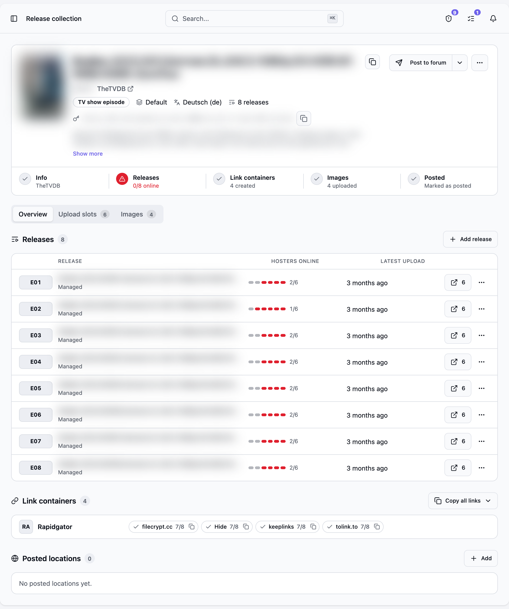
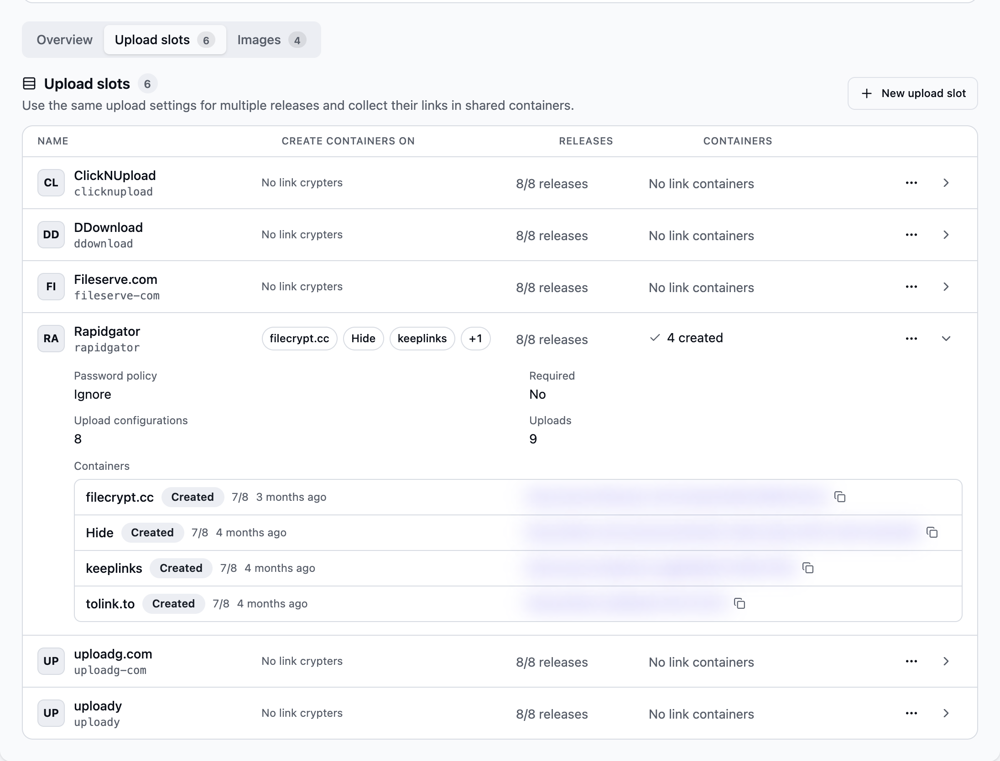

A release collection groups related releases, such as episodes of a TV season.

## Why you would use one

Set hosters, archive settings, and password policies for the whole collection, and gather its
download links in one link crypter container.

## How a collection is created

Enable **Collection detection** on a release template to create collections automatically.
Bearcat checks the name of each new release created from that template for a matching collection.

Choose how Bearcat groups releases:

- **Series episode pattern** reads names like `Show.S01E01` and groups everything from the
  same show and season together.
- **Custom regex** lets you describe your own pattern when your names do not follow the usual
  series layout.

For a matching release, Bearcat creates a collection or adds it to an existing one.
Find them under **Release collections**.

To add a release manually, open a collection and select **Add release**. Only releases from the
same release group can be added.

## Upload slots

An upload slot applies the same settings to every release in the collection. Choose:

- A name, such as "Rapidgator passworded".
- The hoster to upload to.
- The archive configuration to use for each release.
- Whether to restrict downloads to premium users, if supported by the hoster.
- A password policy for all releases in the slot.

A collection can have several slots, for example one per hoster.

## Container links

Use **Edit container link crypters** to gather a slot's links in one container, for example for a
whole season. The password and other crypter settings apply to all uploads in the slot.

## What you find inside a collection

### Header

The header shows the cover, the series title from the metadata source, the collection key and the
series description. **Show more** expands a long description.

**Post to forum** opens the [forum posting dialog](/Bearcat/posting-to-forums/). It is highlighted
while at least one release has an online hoster and the collection is not posted yet. Without an
active forum distribution site, only **Render forum post** is shown.

The `...` menu contains **Edit collection settings** for the content type and primary language,
**Edit metadata** and **Resolve metadata**.

The status display shows progress for metadata, uploads, link containers, images, and posting.
Red marks a problem or an unfinished step. Click a step to open its tab.

### Series metadata

Bearcat uses active metadata sources such as TMDB and TheTVDB to find the series title,
description, and cover. Select **Resolve metadata** in the `...` menu to search again after
changing the name or language.

The primary language sets the language for titles and descriptions. Without a selection, the
provider's default applies. Bearcat searches using an IMDb ID from an included release or the title.

Use the metadata in forum post templates and upload the cover to your image hosters.
See [Release Information and Metadata](/Bearcat/release-information-and-metadata/) for lookup details.

### Overview

**Releases** shows each release with its episode number, such as `E01`, or `S01E01` for a collection
spanning several seasons. The bar shows how many hosters are online. Use a row's `...` menu to open
the release or remove it from the collection.

**Link containers** lists each slot's containers and the number of uploads they include.
**Not created yet** means the crypter has no container. You can delete failed containers here.
**Copy all links** copies one crypter's container URLs across all slots.

See [Posted locations](/Bearcat/posting-to-forums/#posted-locations) for the list at the bottom.

### Upload slots

Each row shows the link crypters of the slot, how many releases have an upload configuration for
it, and the state of its containers. Click a row to see the password policy, the upload counts and
every container with its link. Slots with a failed container are expanded when the page opens.

**Edit container link crypters** and **Delete upload slot** are in the `...` menu of a row.

### Images

Upload the series cover to your image hosters for use in forum posts. Configure this in either place:

- **On a release template:** enable collection detection, then add hosters under **Collection
  image upload configurations**. These settings apply to collections containing releases created from this template.
- **On a collection:** select **Add** on the **Images** tab and choose a hoster.

If you leave the name empty, Bearcat names the configuration after the hoster. You can rename
an existing entry. To use a different hoster, add a new image upload configuration.

Each entry shows its upload state. After uploading, it shows a preview and image links in different
sizes. Copy links individually or together, or use `imagelinks` in forum post templates. See [Forum post templates](/Bearcat/forum-post-templates/) for details.
