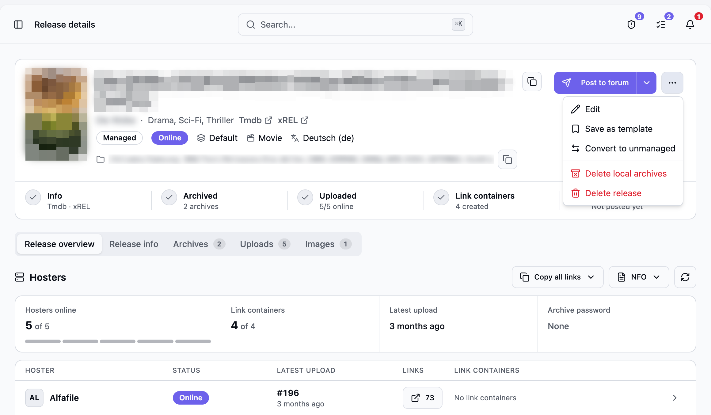
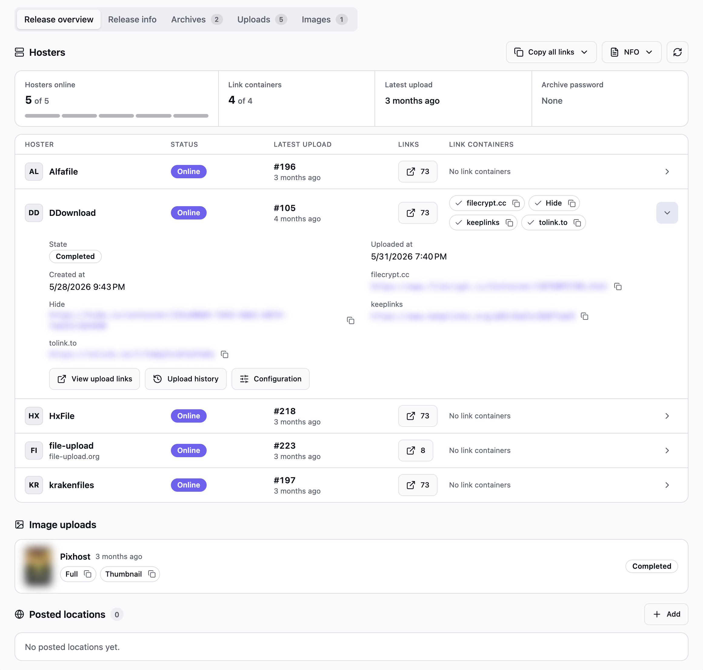
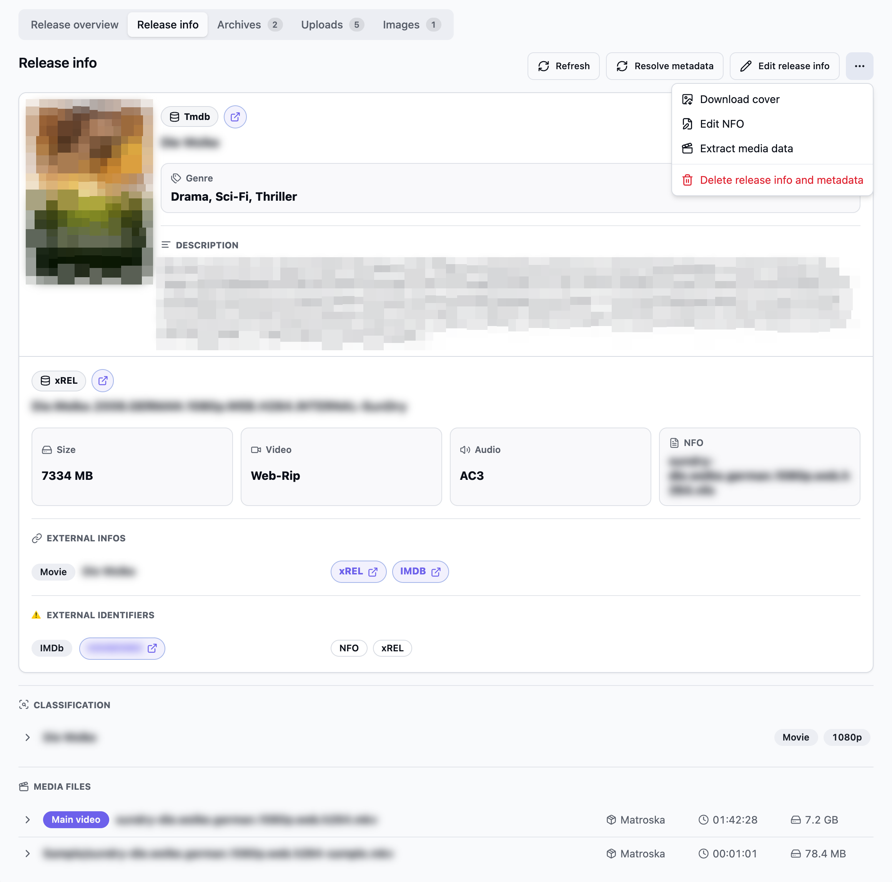
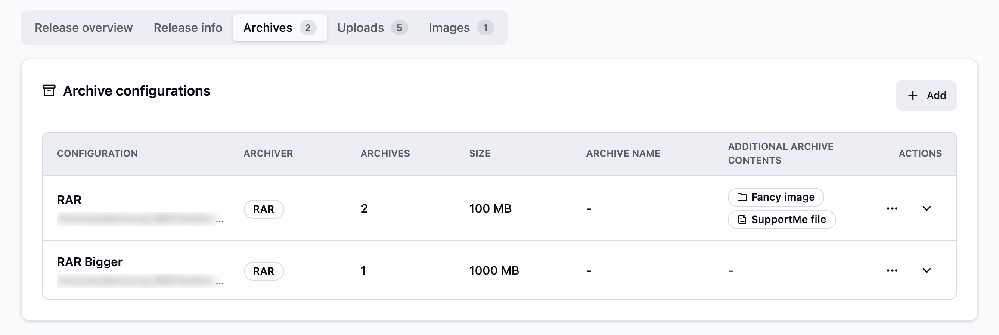
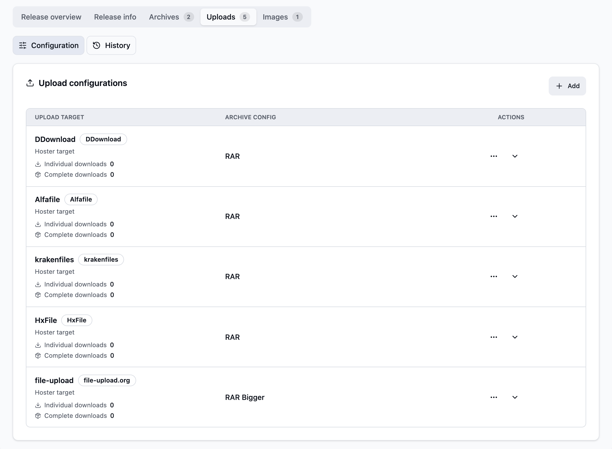
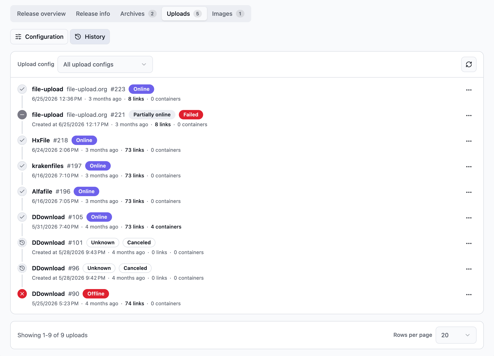
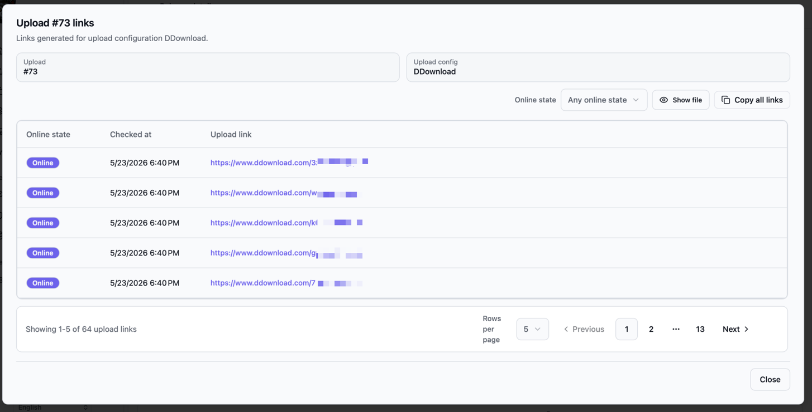
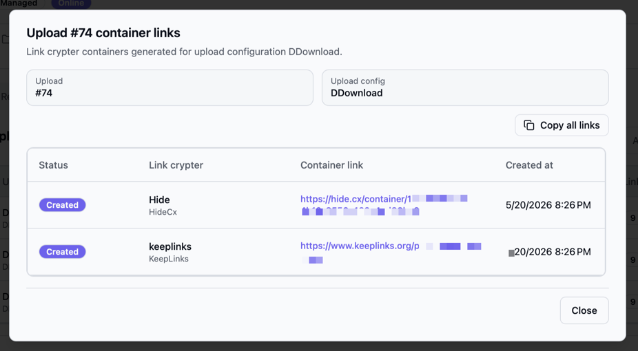
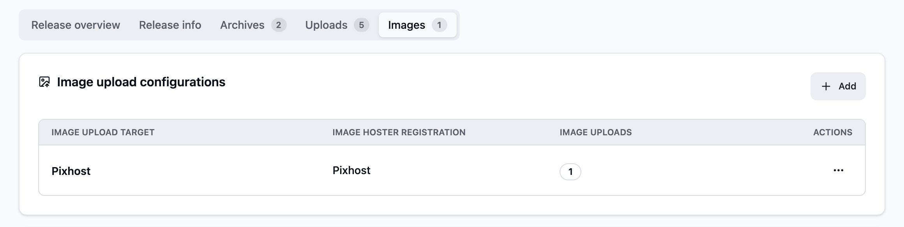
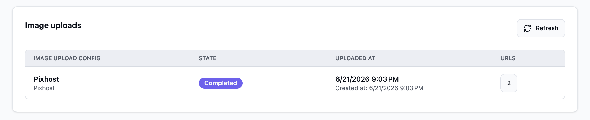

Open **Releases** and click a release name. For a walkthrough, see [Your first upload](/Bearcat/post-installation/).

## Header

The header shows:

- The cover, if the release has one.
- The release name with a copy button.
- The metadata title and genre, with links to the metadata and release databases.
- The meta row: release type, online state, release group, content type and primary language.
- The release folder. Unmanaged releases show their archive folders instead.
- The remote download origin, if the release came from a [remote download](/Bearcat/remote-downloads/).

**Post to forum** opens the [forum posting dialog](/Bearcat/posting-to-forums/). Its arrow menu
contains [**Render forum post**](/Bearcat/forum-post-templates/#render-a-post). The button is
highlighted while at least one hoster is online and the release has not been posted yet. Without an
active forum [distribution site](/Bearcat/posting-to-forums/), only **Render forum post** is shown.

The `...` menu contains **Edit**, **Save as template**, **Convert to unmanaged** or **Convert to
managed** (see [Release types](/Bearcat/release-types/#converting-between-types)), **Delete local
archives** and **Delete release**.

When you scroll down, a compact header with the name, online state and **Post to forum** stays at
the top.

## Progress steps

The row below the header shows five steps. Click a step to open the tab with its details.

| Step | Opens | States |
|------|-------|--------|
| Info | Release info | Done when metadata or scene release information is resolved. Shows the databases used. |
| Archived | Archives | In progress while archives are created or restored. Needs attention when the latest archive failed or has missing files. Done shows the number of finished archives. |
| Uploaded | Uploads | Pending without upload configurations. In progress while an upload waits or runs. Needs attention when not every upload configuration is online. Shows online and total upload configurations. |
| Link containers | Overview | Not applicable when no link containers exist. Needs attention when a container could not be created. Done shows the number of created containers. |
| Posted | Overview | Done when the release has a posted location or was marked as posted in the [post queue](/Bearcat/post-queue/). |

## Overview tab

**Hosters** starts with a summary: hosters online, created link containers, latest upload and the
archive password. If all hosters use the same password, it is shown with a copy button.

Below the summary, each upload configuration has one row with its online state, latest upload,
link count and link containers. The link count opens the links dialog. Expand a row to see upload
dates, container URLs and the archive password, or to jump to its upload history or configuration.

**Copy all links** copies the container URLs of one link crypter for all hosters. The **NFO** menu
saves the NFO file or copies it to the clipboard.

**Image uploads** lists the image links of each image upload configuration with copy buttons.

**Posted locations** lists the URLs where the release was published. See
[Posted locations](/Bearcat/posting-to-forums/#posted-locations).

## Release info tab

Separates scene release information from movie or TV metadata. It also shows the NFO, external IDs
with their sources, and technical media data. You can resolve, refresh, or edit these values
manually. The `...` menu contains **Download cover**, **Edit NFO**, **Extract media data** and
**Delete release info and metadata**.

See [Release Information and Metadata](/Bearcat/release-information-and-metadata/) for details.

## Archives tab

Sets the archiver, output folder, part size, password, and packing options for each set of archives.
See [Creating the archive](/Bearcat/upload-lifecycle/#3-creating-the-archive) for the packing options.
Add at least one configuration for a managed release.

## Uploads tab

The tab has two views.

**Configuration** connects an archive configuration to a hoster account. You can also add link
crypters to create containers for the upload links.

**History** lists every upload run, newest first. Each entry shows the upload configuration, the
hoster account if its name differs, the upload ID, the online state and the upload time. The
upload state is only shown when the upload is not completed. The link and container counts open
the links dialogs. The marker on the left shows the state at a glance:

- Check: online.
- Minus: partially online.
- Cross: offline.
- Spinner: waiting or uploading.
- History icon: online state unknown, for example after a failed or canceled upload.

Filter the list by upload configuration. The `...` menu of an entry checks the online state, sets
the upload offline, shows its links and container links, creates a manual reupload, cancels or
resumes the upload, or deletes it.

## Images tab

**Image upload configurations** selects the image hoster accounts that receive the release cover.
These are separate from file upload configurations.

The release needs a cover URL before Bearcat can upload an image. It normally comes from a metadata
source such as TMDB, with the xREL cover as a fallback. No cover means no image upload or image links.

**Image uploads** lists image upload runs and the URLs returned by the image hoster.

Depending on the image hoster, Bearcat may receive different image sizes, for example full size,
medium size or thumbnail. You can also copy these links from the **Overview** tab.
