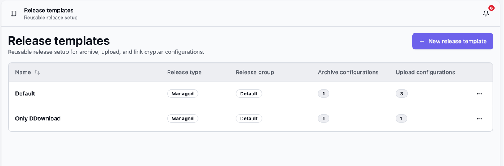
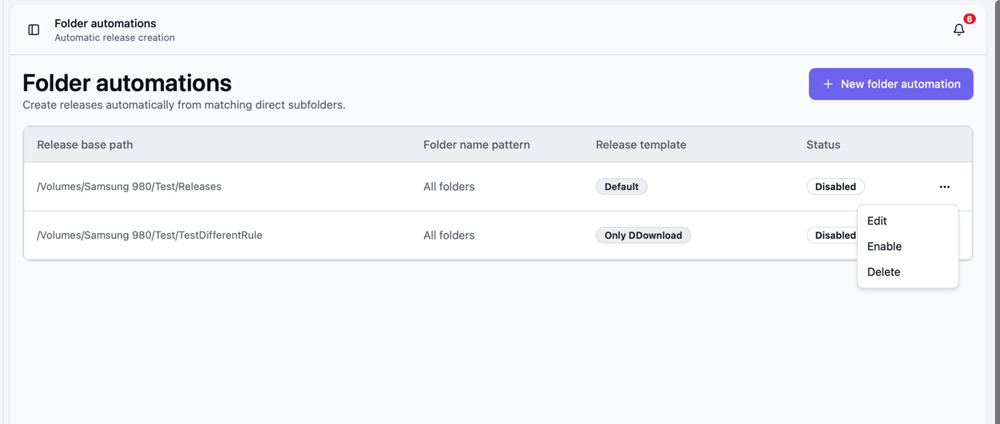

Once your [first upload](/Bearcat/post-installation/) works, save its settings as a template. You can use that template yourself or let Bearcat apply it to new folders automatically.

## Setting up release templates

A release template saves the release group, archive configurations, upload configurations, image
upload configurations, and link crypter settings for reuse.

Create one in either of these ways:

- Open **Release templates**, click **New release template**, and add the configurations.
- Open a configured release and choose **Save as template** from its action menu.



On the **Releases** page, choose **New from template** to use it. The new release normally takes its
name from the folder. Archive configurations set to use the release name also use that new name.

Enable **Collection detection** in the template to group related releases, such as episodes of a TV
season. See [Release Collections](/Bearcat/release-collections/).

## Setting up folder automations

Folder automations apply a release template to new folders automatically.

1. Create a release template, then open **Release folder automations** and click **New release folder automation**.
2. Set **Release base path** to the folder Bearcat should scan. Only direct subfolders are checked.
3. Optionally set a **Folder name pattern**, such as `*1080p*` or `*.GERMAN.*`. Matching ignores case
   and supports wildcards, but not regular expressions. Leave it empty to include all direct subfolders.
4. Select the template and optionally a primary language for translated metadata. An empty language
   uses the metadata provider's default.
5. Save with **Enabled** checked. You can disable or re-enable the automation from its action menu.



For example, with this base folder:

```text
/data/releases/incoming/
  Movie.One.2026.1080p/
  Movie.Two.2026.2160p/
  Some.Other.Folder/
```

The pattern `*1080p*` selects only `Movie.One.2026.1080p`. An empty pattern includes all three folders.

The background task checks about every two minutes. It skips folders that already have a release
and waits for the configured [folder stability and minimum size](/Bearcat/advanced-configuration/#folder-automation).
For each eligible folder, it creates a release from the template and looks up its metadata.
Bearcat then creates archives and uploads them using the template's settings.

### Extract archives before release creation

For managed templates, turn on **Extract archives before release creation** in the folder automation
if the folders contain RAR or 7z archives and you want Bearcat to pack the release itself. The option
is off by default and does not apply to unmanaged templates.

Before the release is created, Bearcat checks the folder against its `.sfv` files, if there are any,
and extracts every RAR and 7z archive in the folder and its subfolders. After a successful extraction,
it deletes the archive volumes and `.sfv` files that only list those volumes. The extraction rules are
the same as for [remote downloads](/Bearcat/remote-downloads/#extract-archives-before-release-creation).

Running checks and extractions appear on the **Activity** page under **Folder automations**.

If the SFV check or extraction fails, the files stay in the folder, no release is created, and Bearcat
sends a notification. The folder is listed under **Failed extractions** on the **Folder automations**
page with the error message. Fix the cause, then click **Retry**; the folder is processed again on the
next scan. Bearcat also retries automatically when the files in the folder change.

### Download releases from FTP or FTPS

Use **Remote sources** and **Remote automations** to download new folders from a server and create
releases from a template. See [FTP / FTPS Downloads](/Bearcat/remote-downloads/) for setup and examples.
