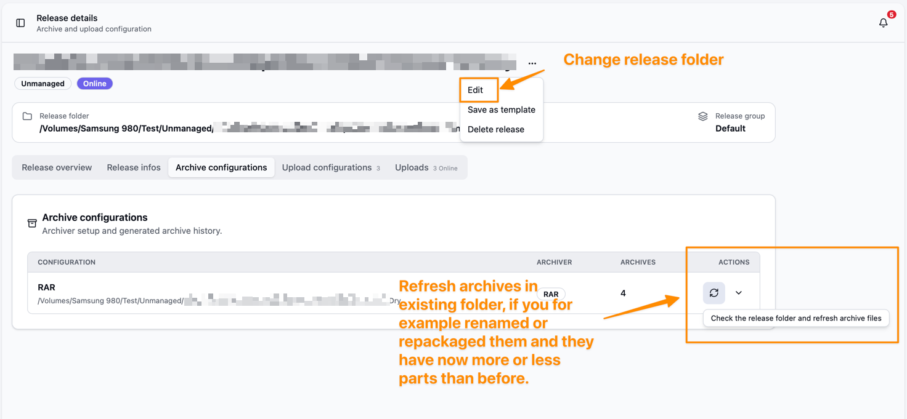

Bearcat supports two release types: managed releases and unmanaged releases.
Both use the same upload, online check, notification, and reupload workflow.
They differ in who creates the archive files.

| Model | Archive files are created by | Best for | What Bearcat does |
| --- | --- | --- | --- |
| Managed | Bearcat | Releases where you have raw files and want Bearcat to pack them | Creates archives, uploads them, checks online state, and can create replacement archives for reuploads. |
| Unmanaged | You or another tool | Releases where archive files already exist | Uses existing archive files, uploads them, checks online state, and waits for refreshed archives when files are missing or replaced. |

## Managed Releases

Managed releases are the default workflow.
The release folder contains the raw files, and Bearcat creates archive files based on the archive configuration.
You choose an archiver, archive folder, archive size, optional password, and the hosters where the release should be uploaded.

When an upload is needed, Bearcat creates or reuses a matching archive and uploads the archive files.
If local archive files go missing, Bearcat marks the old archive as missing and creates a replacement archive from the raw release files.

Managed releases are a good fit if Bearcat should handle automatic reuploads for you.

## Unmanaged Releases

Unmanaged releases are for archives that already exist before Bearcat sees them.
Unlike managed releases, an unmanaged release has **no release folder** for raw files.
Instead, each archive configuration points directly at the folder that holds its archive files.
Bearcat creates an archive configuration and assumes the archiver based on the file endings.

If an unmanaged upload finds that local archive files are missing, Bearcat marks the archive as missing, unlinks it from the upload, and puts the upload back into `WaitingForArchive`.
Bearcat does not repack unmanaged releases because it does not have the raw files.

After you restore or replace the archive files, either change the archive folder to the place where the new archives are located or use the unmanaged archive refresh action so Bearcat can use them for pending reuploads.

Because unmanaged releases have no raw files or release folder to inspect, [quality gates](/Bearcat/quality-gates/) do not apply to them.
They are skipped entirely and are never held back by a quality profile.

## Converting between types

You can convert a release in either direction from the actions menu on the release detail page.

- **Convert to unmanaged** is available for a managed release once every archive configuration has a created archive.
  Bearcat switches the release to unmanaged and forgets the raw release folder, but keeps the existing archives and uploads.
  It does not delete the raw files, so you can remove them yourself afterwards to save disk space.
- **Convert to managed** is available for an unmanaged release.
  You assign a release folder that holds the raw files, and Bearcat switches the release to managed while keeping the existing archive configurations and uploads.
  From then on Bearcat again can repack the release for reuploads.