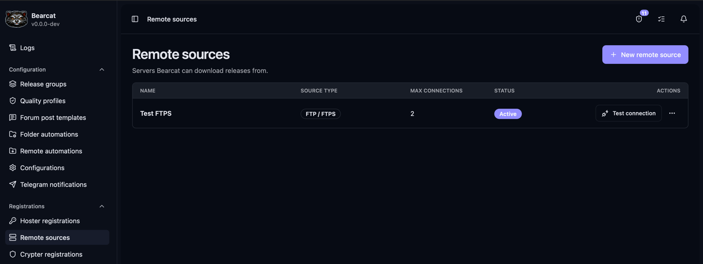
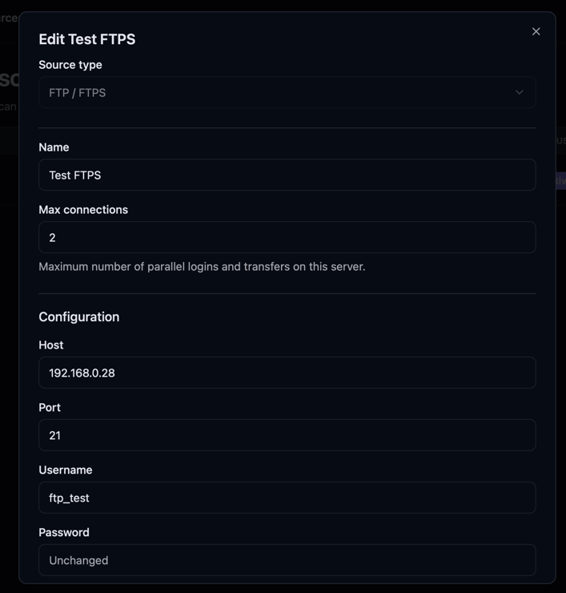
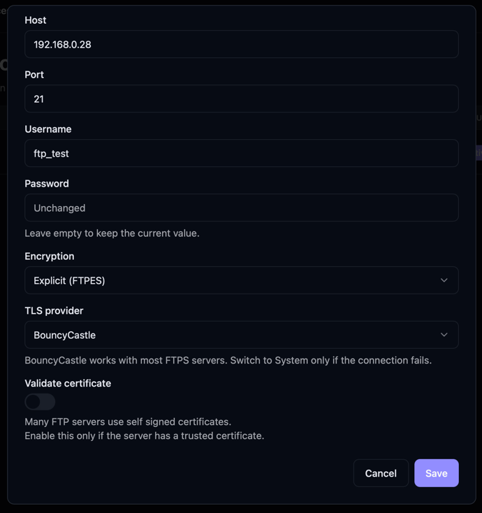
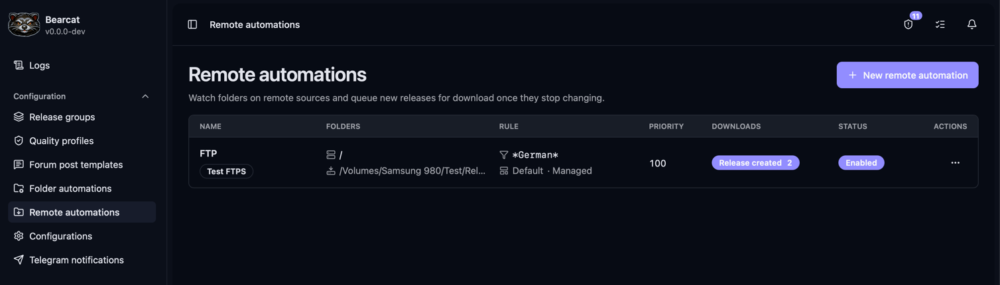
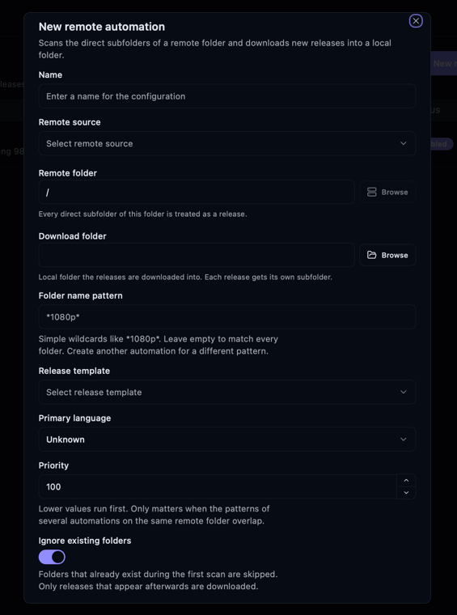
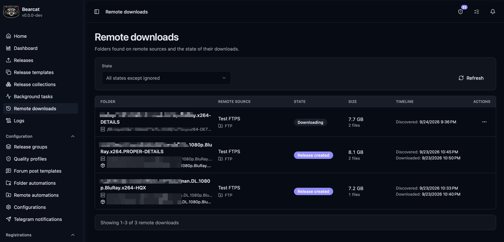
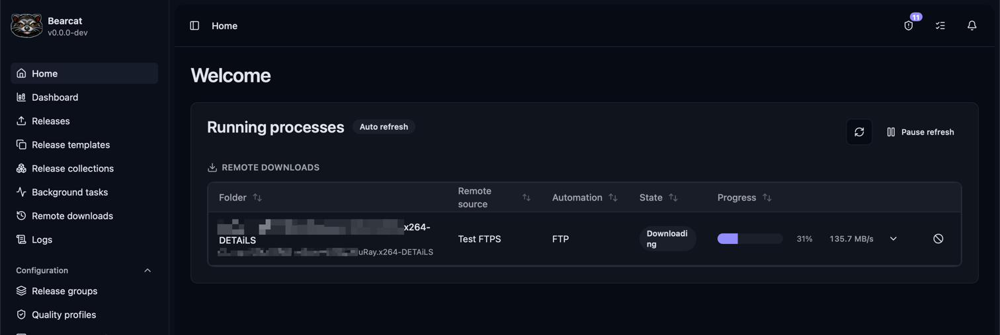

Bearcat can watch an FTP or FTPS server for new release folders, download them, and create releases
from a template. The template supplies the archive and upload settings, so uploads can follow automatically.

## Add a server



1. Open **Remote sources** and click **New remote source**.
2. Choose **FTP / FTPS** as the source type and give the connection a name.
3. Enter the **Host**, **Port**, **Username**, and **Password**.
4. Set **Encryption** to match the server: **Explicit (FTPES)**, **Implicit (FTPS)**, or **None (plain FTP)**.
   The defaults are explicit encryption and port `21`.
5. Set **Max connections** to the number of connections your account allows. The default is `2`.
6. Save, then choose **Test connection** from the server's action menu.




Leave **TLS provider** at **BouncyCastle** to start with. If the connection fails, check the server
details and try **System**. **Validate certificate** is off by default. Enable it to check that the
server has a trusted certificate.

## Watch a remote folder

First, [create a release template](/Bearcat/post-installation/#setting-up-release-templates).
Use a **managed** template to let Bearcat pack the downloaded files, or an **unmanaged** template
if the server already provides the archives you want to upload.



1. Open **Remote automations** and click **New remote automation**.
2. Give it a name and select your **Remote source**.
3. Set **Remote folder** to the folder containing the releases. Use **Browse** to select it on the server.
4. Choose a local **Download folder**. Bearcat creates a subfolder for each release there.
5. Optionally enter a **Folder name pattern**, such as `*1080p*`. Leave it empty to include all folders.
   Matching ignores case and uses wildcards, not regular expressions.
6. Select the **Release template** and, optionally, a **Primary language** for metadata.
7. Decide if you want to **Ignore existing folders**, then save. The automation is enabled by default.



**Ignore existing folders** is on by default. It skips folders that are there during the first scan and
only downloads folders that appear later. Turn it off **before saving** if you also want the existing releases.
Folders already marked as ignored stay ignored when you change this setting.

The download folder must be writable by Bearcat. In Docker, choose a path inside a mounted volume
so the downloads survive container replacement.

### Example

With **Remote folder** set to `/movies`, **Folder name pattern** set to `*1080p*`, and
**Download folder** set to `/data/releases/incoming`:

```text
On the server:
  /movies/Movie.One.2026.1080p/
  /movies/Movie.Two.2026.2160p/

Downloaded locally:
  /data/releases/incoming/Movie.One.2026.1080p/
```

Only direct subfolders of `/movies` are treated as releases. Each matching folder is downloaded
with all its files and nested subfolders. You do not need a separate local folder automation.

### Overlapping automations

Create another automation to use a different pattern, template, or download folder.
If several automations match the same folder on the same source, the lowest **Priority** wins.
For example, `10` wins over the default `100`. Each remote folder is downloaded only once per source.
Changing priorities does not reassign folders Bearcat has already found.

## Follow the download

Bearcat scans about every two minutes. By default, a folder must be at least `1` MB and its file
count and total size must stay unchanged for five minutes before it is queued.
You can adjust these checks under [Remote downloads settings](/Bearcat/advanced-configuration/#remote-downloads).

Open **Remote downloads** to see folders, status, and errors. The usual sequence is:

| Status | Meaning |
| --- | --- |
| Observing | Waiting for the folder to stop changing and reach the minimum size. |
| Queued | Ready to download. |
| Downloading | Files are being saved locally. |
| Downloaded | Files are ready. Release creation is next. |
| Release created | Open the linked release to follow its archives and uploads. |



Running downloads also appear on the start page under **Running transfers**, with progress, speed,
and file details. The release detail page records which remote source it came from.



### Cancel, retry, or skip a folder

Use the action menu in **Remote downloads**:

- **Cancel** stops an observed, queued, or running download. Files from a running download are deleted.
- **Restart download** queues a failed or canceled download again. It starts from scratch and removes
  files left by the previous attempt.
- **Retry release creation** is available when the download finished but creating the release failed.
  Fix the reported cause, then use this action to keep the downloaded files and try creating the release again.
- **Ignore** skips a folder that has not started downloading, or a failed or canceled download.
  Ignored folders are hidden by the default status filter and are not queued again.

If the local release subfolder already contains files before a download starts, Bearcat fails the
download and leaves those files untouched. Move them elsewhere before restarting the download.

Disabling an automation stops it from scanning. Already queued downloads stay queued.
To stop one of those, cancel it on **Remote downloads**.

## Delete raw files after uploading

For managed templates, **Keep raw files** is on by default. Turn it off in the automation if you
want Bearcat to remove the downloaded release folder after uploading.

Bearcat waits until:

- Every upload configuration has a completed upload.
- No uploads are waiting or running, and no archives are being created.
- Every archive configuration has a created archive or an online [mirror](/Bearcat/mirror-downloads/).

It then converts the release to [unmanaged](/Bearcat/release-types/#unmanaged-releases) and deletes
the downloaded folder. Future reuploads use the existing archives or mirrors.

Store archives outside the downloaded release folder if you want that folder removed automatically.
If it contains archives, Bearcat keeps the folder and tells you in a notification.
This option does not apply to unmanaged templates.
