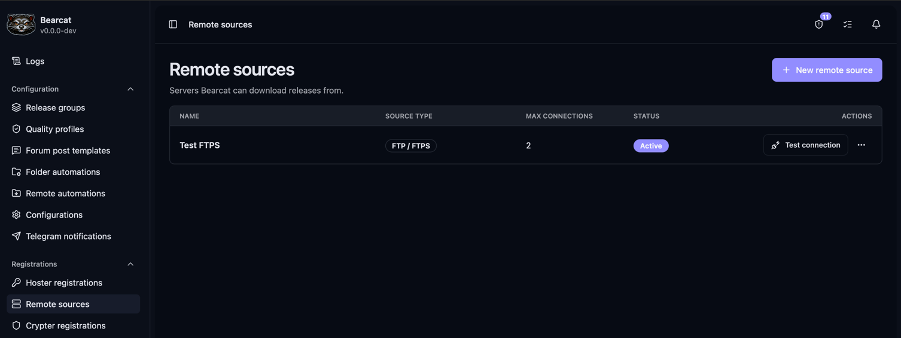
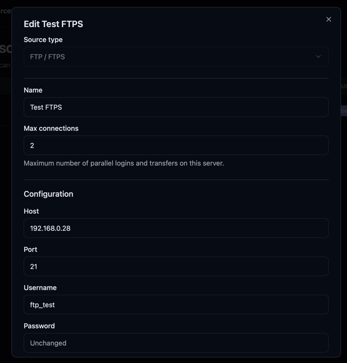
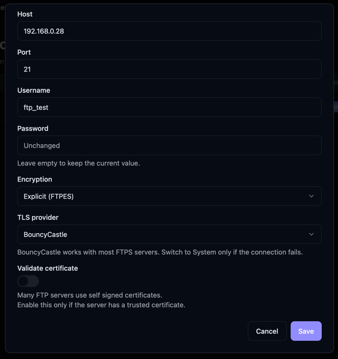
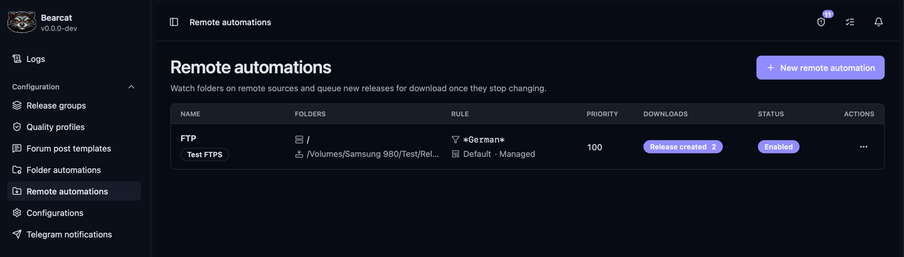
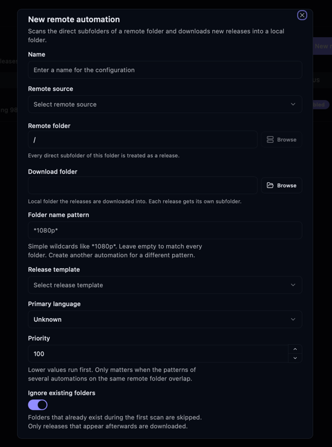
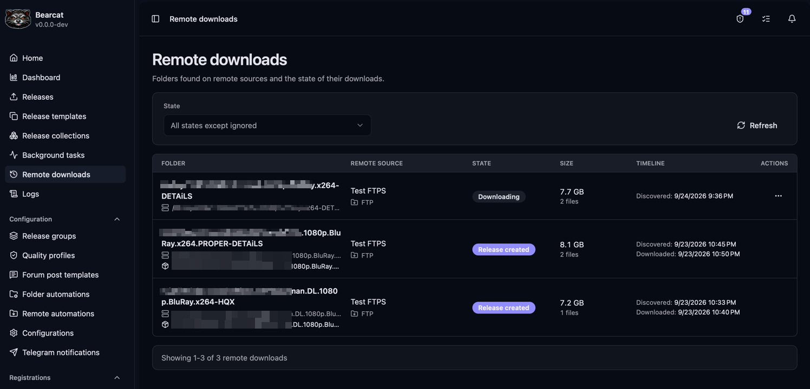
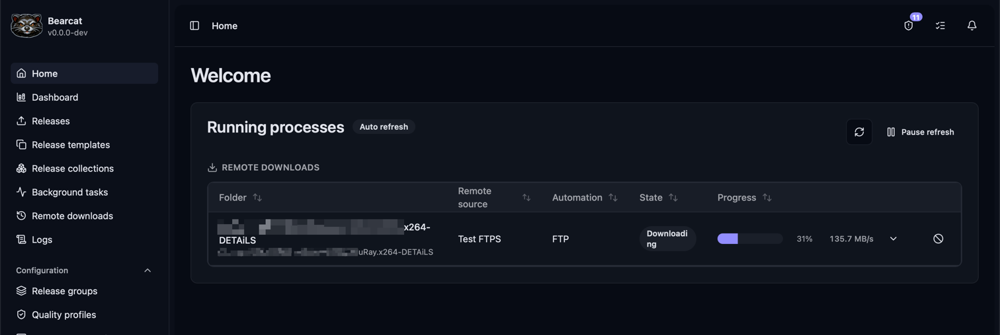

Bearcat watches FTP and FTPS servers for new release folders, downloads them, and verifies any SFV
checksums. A release template controls how the files are then packed and uploaded.

With a managed template, Bearcat can extract RAR and 7z archives before repacking them. Extraction
is off by default. Use an unmanaged template to upload the downloaded archives unchanged.

## Add a server



1. Open **Remote sources** and click **New remote source**.
2. Choose **FTP / FTPS** as the source type and give the connection a name.
3. Enter the **Host**, **Port**, **Username**, and **Password**.
4. Set **Encryption** to match the server: **Explicit (FTPES)**, **Implicit (FTPS)**, or **None (plain FTP)**.
   The defaults are explicit encryption and port `21`.
5. Set **Max connections** to the number of connections your account allows. The default is `2`.
6. Save, then choose **Test connection** from the server's action menu.




Leave **TLS provider** at **BouncyCastle** to start with. If the connection fails, check the server
details and try **System**. **Validate certificate** is off by default. Enable it to check that the
server has a trusted certificate.

## Watch a remote folder

First, [create a release template](/Bearcat/release-templates-and-automations/#setting-up-release-templates).
Choose **managed** to pack the downloaded files or **unmanaged** to upload the provided archives.



1. Open **Remote automations** and click **New remote automation**.
2. Give it a name and select your **Remote source**.
3. Set **Remote folder** to the folder containing the releases. Use **Browse** to select it on the server.
4. Choose a local **Download folder**. Bearcat creates a subfolder for each release there.
5. Optionally enter a **Folder name pattern**, such as `*1080p*`. Leave it empty to include all folders.
   Matching ignores case and uses wildcards, not regular expressions.
6. Select the **Release template** and, optionally, a **Primary language** for metadata.
7. Decide if you want to **Ignore existing folders**, then save. The automation is enabled by default.



**Ignore existing folders** is on by default, so only folders added after the first scan are downloaded.
Turn it off **before saving** to include existing releases. Changing it later does not affect folders
already marked as ignored.

The download folder must be writable by Bearcat. In Docker, choose a path inside a mounted volume
so the downloads survive container replacement.

### Example

With **Remote folder** set to `/movies`, **Folder name pattern** set to `*1080p*`, and
**Download folder** set to `/data/releases/incoming`:

```text
On the server:
  /movies/Movie.One.2026.1080p/
  /movies/Movie.Two.2026.2160p/

Downloaded locally:
  /data/releases/incoming/Movie.One.2026.1080p/
```

Bearcat looks for releases only in direct subfolders of `/movies`. Matching folders are downloaded
with all their contents. You do not need a separate local folder automation.

### Overlapping automations

Create more automations for different patterns, templates, or download folders.
If several match the same folder on a source, Bearcat uses the one with the lowest **Priority**.
For example, `10` takes priority over the default `100`. Each remote folder is downloaded only once per source.
Changing priorities does not reassign folders Bearcat has already found.

### Duplicate folders

Bearcat marks a folder as **Duplicate** if a release or download from any remote source already
has that name. It skips the duplicate even if the first download fails or is canceled. Use
**Restart download** on **Remote downloads** to download it anyway.

## Follow the download

Bearcat scans about every two minutes. By default, a folder must be at least `1` MB and its file
count and total size must stay unchanged for five minutes before it is queued.
You can adjust these checks under [Remote downloads settings](/Bearcat/advanced-configuration/#remote-downloads).

Open **Remote downloads** to see folders, status, and errors. The usual sequence is:

| Status | Meaning |
| --- | --- |
| Observing | Waiting for the folder to stop changing and reach the minimum size. |
| Queued | Ready to download. |
| Downloading | Files are being saved locally. |
| Downloaded | All files are saved locally. Verification and extraction are next. |
| Verifying | Files are checked against the `.sfv` files in the folder. Skipped if there are none. |
| Extracting | Archives are being extracted. Only with **Extract archives before release creation**. |
| Ready for release creation | Release creation is next. |
| Release created | Open the linked release to follow its archives and uploads. |



### SFV verification

After every download, Bearcat looks for `.sfv` files in the release folder and its subfolders and
compares the CRC32 checksum of each listed file. If a listed file is missing or its checksum does not
match, the download fails and the files stay on disk.

You can also follow running downloads under **Activity > Downloads** on the start page. It shows
progress, speed, remaining time, phase, and file details. The release detail page shows the remote source.



### Cancel, retry, or skip a folder

Use the action menu in **Remote downloads**:

- **Cancel** stops an observed, queued, or running download. Files from a running download are deleted.
- **Restart download** queues a failed, canceled, or duplicate download again. It starts from scratch and removes
  files left by the previous attempt.
- **Retry without downloading again** uses the existing files to repeat verification, extraction,
  and release creation. Fix the reported error first. If the archives are already extracted,
  Bearcat only creates the release.
- **Ignore** skips a folder that has not started downloading, or a failed, canceled, or duplicate download.
  Ignored and duplicate folders are hidden by the default status filter and are not queued again.

If the local release folder is not empty before downloading, Bearcat stops with an error.
Existing files are kept. Move them elsewhere before restarting the download.

Disabling an automation stops it from scanning. Already queued downloads stay queued.
To stop one of those, cancel it on **Remote downloads**.

## Extract archives before release creation

With a managed template, turn on **Extract archives before release creation** in the automation
to unpack RAR or 7z archives before Bearcat packs the release.

After SFV verification, Bearcat extracts all RAR and 7z archives in the release folder and its
subfolders, each into the folder that contains it. Once extraction succeeds, it deletes the archive
volumes and `.sfv` files that only list those volumes, then creates the release from the extracted files.

Bearcat stops extraction and keeps the archives if:

- There is not enough free disk space for the extracted files.
- Extraction would overwrite an existing file or folder.
- An archive is damaged or password protected.

This option is off by default and does not apply to unmanaged templates.

## Delete raw files after uploading

For managed templates, **Keep raw files** is on by default. Turn it off in the automation if you
want Bearcat to remove the downloaded release folder after uploading.

Bearcat waits until:

- Every upload configuration has a completed upload.
- No uploads are waiting or running, and no archives are being created.
- Every archive configuration has a created archive or an online [mirror](/Bearcat/mirror-downloads/).

It then converts the release to [unmanaged](/Bearcat/release-types/#unmanaged-releases) and deletes
the downloaded folder. Future reuploads use the existing archives or mirrors.

Store archives outside the downloaded release folder. If it contains archives, Bearcat keeps
the folder and notifies you. This option does not apply to unmanaged templates.
