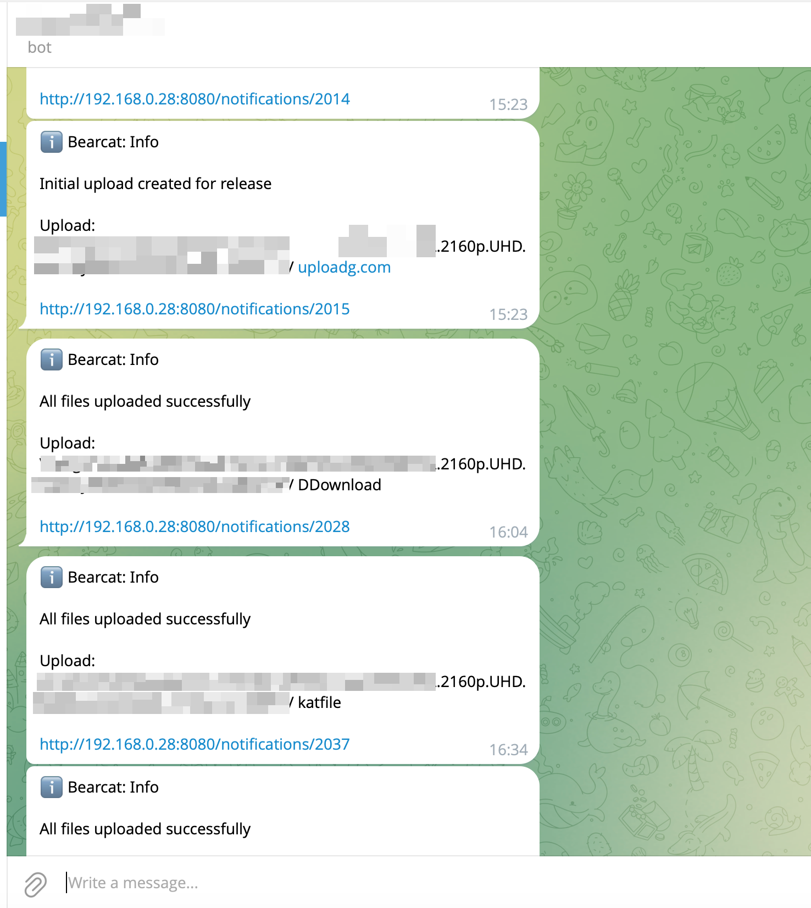
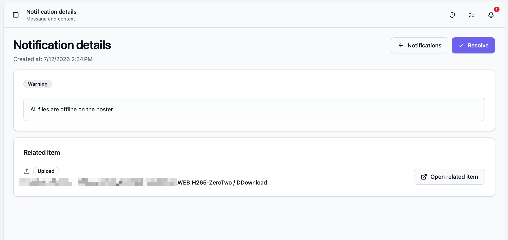
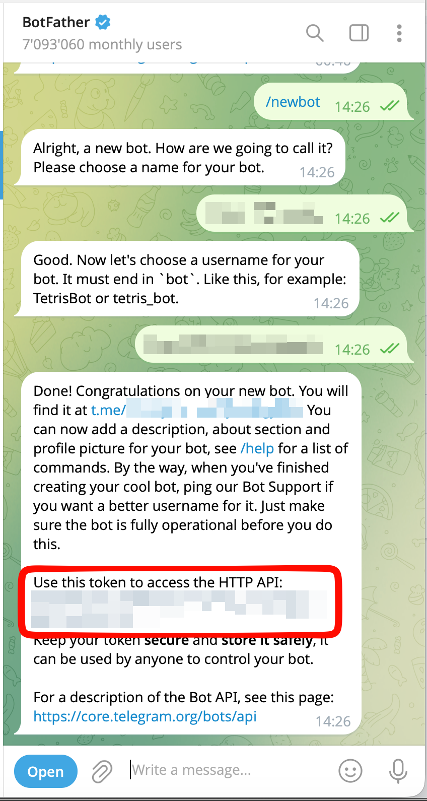
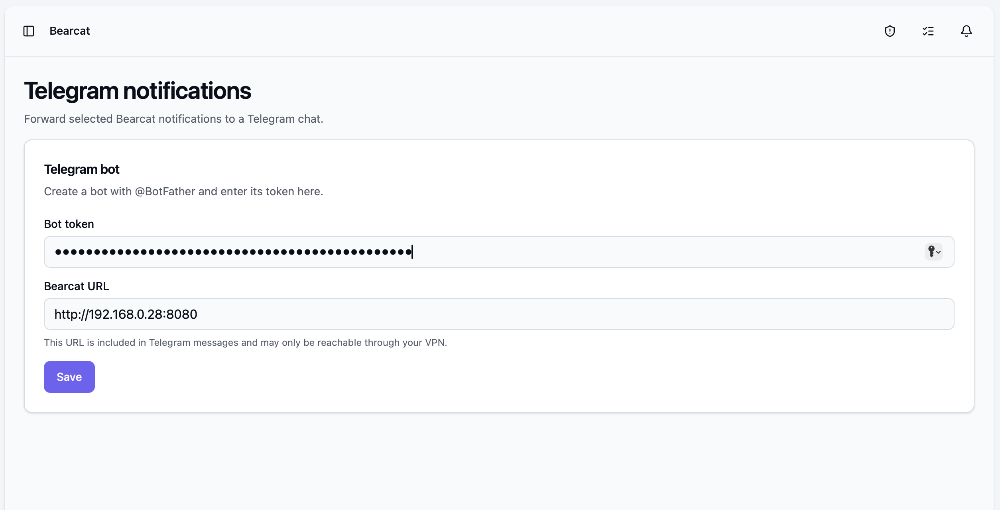
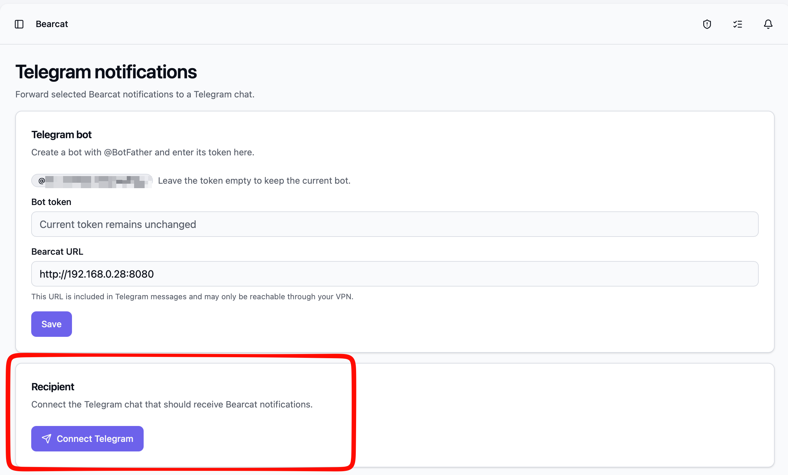
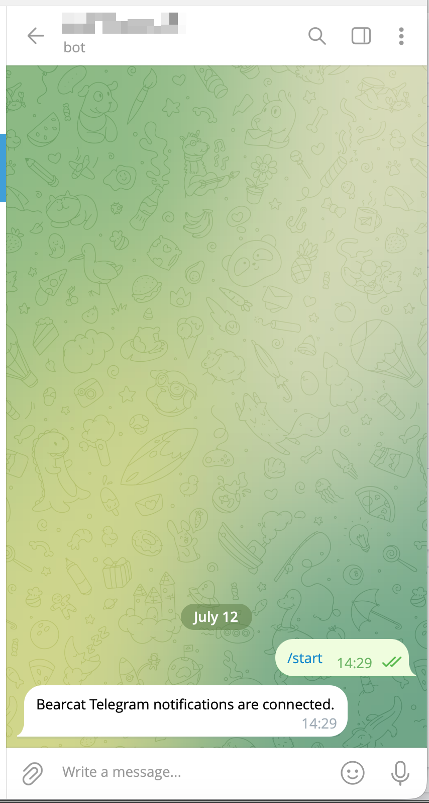

Bearcat can forward its notifications to a Telegram chat. That way you get a message on your
phone when an upload finishes or something fails, without keeping the frontend open. Bearcat
forwards the same info, warning and error notifications you see in the notification bell. Each
message includes the name of the related item (the release, upload or archive it is about) and a
link back to the notification in Bearcat.

Here are a few forwarded notifications as they arrive in Telegram. Each one names the related
item and links back to the notification in Bearcat:

Opening one of those links takes you to the notification details in Bearcat, together with the
related item:

## Where to find it

Open **Telegram notifications** from the sidebar, or go to `/telegram`. The page has three parts:
the bot, the connected chat, and which notification types get forwarded.

## Setting up the bot

Bearcat talks to Telegram through a bot that you own. You only have to create it once.

1. In Telegram, open a chat with [@BotFather](https://t.me/BotFather) and send `/newbot`.
   Follow the prompts to pick a name and a username. BotFather gives you a **bot token**.

   

2. Paste that token into the **Bot token** field on the Telegram notifications page.
3. Fill in the **Bearcat URL**. This URL is put into every Telegram message so you can jump
   from the message straight to the notification. It has to be an address that your phone can
   actually reach, which for most setups means it is only reachable through your VPN.
4. Click **Save**.

The token is stored encrypted, so it is never kept in plain text. Once a bot is saved, you can
leave the token field empty when you change other settings to keep the current bot. Entering a
new token replaces the bot and disconnects the current chat, so you have to pair again.

## Connecting a chat

After the bot is saved, connect the chat that should receive the notifications.

1. In the **Recipient** section, click **Connect Telegram**. Bearcat generates a one-time link.

   

2. Click **Open Telegram** and press **Start** in the chat that opens. The link is valid for
   ten minutes.
3. Back in Bearcat, click **Check connection**. Once the pairing went through, the chat shows up
   as **Connected** and the chat receives a short confirmation message.

   

The pairing link carries a one-time token that is stored only as a hash, so the raw link cannot
be recovered from Bearcat. If you reload the page while a pairing is still running, Bearcat keeps
the pairing state and lets you check the connection or generate a new link instead of silently
starting over.

To send a quick test, use **Send test notification** once the chat is connected. It delivers a
short message so you can confirm the chat and the bot work.

## Choosing which notifications get forwarded

Under **Forwarded notification types** you decide whether **Info**, **Warning** and **Error**
notifications are forwarded. Uncheck a type to stop forwarding it and click **Save**.

Only notifications created after you connect the chat are forwarded. Connecting does not replay
the whole history, so you do not get flooded with old notifications when you first pair.

## Delivery status

The **Recipient** section shows a small status box so you can tell whether forwarding actually
works:

- how many notifications are still waiting to be delivered,
- how many were given up on after repeated failures,
- when the last notification was delivered,
- the last error, if a delivery failed.

Bearcat retries a failed delivery with an increasing delay. If it keeps failing (for example
because the bot was blocked or the chat was deleted), Bearcat stops retrying that notification
after several attempts instead of retrying forever. A blank box that says everything was
delivered means there is nothing to worry about.

## Disconnecting

**Disconnect** removes the connected chat and discards any notifications that are still waiting
to be delivered. Bearcat asks for confirmation first, because this cannot be undone. The bot
itself stays configured, so you can pair a new chat right away.
