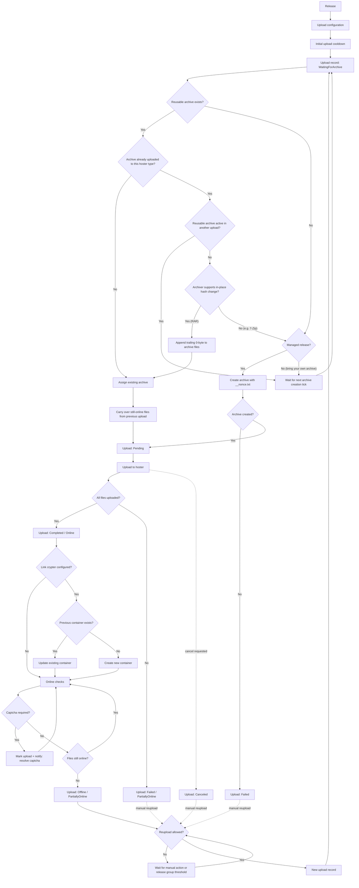

This page explains to you everything that happens after you create a release and tell Bearcat where it should go.

If you like long flow charts, you can expand the diagram below for the whole upload lifecycle.

<details>
<summary>Show the full upload lifecycle diagram</summary>



</details>

## 1. Release and upload configuration

A release on its own is just a description: the source folder and a bit of setup around it. Creating a release does **not** upload anything yet.

The lifecycle only kicks off once a release has at least one **upload configuration**. An upload configuration connects these pieces together:

- the release
- the hoster registration
- the archive configuration
- optional link crypter configurations

Each upload configuration runs its own lifecycle. So if you want the same release on two hosters (say Rapidgator and DDownload), you create two upload configurations, and Bearcat handles each one independently.

Or let's say you want to upload the *same* release to the *same* hoster but in different archive sizes, because you want to post it in different forums, thats also possible.

## 2. The first upload

Bearcat doesn't create the first upload the instant you save an upload configuration. Instead it waits for the **"Initial upload cooldown"** you set under "Configurations" (default: `5` minutes).

The **"Upload state check"** background task then picks up any upload configuration that is still missing its first upload and creates one. That upload starts in the `WaitingForArchive` state.

The cooldown is there to allow you to finish setting up the release before Bearcat starts archiving and uploading. Also, it prevents problems from folders that aren't yet fully copied.

If you'd rather skip the wait, set the cooldown to `0` and the first upload is created on the very next upload state check.

## 3. Creating the archive

The **"Archive creation"** background task looks for uploads in `WaitingForArchive` that don't have an archive yet, and gives each one an archive to upload.

**Can an existing archive be reused?** For every matching upload, Bearcat first checks whether a finished archive already exists for the same archive configuration. If one does, it simply assigns that archive and moves the upload to `Pending`, so there is no need to pack the same files twice.

**Reuploads need a MD5 hash change.** For reuploads, Bearcat also checks whether that archive was already uploaded to the same *type* of hoster before. If so, the archive files need new hashes before they go up again, because hosters often recognise an already-seen file by its MD5 hash.

- If the archiver can change hashes **in place** (currently only RAR), Bearcat appends a single harmless 0-byte to each archive file. That changes the MD5 hash but the archive still works without issues.
- Before doing that, Bearcat makes sure no other active upload is currently using the archive. If one is, it waits and tries again on the next run.
- If the archiver *can't* safely change hashes in place (7Zip!), Bearcat leaves the existing files alone and packs a fresh archive instead.

**Reusing an archive carries over the files that are still online.** When a reupload reuses the *same* archive as a previous upload of the same upload configuration, Bearcat copies over the hoster links for the files that are still online and only uploads the ones that actually went offline. This makes recovering from a `PartiallyOnline` upload cheap: the surviving files stay where they are, and Bearcat just fills the gaps instead of sending everything up again. It only works when the same archive is reused, though. If a fresh archive has to be packed, its freshly packed files aren't compatible with the old ones, so the whole release is uploaded again.

**No reusable archive? Create a new one.** If nothing can be reused, Bearcat builds a new archive from the release folder. The archive configuration decides:

- where the archive files are written
- which archiver is used
- the archive file name prefix
- the archive password
- the archive part size

If packing succeeds, the archive becomes `Created` and the upload moves to `Pending`. If it fails, the archive becomes `CreationFailed` and the upload becomes `Failed`.

> **Note:** Bearcat only *creates* new archives for **managed** releases. Unmanaged releases ("bring your own archives") always already have an archive configuration and archive, so Bearcat just uses what's there.

### The nonce file and repackaging

Just before packing, Bearcat writes a tiny `__nonce.txt` file with a random value into the release folder. It's a small, harmless file that changes between runs, and that little change is what helps reuploads come out with different hashes than before.

How aggressively Bearcat varies the resulting archive files is controlled by the **"Archive repackaging"** configuration. The default is **"Change archive file size by 1 MB"**: it packs without compression and without solid mode, but bumps the archive part size up by `1` MB compared to the latest archive for the same configuration. That reliably shifts the resulting parts without paying for compression CPU time.

The other strategies are:

- **"Nonce only, no compression"**: only `__nonce.txt` changes, packed without compression or solid mode. Lowest CPU cost, but the lowest chance that *every* part ends up with a new MD5 hash.
- **"Solid archive with compression"**: packs with solid mode and compression. Costs more CPU, but makes the `__nonce.txt` change ripple through the whole archive much more reliably.

One thing to keep in mind: if "Archive cleanup" later deletes an archive locally, Bearcat can no longer reuse it. A future reupload will simply pack a fresh archive when needed.

## 4. Uploading to the hoster

The **"Archive upload"** background task takes care of `Pending` uploads. While files are going up, the upload sits in the `Uploading` state.

When every archive file uploads successfully, the upload becomes:

- `Completed`
- `Online`
- stamped with an upload timestamp

If some files don't make it, the upload becomes:

- `Failed`
- `PartiallyOnline`

You can watch all of this live on the release detail page under the **"Uploads"** tab. The **"Overview"** tab shows the latest upload per upload configuration.

## 5. Link crypter containers

Once a hoster upload finishes successfully, Bearcat can wrap the links into link crypter containers.

The **"Link crypter container creation"** background task processes uploads that are:

- `Completed`
- `Online`
- linked to uploaded hoster files
- connected to at least one active link crypter configuration

For the first successful upload of an upload configuration, Bearcat creates a fresh container for each configured link crypter, filled with that upload's hoster links. If a container can't be created, Bearcat records the error on the container and raises a notification so you know.

This runs per release. If you manage related releases together (a TV show season, for example), a release collection can bundle their links into one shared container instead of one per release. See [Release Collections](/Bearcat/release-collections/) for the details.

## 6. Online checks

The **"Upload state check"** background task regularly asks hosters whether the uploaded files are still there. A file gets re-checked when it has never been checked, or when its last check is older than 30 minutes.

Bearcat will then classify the upload using the following states:

- **`Online`**: every checked file is online.
- **`PartiallyOnline`**: at least one file is offline, but not all of them.
- **`Offline`**: all uploaded files are offline.

If the check itself fails (the hoster errors out), Bearcat raises an error notification and keeps the previous online state. And if a hoster asks for a captcha verification first, Bearcat marks the upload accordingly and sends you a notification that asks you to resolve the captcha.

## 7. Automatic reuploads

Automatic reuploads are driven by release groups. To get automatically reuploaded, all of the following must be true for the Release:

- its release group has automatic reuploads enabled
- the latest relevant upload is `Offline` or `PartiallyOnline`
- every uploaded file has been checked at least once
- the release group's "Hours until reupload" threshold has been reached
- there isn't already an online or *blocking* replacement upload for the same upload configuration

A **blocking** replacement is any other upload for the same upload configuration that is `Online`, or in one of these "in progress" states: `Pending`, `Uploading`, `WaitingForArchive`, `Failed`, or `CancellationRequested`.

When a reupload is due, Bearcat creates a new upload record for the same upload configuration, starting fresh at `WaitingForArchive`. From there it follows the normal path:

```text
WaitingForArchive -> Pending -> Uploading -> Completed
```

If an existing archive can still be reused, the reupload skips packing. When that same archive is reused, the reupload also keeps the files that are still online and only sends up the ones that went offline (see [Creating the archive](#3-creating-the-archive)), so recovering a `PartiallyOnline` upload only moves the missing parts. Otherwise it builds a new archive from the release folder and uploads everything, just like the first time.

## 8. Manual reuploads

You can also trigger a reupload yourself from the **"Uploads"** tab. Bearcat allows this for uploads that are:

- `Offline`
- `PartiallyOnline`
- `Canceled`
- `Failed`

The same blocking rules as for automatic reuploads apply: if another online or in-progress replacement already exists for the upload configuration, Bearcat won't create a second one.

A manual reupload creates a new upload record and then follows the normal archive-and-upload lifecycle from there.

## 9. What happens to link crypter containers on a reupload?

On a reupload Bearcat will try to re-use the existing link crypter container, is possible.

If an earlier upload for the same upload configuration already has a container for the same link crypter configuration, Bearcat tries to **update** that container with the new hoster links. When that works, the public container URL stays the same and only the links inside it change, which is great for anyone who already shared the link.

If the update fails, Bearcat falls back to creating a brand-new container, and the new upload may end up with a new container URL.

Whether updating is possible depends on the link crypter provider and its API. Some support it, some don't, and when they don't, Bearcat just creates a fresh container.

## 10. Cleanup after a successful upload

Cleanup is optional. If automatic archive cleanup is **disabled**, Bearcat keeps the local archive folders around after upload.

If it's **enabled**, the **"Archive cleanup"** background task deletes the local archive folder once all linked uploads have completed. To be clear about what this touches: it only removes Bearcat's own generated archive folder. It never deletes your release source folder, and it never deletes anything from the hoster.
