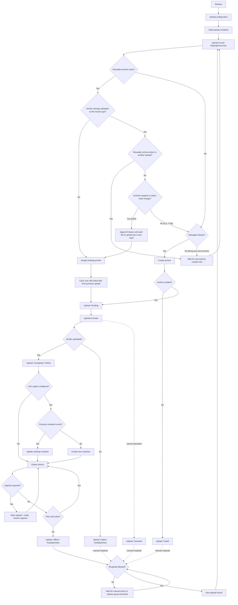

After you add an upload configuration, Bearcat prepares the archive, uploads it, and checks its links.
Enable automatic reuploads in the release group if you want Bearcat to replace files that go offline.

<details>
<summary>Show the full upload lifecycle diagram</summary>


```mermaid
flowchart TD
    %% --- Setup ---
    Release[Release] --> UploadConfig[Upload configuration]
    UploadConfig --> Cooldown[Initial upload cooldown]
    Cooldown --> WFA[Upload record: WaitingForArchive]

    %% --- Archive decision ---
    WFA --> QReuse{Reusable archive exists?}
    QReuse -- Yes --> QHosterType{Archive already uploaded to this hoster type?}
    QReuse -- No --> QManaged{Managed release?}

    QHosterType -- No --> Assign[Assign existing archive]
    QHosterType -- Yes --> QActive{Reusable archive active in another upload?}

    QActive -- Yes --> WaitTick[Wait for next archive creation tick]
    WaitTick --> WFA
    QActive -- No --> QInPlace{Archiver supports in-place hash change?}

    QInPlace -- "Yes (RAR)" --> Append[Append 0-bytes until each file to upload has a new hash]
    Append --> Assign
    QInPlace -- "No (e.g. 7-Zip)" --> QManaged

    QManaged -- Yes --> Create[Create archive]
    QManaged -- "No (bring your own archive)" --> WaitTick

    Create --> QCreated{Archive created?}
    QCreated -- No --> Failed[Upload: Failed]
    QCreated -- Yes --> Pending[Upload: Pending]
    Assign --> Carry[Carry over still-online files from previous upload]
    Carry --> Pending

    %% --- Upload to hoster ---
    Pending --> UploadHoster[Upload to hoster]
    UploadHoster --> QAllFiles{All files uploaded?}
    QAllFiles -- Yes --> Completed[Upload: Completed / Online]
    QAllFiles -- No --> FailedPartial[Upload: Failed / PartiallyOnline]

    %% --- Link crypter containers ---
    Completed --> QLinkCrypter{Link crypter configured?}
    QLinkCrypter -- No --> OnlineChecks[Online checks]
    QLinkCrypter -- Yes --> QPrevContainer{Previous container exists?}
    QPrevContainer -- Yes --> UpdateContainer[Update existing container]
    QPrevContainer -- No --> NewContainer[Create new container]
    UpdateContainer --> OnlineChecks
    NewContainer --> OnlineChecks

    %% --- Online checks ---
    OnlineChecks --> QCaptcha{Captcha required?}
    QCaptcha -- Yes --> CaptchaWait[Mark upload + notify: resolve captcha]
    CaptchaWait --> OnlineChecks
    QCaptcha -- No --> QOnline{Files still online?}
    QOnline -- Yes --> OnlineChecks
    QOnline -- No --> Offline[Upload: Offline / PartiallyOnline]

    %% --- Cancel (manual) ---
    UploadHoster -. cancel requested .-> Canceled[Upload: Canceled]

    %% --- Reupload: automatic from Offline/PartiallyOnline, manual also from Failed/Canceled ---
    Offline --> QReupload{Reupload allowed?}
    FailedPartial -. manual reupload .-> QReupload
    Failed -. manual reupload .-> QReupload
    Canceled -. manual reupload .-> QReupload

    QReupload -- No --> WaitReupload[Wait for manual action or release group threshold]
    WaitReupload --> QReupload
    QReupload -- Yes --> NewUpload[New upload record]
    NewUpload --> WFA
```

</details>

## 1. Release and upload configuration

An upload needs an **upload configuration**. It connects:

- the release
- the hoster registration
- the archive configuration
- optional link crypter configurations

Create an upload configuration for each hoster. Configurations run independently. You can also create
several for the same hoster, for example with different part sizes.

## 2. The first upload

Bearcat waits for the **Initial upload cooldown** before creating the first upload. Set it under
**Configurations**; the default is `5` minutes. This gives you time to finish setup and copy the release files.

After the cooldown, the **Upload state check** background task creates the upload in the
`WaitingForArchive` state. Set the cooldown to `0` to create it on the next check.

## 3. Creating the archive

The **Archive creation** background task prepares an archive for each upload in `WaitingForArchive`:

1. Reuse a finished archive for the same archive configuration, if possible.
2. Restore missing local files from a configured [mirror hoster](/Bearcat/mirror-downloads/).
3. If neither is possible, create a new archive from the release folder.

Bearcat can only repack [managed releases](/Bearcat/release-types/). Unmanaged releases need local
archive files or an available mirror.

The archive configuration sets the archiver, output folder, filename prefix, password, and part size.
It also has two packing options:

- **Pack release folder as root folder** (default: on): the archive contains one folder named
  after the release folder on disk. When off, the contents of the release folder are packed
  directly at the top level of the archive.
- **Create nonce file** (default: on): Bearcat packs a random `__nonce.txt`. See
  [The nonce file and repackaging](#the-nonce-file-and-repackaging).

Changing either option only affects archives created afterwards.
You can also assign [additional archive contents](/Bearcat/additional-archive-contents/), such as
a text file with a referral link, to include whenever Bearcat creates a new archive.

After packing succeeds, the archive becomes `Created` and the upload moves to `Pending`. If packing
fails, their states become `CreationFailed` and `Failed`.

For reuploads, Bearcat may need to change the archive hashes or repack the files. See
[Archive reuse and repackaging](#archive-reuse-and-repackaging) for the details.

### Cancel a running archive creation

Cancel a running archive creation under **Activity > Archives**. This also works during
MD5 calculation or hash changes to a reused archive.

- **New archive:** Bearcat deletes the archive and its files.
- **Reused archive:** the archive is kept. Files whose hash change did not finish get new hashes
  before the archive is assigned to the next upload.

In both cases the uploads waiting for that archive become `Canceled`. Create a manual reupload when
you want to try again. If you stop Bearcat, an interrupted archive creation
continues or the archive is repacked on the next start.

## 4. Uploading to the hoster

The **Archive upload** background task starts `Pending` uploads and changes their state to `Uploading`.

| Result | Upload state | Online state |
| --- | --- | --- |
| All files uploaded | `Completed` | `Online` |
| Some files failed | `Failed` | `PartiallyOnline` |

Bearcat records a timestamp for successful uploads. Follow progress on the release detail page
under **Uploads** > **History**. **Overview** shows the latest upload for each upload configuration.

## 5. Link crypter containers

After a successful upload, Bearcat creates link crypter containers if configured.

The **Link crypter container creation** background task creates a container for each active link
crypter configuration once the upload is `Completed` and `Online`. If creation fails, it shows the error
on the container and creates an error notification.

A [release collection](/Bearcat/release-collections/) can gather links from several releases
in a shared container, for example for a TV season.

## 6. Online checks

The **Upload state check** background task checks each uploaded file, then repeats the check
at intervals of at least 30 minutes.

The upload then has one of these states:

- **`Online`**: every checked file is online.
- **`PartiallyOnline`**: at least one file is offline, but not all of them.
- **`Offline`**: all uploaded files are offline.

If a link check fails, the previous online state is kept. Bearcat creates one error notification per
hoster registration with the number of affected uploads. It creates another notification for this registration only after you resolve the first.

If the hoster requires a captcha, Bearcat marks the upload and notifies you. If it rejects the credentials,
Bearcat disables the hoster registration and notifies you. Fix the credentials and activate it again.
This also applies when the error occurs during an upload.

## 7. Automatic reuploads

Bearcat creates an automatic reupload when all of these conditions are met:

- its release group has automatic reuploads enabled
- the latest relevant upload is `Offline` or `PartiallyOnline` (subject to the hoster's reupload trigger, see below)
- every uploaded file has been checked at least once
- the waiting time ("Hours until reupload") has passed since the upload went offline
- no other replacement upload blocks a reupload for the same upload configuration

A replacement upload blocks another reupload if it is `Online` or has the state `Pending`,
`Uploading`, `WaitingForArchive`, `Failed`, or `CancellationRequested`.

When a reupload is due, Bearcat creates a new upload record for the same upload configuration:

```text
WaitingForArchive -> Pending -> Uploading -> Completed
```

When reusing an archive, Bearcat keeps the links still online and uploads only the missing files.
A newly packed archive must be uploaded in full because its parts cannot be mixed with those from older archives.

### Per-hoster overrides

A hoster registration can override the release group's waiting time and trigger. See
[Reupload overrides per hoster](/Bearcat/account-settings/#reupload-overrides-per-hoster) for setup.

- **Hours until reupload:** replaces the release group's waiting time for this hoster.
- **Reupload trigger:** controls when that waiting time starts:
  - **Partially or fully offline** (default): starts when the first file goes offline.
  - **Only when fully offline:** starts when the last file goes offline. No reupload is scheduled
    while any file remains online. If a file comes back online, the timer resets.
- **Always reupload all files:** uploads every archive part, including those that are still online.

For hosters that remove files one at a time, **Only when fully offline** avoids repeated reuploads
while parts are still online. If a hoster deletes files after a period without downloads, **Always reupload
all files** resets the upload date for all parts.

## 8. Manual reuploads

You can also trigger a reupload yourself with **Create manual reupload** in the `...` menu of an entry in **Uploads** > **History**. Bearcat allows this for uploads that are:

- `Offline`
- `PartiallyOnline`
- `Canceled`
- `Failed`

Manual reuploads follow the same [replacement upload rules](#7-automatic-reuploads).

## 9. Link crypter containers after a reupload

Bearcat tries to update the existing container for the same upload configuration and link crypter
configuration.
If it succeeds, the URL stays the same and links in existing forum posts remain valid.

If the provider cannot update containers or the update fails, Bearcat creates a new container.
The container URL may change.

## 10. Cleanup after a successful upload

Auto cleanup is off by default. You can enable two rules, which the **Auto cleanup** background task
applies after their configured retention periods:

- Convert managed releases to unmanaged: a notification includes the release folder path so you can delete it yourself.
- Delete local archives: only if Bearcat can download them from a mirror hoster or repack them from the release folder.

The archive period counts from the last upload of the archive configuration, so every reupload restarts it. Nothing is ever deleted from the hoster.

If a later reupload needs a missing archive, Bearcat downloads it from a
[mirror hoster](/Bearcat/mirror-downloads/) or repacks it for managed releases.
See [Auto cleanup](/Bearcat/advanced-configuration/#auto-cleanup) for details.

## Archive reuse and repackaging

Hosters often recognise files by their MD5 hash. If an archive was previously uploaded to the same
type of hoster, Bearcat needs new hashes before uploading it again.

Only files that are uploaded again need new hashes. Parts still online from the previous upload
keep their hash.

- **RAR:** Bearcat appends zero bytes until each file to upload has a hash not yet used for this
  archive configuration. The archive still extracts normally. Bearcat keeps the hash history even
  after local files are deleted.
- **7-Zip:** split volumes cannot be changed this way without corrupting the archive, so Bearcat
  creates a new archive instead. If all parts are still online, Bearcat reuses the archive.

Before changing a reused archive, Bearcat checks whether another active upload is using it.
If so, it waits until a later run. If a file to upload is missing locally, Bearcat first restores
it from a [mirror hoster](/Bearcat/mirror-downloads/) and changes the hashes afterwards.

### The nonce file and repackaging

**Create nonce file** adds a random `__nonce.txt` to newly packed archives. Bearcat removes it from
the release folder after packing, even if packing fails. After a crash, it removes leftover temporary
files on the next start.

RAR uses appended zero bytes to give every part a new hash, with or without the nonce file.
This works for reused and newly packed archives, so the part size normally stays at the configured
value instead of growing by `1` MB. The appended bytes still count towards the hoster's file size limit.

7-Zip relies on repacking with a changed nonce, compression, or a larger part size.
See [Archive repackaging](/Bearcat/advanced-configuration/#archive-repackaging) for the strategies
and the exception for older RAR archives with missing hashes.
