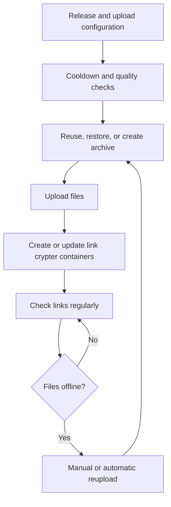

After you add an upload configuration, Bearcat prepares the archive, uploads it, and checks its links.
Enable automatic reuploads in the release group if you want Bearcat to replace files that go offline.

<details>
<summary>Show the upload flow</summary>


```mermaid
flowchart TD
    Release[Release and upload configuration] --> Cooldown[Cooldown and quality checks]
    Cooldown --> Archive[Reuse, restore, or create archive]
    Archive --> Upload[Upload files]
    Upload --> Containers[Create or update link crypter containers]
    Containers --> Checks[Check links regularly]
    Checks --> Offline{Files offline?}
    Offline -- No --> Checks
    Offline -- Yes --> Reupload[Manual or automatic reupload]
    Reupload --> Archive
```

</details>

## 1. Release and upload configuration

An **upload configuration** connects a release, a hoster registration, and an archive configuration.
You can also choose link crypter configurations.

Create an upload configuration for each hoster. Several configurations for the same hoster are
possible, for example with different part sizes.

## 2. The first upload

The **Initial upload cooldown** starts when the release is created.
Set it under **Configurations** (default: `5` minutes).

Once the cooldown has passed and an upload configuration exists, Bearcat schedules the first upload
on its next check. Set `0` minutes to skip the wait.
The release must also pass [quality checks](/Bearcat/quality-gates/) or be manually approved.

## 3. Creating the archive

For each waiting upload, Bearcat prepares an archive:

1. Reuse a finished archive for the same archive configuration, if possible.
2. Restore missing local files from a configured [mirror hoster](/Bearcat/mirror-downloads/).
3. If neither is possible, create a new archive from the release folder.

Bearcat can only repack [managed releases](/Bearcat/release-types/). Unmanaged releases need local
archive files or an available mirror.

The archive configuration sets the archiver, output folder, filename prefix, password, and part size.
It also has two packing options:

- **Pack release folder as root folder** (default: on): the archive contains one folder named
  after the release folder on disk. When off, the contents of the release folder are packed
  directly at the top level of the archive.
- **Create nonce file** (default: on): Bearcat packs a random `__nonce.txt`. See
  [The nonce file and repackaging](#the-nonce-file-and-repackaging).

Changing either option only affects archives created afterwards.
You can also assign [additional archive contents](/Bearcat/additional-archive-contents/), such as
a text file with a referral link, to include whenever Bearcat creates a new archive.

After packing succeeds, the archive becomes `Created` and the upload moves to `Pending`. If packing
fails, their states become `CreationFailed` and `Failed`.

For reuploads, Bearcat may need to change the archive hashes or repack the files. See
[Archive reuse and repackaging](#archive-reuse-and-repackaging) for the details.

### Cancel a running archive creation

Cancel a running archive creation under **Activity > Archives**. This also works during
MD5 calculation or hash changes to a reused archive.

- **New archive:** Bearcat deletes the archive and its files.
- **Reused archive:** the archive is kept. Files whose hash change did not finish get new hashes
  before the archive is assigned to the next upload.

In both cases the uploads waiting for that archive become `Canceled`. Create a manual reupload when
you want to try again. If you stop Bearcat, an interrupted archive creation
continues or the archive is repacked on the next start.

## 4. Uploading to the hoster

The **Archive upload** background task starts `Pending` uploads and changes their state to `Uploading`.

| Result | Upload state | Online state |
| --- | --- | --- |
| All files uploaded | `Completed` | `Online` |
| Some files failed | `Failed` | `PartiallyOnline` |

Bearcat records a timestamp for successful uploads. Follow progress on the release detail page
under **Uploads** > **History**. **Overview** shows the latest upload for each upload configuration.

## 5. Link crypter containers

After a successful upload, Bearcat creates a container with the download links for each active link
crypter configuration. If this fails, the error appears on the container and in a notification.

A [release collection](/Bearcat/release-collections/) gathers links from several releases in a shared
container, for example for a TV season.

## 6. Online checks

Bearcat checks uploaded files regularly, at intervals of at least 30 minutes.

| Online state | Meaning |
| --- | --- |
| `Online` | All files are online. |
| `PartiallyOnline` | Some files are offline. |
| `Offline` | All files are offline. |

If a check fails, the previous online state is kept.
Persistent errors cause one notification per hoster registration.
Further notifications wait until you resolve it.

Bearcat notifies you if a captcha is required. Invalid credentials disable the hoster registration.
Correct them and enable the registration again. This also applies to errors during uploading.

## 7. Automatic reuploads

Bearcat creates an automatic reupload when all of these conditions are met:

- its release group has automatic reuploads enabled
- the upload is offline according to the hoster's reupload trigger, see below
- every uploaded file has been checked at least once
- the **Hours until reupload** waiting time has passed
- no replacement upload blocks a reupload for the same upload configuration
- the release has passed [quality checks](/Bearcat/quality-gates/) or was manually approved

A replacement upload blocks another reupload if it is `Online` or has the state `Pending`,
`Uploading`, `WaitingForArchive`, `Failed`, or `CancellationRequested`.

When a reupload is due, Bearcat creates a new upload record for the same upload configuration:

```text
WaitingForArchive -> Pending -> Uploading -> Completed
```

When reusing an archive, Bearcat keeps the links still online and uploads only the missing files.
A newly packed archive must be uploaded in full because its parts cannot be mixed with those from older archives.

### Per-hoster overrides

Set [reupload overrides](/Bearcat/account-settings/#reupload-overrides-per-hoster) in the hoster registration:

| Setting | Effect |
| --- | --- |
| **Hours until reupload** | Overrides the release group's waiting time for this hoster. |
| **Reupload trigger: Partially or fully offline** (default) | Starts the wait when the first file goes offline. |
| **Reupload trigger: Only when fully offline** | Waits until all files are offline. If one comes back online, the period starts again the next time all files are offline. |
| **Always reupload all files** | Reuploads parts that are still online as well. |

**Only when fully offline** avoids repeated reuploads when a hoster deletes parts one at a time.
**Always reupload all files** resets the upload date for every part.

## 8. Manual reuploads

Choose **Create manual reupload** in an entry's `...` menu under **Uploads > History**.
This is available for `Offline`, `PartiallyOnline`, `Canceled`, or `Failed` uploads.

The same [replacement upload rules](#7-automatic-reuploads) apply.

## 9. Link crypter containers after a reupload

Bearcat tries to update the existing container for the same upload configuration and link crypter
configuration.
If it succeeds, the URL stays the same and links in existing forum posts remain valid.

If the provider cannot update containers or the update fails, Bearcat creates a new container.
The container URL may change.

## 10. Cleanup after a successful upload

Under [Auto cleanup](/Bearcat/advanced-configuration/#auto-cleanup), you can convert managed releases
to unmanaged after a set period and optionally delete their release folders.
You can keep local archives, delete them, or move them to a [storage folder](/Bearcat/archive-storage-folders/).
Both cleanup rules are off by default.

If a later reupload needs missing archives, Bearcat restores them from a [mirror](/Bearcat/mirror-downloads/)
or repacks them for managed releases. Cleanup never deletes files from the hoster.

## Archive reuse and repackaging

Hosters often recognise files by their MD5 hash. If an archive was previously uploaded to the same
type of hoster, Bearcat needs new hashes before uploading it again.

Only files that are uploaded again need new hashes. The other parts keep their hash.

- **RAR:** Bearcat appends zero bytes until each file to upload has a hash not yet used for this
  archive configuration. The archive still extracts normally. Bearcat keeps the hash history even
  after local files are deleted.
- **7-Zip:** split volumes cannot be changed this way without corrupting the archive, so Bearcat
  creates a new archive instead. If no files need uploading again, it can reuse the archive.

Before changing a reused archive, Bearcat checks whether another active upload is using it.
If so, it waits until a later run. If a file to upload is missing locally, Bearcat first restores
it from a [mirror hoster](/Bearcat/mirror-downloads/) and changes the hashes afterwards.

### The nonce file and repackaging

**Create nonce file** adds a random `__nonce.txt` to newly packed archives.
Bearcat removes it from the release folder after packing, even if packing fails.

RAR gets new hashes from appended zero bytes, with or without the nonce file.
These bytes count towards the hoster's file size limit.

7-Zip relies on repacking with a changed nonce, compression, or a larger part size.
See [Archive repackaging](/Bearcat/advanced-configuration/#archive-repackaging) for the strategies
and the exception for older RAR archives with missing hashes.
