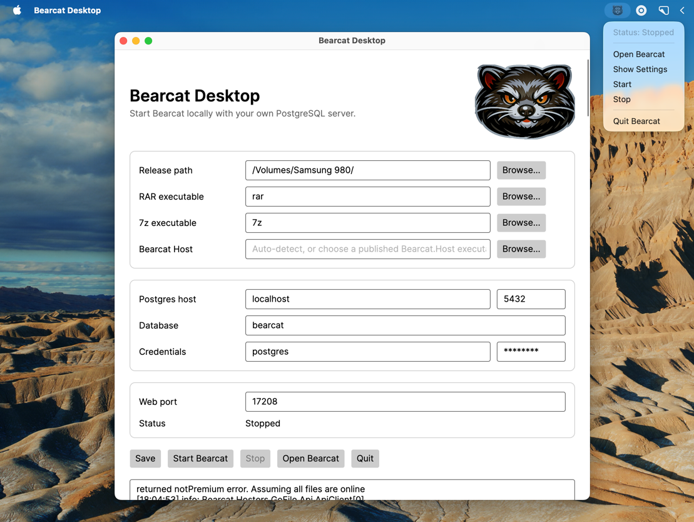
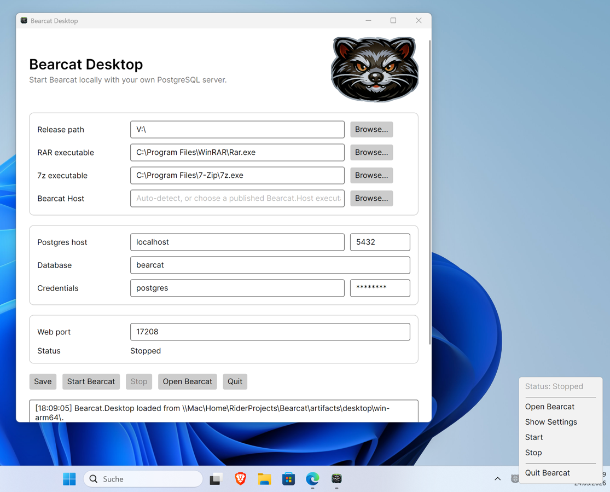
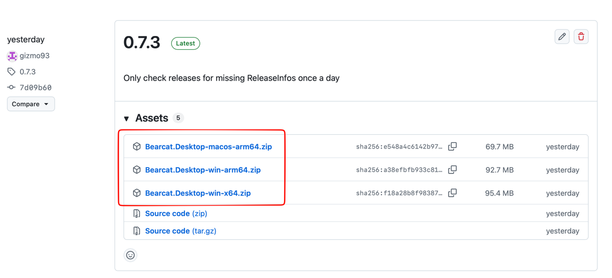

Bearcat is a Web Application that runs in your Browser.

But to make it easier for you to start and stop it if you want to run it on your Windows or macOS machine, Bearcat offers a small Launcher App, that starts Bearcat, keeps it visible through a tray icon, opens the web UI in your browser, and stops Bearcat when you quit the app.

This is my recommended local setup for macOS on Apple Silicon because the Desktop app runs natively on ARM and helps you to get the most out of your fast Apple Silicon Mac.

On Windows, use the Desktop app for local desktop use. Use Docker for Windows Server or other always-on server deployments.

The Desktop uses YOUR OWN PostgreSQL server. It does not ship with PostgreSQL.

| macOS | Windows |
| --- | --- |
|  |  |

## Requirements

- PostgreSQL 18 running locally or on a reachable machine
- RAR command line executable (on Windows this comes with WinRAR)
- 7z command line executable
- A release data directory on your local machine

For PostgreSQL setup instructions, see [Installing PostgreSQL For The Desktop App](/Bearcat/install-postgresql-for-desktop/).

## Downloading the newest release
You can get the latest release of the Desktop app from the [GitHub releases page](https://github.com/gizmo93/Bearcat/releases).



### macOS Gatekeeper

The macOS download is packaged as an `.app` bundle and is ad-hoc signed, because I don't have a Apple Developer License.
This means, that per default, macOS will put the app into "quarantine" and block you from executing it.
If macOS reports that the app is damaged after downloading it from GitHub, move the app to `/Applications`, open the Terminal and remove the quarantine attribute:

```bash
xattr -dr com.apple.quarantine "/Applications/Bearcat Desktop.app"
```

After that, open the app again.

## Settings

On first start, open the launcher settings and enter:

### Release path

The folder where Bearcat looks for release files. This should be a local folder, mounted drive, or network share that the desktop user can read and write.

### RAR executable

Path to the RAR command line executable. You can enter a full path, or a command name if it is available on `PATH`.

Examples:

```text
rar
C:\Program Files\WinRAR\Rar.exe
/usr/local/bin/rar
```

### 7z executable

Path to the 7-Zip command line executable. You can enter a full path, or a command name if it is available on `PATH`.

Examples:

```text
7z
C:\Program Files\7-Zip\7z.exe
/opt/homebrew/bin/7z
```

### Bearcat Host

Optional path to a published `Bearcat.Host` executable or `Bearcat.Host.dll`.
Usually you don't need to touch that one as the executables are found automatically.

During development, this field can also stay empty if the launcher can find the local repository. If auto-detection does not work, choose the built or published host manually.

### PostgreSQL settings

The Desktop app uses your own PostgreSQL server. Enter:

- Host: PostgreSQL server hostname, usually `localhost` for a local database.
- Port: PostgreSQL port, usually `5432`.
- Database: Bearcat database name, for example `bearcat`.
- Username: PostgreSQL user.
- Password: PostgreSQL password.

The database does not need to exist before first start. Bearcat runs database migrations on startup in Desktop mode and can create the target database if the PostgreSQL user has permission to do so.

### Web port

The local HTTP port for the Bearcat web UI. The default is `17208`, so the app opens:

```text
http://127.0.0.1:17208
```

Change this only if the port is already used by another application.

## Where Settings Are Stored

Settings are stored as JSON in the user's application data directory:

```text
Windows: %APPDATA%\Bearcat\Desktop\settings.json
macOS: ~/Library/Application Support/Bearcat/Desktop/settings.json
```

The file contains the Desktop app settings, including the PostgreSQL password. Protect your operating system user account accordingly.

## Where The Encryption Key Is Stored

Bearcat encrypts stored hoster, link crypter, and NFO database account configurations.
The Desktop app creates the encryption key automatically on first start.

Default key locations:

```text
Windows: %APPDATA%\Bearcat\bearcat.key
macOS: ~/Library/Application Support/Bearcat/bearcat.key
```

Back up this file together with your PostgreSQL database.
If you move the Desktop setup to another computer, copy both the database and `bearcat.key`.
Without `bearcat.key`, Bearcat cannot decrypt stored account configurations.

## Starting Bearcat

Use `Start Bearcat` from the app window or the tray menu. When the health check succeeds, the app can open Bearcat at:

```text
http://127.0.0.1:<web-port>
```

The Desktop app starts `Bearcat.Host` with workstation garbage collection, so local desktop runs use less memory than the default server GC configuration used for container/server deployments.

Closing the settings window hides it. Bearcat keeps running until you choose `Stop` or `Quit Bearcat`.

Attention: On Windows, multiple copies of the app can be started at the same time. If a setting or update appears not to take effect, check the tray area and quit old Bearcat Desktop instances.
