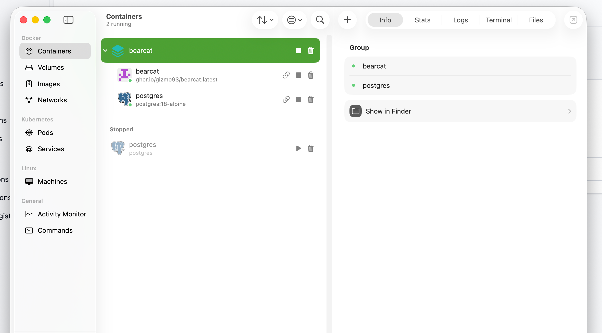

Docker is the recommended setup for Linux, NAS, and server deployments.

On Windows, prefer the [Windows service](/Bearcat/use-the-windows-service/) for always-on use or the [Desktop app](/Bearcat/use-the-desktop-launcher/) for on-demand use. Docker also works, but reading release files through its Linux VM is slower than with the native options.

On Apple Silicon Macs, prefer the native [Desktop app](/Bearcat/use-the-desktop-launcher/). The Docker image uses `linux/amd64` because its bundled RAR tools require Linux x64.

## Initial setup

### Windows
Install [Docker Desktop](https://www.docker.com/products/docker-desktop/) or [Rancher Desktop](https://rancherdesktop.io).

### macOS
Install [Docker Desktop](https://www.docker.com/products/docker-desktop/), [Rancher Desktop](https://rancherdesktop.io), or [OrbStack](https://orbstack.dev). I use OrbStack to run containers while developing Bearcat on macOS.



### Linux
Docker containers run directly on Linux. Docker Desktop and Rancher Desktop are also available; follow their documentation for installation.

### Synology NAS
On a supported x86_64 Synology NAS, install **Container Manager** from Package Manager.


## Running Bearcat

Use the repository's `docker-compose.yml` and copy `.env.example` to `.env`.
Before starting the containers:

1. Set `RELEASES_DIR` to your release folder. It must exist and allow Bearcat to read and write files. Mounted network folders work too.
2. Check `BEARCAT_DATA_DIR`. This folder keeps the application data between container updates, and the database with SQLite.

The remaining settings control ports, resource limits, and the image version.

### Database

| Database | Compose files | Data location |
| --- | --- | --- |
| SQLite (default) | `docker-compose.yml` | `bearcat.db` in `BEARCAT_DATA_DIR` |
| PostgreSQL | `docker-compose.yml` and `docker-compose.postgres.yml` | Separate `bearcat-postgres` container, data in `POSTGRES_DATA_DIR` |

With SQLite, `BEARCAT_DATA_DIR` must be on local storage, not on a network share (NFS/SMB).

To use PostgreSQL, start with both files:

```bash
docker compose -f docker-compose.yml -f docker-compose.postgres.yml up -d
```

Or add this line to `.env`, so that a plain `docker compose` command includes both files:

```text
COMPOSE_FILE=docker-compose.yml:docker-compose.postgres.yml
```

On Windows, separate the files with `;` instead of `:`.

Bearcat cannot move data between SQLite and PostgreSQL. Switching the database starts with an empty database.

### Bearcat related

| Variable | Purpose |
| --- | --- |
| `RELEASES_DIR` | Host directory containing your release files. Required. |
| `BEARCAT_DATA_DIR` | Persistent application data: the `bearcat.key` encryption key created on first start, and `bearcat.db` with SQLite. |
| `BEARCAT_PORT` | Web interface port, normally `8080`. |
| `BEARCAT_API_KEY` | Key for the REST API command endpoints. Empty disables them. See [Orchestrate Bearcat from External Tools](/Bearcat/external-orchestration/#api-key). |
| `BEARCAT_IMAGE` | Image to run. Defaults to `ghcr.io/gizmo93/bearcat:latest`; change it to select a version or your own image. |
| `BEARCAT_CPU_LIMIT` | CPU limit in cores, for example `0.5` for half a core. |
| `BEARCAT_MEMORY_LIMIT` | Memory limit, for example `512m` or `1g`. |

### PostgreSQL related

Only used with `docker-compose.postgres.yml`.

| Variable | Purpose |
| --- | --- |
| `POSTGRES_DATA_DIR` | Host directory for persistent PostgreSQL data. |
| `POSTGRES_USER` | PostgreSQL username. |
| `POSTGRES_PASSWORD` | PostgreSQL password. Choose your own. |
| `POSTGRES_DB` | Database name. |
| `POSTGRES_PORT` | Host port for database connections, normally `5432`. Change it if that port is already in use. |
| `POSTGRES_CPU_LIMIT` | CPU limit in cores, for example `0.5` for half a core. |
| `POSTGRES_MEMORY_LIMIT` | Memory limit, for example `512m` or `1g`. |

From the directory containing `docker-compose.yml`, run:

```bash
docker compose up -d
```

This starts Bearcat using your `.env` settings, and PostgreSQL if `docker-compose.postgres.yml` is included. The first start may take a while.


## Updating Bearcat

The example `.env` uses the `latest` image tag. To download and start a newer image, run these commands from the directory containing `docker-compose.yml`:

```bash
docker compose pull
docker compose up -d
```

This will only recreate the container if the newer image is different from the one you already have.
As Bearcat's database and application data directory are both mounted to persistent locations on your host machine, you won't lose any data by updating the container image.

### Upgrading existing Docker installs

Older versions of `docker-compose.yml` started PostgreSQL. The current `docker-compose.yml` runs Bearcat with SQLite. If you keep your existing compose files, nothing changes.

If your installation uses PostgreSQL and you replace your compose files with the current ones, add this line to `.env` (Windows: `;` instead of `:`):

```text
COMPOSE_FILE=docker-compose.yml:docker-compose.postgres.yml
```

Or start with both files:

```bash
docker compose -f docker-compose.yml -f docker-compose.postgres.yml up -d
```

Without the PostgreSQL override, Bearcat starts with an empty SQLite database. Your data is still in PostgreSQL. Add the override and run `docker compose up -d` again to switch back.

## Account data encryption key

Bearcat stores hoster, link crypter, and NFO database account configurations encrypted in the database. The encryption key is not part of the Docker image. On first start, Bearcat creates a random key file here:

```text
${BEARCAT_DATA_DIR:-./bearcat-data}/bearcat.key
```

Keep this file. Without `bearcat.key`, Bearcat cannot decrypt the stored account configurations anymore.

On the first start of a version with encrypted account data, Bearcat automatically migrates existing plaintext registration configs to encrypted values.

## Backups

For backups and server moves, copy:

- the Bearcat application data directory, usually `${BEARCAT_DATA_DIR:-./bearcat-data}`. It contains `bearcat.key` and, with SQLite, `bearcat.db`.
- with PostgreSQL, also the PostgreSQL data directory, usually `${POSTGRES_DATA_DIR:-./postgres-data}`.

With SQLite, stop Bearcat before copying (`docker compose stop`), or copy `bearcat.db-wal` and `bearcat.db-shm` together with `bearcat.db`.

